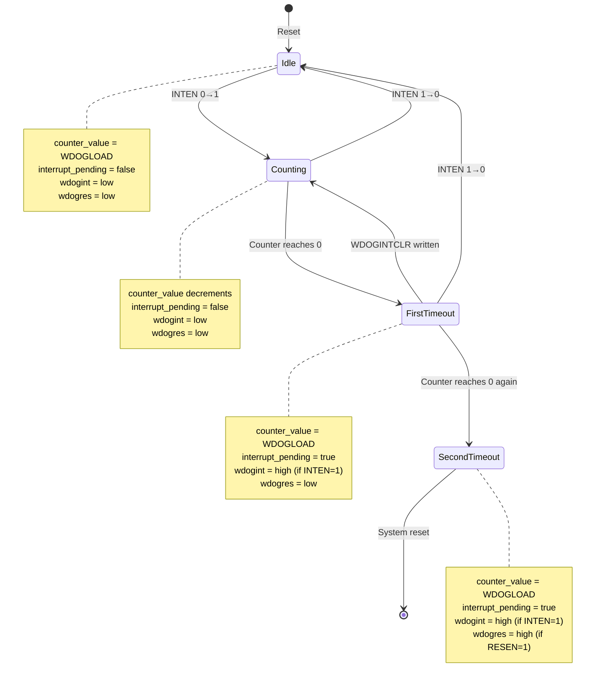

# Design Document

## Overview

The Simics watchdog timer device is a DML 1.4 implementation of an ARM PrimeCell-compatible watchdog peripheral. The device provides system protection through a 32-bit down-counter with configurable timeout intervals, interrupt generation on first timeout, and system reset on second consecutive timeout. The design emphasizes functional correctness over cycle-accurate timing, leveraging Simics' event-driven simulation model for efficient timeout handling.

The device exposes 21 memory-mapped registers organized into functional groups: control/data registers (WDOGLOAD, WDOGVALUE, WDOGCONTROL, WDOGINTCLR), status registers (WDOGRIS, WDOGMIS), lock protection (WDOGLOCK), integration test registers (WDOGITCR, WDOGITOP), and identification registers (WDOGPERIPHID[0-7], WDOGPCELLID[0-3]). The implementation follows Simics device modeling best practices with proper state management, logging, and platform integration.

## Architecture

### Device Structure

```
watchdog-timer (DML device)
├── regs (bank)
│   ├── WDOGLOAD (register @ 0x00)
│   ├── WDOGVALUE (register @ 0x04)
│   ├── WDOGCONTROL (register @ 0x08)
│   │   ├── INTEN (field @ [0])
│   │   ├── RESEN (field @ [1])
│   │   └── step_value (field @ [4:2])
│   ├── WDOGINTCLR (register @ 0x0C)
│   ├── WDOGRIS (register @ 0x10)
│   │   └── raw_int (field @ [0])
│   ├── WDOGMIS (register @ 0x14)
│   │   └── masked_int (field @ [0])
│   ├── WDOGLOCK (register @ 0xC00)
│   ├── WDOGITCR (register @ 0xF00)
│   │   └── test_mode_enable (field @ [0])
│   ├── WDOGITOP (register @ 0xF04)
│   │   ├── test_wdogint (field @ [1])
│   │   └── test_wdogres (field @ [0])
│   ├── WDOGPERIPHID4 (register @ 0xFD0)
│   ├── WDOGPERIPHID5 (register @ 0xFD4)
│   ├── WDOGPERIPHID6 (register @ 0xFD8)
│   ├── WDOGPERIPHID7 (register @ 0xFDC)
│   ├── WDOGPERIPHID0 (register @ 0xFE0)
│   ├── WDOGPERIPHID1 (register @ 0xFE4)
│   ├── WDOGPERIPHID2 (register @ 0xFE8)
│   ├── WDOGPERIPHID3 (register @ 0xFEC)
│   ├── WDOGPCELLID0 (register @ 0xFF0)
│   ├── WDOGPCELLID1 (register @ 0xFF4)
│   ├── WDOGPCELLID2 (register @ 0xFF8)
│   └── WDOGPCELLID3 (register @ 0xFFC)
├── interrupt_port (port)
│   └── simple_interrupt interface
├── reset_port (port)
│   └── simple_signal interface
├── counter_event (event)
└── Device State (session variables)
    ├── counter_value (uint32)
    ├── is_locked (bool)
    ├── interrupt_pending (bool)
    └── test_mode_active (bool)
```

### State Management

The device maintains the following state variables:

1. **counter_value** (uint32): Current down-counter value, decremented based on step_value configuration
2. **is_locked** (bool): Lock protection state, controls write access to control registers
3. **interrupt_pending** (bool): Tracks whether raw interrupt has been triggered
4. **test_mode_active** (bool): Indicates whether integration test mode is active

All register values are automatically managed by Simics through the DML register framework, providing automatic checkpoint/restore support.

### Event-Driven Timing Model

Rather than implementing cycle-accurate counter decrementation, the design uses Simics' event system for efficient timeout handling:

1. When counter is enabled (INTEN transitions 0→1 or WDOGINTCLR written), calculate timeout duration based on counter_value and step_value
2. Schedule counter_event to fire after calculated duration
3. When counter_event fires, trigger timeout logic (interrupt/reset generation)
4. If counter is reloaded or disabled, cancel pending counter_event

This approach provides functional correctness without simulation overhead of per-cycle counter updates.

## Components and Interfaces

### Register Bank (regs)

The register bank implements all 21 watchdog registers with proper offset mapping. Key design decisions:

**Control and Data Registers:**
- WDOGLOAD: Read-write register with after_write method to reload counter when written
- WDOGVALUE: Read-only register with read method returning current counter_value
- WDOGCONTROL: Read-write register with after_write method to handle enable/disable transitions
- WDOGINTCLR: Write-only register with after_write method to clear interrupt and reload counter

**Status Registers:**
- WDOGRIS: Read-only register with read method returning interrupt_pending state
- WDOGMIS: Read-only register with read method returning (interrupt_pending AND INTEN)

**Lock Register:**
- WDOGLOCK: Read-write register with after_write method checking for magic value 0x1ACCE551
- Read method returns 0 if unlocked, 1 if locked
- Write protection implemented in bank-level write method checking is_locked state

**Integration Test Registers:**
- WDOGITCR: Read-write register with after_write method to enter/exit test mode
- WDOGITOP: Write-only register with after_write method to directly drive output signals in test mode

**Identification Registers:**
- WDOGPERIPHID[0-7]: Read-only registers with hard-coded values
- WDOGPCELLID[0-3]: Read-only registers with hard-coded PrimeCell ID values

### Output Ports

**interrupt_port:**
- Implements simple_interrupt interface for edge-triggered interrupt signaling
- Raised when timeout occurs with INTEN=1
- Lowered when WDOGINTCLR is written

**reset_port:**
- Implements simple_signal interface for level-triggered reset signaling
- Asserted when second consecutive timeout occurs with RESEN=1
- Remains asserted until system reset

### Counter Event

The counter_event handles timeout logic:

1. **Event Callback**: When fired, checks current configuration and triggers appropriate actions
2. **Interrupt Generation**: If INTEN=1, set interrupt_pending=true and raise interrupt_port
3. **Reset Generation**: If RESEN=1 AND interrupt_pending=true, assert reset_port
4. **Counter Reload**: Reload counter_value from WDOGLOAD and reschedule event if still enabled

## Data Models

### Register Layout

```
Offset    | Register       | Size | Access | Reset Value | Description
----------|----------------|------|--------|-------------|---------------------------
0x000     | WDOGLOAD       | 32   | RW     | 0xFFFFFFFF  | Load register
0x004     | WDOGVALUE      | 32   | RO     | 0xFFFFFFFF  | Current value register
0x008     | WDOGCONTROL    | 32   | RW     | 0x00000000  | Control register
0x00C     | WDOGINTCLR     | 32   | WO     | -           | Interrupt clear register
0x010     | WDOGRIS        | 32   | RO     | 0x00000000  | Raw interrupt status
0x014     | WDOGMIS        | 32   | RO     | 0x00000000  | Masked interrupt status
0xC00     | WDOGLOCK       | 32   | RW     | 0x00000000  | Lock register
0xF00     | WDOGITCR       | 32   | RW     | 0x00000000  | Integration test control
0xF04     | WDOGITOP       | 32   | WO     | -           | Integration test output
0xFD0     | WDOGPERIPHID4  | 32   | RO     | 0x00000004  | Peripheral ID 4
0xFD4     | WDOGPERIPHID5  | 32   | RO     | 0x00000000  | Peripheral ID 5
0xFD8     | WDOGPERIPHID6  | 32   | RO     | 0x00000000  | Peripheral ID 6
0xFDC     | WDOGPERIPHID7  | 32   | RO     | 0x00000000  | Peripheral ID 7
0xFE0     | WDOGPERIPHID0  | 32   | RO     | 0x00000024  | Peripheral ID 0
0xFE4     | WDOGPERIPHID1  | 32   | RO     | 0x000000B8  | Peripheral ID 1
0xFE8     | WDOGPERIPHID2  | 32   | RO     | 0x0000001B  | Peripheral ID 2
0xFEC     | WDOGPERIPHID3  | 32   | RO     | 0x00000000  | Peripheral ID 3
0xFF0     | WDOGPCELLID0   | 32   | RO     | 0x0000000D  | PrimeCell ID 0
0xFF4     | WDOGPCELLID1   | 32   | RO     | 0x000000F0  | PrimeCell ID 1
0xFF8     | WDOGPCELLID2   | 32   | RO     | 0x00000005  | PrimeCell ID 2
0xFFC     | WDOGPCELLID3   | 32   | RO     | 0x000000B1  | PrimeCell ID 3
```

### WDOGCONTROL Bit Fields

```
Bits  | Field      | Access | Reset | Description
------|------------|--------|-------|------------------------------------------
31-5  | Reserved   | -      | 0     | Reserved, read as zero
4-2   | step_value | RW     | 0     | Counter decrement step (0=÷1, 1=÷2, 2=÷4, 3=÷8, 4=÷16)
1     | RESEN      | RW     | 0     | Reset enable (1=enable reset on second timeout)
0     | INTEN      | RW     | 0     | Interrupt enable (1=enable counter and interrupt)
```

### State Transition Diagram



## Error Handling

### Invalid Register Access

- **Unaligned Access**: Log warning and return zero for reads, ignore writes
- **Reserved Register Offsets**: Return zero for reads, ignore writes
- **Write to Read-Only Register**: Log warning and ignore write
- **Read from Write-Only Register**: Log warning and return zero

### Invalid Configuration

- **Invalid step_value** (values 5-7): Log warning, treat as step_value=0 (÷1)
- **Lock Protection Violation**: Log warning when write attempted to locked register, ignore write
- **Counter Overflow**: Not applicable, counter saturates at zero

### Lock Protection

The lock mechanism protects against accidental misconfiguration:

1. On reset, device is unlocked (is_locked=false)
2. Writing 0x1ACCE551 to WDOGLOCK unlocks device
3. Writing any other value to WDOGLOCK locks device
4. When locked, writes to WDOGLOAD, WDOGVALUE, WDOGCONTROL, WDOGINTCLR are ignored
5. WDOGLOCK itself is always writable regardless of lock state
6. Identification registers are always read-only regardless of lock state

### Integration Test Mode

When test mode is active (WDOGITCR bit[0]=1):

1. Normal counter operation is suspended
2. Output signals are driven directly by WDOGITOP register values
3. Writing to WDOGITOP bit[1] directly controls wdogint output
4. Writing to WDOGITOP bit[0] directly controls wdogres output
5. Exiting test mode (WDOGITCR bit[0]=0) restores normal operation

## Testing Strategy

### Unit Tests

**Register Access Tests:**
- Test read/write operations for all registers
- Verify reset values for all registers
- Test read-only register write protection
- Test write-only register read behavior
- Test reserved bit handling

**Lock Protection Tests:**
- Test unlock with magic value 0x1ACCE551
- Test lock with other values
- Verify write protection when locked
- Verify WDOGLOCK always writable

**Counter Operation Tests:**
- Test counter reload from WDOGLOAD
- Test counter decrement with different step_value settings
- Test WDOGVALUE read returns current counter
- Test counter enable/disable via INTEN

**Interrupt Generation Tests:**
- Test interrupt assertion on first timeout with INTEN=1
- Test no interrupt when INTEN=0
- Test interrupt clear via WDOGINTCLR
- Test WDOGRIS and WDOGMIS status registers

**Reset Generation Tests:**
- Test reset assertion on second timeout with RESEN=1
- Test no reset when RESEN=0
- Test reset prevention by clearing interrupt
- Test reset persistence until system reset

**Integration Test Mode Tests:**
- Test entry/exit of test mode via WDOGITCR
- Test direct wdogint control via WDOGITOP bit[1]
- Test direct wdogres control via WDOGITOP bit[0]
- Test normal operation suspension in test mode

### Integration Tests

**Platform Integration:**
- Test device mapping at base address 0x1000
- Test APB bus transactions
- Test interrupt routing to platform interrupt controller
- Test reset routing to platform reset controller

**Software Driver Tests:**
- Test typical watchdog initialization sequence
- Test watchdog feeding (WDOGINTCLR write) before timeout
- Test timeout recovery scenario
- Test lock/unlock sequence

### Functional Scenarios

**Scenario 1: Normal Watchdog Operation**
1. Software unlocks device (write 0x1ACCE551 to WDOGLOCK)
2. Software writes timeout value to WDOGLOAD
3. Software enables interrupt and reset (write 0x03 to WDOGCONTROL)
4. Counter decrements to zero, interrupt asserted
5. Software services watchdog (write to WDOGINTCLR)
6. Counter reloads and continues

**Scenario 2: Watchdog Timeout with Reset**
1. Software configures watchdog as in Scenario 1
2. Counter decrements to zero, interrupt asserted
3. Software fails to service watchdog
4. Counter decrements to zero again, reset asserted
5. System resets

**Scenario 3: Lock Protection**
1. Software configures watchdog
2. Software locks device (write non-magic value to WDOGLOCK)
3. Attempt to write WDOGCONTROL is ignored
4. Software unlocks device (write 0x1ACCE551 to WDOGLOCK)
5. Write to WDOGCONTROL succeeds

**Scenario 4: Integration Test**
1. Software enters test mode (write 1 to WDOGITCR bit[0])
2. Software writes 1 to WDOGITOP bit[1], wdogint asserts
3. Software writes 0 to WDOGITOP bit[1], wdogint deasserts
4. Software writes 1 to WDOGITOP bit[0], wdogres asserts
5. Software exits test mode (write 0 to WDOGITCR bit[0])

## Design Decisions and Rationales

### Event-Driven vs Cycle-Accurate Timing

**Decision**: Use event-driven timeout model rather than per-cycle counter updates

**Rationale**: 
- Simics is a functional simulator, not a cycle-accurate simulator
- Event-driven approach provides identical functional behavior with minimal overhead
- Calculating timeout duration and scheduling single event is more efficient than updating counter every cycle
- Allows simulation to run at maximum speed without timing accuracy requirements

### Functional Model Scope

**Decision**: Implement functional behavior only, exclude cycle-accurate APB protocol details

**Rationale**:
- DML framework handles APB bus protocol automatically through bank/register abstractions
- Software-visible behavior (register values, timing relationships) is what matters for functional simulation
- Detailed bus protocol timing is not observable to software and adds unnecessary complexity
- Focus on correct register semantics and timeout behavior

### Lock Protection Implementation

**Decision**: Implement lock as boolean state checked in bank write method

**Rationale**:
- Simple and efficient implementation
- Provides clear separation between lock control (WDOGLOCK) and protected registers
- Easy to extend if additional registers need protection
- Matches hardware specification behavior exactly

### Integration Test Mode

**Decision**: Implement test mode as separate code path that bypasses normal counter logic

**Rationale**:
- Clean separation between normal and test operation
- Prevents test mode from interfering with normal state
- Allows direct signal control without complex state management
- Matches hardware specification intent for manufacturing test

### Step Value Configuration

**Decision**: Implement step_value as multiplier for counter decrement, treat invalid values as ÷1

**Rationale**:
- Matches hardware specification exactly
- Provides flexibility for different clock frequencies
- Invalid value handling prevents undefined behavior
- Simple implementation using switch/case or lookup table

### Register Organization

**Decision**: Use single bank with all registers at specified offsets

**Rationale**:
- Matches hardware memory map exactly
- Simplifies address decoding
- DML bank object provides automatic offset handling
- Clear correspondence between specification and implementation

## Platform Integration

### Memory Mapping

The device is mapped to QSP-x86 platform at base address 0x1000 with 4KB address space (0x1000-0x1FFF). Platform configuration:

```python
# Platform configuration (conceptual, actual syntax may vary)
system.watchdog = watchdog_timer()
system.watchdog.map(base=0x1000, size=0x1000)
```

### Interrupt Connection

The wdogint signal connects to platform interrupt controller. Connection details are platform-specific and handled through Simics configuration:

```python
# Interrupt routing (conceptual)
system.watchdog.interrupt_port -> system.interrupt_controller.line[N]
```

### Reset Connection

The wdogres signal connects to platform reset controller. Connection details are platform-specific:

```python
# Reset routing (conceptual)
system.watchdog.reset_port -> system.reset_controller.watchdog_reset
```

### Clock Configuration

The device uses functional timing model and does not require explicit clock frequency configuration. The step_value field in WDOGCONTROL provides software-visible clock divider control, but actual timing is event-driven.

## Logging and Observability

### Log Levels

- **Error**: Invalid operations that should never occur in correct usage
- **Warning**: Unusual but recoverable conditions (lock violations, invalid step_value)
- **Info**: Normal operational events (register writes, timeout events, interrupt/reset assertions)
- **Debug**: Detailed tracing (register reads, counter updates, state transitions)

### Log Messages

**Register Access:**
```
[info] WDOGLOAD write: offset=0x000, value=0x12345678
[debug] WDOGVALUE read: offset=0x004, value=0x12345670
```

**Counter Events:**
```
[info] Watchdog timeout: counter=0, INTEN=1, RESEN=1, interrupt_pending=0
[info] Watchdog interrupt asserted
[warning] Watchdog reset asserted
```

**Lock Protection:**
```
[info] Watchdog unlocked: magic value written to WDOGLOCK
[info] Watchdog locked: non-magic value written to WDOGLOCK
[warning] Write to WDOGCONTROL ignored: device is locked
```

**Test Mode:**
```
[info] Integration test mode entered
[info] Integration test mode exited
[debug] Test mode output: wdogint=1, wdogres=0
```

## Performance Considerations

### Simulation Overhead

- Event-driven timing model minimizes per-cycle overhead
- Register access uses DML framework's optimized implementation
- State variables kept minimal (4 session variables)
- No unnecessary computation in hot paths

### Memory Footprint

- 21 registers × 4 bytes = 84 bytes register storage
- 4 session variables × 4-8 bytes = 16-32 bytes state storage
- Total device footprint < 200 bytes

### Scalability

- Device can be instantiated multiple times in platform
- Each instance maintains independent state
- No global state or shared resources
- Suitable for multi-watchdog configurations

## Future Extensions

Potential enhancements not in current scope:

1. **Checkpoint/Restore**: While Simics handles register state automatically, explicit counter_event checkpoint handling could be added
2. **Advanced Logging**: Structured logging with JSON output for automated analysis
3. **Performance Counters**: Track timeout events, interrupt assertions, lock violations
4. **Debug Interface**: Additional registers or attributes for runtime inspection
5. **Power Management**: Clock gating and power domain support
6. **Multiple Interrupt Lines**: Separate interrupt lines for different timeout stages
