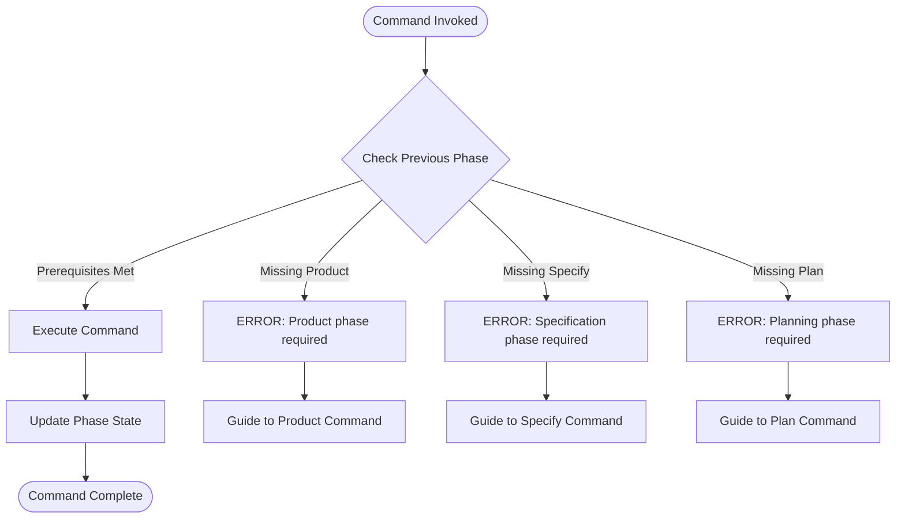
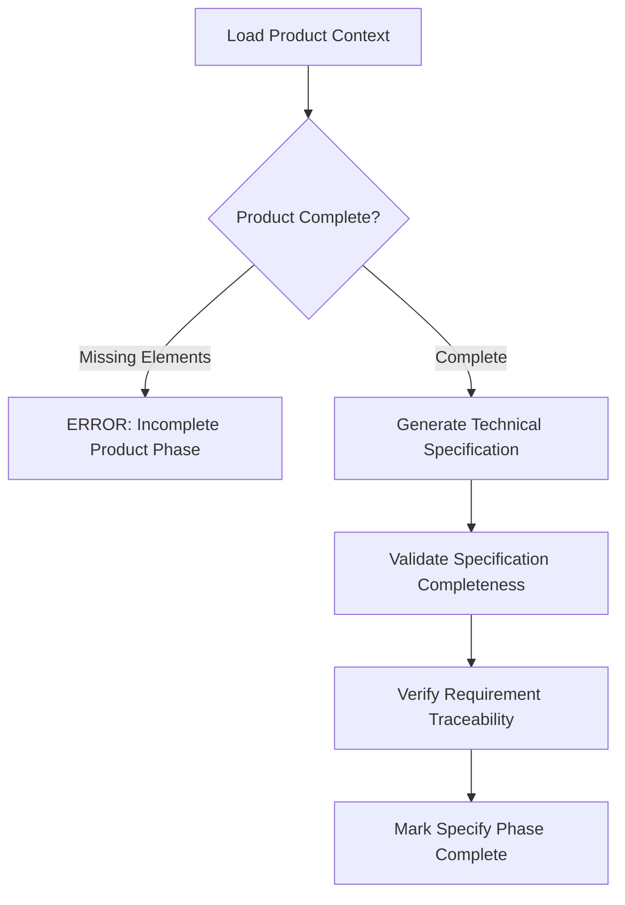
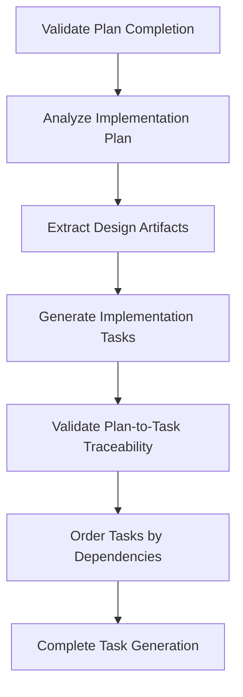
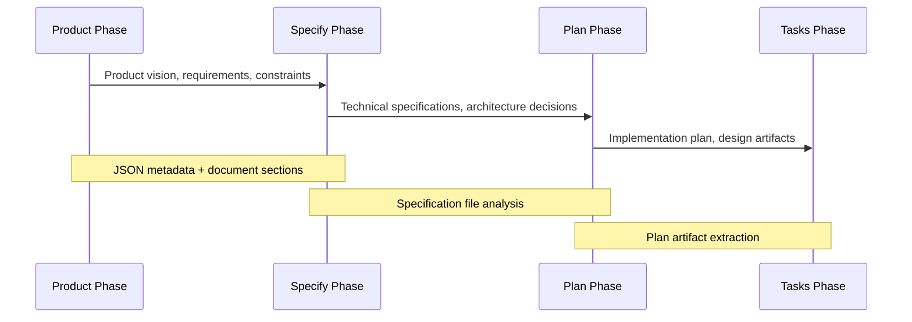

# Enhanced Workflow Enforcement: Product → Specify → Plan → Tasks

**Created**: 2024-12-19
**Status**: Design Phase
**Repository Type**: CLI Tool
**Objective**: Enforce proper development sequence to prevent shortcuts bypassing specification phase

## Overview

The spec-kit framework currently supports multiple development commands (simics-platform, specify, plan, tasks) but lacks enforcement of the proper workflow sequence. This enhancement establishes a structured progression that ensures product context flows into specification before proceeding to planning and task generation.

### Current State Analysis

The existing workflow allows direct execution of planning commands without proper specification groundwork, leading to:
- **Context Loss**: Product requirements not captured in specifications
- **Implementation Shortcuts**: Direct jump from product concept to planning
- **Quality Degradation**: Missing specification validation step
- **Inconsistent Outcomes**: Variable quality due to workflow bypasses

### Value Proposition

Enforcing the product → specify → plan → tasks sequence provides:
- **Requirement Traceability**: Clear connection from product vision to implementation tasks
- **Quality Assurance**: Mandatory specification validation before planning
- **Context Preservation**: Product insights inform specification generation
- **Process Consistency**: Standardized development flow across all features

## Architecture

### Workflow State Management

The enhanced system tracks workflow progression through state indicators that prevent premature advancement to subsequent phases.

| Phase | State Indicator | Required Input | Generated Output | Next Phase Gate |
|-------|----------------|----------------|------------------|-----------------|
| Product | Product Definition Complete | Product description, requirements | Product specification document | Specification readiness check |
| Specify | Specification Complete | Product context, technical requirements | Feature specification | Specification validation pass |
| Plan | Planning Complete | Validated specification | Implementation plan, design artifacts | Plan completeness verification |
| Tasks | Tasks Generated | Implementation plan, design artifacts | Actionable task list | Task dependency validation |

### Command Enhancement Strategy

#### Phase Dependency Validation

Each command validates prerequisite phase completion before execution:

#### Context Flow Architecture

Product context flows through the workflow phases via structured data transfer:

| Context Element | Source Phase | Target Phase | Transfer Mechanism |
|-----------------|--------------|--------------|-------------------|
| Product Vision | Product | Specify | JSON metadata in specification |
| Requirements | Product | Specify | Structured requirement sections |
| Constraints | Product | Specify | Technical constraint documentation |
| Specification Content | Specify | Plan | Specification file analysis |
| Design Decisions | Plan | Tasks | Implementation plan references |

### State Persistence Model

#### Phase State Tracking

The system maintains phase completion state through file-based indicators:

**State File Structure:**
- `.spec-kit/workflow-state.json` - Central workflow tracking
- `.spec-kit/phase-markers/` - Individual phase completion markers
- Feature branch state files for multi-feature coordination

**State Schema:**
| Field | Type | Purpose | Values |
|-------|------|---------|--------|
| currentPhase | String | Active workflow phase | product, specify, plan, tasks |
| completedPhases | Array | Completed phase list | List of completed phase names |
| featureName | String | Feature identifier | Feature branch name |
| lastUpdated | Timestamp | State modification time | ISO 8601 timestamp |
| contextHash | String | Context integrity check | SHA256 of input content |

#### State Validation Logic

Before each command execution, the system validates:
1. **Phase Prerequisites**: Required previous phases completed
2. **Context Integrity**: Product context preserved through phases
3. **File Dependencies**: Required input files exist and are valid
4. **Branch Consistency**: Workflow state matches feature branch

## Enhanced Command Specifications

### Product Command Enhancement

The simics-platform command becomes the product definition phase entry point:

**New Responsibilities:**
- Initialize workflow state tracking
- Capture comprehensive product context
- Generate product specification document
- Set foundation for specification phase

**Context Capture Strategy:**

| Context Type | Capture Method | Storage Location | Usage in Specify Phase |
|--------------|----------------|------------------|------------------------|
| Product Vision | Natural language description | Product section in spec | Feature overview generation |
| Success Criteria | Structured requirements | Acceptance criteria section | Validation scenario creation |
| Technical Constraints | Constraint identification | Technical constraints section | Architecture decision input |
| Stakeholder Requirements | Requirement analysis | Stakeholder section | Use case development |

### Specify Command Enhancement

Enhanced to consume product context and enforce specification completeness:

**Product Context Integration:**
- Automatically loads product specification content
- Validates product context completeness before proceeding
- Maps product requirements to technical specifications
- Ensures traceability from product vision to technical details

**Specification Validation Framework:**

### Plan Command Enhancement

Modified to require validated specification and leverage specification content:

**Specification Dependency Validation:**
- Confirms specification phase completion
- Loads and analyzes specification content
- Validates specification quality before planning
- Rejects execution if specification incomplete

**Enhanced Planning Process:**

| Planning Aspect | Specification Input | Planning Output | Validation Criteria |
|-----------------|-------------------|-----------------|-------------------|
| Architecture Decisions | Technical requirements | Architecture document | Requirements coverage |
| Implementation Strategy | Feature specifications | Implementation plan | Feasibility validation |
| Technology Selection | Technical constraints | Technology stack | Constraint compliance |
| Resource Planning | Complexity analysis | Resource allocation | Capacity validation |

### Tasks Command Enhancement

Enhanced to ensure proper plan foundation and generate traceable tasks:

**Plan Dependency Requirements:**
- Validates plan phase completion
- Analyzes implementation plan content
- Ensures design artifact availability
- Verifies plan-to-task traceability

**Task Generation Strategy:**

## Command Interaction Model

### Workflow Enforcement Rules

**Phase Transition Gates:**

1. **Product → Specify Gate**
   - Product specification document exists
   - Required product sections completed
   - Success criteria defined
   - Technical constraints identified

2. **Specify → Plan Gate**
   - Specification validation passed
   - All [NEEDS CLARIFICATION] items resolved
   - Technical requirements complete
   - Architecture decisions documented

3. **Plan → Tasks Gate**
   - Implementation plan completed
   - Design artifacts generated
   - Technology stack selected
   - Resource allocation defined

### Error Handling and Guidance

When users attempt to skip phases, the system provides constructive guidance:

**Skip Detection and Response:**

| Attempted Action | Missing Prerequisite | System Response | Guidance Provided |
|------------------|---------------------|-----------------|-------------------|
| /specify without product | Product phase incomplete | Block execution | Guide to simics-platform command |
| /plan without specify | Specification phase incomplete | Block execution | Guide to specify command completion |
| /tasks without plan | Planning phase incomplete | Block execution | Guide to plan command execution |

**Guidance Message Structure:**
- Clear error explanation
- Required prerequisite identification
- Specific command to run next
- Context about why the sequence matters

### Context Preservation Mechanisms

#### Product Context Flow

Product information flows through the workflow via structured mechanisms:

**Context Transfer Points:**

**Context Validation:**
- Hash-based content integrity checking
- Required section presence validation
- Semantic consistency verification
- Traceability link validation

## Implementation Strategy

### Phase 1: State Management Infrastructure

**State Tracking System:**
- Implement workflow state persistence
- Create phase completion markers
- Develop state validation logic
- Build context integrity checking

**File System Integration:**
- `.spec-kit/workflow-state.json` creation
- Phase marker directory structure
- Context file organization
- State cleanup mechanisms

### Phase 2: Command Enhancement

**Enhanced Command Logic:**
- Add phase prerequisite validation to each command
- Implement context loading mechanisms
- Build guidance systems for workflow violations
- Create context transfer utilities

**Template Integration:**
- Modify command templates to include phase checks
- Add context injection points
- Update error handling sections
- Enhance guidance messaging

### Phase 3: Validation Framework

**Specification Validation:**
- Implement completeness checking
- Build quality validation rules
- Create traceability verification
- Add consistency validation

**Plan Validation:**
- Develop plan completeness criteria
- Implement design artifact checking
- Build technology stack validation
- Create resource allocation verification

## Testing Strategy

### Workflow Enforcement Testing

**Positive Flow Testing:**
- Complete product → specify → plan → tasks sequence
- Context preservation across phases
- State persistence validation
- Successful completion scenarios

**Negative Flow Testing:**
- Attempt to skip product phase
- Try specify without product completion
- Execute plan without specification
- Run tasks without planning

**Edge Case Testing:**
- Corrupted state files
- Missing context files
- Invalid phase transitions
- Concurrent workflow execution

### Integration Testing

**Command Integration:**
- Multi-command workflow execution
- State sharing between commands
- Context transfer validation
- Error propagation testing

**Template Integration:**
- Template-command coordination
- Context injection validation
- Error handling verification
- Guidance message accuracy

## Quality Assurance

### Validation Rules

**Product Phase Validation:**
- Product vision completeness
- Success criteria definition
- Technical constraint identification
- Stakeholder requirement capture

**Specification Phase Validation:**
- Technical requirement completeness
- Architecture decision documentation
- Traceability to product requirements
- [NEEDS CLARIFICATION] resolution

**Planning Phase Validation:**
- Implementation strategy definition
- Technology stack selection
- Resource allocation specification
- Design artifact generation

**Task Phase Validation:**
- Task-to-plan traceability
- Dependency ordering correctness
- Implementation detail sufficiency
- Execution readiness verification

### Quality Metrics

**Workflow Compliance:**
- Phase sequence adherence rate
- Context preservation accuracy
- Validation rule compliance
- Error handling effectiveness

**Output Quality:**
- Specification completeness scores
- Plan feasibility assessments
- Task actionability ratings
- Traceability coverage metrics