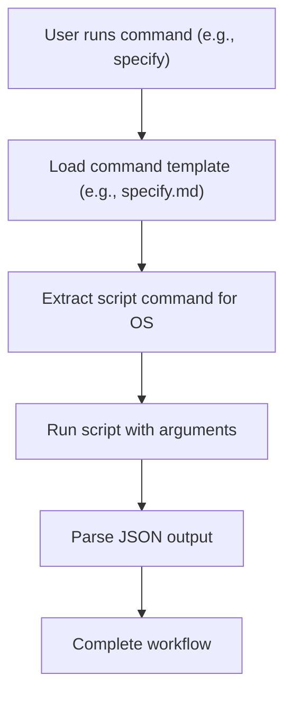
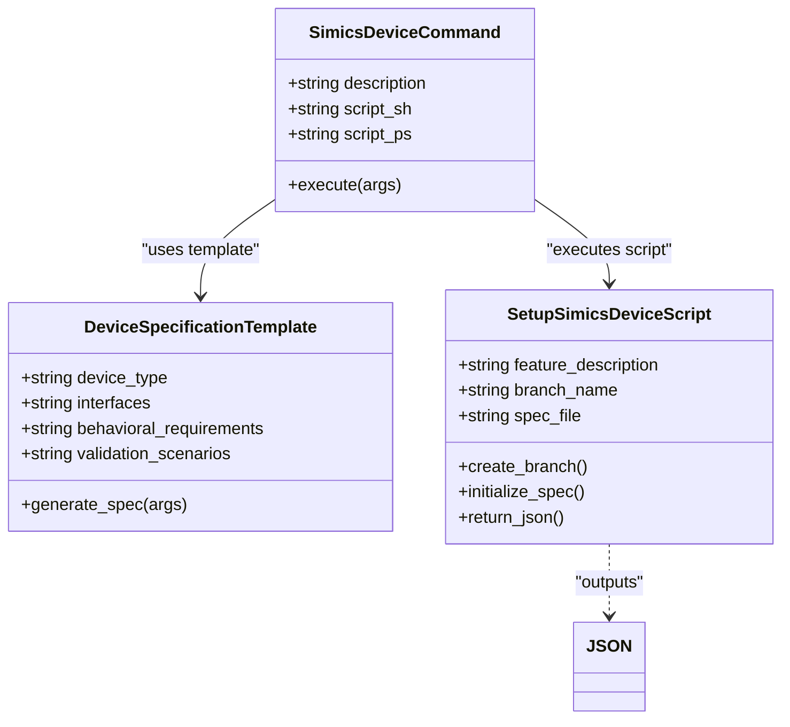

# Advanced Usage & Extensibility

<cite>
**Referenced Files in This Document**   
- [__init__.py](file://src/specify_cli/__init__.py)
- [create-new-feature.sh](file://scripts/bash/create-new-feature.sh)
- [create-new-feature.ps1](file://scripts/powershell/create-new-feature.ps1)
- [specify.md](file://templates/commands/specify.md)
- [plan.md](file://templates/commands/plan.md)
- [simics-device.md](file://templates/commands/simics-device.md)
- [device-spec-template.md](file://templates/simics/projects/device-spec-template.md)
</cite>

## Table of Contents
1. [CLI Extension with Typer](#cli-extension-with-typer)
2. [Template-Based Command System](#template-based-command-system)
3. [Plugin Architecture for Script Variants](#plugin-architecture-for-script-variants)
4. [Simics Integration and Custom Device Types](#simics-integration-and-custom-device-types)
5. [Agent Context and Plan Generation Customization](#agent-context-and-plan-generation-customization)
6. [Expert-Level Usage Patterns](#expert-level-usage-patterns)
7. [Performance Optimization for Large-Scale Deployments](#performance-optimization-for-large-scale-deployments)

## CLI Extension with Typer

The spec-kit CLI is built on the Typer framework, enabling structured command definition and automatic help generation. The main application instance is created using `typer.Typer` with custom configuration including banner display and help formatting. Commands are added via the `@app.command()` decorator, allowing for easy extension with new functionality. The `BannerGroup` class extends `TyperGroup` to show an ASCII art banner before help output, demonstrating how to customize CLI behavior through class inheritance. The callback system allows for pre-command execution logic, such as displaying banners when no subcommand is provided.

**Section sources**
- [__init__.py](file://src/specify_cli/__init__.py#L298-L334)

## Template-Based Command System

spec-kit uses a template-based command system where each CLI command is defined by a Markdown file in the `templates/commands/` directory. These templates contain YAML frontmatter with script definitions for different shell types (POSIX shell and PowerShell). When a command is executed, the system substitutes `{SCRIPT}` and `{ARGS}` placeholders with the appropriate script path and user-provided arguments. This architecture allows for cross-platform compatibility and easy command extension by simply adding new template files. The system supports JSON output mode for programmatic consumption, enabling integration with other tools and automation scripts.

**Diagram sources**
- [specify.md](file://templates/commands/specify.md#L1-L15)
- [__init__.py](file://src/specify_cli/__init__.py#L258-L301)

**Section sources**
- [specify.md](file://templates/commands/specify.md#L1-L15)
- [__init__.py](file://src/specify_cli/__init__.py#L258-L301)

## Plugin Architecture for Script Variants

The plugin architecture supports multiple script variants through parallel directory structures for bash and PowerShell scripts. The system automatically selects the appropriate script variant based on the user's operating system or explicit selection. Script files in `scripts/bash/` and `scripts/powershell/` directories provide identical functionality with platform-appropriate syntax. The template system references both variants in the YAML frontmatter using `sh:` and `ps:` keys. During project initialization, the system copies the selected script variant to the project's `.specify/scripts/` directory, ensuring that only relevant scripts are included. This architecture allows for easy addition of new script variants and commands without modifying core CLI logic.

**Section sources**
- [create-new-feature.sh](file://scripts/bash/create-new-feature.sh#L1-L58)
- [create-new-feature.ps1](file://scripts/powershell/create-new-feature.ps1#L1-L52)

## Simics Integration and Custom Device Types

The Simics integration framework enables creation of device model specifications through the `simics-device` command. This command uses the `setup-simics-device.sh` script to create feature branches and initialize specification files. The `device-spec-template.md` provides a comprehensive structure for device modeling specifications, including mandatory sections like Device Overview, Behavioral Model, Register Interface, Memory Interface, and Validation Scenarios. To extend support for new device types, users can modify the template to include device-specific requirements or create new templates for specialized device categories. The system validates specifications to ensure they focus on behavioral requirements rather than implementation details, maintaining a clear separation between specification and implementation.

**Diagram sources**
- [simics-device.md](file://templates/commands/simics-device.md#L1-L45)
- [device-spec-template.md](file://templates/simics/projects/device-spec-template.md#L1-L230)
- [setup-simics-device.sh](file://scripts/bash/setup-simics-device.sh)

**Section sources**
- [simics-device.md](file://templates/commands/simics-device.md#L1-L45)
- [device-spec-template.md](file://templates/simics/projects/device-spec-template.md#L1-L230)

## Agent Context and Plan Generation Customization

The agent context update mechanism is customizable through the `update-agent-context.sh` script, which can be extended to incorporate additional context sources or modify context structure. The plan generation workflow, defined in `plan.md`, follows a structured execution flow with nine steps that can be customized by modifying the `plan-template.md`. Users can extend the workflow by adding new phases or modifying existing ones to accommodate different development methodologies. The system uses absolute paths to ensure consistent behavior across different environments and supports JSON output for integration with external tools. The constitution at `/memory/constitution.md` serves as a source of non-negotiable principles that influence plan generation, and this file can be customized to reflect project-specific requirements.

**Section sources**
- [plan.md](file://templates/commands/plan.md#L1-L39)
- [update-agent-context.sh](file://scripts/bash/update-agent-context.sh)

## Expert-Level Usage Patterns

Expert users can automate batch specification generation by scripting the CLI commands and processing JSON output programmatically. For CI/CD integration, the validation commands like `validate-simics` can be incorporated into pipeline stages to ensure specification quality. The system supports parallel processing through external orchestration, allowing multiple specifications to be generated simultaneously. Users can create wrapper scripts that combine multiple spec-kit commands into higher-level workflows. The JSON output mode enables integration with data processing tools for analytics and reporting on specification patterns across multiple projects. For large-scale deployments, the template system can be extended with dynamic content generation based on external data sources.

**Section sources**
- [__init__.py](file://src/specify_cli/__init__.py#L1046-L1081)
- [create-new-feature.sh](file://scripts/bash/create-new-feature.sh#L1-L58)

## Performance Optimization for Large-Scale Deployments

For large-scale deployments, performance can be optimized by minimizing file system operations and leveraging caching mechanisms. The system already implements efficient template processing by copying only necessary files during project initialization. Additional optimizations include using symbolic links for shared templates across projects, implementing a template cache to avoid repeated downloads, and parallelizing independent specification generation tasks. The JSON output format reduces parsing overhead compared to text-based output. For distributed environments, the system can be extended with a shared template repository to reduce bandwidth usage. The use of lightweight scripting languages (bash/PowerShell) for automation tasks ensures minimal resource consumption during specification generation.

**Section sources**
- [__init__.py](file://src/specify_cli/__init__.py#L1134-L1157)
- [create-new-feature.sh](file://scripts/bash/create-new-feature.sh#L1-L58)