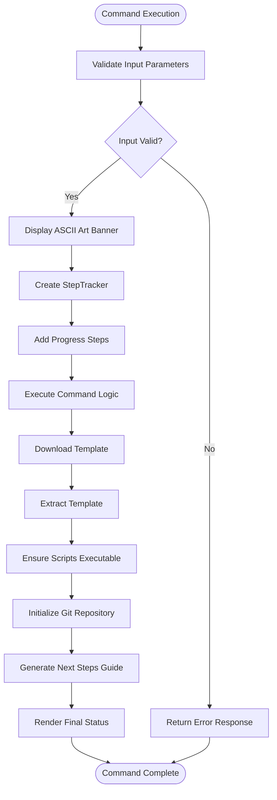
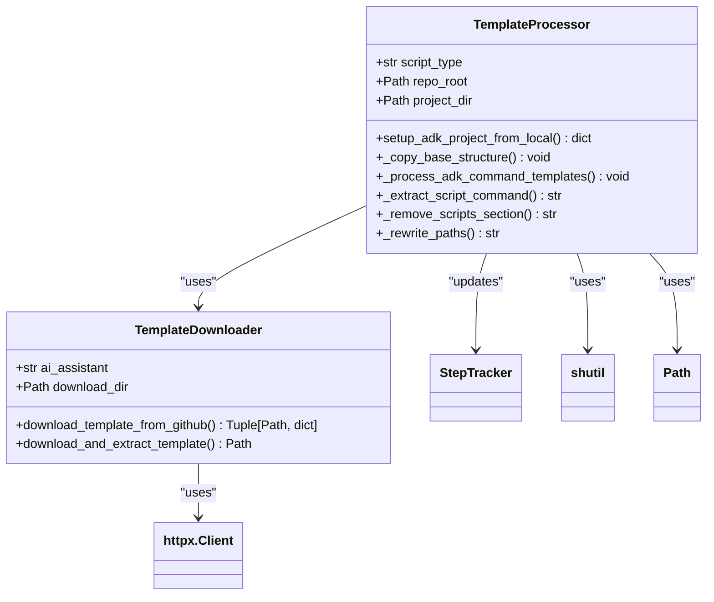
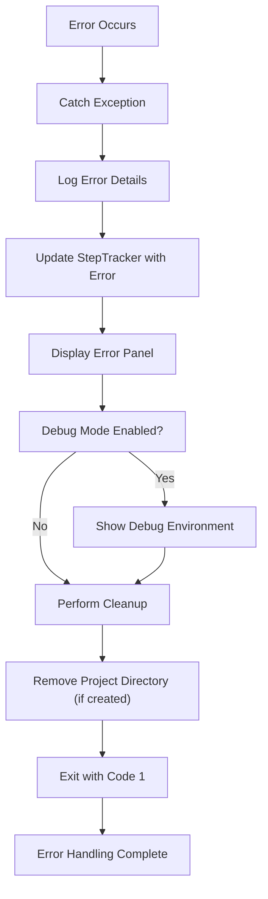
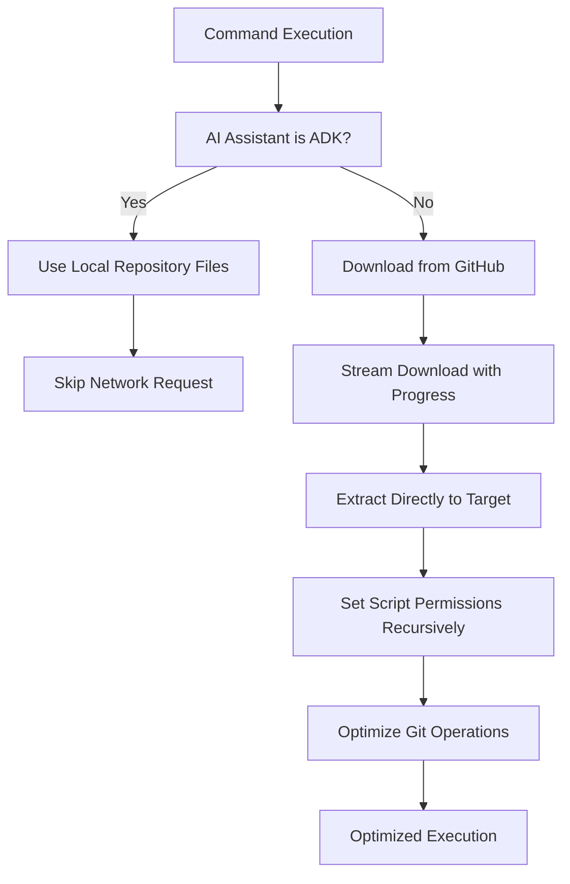

# Command Reference

<cite>
**Referenced Files in This Document**   
- [__init__.py](file://src/specify_cli/__init__.py)
- [simics_validation.py](file://src/specify_cli/simics_validation.py)
</cite>

## Table of Contents
1. [Core CLI Commands Overview](#core-cli-commands-overview)
2. [init Command](#init-command)
3. [check Command](#check-command)
4. [validate-simics Command](#validate-simics-command)
5. [Command Execution Flow](#command-execution-flow)
6. [Template Engine Integration](#template-engine-integration)
7. [Error Handling and Debugging](#error-handling-and-debugging)
8. [Performance Optimization](#performance-optimization)

## Core CLI Commands Overview

The Specify CLI provides a set of core commands that enable developers to initialize, validate, and manage specification-driven development projects. These commands serve as the foundation for the specification workflow, enabling seamless integration with AI assistants and development tools. The primary commands include `init`, `check`, and `validate-simics`, each designed to address specific aspects of project setup and validation.

The CLI architecture is built on Typer, providing a robust command-line interface with automatic help generation and argument parsing. Commands interact with template engines to generate project structures and validate system requirements, ensuring a consistent development environment across different platforms and AI assistants.

**Section sources**
- [__init__.py](file://src/specify_cli/__init__.py#L295-L301)

## init Command

The `init` command initializes a new Specify project from the latest template, creating the necessary directory structure and configuration files. This command serves as the entry point for starting a new specification-driven development project.

### Purpose and Functionality
The `init` command performs several critical functions:
1. Validates required tools are installed
2. Allows selection of AI assistant (Claude Code, Gemini CLI, GitHub Copilot, Cursor, Qwen Code, opencode, or ADK)
3. Downloads the appropriate template from GitHub
4. Extracts the template to the specified project directory
5. Initializes a git repository (unless --no-git is specified)
6. Sets up AI assistant commands

### Syntax and Parameters
```bash
specify init [PROJECT_NAME] [OPTIONS]
```

**Parameters:**
- `project_name`: Name for the new project directory (optional when using --here)
- `--ai, --ai_assistant`: AI assistant to use (claude, gemini, copilot, cursor, qwen, opencode, adk)
- `--script, --script_type`: Script type to use (sh for POSIX shell, ps for PowerShell)
- `--ignore-agent-tools`: Skip checks for AI agent tools
- `--no-git`: Skip git repository initialization
- `--here`: Initialize project in current directory
- `--skip-tls`: Skip SSL/TLS verification (not recommended)
- `--debug`: Show verbose diagnostic output

### Return Values
The command returns:
- Exit code 0 on successful initialization
- Exit code 1 on failure with error message displayed
- Progress tracking through a hierarchical step tracker

### Usage Examples
```bash
# Initialize a new project with default settings
specify init my-project

# Initialize with specific AI assistant
specify init my-project --ai claude

# Initialize in current directory
specify init --here --ai gemini

# Initialize without git repository
specify init my-project --no-git
```

The command uses a StepTracker to provide real-time feedback on the initialization process, showing progress through fetch, download, extraction, and setup phases. For ADK projects, it uses local repository files instead of downloading from GitHub.

**Section sources**
- [__init__.py](file://src/specify_cli/__init__.py#L1027-L1299)

## check Command

The `check` command verifies that all required tools are installed and available in the system environment, ensuring the development environment is properly configured for specification-driven development.

### Purpose and Functionality
The `check` command performs comprehensive validation of the development environment by:
1. Checking for the presence of essential tools (git, AI assistants, IDEs)
2. Validating Simics integration if available
3. Providing detailed feedback on missing components
4. Offering installation recommendations for missing tools

### Syntax and Parameters
```bash
specify check
```

This command has no parameters and runs a comprehensive check of the system environment.

### Return Values
The command returns:
- Exit code 0 after completing the check
- A visual tree representation of tool availability
- Success indicators for available tools
- Error indicators for missing tools
- Summary recommendations for improving the development environment

### Usage Examples
```bash
# Check development environment setup
specify check

# Run check and review tool availability
specify check
# Output shows which AI assistants and tools are available
```

The command uses a StepTracker to display the status of each tool check, with different visual indicators for available, missing, or optional tools. It specifically checks for git, Claude Code, Gemini CLI, Qwen Code, VS Code, Cursor IDE, opencode, and ADK CLI. For Simics integration, it validates the setup if the current directory contains a spec-kit project.

**Section sources**
- [__init__.py](file://src/specify_cli/__init__.py#L1303-L1357)

## validate-simics Command

The `validate-simics` command performs comprehensive validation of Simics integration setup and project configuration, ensuring that all components are properly configured for simulation development.

### Purpose and Functionality
The `validate-simics` command validates three key aspects of Simics integration:
1. Template structure and content validation
2. Project setup validation
3. Script execution testing

### Syntax and Parameters
```bash
specify validate-simics [OPTIONS]
```

**Parameters:**
- `--path, -p`: Path to validate (default: current directory)
- `--test-scripts`: Test script execution in addition to structural validation
- `--verbose, -v`: Show detailed validation output

### Return Values
The command returns:
- Exit code 0 if validation passes
- Exit code 1 if validation fails
- Detailed validation results including errors and warnings
- Summary of validation status

### Usage Examples
```bash
# Validate Simics integration in current directory
specify validate-simics

# Validate specific project path
specify validate-simics --path /path/to/project

# Validate with script execution testing
specify validate-simics --test-scripts --verbose
```

The command uses a hierarchical validation approach, first checking template integration, then project setup, and optionally testing script execution. It provides detailed feedback on any issues found, including missing directories, invalid templates, or script execution failures.

**Section sources**
- [__init__.py](file://src/specify_cli/__init__.py#L1361-L1480)
- [simics_validation.py](file://src/specify_cli/simics_validation.py#L396-L431)

## Command Execution Flow

The Specify CLI commands follow a consistent execution pattern that ensures reliability and provides clear feedback to users. This flow is particularly evident in the `init` command, which orchestrates multiple operations to create a new project.



**Diagram sources**
- [__init__.py](file://src/specify_cli/__init__.py#L1027-L1299)
- [__init__.py](file://src/specify_cli/__init__.py#L85-L169)

The execution flow begins with input validation, ensuring that required parameters are provided and mutually exclusive options are not used together. After validation, the command displays the ASCII art banner and creates a StepTracker instance to manage progress reporting. The main logic executes, performing the core functionality (template download, extraction, etc.), with each step updated in the tracker. Finally, the command generates a next steps guide and renders the final status.

**Section sources**
- [__init__.py](file://src/specify_cli/__init__.py#L85-L169)
- [__init__.py](file://src/specify_cli/__init__.py#L1027-L1299)

## Template Engine Integration

The Specify CLI integrates with a template engine to generate project structures and configuration files based on selected AI assistants and script types. This integration enables consistent project setup across different development environments.



**Diagram sources**
- [__init__.py](file://src/specify_cli/__init__.py#L425-L578)
- [__init__.py](file://src/specify_cli/__init__.py#L689-L787)

The template engine integration consists of two main components: local template processing for ADK projects and remote template downloading for other AI assistants. For ADK projects, the CLI uses local repository files to set up the project structure, processing command templates with placeholder replacement. For other assistants, it downloads templates from GitHub releases, extracting them to create the project structure.

The template processing involves several steps:
1. Copying the base structure (memory, scripts, templates)
2. Processing command templates with placeholder replacement
3. Rewriting paths to use .specify/ prefix
4. Ensuring scripts have proper execute permissions

**Section sources**
- [__init__.py](file://src/specify_cli/__init__.py#L425-L578)
- [__init__.py](file://src/specify_cli/__init__.py#L689-L787)

## Error Handling and Debugging

The Specify CLI implements comprehensive error handling and debugging capabilities to help users identify and resolve issues during project setup and validation.



**Diagram sources**
- [__init__.py](file://src/specify_cli/__init__.py#L1027-L1299)
- [__init__.py](file://src/specify_cli/__init__.py#L331-L347)

The error handling system uses several strategies:
1. **Graceful Degradation**: When template processing fails for ADK projects, it falls back to direct copying
2. **Comprehensive Error Reporting**: Errors are displayed in formatted panels with context
3. **Debug Mode**: The --debug flag provides detailed diagnostic output including Python version, platform, and current working directory
4. **Cleanup on Failure**: Temporary files and partially created project directories are removed on failure
5. **StepTracker Integration**: Errors are reflected in the progress tracker with appropriate visual indicators

Common issues and their debugging strategies include:
- **Invalid Arguments**: The CLI validates arguments at startup and provides clear error messages
- **Missing Dependencies**: The check command identifies missing tools and provides installation hints
- **Failed Executions**: Detailed error output is shown, with debug mode providing additional context
- **Network Issues**: SSL/TLS verification can be skipped with --skip-tls (not recommended)
- **Permission Issues**: Script execute permissions are automatically set on POSIX systems

**Section sources**
- [__init__.py](file://src/specify_cli/__init__.py#L331-L347)
- [__init__.py](file://src/specify_cli/__init__.py#L1027-L1299)

## Performance Optimization

The Specify CLI includes several performance optimization features to improve command execution speed and efficiency, particularly for operations involving network requests and file operations.



**Diagram sources**
- [__init__.py](file://src/specify_cli/__init__.py#L790-L963)
- [__init__.py](file://src/specify_cli/__init__.py#L966-L1023)

Key performance optimizations include:
1. **Local Template Processing**: For ADK projects, the CLI uses local repository files instead of downloading from GitHub, eliminating network latency
2. **Streaming Downloads**: Template downloads are streamed with progress indication, reducing memory usage
3. **Efficient Extraction**: The extraction process handles GitHub-style ZIP files with nested directories by flattening them efficiently
4. **Batch Operations**: Script permission updates are performed recursively in a single pass
5. **Git Optimization**: Git operations are performed with capture_output=True to reduce console output overhead

Performance tips for users:
- Use `--here` to initialize projects in the current directory when templates are already downloaded
- Cache configurations by reusing project templates locally
- Optimize command sequences by running `check` before `init` to identify missing dependencies early
- Use `--debug` only when needed, as it adds overhead from environment variable collection
- For ADK projects, ensure the local repository is up to date to avoid download delays

**Section sources**
- [__init__.py](file://src/specify_cli/__init__.py#L790-L963)
- [__init__.py](file://src/specify_cli/__init__.py#L966-L1023)