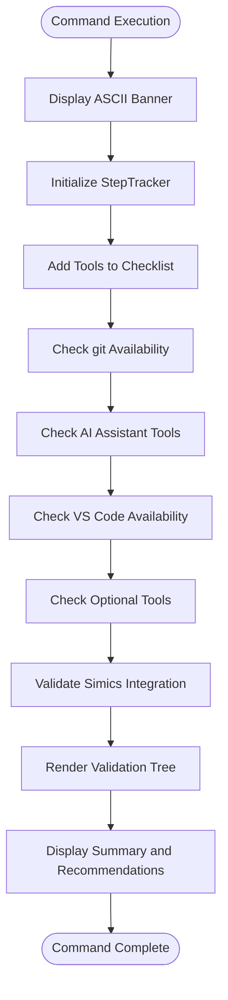
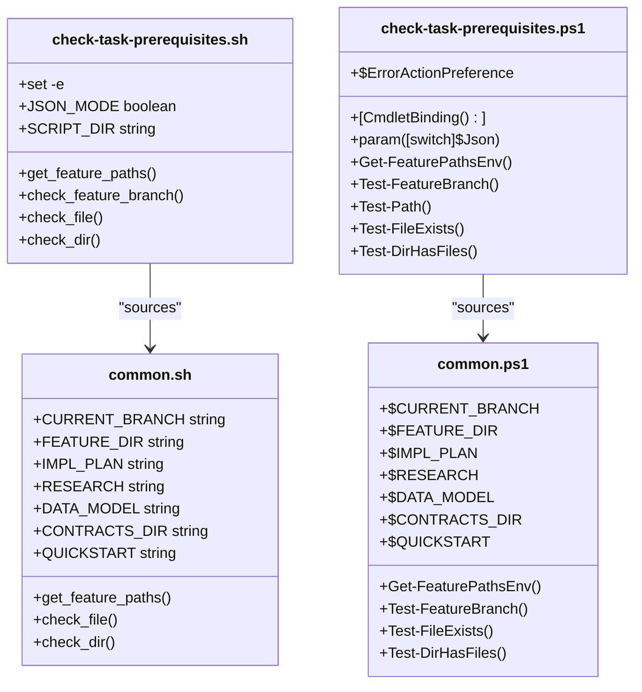
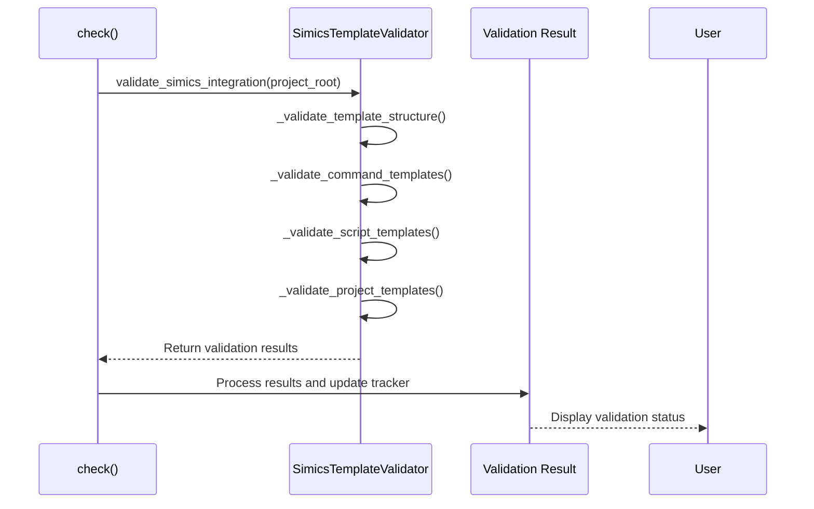

# check Command

<cite>
**Referenced Files in This Document**   
- [__init__.py](file://src/specify_cli/__init__.py)
- [simics_validation.py](file://src/specify_cli/simics_validation.py)
- [check-task-prerequisites.sh](file://scripts/bash/check-task-prerequisites.sh)
- [check-task-prerequisites.ps1](file://scripts/powershell/check-task-prerequisites.ps1)
</cite>

## Table of Contents
1. [Introduction](#introduction)
2. [Command Syntax and Options](#command-syntax-and-options)
3. [Core Functionality and Internal Logic](#core-functionality-and-internal-logic)
4. [Cross-Platform Script Integration](#cross-platform-script-integration)
5. [Simics Integration Validation](#simics-integration-validation)
6. [Output Format and User Interface](#output-format-and-user-interface)
7. [Relationship with Other Commands](#relationship-with-other-commands)
8. [Common Failure Scenarios and Troubleshooting](#common-failure-scenarios-and-troubleshooting)
9. [Extending the Check System](#extending-the-check-system)
10. [Practical Examples](#practical-examples)

## Introduction

The `check` command is a critical component of the spec-kit toolkit, designed to verify system prerequisites and validate the development environment before executing specification tasks. It ensures that all required tools, dependencies, and configurations are properly installed and accessible, preventing execution failures due to missing components. This command serves as a gatekeeper for development workflows, providing immediate feedback on environment readiness and helping maintain consistency across different development setups.

**Section sources**
- [__init__.py](file://src/specify_cli/__init__.py#L1303-L1357)

## Command Syntax and Options

The `check` command has a simple syntax with no required parameters:

```
specify check
```

When executed, it automatically performs a comprehensive validation of the development environment without requiring additional arguments. The command is designed to be self-contained and intuitive, running all necessary checks with a single invocation. It leverages the rich library for output formatting, providing a visually clear and informative status display that highlights both successful validations and any issues that need attention.

**Section sources**
- [__init__.py](file://src/specify_cli/__init__.py#L1303-L1357)

## Core Functionality and Internal Logic

The `check` command implements a systematic validation process through a multi-step verification workflow. It begins by displaying an ASCII art banner and initializing a `StepTracker` object to manage and visualize the checking process. The command then creates a checklist of essential tools and systematically verifies each one using the `check_tool_for_tracker` function, which leverages `shutil.which()` to determine tool availability in the system PATH.

The internal logic follows a dependency validation pattern where each tool is checked in sequence, with results immediately reflected in the tracker interface. For tools with multiple possible executable names (like VS Code with both "code" and "code-insiders"), the command attempts alternative names if the primary one is not found. The process concludes with rendering the complete validation tree and providing summary recommendations based on the results.



**Diagram sources**
- [__init__.py](file://src/specify_cli/__init__.py#L1303-L1357)
- [__init__.py](file://src/specify_cli/__init__.py#L350-L357)
- [__init__.py](file://src/specify_cli/__init__.py#L85-L169)

**Section sources**
- [__init__.py](file://src/specify_cli/__init__.py#L1303-L1357)
- [__init__.py](file://src/specify_cli/__init__.py#L350-L357)
- [__init__.py](file://src/specify_cli/__init__.py#L85-L169)

## Cross-Platform Script Integration

The `check` command ecosystem includes cross-platform script integration through dedicated bash and PowerShell scripts that perform task-specific prerequisite checks. These scripts, `check-task-prerequisites.sh` and `check-task-prerequisites.ps1`, operate in parallel to validate project structure and file availability for specification tasks.

Both scripts implement similar logic with platform-appropriate syntax, checking for the existence of essential directories and files like the feature directory and implementation plan. They support both human-readable and JSON output formats, enabling integration with automated systems. The scripts source common functionality from their respective `common.sh` and `common.ps1` files, ensuring consistent behavior across platforms while leveraging native shell capabilities.



**Diagram sources**
- [check-task-prerequisites.sh](file://scripts/bash/check-task-prerequisites.sh)
- [check-task-prerequisites.ps1](file://scripts/powershell/check-task-prerequisites.ps1)
- [common.sh](file://scripts/bash/common.sh)
- [common.ps1](file://scripts/powershell/common.ps1)

**Section sources**
- [check-task-prerequisites.sh](file://scripts/bash/check-task-prerequisites.sh)
- [check-task-prerequisites.ps1](file://scripts/powershell/check-task-prerequisites.ps1)

## Simics Integration Validation

The `check` command includes specialized validation for Simics integration through the `validate_simics_integration` function. This functionality is implemented in the `simics_validation.py` module and is automatically invoked when the `check` command is executed. The validation process uses the `SimicsTemplateValidator` class to perform a comprehensive assessment of the Simics integration setup.

The validation covers multiple aspects including directory structure, command templates, script templates, and project structure templates. It verifies the presence of required directories like `templates/simics` and `templates/simics/projects`, checks for essential command templates such as `simics-device.md`, and validates script templates for proper content including shebangs, main functions, and JSON output support. The process returns a detailed result dictionary containing success status, error list, warning list, and a summary message.



**Diagram sources**
- [__init__.py](file://src/specify_cli/__init__.py#L1303-L1357)
- [simics_validation.py](file://src/specify_cli/simics_validation.py#L396-L406)
- [simics_validation.py](file://src/specify_cli/simics_validation.py#L22-L39)

**Section sources**
- [__init__.py](file://src/specify_cli/__init__.py#L1303-L1357)
- [simics_validation.py](file://src/specify_cli/simics_validation.py#L396-L406)
- [simics_validation.py](file://src/specify_cli/simics_validation.py#L22-L39)

## Output Format and User Interface

The `check` command utilizes the rich library to create an intuitive and visually appealing user interface. The output is organized as a hierarchical tree structure with color-coded status indicators, making it easy to quickly assess the validation results. Each checked component is represented with a status symbol: green circles for successful checks, red circles for errors, and gray circles for pending items.

The interface follows a consistent format with the main title "Check Available Tools" displayed in cyan, followed by individual tool entries showing their status and detailed information. Successful checks display "available" in green, while missing tools show "not found" with installation hints in red. The output concludes with a success message and targeted recommendations based on the validation results, such as suggesting git installation if it's missing or recommending AI assistant installation if none are detected.

**Section sources**
- [__init__.py](file://src/specify_cli/__init__.py#L1303-L1357)
- [__init__.py](file://src/specify_cli/__init__.py#L85-L169)

## Relationship with Other Commands

The `check` command plays a foundational role in the spec-kit command ecosystem, serving as a prerequisite validator for other key commands like `init` and `validate-simics`. While `init` is responsible for project setup and structure creation, `check` verifies that the environment is properly configured to support these operations. The two commands complement each other, with `check` ensuring tool availability and `init` establishing project organization.

For Simics-related workflows, `check` provides preliminary validation that integrates with the more specialized `validate-simics` command. The `check` command performs basic verification of Simics integration components, while `validate-simics` offers deeper, more comprehensive testing of Simics functionality. This layered approach allows for quick environment checks with `check` and thorough validation with dedicated commands when needed.

**Section sources**
- [__init__.py](file://src/specify_cli/__init__.py#L1303-L1357)
- [simics_validation.py](file://src/specify_cli/simics_validation.py#L396-L406)

## Common Failure Scenarios and Troubleshooting

The `check` command helps identify several common failure scenarios in development environments. The most frequent issue is missing essential tools, particularly git, which is required for repository management. When git is not found, the command clearly indicates this with a red error status and provides the installation URL as guidance.

Another common scenario involves missing AI assistant tools, which are recommended for optimal experience. If none of the supported AI assistants (Claude, Gemini, Qwen, etc.) are detected, the command provides a recommendation to install one. For Simics integration, common issues include missing template directories, incomplete command templates without required YAML fields, or scripts lacking proper error handling mechanisms.

Troubleshooting these issues typically involves installing the missing components using the provided installation hints, ensuring they are properly added to the system PATH, and verifying their functionality. For Simics-related issues, users should ensure all required template files are present and correctly formatted according to the validation requirements.

**Section sources**
- [__init__.py](file://src/specify_cli/__init__.py#L1303-L1357)
- [simics_validation.py](file://src/specify_cli/simics_validation.py#L14-L208)

## Extending the Check System

The `check` command system is designed to be extensible, allowing for the addition of custom validations. New tool checks can be incorporated by adding entries to the tracker with appropriate installation hints. The modular design of the validation system, particularly evident in the `SimicsTemplateValidator` class, provides a template for creating specialized validators for other integration points.

Custom validations can be implemented by creating new validation methods that follow the same pattern of adding items to the tracker, performing checks, and updating the status accordingly. The system supports both simple presence checks using `shutil.which()` and more complex validations that examine file contents, directory structures, or functional capabilities. This extensibility ensures that the `check` command can adapt to evolving tooling requirements and support new integration scenarios.

**Section sources**
- [__init__.py](file://src/specify_cli/__init__.py#L1303-L1357)
- [simics_validation.py](file://src/specify_cli/simics_validation.py#L14-L208)

## Practical Examples

The `check` command is typically used at the beginning of development workflows to ensure environment readiness. A common use case is verifying Simics installation by checking for the presence of required tools and templates. When executed, it will validate that git is available for version control, that an AI assistant is installed for enhanced development capabilities, and that Simics integration components are properly set up.

Another practical example is checking for required toolchains before starting specification tasks. The command will verify the availability of essential development tools and provide immediate feedback if any are missing. This proactive validation helps prevent workflow interruptions and ensures that developers can proceed with confidence, knowing their environment meets all prerequisites for successful task execution.

**Section sources**
- [__init__.py](file://src/specify_cli/__init__.py#L1303-L1357)
- [simics_validation.py](file://src/specify_cli/simics_validation.py#L396-L406)