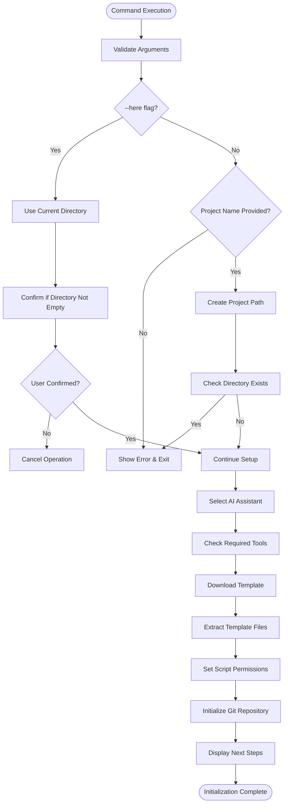
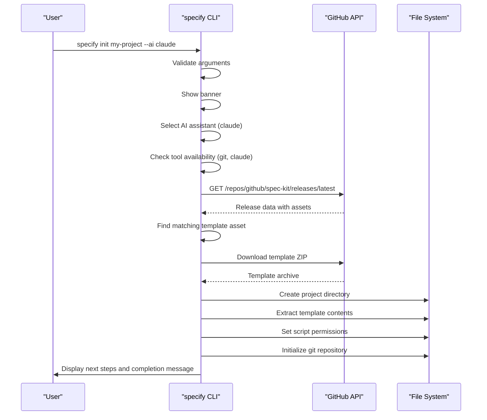
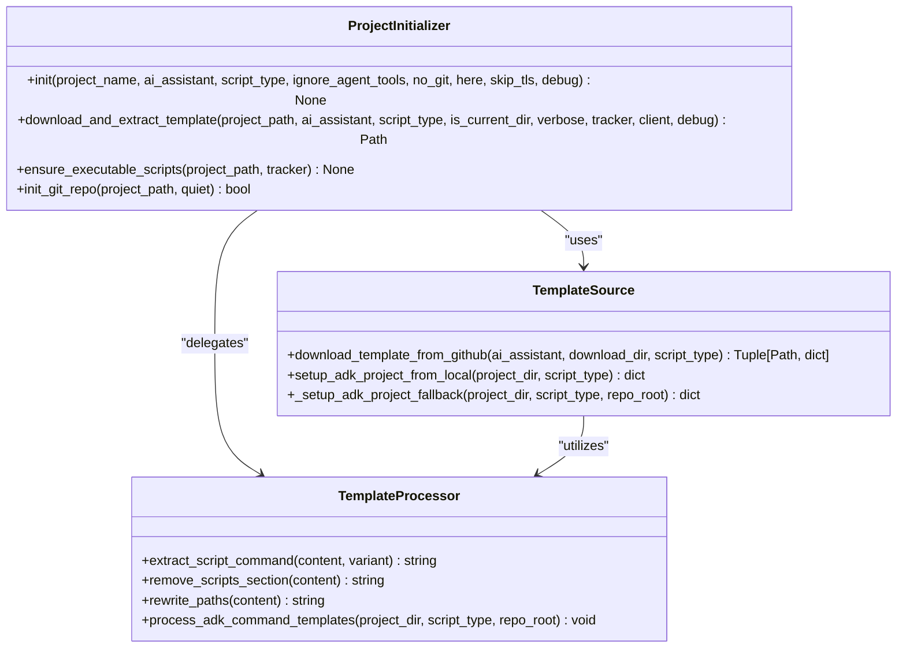
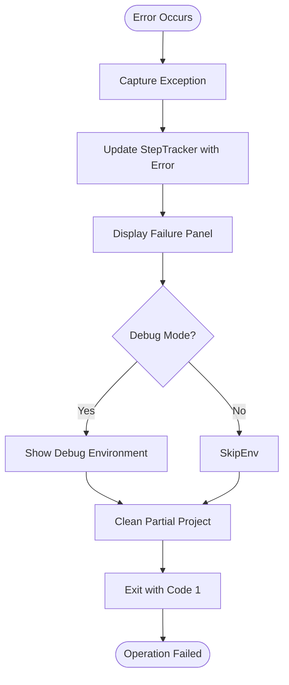

# init Command

<cite>
**Referenced Files in This Document**   
- [__init__.py](file://src/specify_cli/__init__.py)
- [pyproject.toml](file://pyproject.toml)
- [spec-template.md](file://templates/spec-template.md)
- [plan-template.md](file://templates/plan-template.md)
- [tasks-template.md](file://templates/tasks-template.md)
- [simics-platform.md](file://templates/commands/simics-platform.md)
- [simics-device.md](file://templates/commands/simics-device.md)
- [simics-validate.md](file://templates/commands/simics-validate.md)
</cite>

## Table of Contents
1. [Introduction](#introduction)
2. [Command Parameters and Usage](#command-parameters-and-usage)
3. [Internal Workflow](#internal-workflow)
4. [Template System Integration](#template-system-integration)
5. [Real-World Usage Examples](#real-world-usage-examples)
6. [Error Handling and Debugging](#error-handling-and-debugging)
7. [Performance Considerations](#performance-considerations)
8. [Conclusion](#conclusion)

## Introduction
The `init` command in the spec-kit CLI serves as the primary entry point for bootstrapping new specification-driven development projects. It automates the creation of project structures, applies customizable templates, configures environment settings, and prepares the development environment for immediate use. This command is designed to streamline project setup by integrating with AI assistants, script environments, and version control systems while maintaining flexibility for various development workflows.

**Section sources**
- [__init__.py](file://src/specify_cli/__init__.py#L1027-L1299)

## Command Parameters and Usage
The `specify init` command supports multiple parameters that control project initialization behavior:

- **project_name**: Optional directory name for the new project (omitted when using `--here`)
- **--ai**: Specifies the AI assistant to configure (claude, gemini, copilot, cursor, qwen, opencode, or adk)
- **--script**: Chooses script type (sh for bash, ps for PowerShell)
- **--ignore-agent-tools**: Skips validation of required AI CLI tools
- **--no-git**: Prevents git repository initialization
- **--here**: Initializes project in current directory instead of creating a new one
- **--skip-tls**: Disables SSL/TLS verification during downloads
- **--debug**: Enables verbose diagnostic output

When no arguments are provided, the command uses interactive prompts to select AI assistant and script type based on the operating system default.



**Diagram sources**
- [__init__.py](file://src/specify_cli/__init__.py#L1027-L1299)

**Section sources**
- [__init__.py](file://src/specify_cli/__init__.py#L1027-L1299)

## Internal Workflow
The `init` command follows a structured workflow to ensure reliable project creation:

1. **Argument Validation**: Validates command-line arguments, ensuring mutually exclusive options like `--here` and project name aren't used together
2. **Project Path Determination**: Sets the target directory either as a new folder or the current working directory
3. **Tool Verification**: Checks for required tools including git and AI-specific CLIs (unless `--ignore-agent-tools` is specified)
4. **Interactive Selection**: Uses arrow-key navigation interface for AI assistant and script type selection when not explicitly specified
5. **Template Acquisition**: Downloads appropriate template ZIP from GitHub releases based on AI assistant and script type preferences
6. **Extraction and Setup**: Extracts template contents, handling nested directory structures from GitHub archives
7. **Permission Configuration**: Ensures shell scripts have execute permissions on POSIX systems
8. **Git Initialization**: Creates a new git repository with initial commit if requested and git is available
9. **Finalization**: Displays next steps and usage instructions tailored to the selected AI assistant

The process uses a StepTracker system to provide real-time progress feedback with distinct phases for each major operation.



**Diagram sources**
- [__init__.py](file://src/specify_cli/__init__.py#L1027-L1299)
- [__init__.py](file://src/specify_cli/__init__.py#L689-L787)

**Section sources**
- [__init__.py](file://src/specify_cli/__init__.py#L1027-L1299)

## Template System Integration
The `init` command integrates with the template system through the `templates/` directory structure, which contains both base templates and command-specific templates:

- **Base Templates**: Located in root templates/ directory (spec-template.md, plan-template.md, etc.)
- **Command Templates**: Stored in templates/commands/ directory for specific functionality
- **Simics Templates**: Specialized templates under templates/simics/ for hardware simulation projects

For ADK (AI Development Kit) projects, the initialization process uses local repository files instead of downloading from GitHub. It processes command templates by:
1. Extracting script commands from YAML frontmatter based on selected script type
2. Removing scripts sections from frontmatter while preserving structure
3. Rewriting paths to use `.specify/` prefix for proper resource resolution
4. Replacing placeholders like `{SCRIPT}`, `{ARGS}`, and `__AGENT__`

The template system supports dynamic configuration through placeholder replacement and conditional processing based on the selected AI platform and script environment.



**Diagram sources**
- [__init__.py](file://src/specify_cli/__init__.py#L510-L563)
- [__init__.py](file://src/specify_cli/__init__.py#L689-L787)
- [__init__.py](file://src/specify_cli/__init__.py#L425-L459)

**Section sources**
- [__init__.py](file://src/specify_cli/__init__.py#L425-L623)

## Real-World Usage Examples
### Simics Project Initialization
To initialize a Simics-related hardware development project:

```bash
specify init my-simics-project --ai claude --script sh
```

This creates a project configured for Simics development with:
- Simics-specific command templates (simics-device.md, simics-platform.md, simics-validate.md)
- Bash scripts for Linux-based development environments
- Claude Code integration for AI-assisted development
- Proper directory structure for specification-driven development

The initialization automatically includes Simics example documentation and project structure guidelines from the templates/simics/examples/ directory.

### Current Directory Initialization
For initializing a project in an existing directory:

```bash
cd existing-project
specify init --here --ai gemini --no-git
```

This merges template files into the current directory without creating a new folder or initializing git, useful for adding specification capabilities to existing projects.

### ADK Project Setup
For AI Development Kit projects, the system uses local templates:

```bash
specify init adk-project --ai adk --script ps
```

This setup processes command templates locally, rewriting paths to use `.specify/` prefixes and configuring PowerShell scripts for Windows environments.

**Section sources**
- [__init__.py](file://src/specify_cli/__init__.py#L1027-L1299)
- [simics-platform.md](file://templates/commands/simics-platform.md)
- [simics-device.md](file://templates/commands/simics-device.md)

## Error Handling and Debugging
The `init` command implements comprehensive error handling for common issues:

### Common Issues and Solutions
- **Directory Conflicts**: When target directory exists, initialization aborts unless `--here` is used
- **Invalid Project Names**: Names with special characters or invalid filesystem characters cause validation errors
- **Template Rendering Failures**: For ADK projects, template processing failures trigger fallback to direct copying
- **Network Issues**: SSL/TLS verification problems can be bypassed with `--skip-tls` (not recommended)
- **Missing Dependencies**: Required AI tools prompt installation instructions; use `--ignore-agent-tools` to bypass

### Debugging Strategies
Enable debug mode with `--debug` flag to:
- Display detailed environment information (Python version, platform, CWD)
- Show complete error traces for network and extraction failures
- Log HTTP response headers and body samples for API issues
- Provide insight into SSL/TLS handshake problems

The system automatically cleans up partially created project directories on failure to prevent inconsistent states.



**Diagram sources**
- [__init__.py](file://src/specify_cli/__init__.py#L1027-L1299)

**Section sources**
- [__init__.py](file://src/specify_cli/__init__.py#L1027-L1299)

## Performance Considerations
The `init` command optimizes performance through several strategies:

- **Minimized I/O Operations**: Files are written directly to final locations when possible, reducing copy operations
- **Efficient Archive Handling**: ZIP files are streamed during download and extracted without intermediate buffering
- **Conditional Processing**: Git operations only occur when explicitly requested and tools are available
- **Parallelizable Operations**: Template processing and file copying operations are designed to be independent and potentially parallelizable
- **Progressive Rendering**: Uses Rich Live display for real-time progress updates without excessive console output

The command avoids unnecessary operations by:
- Skipping git initialization when `--no-git` is specified
- Bypassing AI tool checks when `--ignore-agent-tools` is used
- Using local templates for ADK projects instead of downloading
- Only showing interactive prompts when stdin is a TTY

Network performance is optimized through:
- Direct streaming of download content to disk
- Progress indicators that don't interfere with download speed
- Efficient HTTP client configuration with proper timeouts

**Section sources**
- [__init__.py](file://src/specify_cli/__init__.py#L1027-L1299)

## Conclusion
The `init` command provides a robust foundation for specification-driven development projects by automating complex setup tasks while maintaining flexibility for different development environments and workflows. Its integration with AI assistants, template system, and version control enables rapid project bootstrapping with consistent structure and configuration. The command's comprehensive error handling, debugging capabilities, and performance optimizations ensure reliable operation across various scenarios, from simple local projects to complex Simics-based hardware development environments.