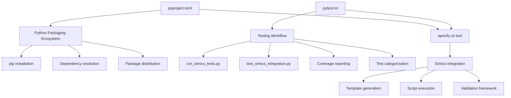

# Configuration Files

<cite>
**Referenced Files in This Document**   
- [pyproject.toml](file://pyproject.toml)
- [pytest.ini](file://pytest.ini)
- [src/specify_cli/simics_validation.py](file://src/specify_cli/simics_validation.py)
- [run_simics_tests.py](file://run_simics_tests.py)
- [tests/test_simics_integration.py](file://tests/test_simics_integration.py)
</cite>

## Table of Contents
1. [Introduction](#introduction)
2. [pyproject.toml Configuration](#pyprojecttoml-configuration)
3. [pytest.ini Configuration](#pytestini-configuration)
4. [Integration with System Workflows](#integration-with-system-workflows)
5. [Common Configuration Issues](#common-configuration-issues)
6. [Best Practices](#best-practices)
7. [Conclusion](#conclusion)

## Introduction
This document provides comprehensive guidance on the configuration files that control tool behavior in the spec-kit repository. The primary focus is on two critical configuration files: `pyproject.toml` and `pytest.ini`. These files define essential metadata, dependencies, package configuration, and test runner settings that enable Simics integration testing. The documentation explains their structure, purpose, and integration with the broader development ecosystem, while also addressing common issues and best practices for configuration management across different environments.

## pyproject.toml Configuration

The `pyproject.toml` file serves as the central configuration for Python packaging and project metadata in the spec-kit repository. It follows the modern Python packaging standard and defines essential information about the specify-cli tool, including its name, version, dependencies, and entry points.

The configuration is structured into several key sections that control different aspects of the package:

- **Project Metadata**: Defines the package name (`specify-cli`), version (`0.0.6`), description, and required Python version (`>=3.11`)
- **Dependencies**: Specifies the runtime dependencies including `typer` for CLI functionality, `rich` for enhanced output, `httpx[socks]` for HTTP operations, `platformdirs` for platform-specific directory handling, `readchar` for keyboard input, and `truststore` for secure connections
- **Entry Points**: Configures the command-line interface through the `[project.scripts]` section, exposing the `specify` command that maps to the `main` function in the `specify_cli` module
- **Build System**: Defines the build backend using Hatch (`hatchling`) and specifies the package location in the `src` directory

This configuration enables seamless installation and distribution of the specify-cli tool through standard Python package managers while ensuring all required dependencies are properly resolved.

**Section sources**
- [pyproject.toml](file://pyproject.toml#L1-L23)

## pytest.ini Configuration

The `pytest.ini` file configures the pytest test runner for Simics integration tests, establishing the testing environment and execution parameters. This configuration is critical for maintaining consistent test behavior across different development environments and ensuring comprehensive test coverage.

The configuration includes several key components:

- **Core Test Settings**: Sets the minimum pytest version to 6.0 and defines the test paths to search for tests in the `tests` directory
- **Test Discovery**: Configures Python file patterns to identify test files (`test_*.py`, `*_test.py`), test classes (`Test*`), and test functions (`test_*`)
- **Command Line Options**: Specifies default command-line arguments including result reporting (`-ra`), strict marker enforcement, strict configuration validation, disabled warnings, and short traceback format
- **Custom Markers**: Defines test markers for categorizing tests by type, including `simics` for Simics integration tests, `slow` for time-consuming tests, `integration` for integration tests, `unit` for unit tests, and `e2e` for end-to-end tests
- **Coverage Configuration**: Sets up code coverage analysis with branch coverage enabled and specifies files to omit from coverage reports, including test files and cache directories
- **Coverage Reporting**: Configures exclusion patterns for coverage reporting, allowing certain code patterns to be excluded from coverage requirements (e.g., debug code, abstract methods, and protocol definitions)

The pytest configuration ensures that Simics integration tests are executed consistently with proper reporting and coverage measurement, while also providing mechanisms to selectively run different categories of tests based on their markers.

```mermaid
flowchart TD
A["pytest.ini Configuration"] --> B["Core Settings"]
A --> C["Test Discovery"]
A --> D["Command Line Options"]
A --> E["Custom Markers"]
A --> F["Coverage Configuration"]
B --> B1["minversion = 6.0"]
B --> B2["testpaths = tests"]
C --> C1["python_files = test_*.py *_test.py"]
C --> C2["python_classes = Test*"]
C --> C3["python_functions = test_*"]
D --> D1["-ra"]
D --> D2["--strict-markers"]
D --> D3["--strict-config"]
D --> D4["--disable-warnings"]
D --> D5["--tb=short"]
E --> E1["simics: Simics integration tests"]
E --> E2["slow: Slow tests"]
E --> E3["integration: Integration tests"]
E --> E4["unit: Unit tests"]
E --> E5["e2e: End-to-end tests"]
F --> F1["source = specify_cli"]
F --> F2["branch = True"]
F --> F3["omit patterns"]
F --> F4["exclude_lines patterns"]
```

**Diagram sources**
- [pytest.ini](file://pytest.ini#L1-L39)

**Section sources**
- [pytest.ini](file://pytest.ini#L1-L39)
- [tests/test_simics_integration.py](file://tests/test_simics_integration.py#L1-L351)

## Integration with System Workflows

The configuration files integrate with the broader system workflows in several important ways, connecting the Python packaging ecosystem with the testing infrastructure.

The `pyproject.toml` file integrates with the Python packaging ecosystem by:
- Enabling installation via pip and other Python package managers
- Defining the executable entry point for the specify-cli tool
- Specifying dependencies that are automatically resolved during installation
- Using Hatch as the build backend for consistent package building

The `pytest.ini` configuration integrates with the testing workflow by:
- Working in conjunction with the `run_simics_tests.py` script that orchestrates test execution
- Supporting the test structure defined in `test_simics_integration.py` which uses pytest markers to categorize Simics integration tests
- Enabling coverage reporting that measures the effectiveness of the test suite
- Providing consistent test execution parameters across different environments

The integration between these configuration files and the system workflows ensures that developers can reliably install, configure, and test the specify-cli tool with consistent behavior across different development environments.

**Diagram sources**
- [pyproject.toml](file://pyproject.toml#L1-L23)
- [pytest.ini](file://pytest.ini#L1-L39)
- [run_simics_tests.py](file://run_simics_tests.py#L1-L275)
- [src/specify_cli/simics_validation.py](file://src/specify_cli/simics_validation.py#L1-L431)

**Section sources**
- [pyproject.toml](file://pyproject.toml#L1-L23)
- [pytest.ini](file://pytest.ini#L1-L39)
- [run_simics_tests.py](file://run_simics_tests.py#L1-L275)
- [src/specify_cli/simics_validation.py](file://src/specify_cli/simics_validation.py#L1-L431)

## Common Configuration Issues

Several common configuration issues can arise when working with the configuration files in the spec-kit repository. Understanding these issues and their solutions is essential for maintaining a stable development environment.

### pyproject.toml Issues
- **Missing Dependencies**: Forgetting to add required dependencies to the `dependencies` list can cause runtime errors when the tool is used
- **Incorrect Python Version**: Specifying an incompatible Python version requirement can prevent installation on supported systems
- **Invalid Entry Points**: Incorrectly configured script entry points can prevent the command-line interface from working properly
- **Build Backend Problems**: Issues with the Hatch build backend configuration can prevent package building and distribution

### pytest.ini Issues
- **Marker Misuse**: Using undefined markers in test functions can cause pytest to fail with strict marker enforcement enabled
- **Incorrect Test Paths**: Misconfigured `testpaths` can cause tests to be missed during test discovery
- **Conflicting Options**: Combining incompatible command-line options can lead to unexpected test behavior
- **Coverage Configuration Errors**: Incorrect source paths or omit patterns can result in inaccurate coverage reports

### Environment-Specific Issues
- **Cross-Platform Testing**: Differences between Windows and Unix-like systems can affect test execution, particularly for shell scripts
- **Dependency Version Conflicts**: Conflicting dependency versions between development and production environments
- **Path Configuration**: Relative path issues when running tests from different working directories

These issues can typically be resolved by carefully reviewing the configuration files, ensuring all required sections are present and correctly formatted, and validating the configuration against the official documentation for each tool.

**Section sources**
- [pyproject.toml](file://pyproject.toml#L1-L23)
- [pytest.ini](file://pytest.ini#L1-L39)
- [run_simics_tests.py](file://run_simics_tests.py#L1-L275)

## Best Practices

To ensure reliable and maintainable configuration management, several best practices should be followed when working with the configuration files in the spec-kit repository.

### pyproject.toml Best Practices
- **Explicit Dependencies**: List all direct dependencies explicitly, avoiding broad dependency specifications
- **Version Pinning**: Use appropriate version specifiers to balance dependency stability with security updates
- **Comprehensive Metadata**: Provide complete project metadata including description, authors, and license information
- **Regular Updates**: Periodically review and update dependencies to incorporate security fixes and new features
- **Testing Configuration**: Include development dependencies in a separate section for testing and development tools

### pytest.ini Best Practices
- **Consistent Test Organization**: Follow the configured test discovery patterns to ensure tests are automatically discovered
- **Appropriate Marker Usage**: Use custom markers consistently to categorize tests and enable selective test execution
- **Coverage Goals**: Set realistic coverage goals and use exclusion patterns judiciously to avoid masking untested code
- **Configuration Validation**: Regularly validate the pytest configuration by running tests with strict mode enabled
- **Documentation**: Document any custom configuration options or non-standard practices in the project documentation

### Cross-Environment Best Practices
- **Environment Parity**: Maintain consistency between development, testing, and production environments
- **Configuration Validation**: Implement automated checks to validate configuration files during the development process
- **Team Standards**: Establish and document team-wide standards for configuration management
- **Version Control**: Keep configuration files under version control and document significant changes
- **Review Process**: Include configuration changes in code reviews to ensure they meet project standards

Following these best practices helps ensure that the configuration files remain reliable, maintainable, and effective across different development environments and team setups.

**Section sources**
- [pyproject.toml](file://pyproject.toml#L1-L23)
- [pytest.ini](file://pytest.ini#L1-L39)
- [run_simics_tests.py](file://run_simics_tests.py#L1-L275)
- [src/specify_cli/simics_validation.py](file://src/specify_cli/simics_validation.py#L1-L431)

## Conclusion
The configuration files `pyproject.toml` and `pytest.ini` play critical roles in the spec-kit repository, controlling package metadata, dependencies, and test execution behavior. The `pyproject.toml` file provides the foundation for Python packaging and distribution, while `pytest.ini` configures the test runner for Simics integration tests with comprehensive settings for test discovery, execution, and coverage measurement. These files integrate seamlessly with the broader system workflows, connecting the Python packaging ecosystem with the testing infrastructure. By understanding common configuration issues and following best practices for configuration management, development teams can ensure reliable and maintainable setups across different environments. Proper configuration management is essential for maintaining the stability, reliability, and effectiveness of the specify-cli tool and its Simics integration capabilities.