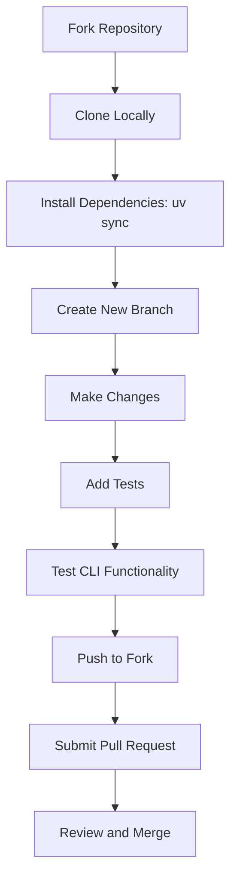
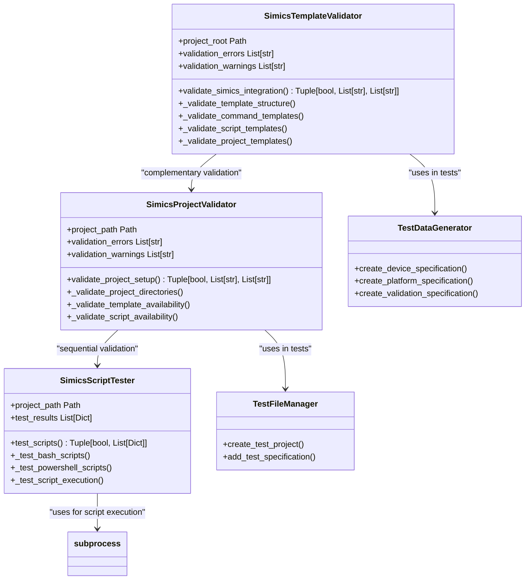
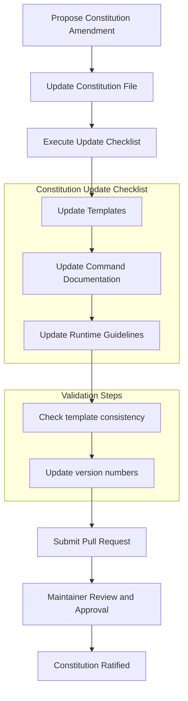

# Contributing Guidelines

<cite>
**Referenced Files in This Document**   
- [CONTRIBUTING.md](file://CONTRIBUTING.md)
- [CODE_OF_CONDUCT.md](file://CODE_OF_CONDUCT.md)
- [memory/constitution.md](file://memory/constitution.md)
- [memory/constitution_update_checklist.md](file://memory/constitution_update_checklist.md)
- [tests/test_simics_e2e.py](file://tests/test_simics_e2e.py)
- [tests/test_simics_integration.py](file://tests/test_simics_integration.py)
- [src/specify_cli/simics_validation.py](file://src/specify_cli/simics_validation.py)
- [SIMICS_INTEGRATION_PLAN.md](file://SIMICS_INTEGRATION_PLAN.md)
</cite>

## Table of Contents
1. [Introduction](#introduction)
2. [Contribution Workflow](#contribution-workflow)
3. [Technical Expectations](#technical-expectations)
4. [Project Governance](#project-governance)
5. [Feature Proposals and Issue Reporting](#feature-proposals-and-issue-reporting)
6. [Community Interaction Norms](#community-interaction-norms)
7. [Exemplary Contributions and Common Pitfalls](#exemplary-contributions-and-common-pitfalls)
8. [Conclusion](#conclusion)

## Introduction

This document provides a comprehensive guide for contributing to the spec-kit project, consolidating and expanding upon the information in CONTRIBUTING.md and CODE_OF_CONDUCT.md. It serves as a complete resource for both new and experienced contributors, detailing the contribution workflow, technical expectations, governance model, and community interaction norms. The spec-kit project welcomes contributions that align with its core principles of specification-driven development and aims to foster an inclusive and productive environment for all participants.

**Section sources**
- [CONTRIBUTING.md](file://CONTRIBUTING.md#L1-L53)
- [CODE_OF_CONDUCT.md](file://CODE_OF_CONDUCT.md#L1-L73)

## Contribution Workflow

The contribution workflow for spec-kit follows a structured fork-build-test-submit cycle designed to ensure code quality and maintain project integrity. Contributors should begin by forking the repository and cloning it locally. After installing the required dependencies with `uv sync`, contributors must create a new branch for their changes using a descriptive name that follows the project's naming conventions. The development workflow emphasizes testing changes with the `specify` CLI commands in an AI coding agent environment, verifying template functionality, and ensuring script functionality is preserved. Before submitting a pull request, contributors must ensure their changes are focused, include appropriate tests, and update relevant documentation. Large changes that materially impact the CLI or repository structure must be discussed and agreed upon with project maintainers prior to submission to avoid rejection.

**Diagram sources**
- [CONTRIBUTING.md](file://CONTRIBUTING.md#L15-L38)

**Section sources**
- [CONTRIBUTING.md](file://CONTRIBUTING.md#L15-L53)

## Technical Expectations

Contributors to spec-kit must adhere to strict technical expectations regarding code quality, testing coverage, and documentation updates. The project follows a test-first (TDD) methodology as a non-negotiable principle, requiring tests to be written before implementation. For Simics integration, the test suite includes both `test_simics_integration.py` and `test_simics_e2e.py`, which verify the end-to-end functionality of Simics commands, template generation, and script execution. These tests validate that the Simics integration maintains proper template structure, command templates, script templates, and project templates. The `simics_validation.py` module provides comprehensive validation functions that check for required directories, validate command templates for proper YAML frontmatter and required fields, ensure script content includes main functions and JSON output support, and verify project templates contain essential sections like execution flow and review checklists. Documentation updates are required for any changes affecting user-facing features, particularly in `README.md` and `spec-driven.md`.

**Diagram sources**
- [src/specify_cli/simics_validation.py](file://src/specify_cli/simics_validation.py#L14-L208)
- [src/specify_cli/simics_validation.py](file://src/specify_cli/simics_validation.py#L211-L290)
- [src/specify_cli/simics_validation.py](file://src/specify_cli/simics_validation.py#L293-L393)

**Section sources**
- [tests/test_simics_e2e.py](file://tests/test_simics_e2e.py#L1-L308)
- [tests/test_simics_integration.py](file://tests/test_simics_integration.py#L1-L351)
- [src/specify_cli/simics_validation.py](file://src/specify_cli/simics_validation.py#L1-L431)

## Project Governance

The governance model of spec-kit is defined in the `memory/constitution.md` file, which establishes the project's core principles and decision-making framework. The constitution outlines key principles including Library-First, CLI Interface, Test-First (non-negotiable), Integration Testing, and other foundational concepts that guide development practices. Amendments to the constitution follow a structured process documented in `constitution_update_checklist.md`, which ensures consistency across all project documentation when changes are made. This checklist requires updating templates, command documentation, and other dependent files to maintain alignment with constitutional changes. The governance model emphasizes that the constitution supersedes all other practices and requires proper documentation, approval, and migration planning for any amendments. Project maintainers are responsible for enforcing these standards and ensuring all contributions comply with the established principles.

**Diagram sources**
- [memory/constitution.md](file://memory/constitution.md#L1-L49)
- [memory/constitution_update_checklist.md](file://memory/constitution_update_checklist.md#L1-L84)

**Section sources**
- [memory/constitution.md](file://memory/constitution.md#L1-L49)
- [memory/constitution_update_checklist.md](file://memory/constitution_update_checklist.md#L1-L84)

## Feature Proposals and Issue Reporting

Contributors are encouraged to propose new features, report bugs, and suggest improvements through the project's established channels. For feature proposals, especially those that introduce large changes to the CLI or repository structure, contributors must first discuss and gain agreement from project maintainers before submitting a pull request. This pre-approval process ensures alignment with the project's roadmap and prevents wasted effort on rejected contributions. Bug reports should include detailed information about the issue, steps to reproduce, expected behavior, and actual behavior. Suggestions for improvements can be submitted as issues, providing clear rationale and potential implementation approaches. The project's implementation plan, documented in `SIMICS_INTEGRATION_PLAN.md`, serves as a model for how to structure comprehensive feature proposals with phased implementation, quality gates, and success metrics.

**Section sources**
- [CONTRIBUTING.md](file://CONTRIBUTING.md#L15-L22)
- [SIMICS_INTEGRATION_PLAN.md](file://SIMICS_INTEGRATION_PLAN.md#L1-L386)

## Community Interaction Norms

The spec-kit community adheres to the Contributor Covenant Code of Conduct, which fosters an open and welcoming environment for all participants. The code of conduct emphasizes using welcoming and inclusive language, being respectful of differing viewpoints and experiences, gracefully accepting constructive criticism, focusing on what is best for the community, and showing empathy towards other community members. Unacceptable behavior includes the use of sexualized language or imagery, trolling, insulting or derogatory comments, personal or political attacks, harassment, and publishing others' private information without permission. Project maintainers have the right and responsibility to remove, edit, or reject comments, commits, code, wiki edits, issues, and other contributions that do not align with this code of conduct. Instances of abusive or harassing behavior can be reported to the project team at <opensource@github.com>, with all complaints reviewed and investigated confidentially.

**Section sources**
- [CODE_OF_CONDUCT.md](file://CODE_OF_CONDUCT.md#L1-L73)

## Exemplary Contributions and Common Pitfalls

Exemplary contributions to spec-kit follow the project's best practices and avoid common pitfalls. Well-structured contributions are focused, addressing a single issue or feature without introducing unrelated changes. They include comprehensive tests that cover both positive and negative scenarios, particularly for critical components like Simics integration. Documentation is updated to reflect any user-facing changes, and commit messages follow the recommended format with clear, descriptive content. Contributors who test their changes with the Spec-Driven Development workflow ensure compatibility with the project's core methodology. Common pitfalls to avoid include submitting large changes without prior discussion, failing to write adequate tests, neglecting documentation updates, introducing code that doesn't follow the project's coding conventions, and making changes that violate the principles outlined in the constitution. Contributions that bypass the test-first methodology or fail to validate template and script integrity are likely to be rejected.

**Section sources**
- [CONTRIBUTING.md](file://CONTRIBUTING.md#L39-L53)
- [SIMICS_INTEGRATION_PLAN.md](file://SIMICS_INTEGRATION_PLAN.md#L1-L386)

## Conclusion

Contributing to spec-kit requires adherence to a comprehensive set of guidelines that encompass technical standards, governance principles, and community norms. By following the documented contribution workflow, maintaining high technical expectations for code quality and testing, respecting the project's governance model, and engaging with the community in a constructive manner, contributors can make valuable additions to the project. The resources provided in this document, including detailed information on the fork-build-test-submit cycle, technical requirements for Simics integration testing, constitutional governance, and best practices for feature proposals, equip contributors with the knowledge needed to make successful contributions. The project's success depends on the collective effort of its community, and adherence to these guidelines ensures that spec-kit continues to evolve as a robust, reliable, and inclusive open-source project.