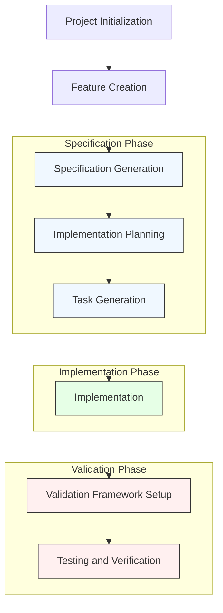
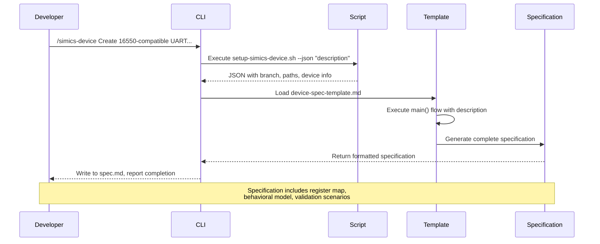

# Development Workflow

<cite>
**Referenced Files in This Document**   
- [create-new-feature.sh](file://scripts/bash/create-new-feature.sh)
- [setup-simics-device.sh](file://scripts/bash/setup-simics-device.sh)
- [setup-plan.sh](file://scripts/bash/setup-plan.sh)
- [setup-simics-validate.sh](file://scripts/bash/setup-simics-validate.sh)
- [simics-device.md](file://templates/commands/simics-device.md)
- [simics-validate.md](file://templates/commands/simics-validate.md)
- [plan.md](file://templates/commands/plan.md)
- [device-spec-template.md](file://templates/simics/projects/device-spec-template.md)
- [validation-template.md](file://templates/simics/projects/validation-template.md)
- [simics_validation.py](file://src/specify_cli/simics_validation.py)
- [uart-controller-example.md](file://templates/simics/examples/uart-controller-example.md)
</cite>

## Table of Contents
1. [Specification-Driven Development Methodology](#specification-driven-development-methodology)
2. [End-to-End Development Workflow](#end-to-end-development-workflow)
3. [Component Integration in the Workflow](#component-integration-in-the-workflow)
4. [Practical Example: UART Controller Development](#practical-example-uart-controller-development)
5. [Common Workflow Bottlenecks and Solutions](#common-workflow-bottlenecks-and-solutions)
6. [Performance Considerations for Fast Feedback Loops](#performance-considerations-for-fast-feedback-loops)

## Specification-Driven Development Methodology

The spec-kit framework promotes a specification-driven development methodology that establishes clear, testable requirements before implementation begins. This approach ensures alignment between design intent and implementation outcomes, particularly in complex Simics-based device modeling projects. The methodology follows a strict separation between specification (WHAT) and implementation (HOW), preventing premature technical decisions from influencing requirements. Specifications serve as executable contracts that guide development, testing, and validation activities throughout the project lifecycle. This approach enables early validation of requirements, reduces rework, and provides a single source of truth for cross-functional teams working on simulation models.

**Section sources**
- [device-spec-template.md](file://templates/simics/projects/device-spec-template.md#L1-L230)
- [validation-template.md](file://templates/simics/projects/validation-template.md#L1-L303)
- [simics-device.md](file://templates/commands/simics-device.md#L1-L45)

## End-to-End Development Workflow

The end-to-end development workflow in spec-kit follows a structured progression from project initialization to final validation. The process begins with the `create-new-feature` script, which initializes a new feature branch and directory structure following the repository's naming conventions. Developers then use specialized commands like `/simics-device` to generate comprehensive device specifications based on natural language descriptions. These specifications are created using predefined templates that ensure consistency and completeness across projects. Following specification generation, the `/plan` command creates implementation plans that translate requirements into actionable technical approaches. The workflow culminates with the `/tasks` command that generates prioritized implementation tasks, creating a clear roadmap for development teams. Finally, the `/simics-validate` command establishes validation frameworks that define test scenarios and success criteria, closing the loop between specification and verification.



**Diagram sources **
- [create-new-feature.sh](file://scripts/bash/create-new-feature.sh#L1-L58)
- [setup-simics-device.sh](file://scripts/bash/setup-simics-device.sh#L1-L201)
- [setup-plan.sh](file://scripts/bash/setup-plan.sh#L1-L17)
- [setup-simics-validate.sh](file://scripts/bash/setup-simics-validate.sh#L1-L272)

**Section sources**
- [create-new-feature.sh](file://scripts/bash/create-new-feature.sh#L1-L58)
- [setup-simics-device.sh](file://scripts/bash/setup-simics-device.sh#L1-L201)
- [setup-plan.sh](file://scripts/bash/setup-plan.sh#L1-L17)
- [setup-simics-validate.sh](file://scripts/bash/setup-simics-validate.sh#L1-L272)

## Component Integration in the Workflow

Each component in the spec-kit ecosystem plays a distinct role in the development workflow. The CLI serves as the primary interface, routing commands to appropriate scripts and templates. Templates provide standardized structures for specifications, plans, and validation frameworks, ensuring consistency across projects. Scripts handle the execution of workflow steps, creating directory structures, initializing git branches, and generating project artifacts. The validation component, implemented in `simics_validation.py`, ensures that all generated artifacts meet quality standards through automated checks. These components work together seamlessly: when a user invokes `/simics-device`, the CLI executes the corresponding bash or PowerShell script, which creates the project structure and returns metadata used by the template processor to generate a comprehensive specification. This integration creates a cohesive development experience where each tool complements the others, reducing context switching and minimizing setup overhead.

```mermaid
classDiagram
class CLI {
+execute_command(command)
+parse_arguments()
+route_to_script()
}
class TemplateProcessor {
+load_template()
+replace_placeholders()
+validate_specification()
+generate_artifacts()
}
class ScriptExecutor {
+run_setup_script()
+parse_json_output()
+handle_errors()
}
class Validator {
+validate_template_structure()
+validate_project_setup()
+test_scripts()
}
CLI --> ScriptExecutor : "delegates execution"
CLI --> TemplateProcessor : "initiates generation"
TemplateProcessor --> Validator : "verifies output"
ScriptExecutor --> CLI : "returns results"
Validator --> CLI : "reports status"
note right of CLI : Primary user interface for workflow commands
note right of TemplateProcessor : Handles specification, plan, and validation template processing
note right of ScriptExecutor : Executes bash/PowerShell setup scripts and parses output
note right of Validator : Ensures quality and consistency of generated artifacts
```

**Diagram sources **
- [simics_validation.py](file://src/specify_cli/simics_validation.py#L1-L431)
- [simics-device.md](file://templates/commands/simics-device.md#L1-L45)
- [simics-validate.md](file://templates/commands/simics-validate.md#L1-L46)
- [plan.md](file://templates/commands/plan.md#L1-L39)

**Section sources**
- [simics_validation.py](file://src/specify_cli/simics_validation.py#L1-L431)
- [simics-device.md](file://templates/commands/simics-device.md#L1-L45)
- [simics-validate.md](file://templates/commands/simics-validate.md#L1-L46)
- [plan.md](file://templates/commands/plan.md#L1-L39)

## Practical Example: UART Controller Development

The development of a UART controller using spec-kit demonstrates the complete workflow in practice. Starting with a natural language description of a "16550-compatible UART controller with 16-byte FIFO buffers," the `/simics-device` command generates a comprehensive specification that includes register interfaces, behavioral models, and validation scenarios. The specification details the 8-byte memory map with standard registers like THR/RBR at offset 0x00 and IER at 0x01, along with FIFO management and interrupt generation requirements. Subsequent use of the `/plan` command creates an implementation approach specifying DML for register modeling and Python for FIFO management. The `/tasks` command then generates actionable items such as implementing the register model in DML and creating contract tests for register access. This example shows how high-level requirements are systematically transformed into implementation-ready artifacts, with the specification serving as a reference throughout development and validation.



**Diagram sources **
- [uart-controller-example.md](file://templates/simics/examples/uart-controller-example.md#L1-L429)
- [device-spec-template.md](file://templates/simics/projects/device-spec-template.md#L1-L230)
- [setup-simics-device.sh](file://scripts/bash/setup-simics-device.sh#L1-L201)

**Section sources**
- [uart-controller-example.md](file://templates/simics/examples/uart-controller-example.md#L1-L429)
- [device-spec-template.md](file://templates/simics/projects/device-spec-template.md#L1-L230)

## Common Workflow Bottlenecks and Solutions

Several common bottlenecks can occur in the spec-kit development workflow, along with established solutions. Template iteration challenges often arise when specifications contain ambiguous requirements marked with [NEEDS CLARIFICATION]. The solution involves establishing a rapid feedback loop with domain experts to resolve uncertainties before proceeding to implementation. Debugging failed validations presents another bottleneck, particularly when test failures are difficult to reproduce. This is addressed through comprehensive logging and the use of Simics' debugging capabilities to trace execution flow. Collaboration across teams can be hindered by inconsistent interpretation of specifications, which is mitigated by treating specifications as executable contracts that can be validated for completeness and clarity. Additionally, environment setup inconsistencies are prevented through the use of standardized scripts that create reproducible development environments across different platforms (bash for Unix-like systems, PowerShell for Windows).

**Section sources**
- [device-spec-template.md](file://templates/simics/projects/device-spec-template.md#L1-L230)
- [validation-template.md](file://templates/simics/projects/validation-template.md#L1-L303)
- [simics_validation.py](file://src/specify_cli/simics_validation.py#L1-L431)

## Performance Considerations for Fast Feedback Loops

Maintaining fast feedback loops during specification refinement requires attention to several performance considerations. The template processing system should be optimized to minimize generation time, allowing developers to quickly iterate on specifications. Validation checks should be designed to provide immediate feedback on specification completeness and quality, with clear error messages that guide correction. The use of JSON output in setup scripts enables efficient parsing and integration with automated tooling, reducing processing overhead. Additionally, the separation of concerns between specification and implementation allows parallel work streams, where validation engineers can begin developing test scenarios while implementation teams work on coding. This parallelization significantly reduces overall development time. The framework's support for both bash and PowerShell scripts ensures consistent performance across different operating systems, preventing platform-specific delays in the development workflow.

**Section sources**
- [simics_validation.py](file://src/specify_cli/simics_validation.py#L1-L431)
- [setup-simics-device.sh](file://scripts/bash/setup-simics-device.sh#L1-L201)
- [setup-simics-validate.sh](file://scripts/bash/setup-simics-validate.sh#L1-L272)