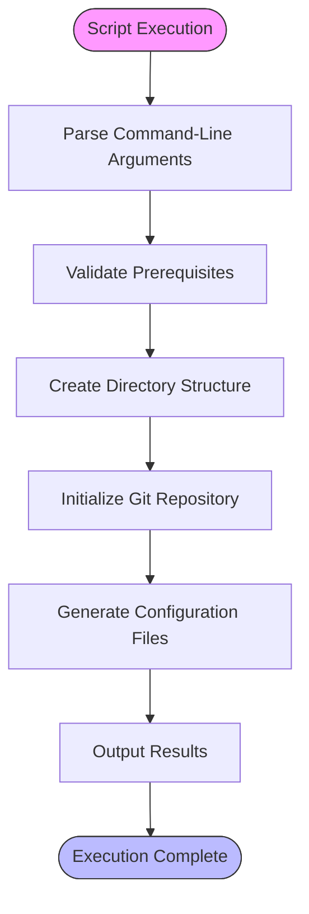

# Installation & Setup

<cite>
**Referenced Files in This Document**   
- [pyproject.toml](file://pyproject.toml)
- [__init__.py](file://src/specify_cli/__init__.py)
- [simics_validation.py](file://src/specify_cli/simics_validation.py)
- [setup-simics-device.sh](file://scripts/bash/setup-simics-device.sh)
- [setup-simics-device.ps1](file://scripts/powershell/setup-simics-device.ps1)
- [README.md](file://README.md)
</cite>

## Table of Contents
1. [Prerequisites](#prerequisites)
2. [Installation Methods](#installation-methods)
3. [Configuration Setup](#configuration-setup)
4. [Platform-Specific Environment Initialization](#platform-specific-environment-initialization)
5. [Post-Installation Verification](#post-installation-verification)
6. [Troubleshooting Common Issues](#troubleshooting-common-issues)
7. [Performance Considerations](#performance-considerations)

## Prerequisites

Before installing the spec-kit CLI tool, ensure your system meets the following requirements:

- **Python Version**: Python 3.11 or higher is required, as specified in both `pyproject.toml` and the script header in `__init__.py`. The tool uses modern Python features and dependencies that are not compatible with earlier versions.
  
- **System Dependencies**: 
  - Git must be installed and available in the system PATH for project initialization and version control operations.
  - A supported AI coding agent must be installed depending on your development environment:
    - [Claude Code](https://www.anthropic.com/claude-code)
    - [GitHub Copilot](https://code.visualstudio.com/)
    - [Gemini CLI](https://github.com/google-gemini/gemini-cli)
    - [Cursor](https://cursor.sh/)
    - [Qwen CLI](https://github.com/QwenLM/qwen-code)
    - [opencode](https://opencode.ai/)

- **Package Manager**: The recommended installation method uses `uv`, a fast Python package installer and resolver. Install `uv` using the official installation script before proceeding with spec-kit installation.

- **Simics Environment**: For Simics integration, ensure that Intel Simics is properly installed and configured in your development environment. While Simics itself is not required for CLI installation, it is necessary for executing Simics-specific commands like `/simics-device`, `/simics-platform`, and `/simics-validate`.

- **Operating System Compatibility**: The tool supports Linux, macOS, and Windows (via WSL2 or native PowerShell). On Windows, PowerShell 5.1 or later is required for full functionality.

**Section sources**
- [pyproject.toml](file://pyproject.toml#L3-L10)
- [__init__.py](file://src/specify_cli/__init__.py#L1-L20)
- [README.md](file://README.md#L100-L115)

## Installation Methods

The spec-kit CLI can be installed using two primary methods: via pip (recommended) or directly from the repository.

### Installation via pip with uv

The recommended installation method uses `uv`, which provides faster dependency resolution and installation compared to traditional pip:

```bash
uv tool install --from git+https://github.com/github/spec-kit.git specify-cli
```

This command installs the `specify` CLI globally, making it available as a system command. After installation, verify the installation by running `specify --help`.

### Direct Repository Installation

For development purposes or when installing from a local clone, use the following approach:

```bash
uvx --from git+https://github.com/github/spec-kit.git specify init <PROJECT_NAME>
```

This method uses `uvx` to execute the `specify` command directly from the repository without permanent installation. It's particularly useful for testing specific branches or versions.

### Alternative Installation Options

When initializing a project, you can specify additional options to customize the installation:

- `--ai`: Specify the AI assistant to use (e.g., `--ai claude`, `--ai copilot`)
- `--script`: Choose the script variant (`sh` for bash/zsh or `ps` for PowerShell)
- `--ignore-agent-tools`: Skip validation of AI agent tools during installation
- `--no-git`: Prevent automatic git repository initialization
- `--here`: Initialize the project in the current directory rather than creating a new one

These options can be combined as needed, for example: `specify init my-project --ai copilot --script ps --no-git`.

**Section sources**
- [README.md](file://README.md#L50-L65)
- [__init__.py](file://src/specify_cli/__init__.py#L100-L150)

## Configuration Setup

The spec-kit CLI uses a combination of configuration files and environment variables to manage settings and preferences.

### pyproject.toml Configuration

The `pyproject.toml` file serves as the primary configuration file for the package metadata and dependencies. Key configuration elements include:

- **Project Metadata**: Name (`specify-cli`), version (`0.0.6`), and description
- **Python Requirements**: Specifies `>=3.11` as the minimum Python version
- **Dependencies**: Lists required packages including `typer`, `rich`, `httpx[socks]`, `platformdirs`, `readchar`, and `truststore>=0.10.4`
- **Entry Points**: Defines the `specify` command that maps to the `main` function in `specify_cli`

This configuration ensures consistent dependency resolution and package management across different environments.

### Environment Variables

The CLI automatically detects and utilizes several environment variables:

- `SIMICS_VERSION`: Overrides the default Simics version detection in setup scripts
- `SPECIFY_DEBUG`: Enables debug output when set to `true`
- `UV_CACHE_DIR`: Controls the location of uv's package cache for performance optimization

No manual environment variable configuration is required for basic operation, as the tool handles configuration through command-line options and internal defaults.

**Section sources**
- [pyproject.toml](file://pyproject.toml#L1-L24)
- [__init__.py](file://src/specify_cli/__init__.py#L200-L250)

## Platform-Specific Environment Initialization

The spec-kit CLI provides platform-specific setup scripts located in the `scripts/bash` and `scripts/powershell` directories to initialize the development environment.

### Unix-like Systems (Bash/Zsh)

On Unix-like systems, the bash scripts in `scripts/bash/` are used to initialize the development environment. These scripts:

- Set up proper file permissions and execute bits
- Configure environment variables specific to the development workflow
- Create necessary directory structures for specifications and templates
- Integrate with the system's shell environment for seamless command execution

The scripts follow POSIX standards and use `#!/bin/bash` shebangs with `set -euo pipefail` for robust error handling. They support both interactive and non-interactive execution modes, with JSON output capabilities for programmatic use.

### Windows Systems (PowerShell)

On Windows systems, the PowerShell scripts in `scripts/powershell/` provide equivalent functionality with Windows-specific optimizations:

- Use PowerShell cmdlets for file system operations and process management
- Handle Windows path conventions and drive letters appropriately
- Integrate with Windows security and permission models
- Support both PowerShell Core (cross-platform) and Windows PowerShell

The PowerShell scripts maintain feature parity with their bash counterparts, ensuring consistent behavior across platforms. They use parameter attributes for type safety and include comprehensive error handling for Windows-specific scenarios.

### Script Initialization Process

Both script families follow a consistent initialization process:

1. Parse command-line arguments (including JSON input for programmatic use)
2. Validate prerequisites and dependencies
3. Create the project directory structure
4. Initialize git repository (if not disabled)
5. Generate configuration files and templates
6. Output results in both human-readable and machine-readable (JSON) formats

The scripts are designed to be idempotent, allowing safe repeated execution without causing conflicts or data loss.



**Diagram sources**
- [setup-simics-device.sh](file://scripts/bash/setup-simics-device.sh#L1-L202)
- [setup-simics-device.ps1](file://scripts/powershell/setup-simics-device.ps1#L1-L201)
- [__init__.py](file://src/specify_cli/__init__.py#L462-L507)

**Section sources**
- [scripts/bash/setup-simics-device.sh](file://scripts/bash/setup-simics-device.sh#L1-L202)
- [scripts/powershell/setup-simics-device.ps1](file://scripts/powershell/setup-simics-device.ps1#L1-L201)

## Post-Installation Verification

After installation, verify the spec-kit CLI functionality using the built-in check command and validation tools.

### Using the 'specify check' Command

The `specify check` command performs comprehensive validation of the installation and environment:

```bash
specify check
```

This command verifies:
- Python version compatibility
- Availability of required dependencies
- Presence of AI agent tools (if not skipped)
- Git installation and configuration
- Proper PATH configuration for the specify command

The check command provides detailed feedback on any issues detected, along with suggestions for resolution.

### Simics Integration Validation

For projects requiring Simics integration, use the built-in validation framework in `simics_validation.py` to verify setup correctness:

- `validate_simics_integration()`: Checks the completeness of Simics templates and command structure
- `validate_simics_project()`: Validates project setup including directory structure and template availability
- `test_simics_scripts()`: Executes functional tests on Simics setup scripts

These validation functions perform thorough checks on template structure, command templates, script templates, and project templates, ensuring all components are present and correctly configured.

### Manual Verification Steps

In addition to automated checks, perform these manual verification steps:

1. Run `specify --help` to confirm the CLI is properly installed and accessible
2. Initialize a test project using `specify init test-project --here --no-git`
3. Verify the creation of the `.specify` directory and its contents
4. Check that both bash and PowerShell scripts are properly copied to the project
5. Confirm template files are correctly populated in the `templates/` directory

**Section sources**
- [__init__.py](file://src/specify_cli/__init__.py#L1000-L1050)
- [simics_validation.py](file://src/specify_cli/simics_validation.py#L1-L432)

## Troubleshooting Common Issues

Address common installation and configuration issues with these solutions:

### Permission Errors

**Issue**: Permission denied errors during installation or execution.

**Solutions**:
- On Unix-like systems, ensure the user has write permissions to the installation directory
- Avoid using `sudo` with `uv` or `pip` when possible; use user-level installation instead
- On Windows, run PowerShell or Command Prompt as administrator only when necessary
- Fix file permissions using `chmod +x` for executable scripts if they lose execute bits

### Path Configuration Problems

**Issue**: 'specify' command not found after installation.

**Solutions**:
- Ensure the uv binary directory is in the system PATH
- On Unix-like systems, typically `~/.local/bin` needs to be added to PATH
- On Windows, ensure `%APPDATA%\Python\PythonScripts` is in the PATH environment variable
- Restart the terminal after installation to refresh the PATH
- Use `uv tool path specify-cli` to find the installation location

### Dependency Conflicts

**Issue**: Conflicting dependencies or version mismatches.

**Solutions**:
- Use isolated virtual environments for different projects
- Clear the uv cache with `uv cache clean` if corrupted packages are suspected
- Install with `--force-reinstall` to replace potentially corrupted installations
- Check for multiple Python installations that might cause confusion

### Script Execution Issues

**Issue**: Setup scripts fail to execute properly.

**Solutions**:
- On Unix-like systems, ensure scripts have execute permissions (`chmod +x`)
- On Windows, ensure PowerShell execution policy allows script execution (`Set-ExecutionPolicy RemoteSigned`)
- Verify line endings are correct (LF for Unix, CRLF for Windows)
- Check that required tools like git are available in the PATH

### Network and SSL Issues

**Issue**: SSL/TLS verification failures during template downloads.

**Solutions**:
- Update CA certificates on the system
- Use the `--skip-tls` flag as a temporary workaround (not recommended for production)
- Configure corporate proxies if behind a firewall
- Ensure system time is synchronized, as SSL validation depends on accurate time

**Section sources**
- [README.md](file://README.md#L300-L350)
- [__init__.py](file://src/specify_cli/__init__.py#L200-L300)
- [simics_validation.py](file://src/specify_cli/simics_validation.py#L100-L200)

## Performance Considerations

Optimize the spec-kit CLI performance based on operating system and network configuration characteristics.

### Operating System Differences

**Unix-like Systems (Linux/macOS/WSL2)**:
- Benefit from native bash script execution with minimal overhead
- File system operations are generally faster due to native POSIX compliance
- Can leverage system-level optimizations for process forking and execution
- Better performance for frequent script invocations and automation workflows

**Windows Systems**:
- PowerShell execution has higher overhead compared to bash
- File system operations may be slower due to NTFS characteristics
- Antivirus software can significantly impact script execution speed
- Consider using WSL2 for development to achieve Unix-like performance characteristics

### Network Configuration Impact

**Template Download Performance**:
- The CLI downloads templates from GitHub releases, so network speed and latency directly impact initialization time
- Use a reliable internet connection with sufficient bandwidth for initial setup
- Corporate firewalls and proxies may slow down or block template downloads
- Consider caching templates locally in restricted network environments

### Dependency Management Optimization

**uv Cache Utilization**:
- uv maintains a local package cache that significantly speeds up subsequent installations
- The cache is stored in the system's temporary directory or a user-specified location
- Regularly clean the cache with `uv cache clean` to prevent excessive disk usage
- In CI/CD environments, consider sharing the uv cache between builds

### Resource Usage Patterns

The spec-kit CLI has minimal runtime resource requirements:
- Low memory footprint during execution
- Minimal CPU usage for command processing
- Disk space requirements depend on project size and template downloads
- Network usage occurs primarily during initial installation and template fetching

For optimal performance, ensure adequate system resources and consider the cumulative impact when running multiple instances or integrating into automated workflows.

**Section sources**
- [__init__.py](file://src/specify_cli/__init__.py#L500-L600)
- [README.md](file://README.md#L200-L250)