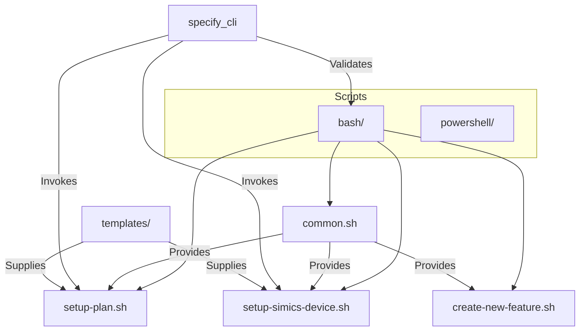
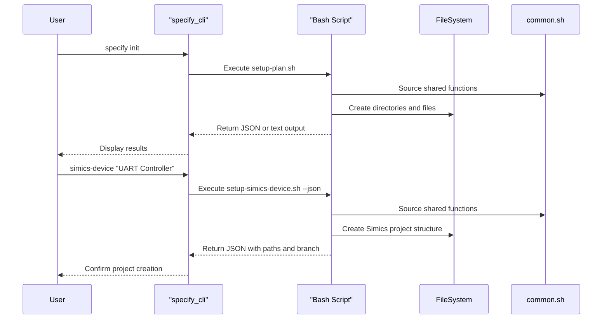
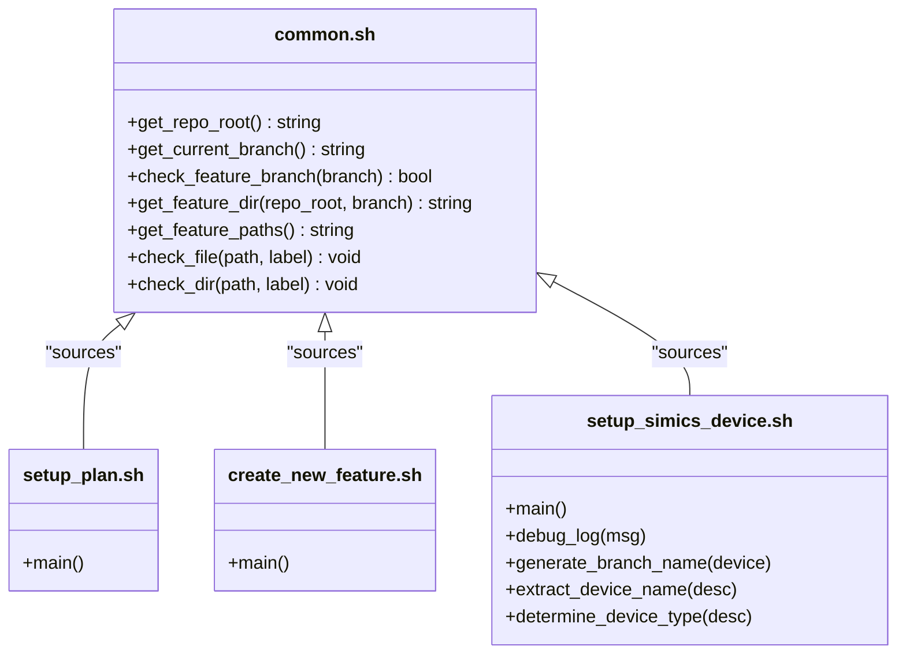
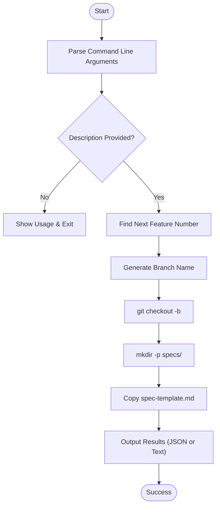
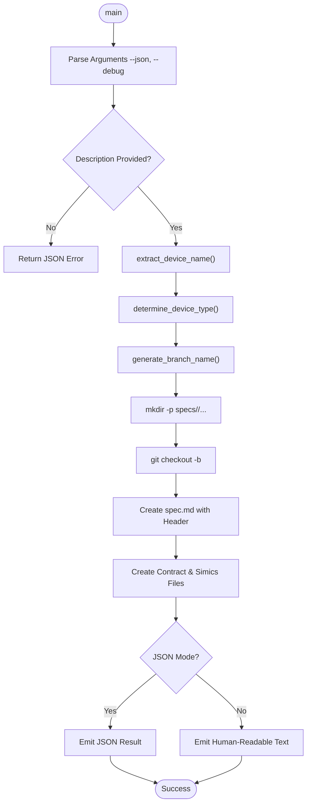
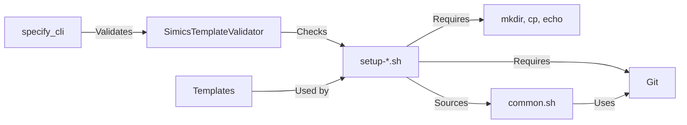

# Bash Scripts

<cite>
**Referenced Files in This Document**   
- [common.sh](file://scripts/bash/common.sh)
- [setup-plan.sh](file://scripts/bash/setup-plan.sh)
- [setup-simics-device.sh](file://scripts/bash/setup-simics-device.sh)
- [create-new-feature.sh](file://scripts/bash/create-new-feature.sh)
- [simics_validation.py](file://src/specify_cli/simics_validation.py)
</cite>

## Table of Contents
1. [Introduction](#introduction)
2. [Project Structure](#project-structure)
3. [Core Components](#core-components)
4. [Architecture Overview](#architecture-overview)
5. [Detailed Component Analysis](#detailed-component-analysis)
6. [Dependency Analysis](#dependency-analysis)
7. [Performance Considerations](#performance-considerations)
8. [Troubleshooting Guide](#troubleshooting-guide)
9. [Conclusion](#conclusion)

## Introduction
The spec-kit automation framework utilizes a suite of Bash scripts to streamline the creation, setup, and validation of Simics-based device and platform specifications. These scripts are designed to automate repetitive tasks such as branch creation, directory structure initialization, file templating, and environment configuration. The Bash scripts work in conjunction with a Python CLI (`specify_cli`) to provide a seamless developer experience for generating and managing hardware simulation projects. This document details the implementation, integration, and operational best practices of the Bash script suite, with a focus on modularity, error handling, and cross-platform compatibility.

## Project Structure
The Bash scripts are organized under the `scripts/bash/` directory and are paired with PowerShell equivalents in `scripts/powershell/` to support cross-platform usage. Each script serves a specific workflow purpose, from initializing feature branches to setting up Simics-specific project structures. The scripts rely on shared utility functions defined in `common.sh` and interact with templates located in the `templates/` directory. The overall structure emphasizes separation of concerns, reusability, and integration with the broader Python-based CLI.

**Diagram sources**
- [common.sh](file://scripts/bash/common.sh)
- [setup-plan.sh](file://scripts/bash/setup-plan.sh)
- [setup-simics-device.sh](file://scripts/bash/setup-simics-device.sh)
- [create-new-feature.sh](file://scripts/bash/create-new-feature.sh)

**Section sources**
- [scripts/bash](file://scripts/bash)
- [templates](file://templates)

## Core Components
The Bash script suite consists of several key components: `common.sh` provides shared functions for path resolution and validation; `create-new-feature.sh` initializes new feature branches and directory structures; `setup-plan.sh` generates implementation plans from templates; and `setup-simics-device.sh` configures Simics-specific device projects. These scripts are invoked either directly or through the Python CLI and support JSON output for programmatic consumption. They enforce consistent project structure and naming conventions across the codebase.

**Section sources**
- [common.sh](file://scripts/bash/common.sh#L1-L37)
- [create-new-feature.sh](file://scripts/bash/create-new-feature.sh#L1-L58)
- [setup-plan.sh](file://scripts/bash/setup-plan.sh#L1-L17)
- [setup-simics-device.sh](file://scripts/bash/setup-simics-device.sh#L1-L201)

## Architecture Overview
The architecture integrates Bash scripts with a Python CLI to provide a unified interface for project automation. The Python CLI parses user commands and delegates execution to the appropriate Bash script, which performs the actual file system operations. Shared logic is centralized in `common.sh`, ensuring consistency across scripts. The system supports both interactive and machine-readable (JSON) output modes, enabling integration with other tools and automation pipelines.

**Diagram sources**
- [setup-plan.sh](file://scripts/bash/setup-plan.sh#L1-L17)
- [setup-simics-device.sh](file://scripts/bash/setup-simics-device.sh#L1-L201)
- [simics_validation.py](file://src/specify_cli/simics_validation.py#L22-L39)

## Detailed Component Analysis

### Common Function Library Analysis
The `common.sh` script provides foundational utilities used across all Bash scripts in the suite. It includes functions for retrieving repository metadata, validating branch names, and constructing feature-specific paths. These functions promote code reuse and ensure consistent behavior across different workflows.

**Diagram sources**
- [common.sh](file://scripts/bash/common.sh#L1-L37)

**Section sources**
- [common.sh](file://scripts/bash/common.sh#L1-L37)

### Feature Creation Workflow Analysis
The `create-new-feature.sh` script automates the creation of new feature branches with properly formatted names and associated directory structures. It parses user input to generate a branch name, determines the next available feature number, and sets up the initial specification file using a template. The script supports both human-readable and JSON output modes for integration purposes.

**Diagram sources**
- [create-new-feature.sh](file://scripts/bash/create-new-feature.sh#L1-L58)

**Section sources**
- [create-new-feature.sh](file://scripts/bash/create-new-feature.sh#L1-L58)

### Simics Device Setup Analysis
The `setup-simics-device.sh` script initializes a complete Simics device model project based on a natural language description. It extracts device characteristics, generates a unique branch name, creates the necessary directory structure, and populates initial specification files. The script includes robust error handling and supports debugging output for troubleshooting.

**Diagram sources**
- [setup-simics-device.sh](file://scripts/bash/setup-simics-device.sh#L1-L201)

**Section sources**
- [setup-simics-device.sh](file://scripts/bash/setup-simics-device.sh#L1-L201)

## Dependency Analysis
The Bash scripts depend on Git for repository operations, standard Unix tools (mkdir, cp, echo), and the file system for persistence. They are invoked by the Python CLI, which validates their existence and integration through the `simics_validation.py` module. The validation module checks for proper shebangs, JSON support, and error handling mechanisms, ensuring script reliability.

**Diagram sources**
- [simics_validation.py](file://src/specify_cli/simics_validation.py#L14-L208)
- [common.sh](file://scripts/bash/common.sh#L1-L37)

**Section sources**
- [simics_validation.py](file://src/specify_cli/simics_validation.py#L14-L208)

## Performance Considerations
To optimize performance, scripts minimize subprocess calls by batching file operations and avoiding redundant Git invocations. The use of `set -euo pipefail` ensures immediate failure on errors, preventing wasted computation. Scripts should be executed in environments with efficient file system access, and JSON mode should be preferred for programmatic use to avoid text parsing overhead.

## Troubleshooting Guide
Common issues include missing dependencies (Git, Bash), incorrect line endings (CRLF vs LF), and permission errors. Ensure scripts have execute permissions via `chmod +x`. On Windows, use WSL or Git Bash to avoid shell compatibility issues. If JSON output is expected but not received, verify the `--json` flag is used. For branch naming conflicts, ensure no existing branch has the same name.

**Section sources**
- [common.sh](file://scripts/bash/common.sh#L1-L37)
- [setup-simics-device.sh](file://scripts/bash/setup-simics-device.sh#L1-L201)
- [simics_validation.py](file://src/specify_cli/simics_validation.py#L14-L208)

## Conclusion
The Bash script suite in spec-kit provides a robust foundation for automating Simics project setup and feature development. Through shared utilities, consistent design patterns, and tight integration with the Python CLI, these scripts enhance developer productivity and ensure project consistency. The architecture supports both interactive and automated workflows, with comprehensive validation and error handling to maintain reliability across platforms.