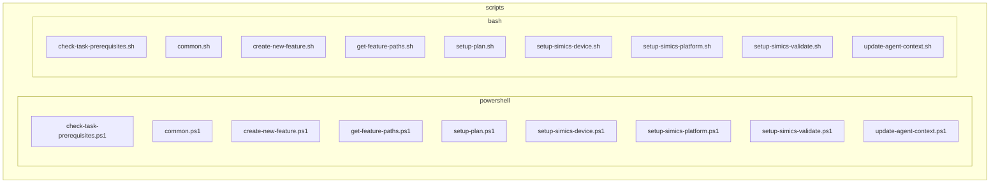
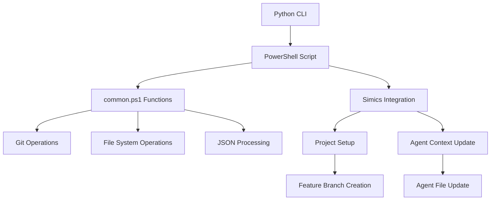
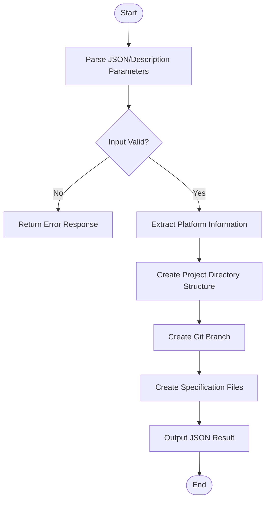
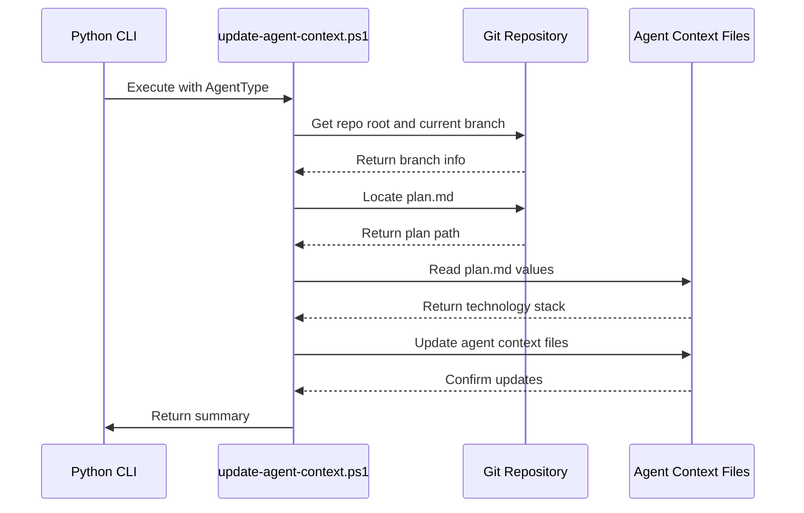
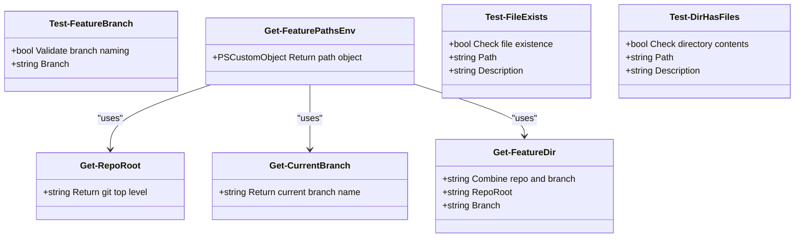
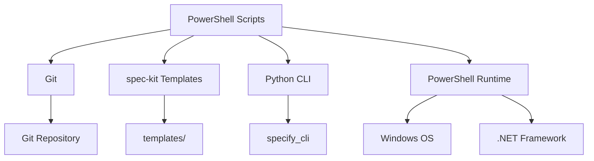

# PowerShell Scripts

<cite>
**Referenced Files in This Document**   
- [setup-simics-platform.ps1](file://scripts/powershell/setup-simics-platform.ps1)
- [update-agent-context.ps1](file://scripts/powershell/update-agent-context.ps1)
- [common.ps1](file://scripts/powershell/common.ps1)
- [simics-platform.md](file://templates/commands/simics-platform.md)
- [simics-device.md](file://templates/commands/simics-device.md)
- [simics-validate.md](file://templates/commands/simics-validate.md)
</cite>

## Table of Contents
1. [Introduction](#introduction)
2. [Project Structure](#project-structure)
3. [Core Components](#core-components)
4. [Architecture Overview](#architecture-overview)
5. [Detailed Component Analysis](#detailed-component-analysis)
6. [Dependency Analysis](#dependency-analysis)
7. [Performance Considerations](#performance-considerations)
8. [Troubleshooting Guide](#troubleshooting-guide)
9. [Conclusion](#conclusion)

## Introduction
The PowerShell script suite in the spec-kit ecosystem provides Windows-compatible automation for Simics integration tasks, project setup, and agent context management. These scripts work in parallel with their Bash counterparts to ensure cross-platform compatibility, enabling developers to use spec-kit on Windows systems without sacrificing functionality. The suite follows structured scripting practices with robust error handling, logging, and integration with the Python CLI layer.

## Project Structure
The PowerShell scripts are organized in a dedicated directory alongside Bash scripts, maintaining parity in functionality across platforms. Each script serves a specific purpose in the Simics integration workflow, from project initialization to agent context updates.

**Diagram sources**
- [scripts/powershell](file://scripts/powershell)
- [scripts/bash](file://scripts/bash)

**Section sources**
- [scripts/powershell](file://scripts/powershell)
- [scripts/bash](file://scripts/bash)

## Core Components
The PowerShell script suite consists of nine core scripts that enable Windows-based automation within the spec-kit ecosystem. These scripts handle project setup, prerequisite checking, and Simics integration tasks. The `common.ps1` script provides cross-script functionality such as logging, error trapping, and file system operations using native PowerShell cmdlets. The suite is designed to mirror the functionality of the Bash scripts, ensuring consistent behavior across platforms.

**Section sources**
- [scripts/powershell/common.ps1](file://scripts/powershell/common.ps1)
- [scripts/powershell/setup-simics-platform.ps1](file://scripts/powershell/setup-simics-platform.ps1)
- [scripts/powershell/update-agent-context.ps1](file://scripts/powershell/update-agent-context.ps1)

## Architecture Overview
The PowerShell scripts integrate with the Python CLI layer through a well-defined invocation mechanism. The CLI passes arguments to the scripts, which execute with appropriate execution policies and security considerations. The scripts use native PowerShell cmdlets for file system operations, Git integration, and JSON processing, ensuring robust and secure automation.

**Diagram sources**
- [src/specify_cli/__init__.py](file://src/specify_cli/__init__.py)
- [scripts/powershell/common.ps1](file://scripts/powershell/common.ps1)
- [scripts/powershell/setup-simics-platform.ps1](file://scripts/powershell/setup-simics-platform.ps1)
- [scripts/powershell/update-agent-context.ps1](file://scripts/powershell/update-agent-context.ps1)

## Detailed Component Analysis

### setup-simics-platform.ps1 Analysis
The `setup-simics-platform.ps1` script initializes a Simics virtual platform project based on a provided description. It extracts platform characteristics, generates a unique branch name, and creates the necessary directory structure for specifications, contracts, and implementation details.

**Diagram sources**
- [scripts/powershell/setup-simics-platform.ps1](file://scripts/powershell/setup-simics-platform.ps1#L0-L236)

**Section sources**
- [scripts/powershell/setup-simics-platform.ps1](file://scripts/powershell/setup-simics-platform.ps1#L0-L236)
- [templates/commands/simics-platform.md](file://templates/commands/simics-platform.md#L0-L46)

### update-agent-context.ps1 Analysis
The `update-agent-context.ps1` script updates context files for various AI coding agents based on the current feature branch's plan. It extracts technology stack information and updates agent-specific files with relevant context.

**Diagram sources**
- [scripts/powershell/update-agent-context.ps1](file://scripts/powershell/update-agent-context.ps1#L0-L107)
- [templates/agent-file-template.md](file://templates/agent-file-template.md)

**Section sources**
- [scripts/powershell/update-agent-context.ps1](file://scripts/powershell/update-agent-context.ps1#L0-L107)

### common.ps1 Analysis
The `common.ps1` script provides shared functionality across all PowerShell scripts in the suite. It includes functions for repository navigation, branch validation, and path resolution.

**Diagram sources**
- [scripts/powershell/common.ps1](file://scripts/powershell/common.ps1#L0-L65)

**Section sources**
- [scripts/powershell/common.ps1](file://scripts/powershell/common.ps1#L0-L65)

## Dependency Analysis
The PowerShell scripts depend on Git for repository operations and rely on the presence of specific directory structures and template files. They integrate with the Python CLI layer through command-line arguments and JSON input/output.

**Diagram sources**
- [go.mod](file://go.mod)
- [main.go](file://main.go)

**Section sources**
- [scripts/powershell](file://scripts/powershell)
- [templates](file://templates)

## Performance Considerations
The PowerShell scripts are designed for efficiency and minimal overhead. They use native PowerShell cmdlets for file operations and Git integration, avoiding external dependencies. The scripts process input parameters and generate output quickly, with minimal memory footprint.

## Troubleshooting Guide
Common issues with PowerShell script execution include execution policy restrictions, missing Git installation, and incorrect parameter passing.

**Section sources**
- [docs/SIMICS_INTEGRATION.md](file://docs/SIMICS_INTEGRATION.md#L351-L398)
- [SIMICS_INTEGRATION_PLAN.md](file://SIMICS_INTEGRATION_PLAN.md)

## Conclusion
The PowerShell script suite provides robust Windows-compatible automation for the spec-kit ecosystem. By following structured scripting practices and leveraging native PowerShell capabilities, these scripts enable seamless Simics integration on Windows platforms. The suite demonstrates best practices in secure scripting, error handling, and cross-platform compatibility.