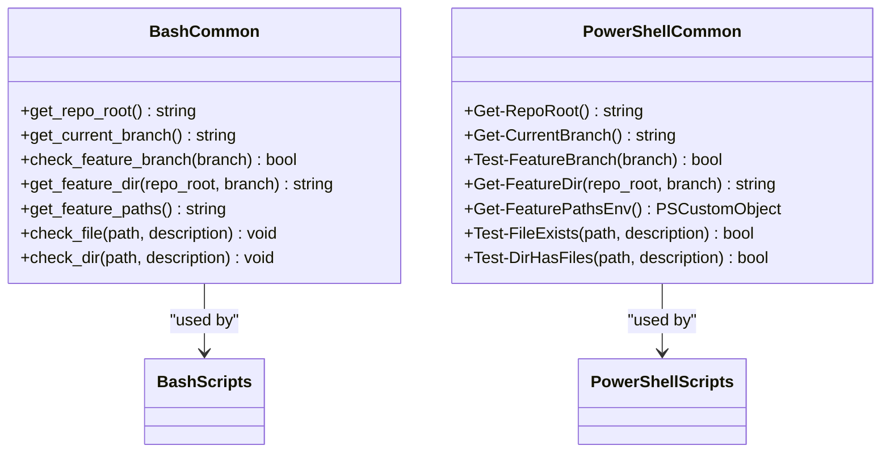
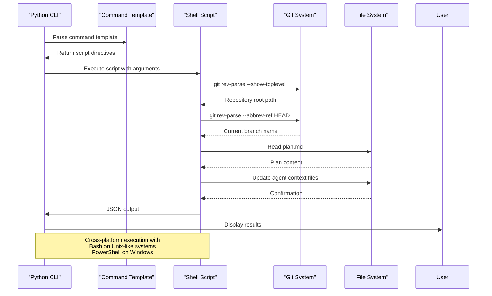

# Script System

<cite>
**Referenced Files in This Document**   
- [common.sh](file://scripts/bash/common.sh)
- [common.ps1](file://scripts/powershell/common.ps1)
- [check-task-prerequisites.sh](file://scripts/bash/check-task-prerequisites.sh)
- [check-task-prerequisites.ps1](file://scripts/powershell/check-task-prerequisites.ps1)
- [update-agent-context.sh](file://scripts/bash/update-agent-context.sh)
- [update-agent-context.ps1](file://scripts/powershell/update-agent-context.ps1)
- [simics_validation.py](file://src/specify_cli/simics_validation.py)
- [simics-device.md](file://templates/commands/simics-device.md)
- [simics-platform.md](file://templates/commands/simics-platform.md)
</cite>

## Table of Contents
1. [Cross-Platform Script Architecture](#cross-platform-script-architecture)
2. [Shared Functionality in Common Scripts](#shared-functionality-in-common-scripts)
3. [CLI Integration and Invocation Flow](#cli-integration-and-invocation-flow)
4. [Domain-Specific Implementation Concerns](#domain-specific-implementation-concerns)
5. [Troubleshooting Platform-Specific Issues](#troubleshooting-platform-specific-issues)
6. [Performance Optimization Strategies](#performance-optimization-strategies)

## Cross-Platform Script Architecture

The script system implements a dual-shell architecture supporting both Bash and PowerShell environments to ensure cross-platform compatibility across Linux, macOS, and Windows systems. This design enables consistent automation of environment setup, prerequisite validation, and agent context updates regardless of the host operating system. The architecture follows a parallel file structure with equivalent functionality implemented in both `scripts/bash/` and `scripts/powershell/` directories, allowing users to invoke the appropriate script variant based on their shell environment.

Each script pair serves identical purposes with platform-appropriate syntax and command patterns. For example, `check-task-prerequisites.sh` and `check-task-prerequisites.ps1` perform the same validation workflow but use shell-specific constructs for parameter handling, file operations, and output formatting. The system supports JSON output mode through `--json` flags in Bash scripts and `-Json` parameters in PowerShell scripts, enabling structured data exchange with higher-level automation tools.

The architecture demonstrates a clear separation of concerns, with specialized scripts handling specific automation tasks:
- `setup-simics-*` scripts initialize Simics integration projects
- `check-task-prerequisites.*` validate required conditions before task execution
- `update-agent-context.*` manage AI agent context files based on project specifications
- `get-feature-paths.*` retrieve project path information for current feature branches

This modular design allows scripts to be invoked independently or chained together in complex workflows, providing flexibility for both interactive use and automated pipelines.

**Section sources**
- [check-task-prerequisites.sh](file://scripts/bash/check-task-prerequisites.sh#L1-L16)
- [check-task-prerequisites.ps1](file://scripts/powershell/check-task-prerequisites.ps1#L1-L36)

## Shared Functionality in Common Scripts

The cross-platform script system achieves code reuse through dedicated common modules that provide shared functionality across all scripts. The `common.sh` and `common.ps1` files contain equivalent functions that abstract platform-specific operations while maintaining consistent interfaces and behavior.

Key shared functions include:
- `get_repo_root()` / `Get-RepoRoot()`: Retrieves the Git repository root directory using `git rev-parse --show-toplevel`
- `get_current_branch()` / `Get-CurrentBranch()`: Obtains the current Git branch name
- `check_feature_branch()` / `Test-FeatureBranch()`: Validates that the current branch follows the required naming convention (e.g., `001-feature-name`)
- `get_feature_dir()` / `Get-FeatureDir()`: Constructs the feature directory path based on repository root and branch name
- `get_feature_paths()` / `Get-FeaturePathsEnv()`: Generates environment variables for key project paths
- `check_file()` / `Test-FileExists()`: Validates file existence with formatted output
- `check_dir()` / `Test-DirHasFiles()`: Checks for non-empty directories

These common functions enable consistent path resolution and environment setup across all scripts. The `get_feature_paths()` function in Bash and its PowerShell counterpart `Get-FeaturePathsEnv()` demonstrate particularly sophisticated shared functionality, generating a complete set of path variables for feature-specific directories and files. This eliminates redundant path construction logic in individual scripts and ensures consistency in file location assumptions.

The design pattern follows strict functional parity between the two implementations, allowing developers to understand the entire script system by learning one platform's implementation and applying that knowledge to the other. This approach significantly reduces maintenance overhead while ensuring consistent behavior across platforms.



**Diagram sources**
- [common.sh](file://scripts/bash/common.sh#L1-L37)
- [common.ps1](file://scripts/powershell/common.ps1#L1-L65)

**Section sources**
- [common.sh](file://scripts/bash/common.sh#L1-L37)
- [common.ps1](file://scripts/powershell/common.ps1#L1-L65)

## CLI Integration and Invocation Flow

The script system integrates tightly with the Python CLI layer through command templates that define the invocation relationships between CLI commands and script execution. This integration is facilitated by YAML-frontmatter in command template files that specify the exact script commands to execute for each CLI operation.

The invocation flow begins with CLI commands defined in template files such as `simics-device.md` and `simics-platform.md`, which contain script directives in their YAML frontmatter:

```yaml
scripts:
  sh: scripts/bash/setup-simics-device.sh --json "{ARGS}"
  ps: scripts/powershell/setup-simics-device.ps1 -Json "{ARGS}"
```

When a user invokes a CLI command, the system determines the appropriate script variant based on the host platform and substitutes the `{SCRIPT}` and `{ARGS}` placeholders with the actual script path and command-line arguments. The CLI layer executes the script and parses its JSON output to extract key information such as branch names, file paths, and configuration parameters.

The `update-agent-context` scripts demonstrate a more complex interaction pattern, where the script extracts technology stack information from `plan.md` files and updates AI agent context files accordingly. This creates a feedback loop where project planning information automatically propagates to development environment configurations.

The Python validation module `simics_validation.py` provides additional integration by testing script functionality through subprocess execution. It validates that both Bash and PowerShell scripts produce expected outputs and handle errors appropriately, ensuring cross-platform consistency.



**Diagram sources**
- [simics-device.md](file://templates/commands/simics-device.md#L1-L46)
- [simics-platform.md](file://templates/commands/simics-platform.md#L1-L47)
- [simics_validation.py](file://src/specify_cli/simics_validation.py#L293-L393)

**Section sources**
- [simics-device.md](file://templates/commands/simics-device.md#L1-L46)
- [simics-platform.md](file://templates/commands/simics-platform.md#L1-L47)
- [simics_validation.py](file://src/specify_cli/simics_validation.py#L1-L431)

## Domain-Specific Implementation Concerns

The script system addresses several domain-specific concerns related to cross-platform development, particularly in the areas of path handling, permission management, and error propagation.

Path handling is managed through consistent use of absolute paths derived from the Git repository root. Both Bash and PowerShell implementations use `git rev-parse --show-toplevel` to establish a reliable base path, eliminating issues with relative path resolution across different working directories. The scripts construct all file paths by joining the repository root with known relative paths, ensuring consistent behavior regardless of the current directory.

Permission management is handled differently on each platform but with equivalent outcomes. Bash scripts use standard Unix file permissions and rely on the execute bit being set, while PowerShell scripts are subject to execution policies that may restrict script execution. The system assumes appropriate permissions are configured in the development environment, with PowerShell scripts requiring at least RemoteSigned execution policy to run.

Error propagation follows platform-appropriate patterns while maintaining consistent exit codes. Bash scripts use `set -e` to exit immediately on error and return non-zero exit codes for failure conditions. PowerShell scripts use `[CmdletBinding()]` and `$ErrorActionPreference = 'Stop'` to achieve similar error handling behavior. Both implementations write error messages to stderr and use exit code 1 to indicate failure.

The `update-agent-context` scripts demonstrate sophisticated text processing that must handle cross-platform line ending differences. The Bash implementation uses standard Unix text processing tools like `sed` and `grep`, while the PowerShell version uses .NET string manipulation methods. Both achieve the same result of updating agent context files with new technology stack information while preserving manual additions marked by special comment delimiters.

**Section sources**
- [update-agent-context.sh](file://scripts/bash/update-agent-context.sh#L1-L69)
- [update-agent-context.ps1](file://scripts/powershell/update-agent-context.ps1#L1-L108)

## Troubleshooting Platform-Specific Issues

The script system may encounter platform-specific issues that require targeted troubleshooting approaches. Understanding these common issues and their solutions is essential for maintaining cross-platform compatibility.

**Line Ending Conflicts**: When scripts are shared across platforms, line ending differences (LF vs CRLF) can cause execution problems, particularly with Bash scripts on Unix-like systems. The most common symptom is a "bad interpreter" error when the shebang line contains a carriage return. This can be resolved by ensuring consistent line endings through Git configuration (`core.autocrlf`) or using text editors that preserve the original line endings.

**Execution Policy Restrictions on Windows**: PowerShell scripts are subject to execution policies that may prevent their execution. Users may encounter "execution of scripts is disabled" errors. The recommended solution is to set the execution policy to RemoteSigned at the current user level:
```powershell
Set-ExecutionPolicy -ExecutionPolicy RemoteSigned -Scope CurrentUser
```

**Missing Utilities on Linux**: Some Bash scripts may depend on utilities that are not installed by default on minimal Linux distributions. Common dependencies include `git`, `jq` (for JSON processing), and `python3`. These can be installed using the system package manager:
```bash
sudo apt-get install git python3
```

**Path Separation Issues**: Scripts that process file paths must handle platform-specific path separators (forward slash on Unix, backslash on Windows). The common functions in `common.sh` and `common.ps1` abstract this difference by using platform-appropriate path construction methods.

**JSON Output Compatibility**: The `--json` flag in Bash scripts and `-Json` parameter in PowerShell scripts must produce compatible JSON output for consumption by the CLI layer. Issues may arise from malformed JSON or encoding differences. Testing JSON output with tools like `jsonlint` or PowerShell's `ConvertFrom-Json` can help identify and resolve these issues.

**Git Integration Problems**: Since the scripts rely heavily on Git commands to determine repository state, issues may occur if Git is not properly installed or configured. Ensuring Git is in the system PATH and that the current directory is within a Git repository is essential for proper script operation.

**Section sources**
- [check-task-prerequisites.sh](file://scripts/bash/check-task-prerequisites.sh#L1-L16)
- [check-task-prerequisites.ps1](file://scripts/powershell/check-task-prerequisites.ps1#L1-L36)

## Performance Optimization Strategies

The script system can be optimized for performance through several strategies that improve execution speed and resource utilization, particularly when scripts are chained together in complex workflows.

**Script Chaining and Pipelining**: Scripts can be chained using shell pipelines to pass data between them without intermediate files. For example, the output of `get-feature-paths.sh` can be directly sourced in subsequent scripts to avoid redundant Git operations:
```bash
source <(./get-feature-paths.sh) && ./check-task-prerequisites.sh
```

**Parallel Execution**: Independent scripts can be executed in parallel to reduce overall execution time. For example, validation tasks that do not depend on each other can run concurrently:
```bash
./check-task-prerequisites.sh & ./validate-simics-configuration.sh & wait
```

**Caching Repository Information**: Since multiple scripts call `git rev-parse --show-toplevel` and `git rev-parse --abbrev-ref HEAD`, caching these values can significantly reduce execution time in script chains. The common functions could be modified to store these values in temporary files or environment variables for reuse.

**Minimizing Subprocess Calls**: The `update-agent-context.sh` script demonstrates an optimization by using a single Python subprocess to handle complex text processing rather than multiple `sed` and `grep` calls. This reduces the overhead of process creation and improves performance for operations that require complex string manipulation.

**Conditional Execution**: Scripts should use conditional execution to skip unnecessary operations. For example, `update-agent-context.*` scripts only update files that already exist or create them based on templates, avoiding redundant operations.

**Efficient File System Operations**: When checking for file and directory existence, the scripts should minimize the number of system calls. The `check_dir()` function in Bash uses `ls -A` with error suppression to efficiently check for non-empty directories, while the PowerShell equivalent uses `Get-ChildItem` with `Select-Object -First 1` to achieve the same result.

**Batch Operations**: When multiple files need to be processed, batch operations should be used instead of individual processing. For example, updating multiple agent context files can be done in a single script invocation rather than separate calls for each file.

**Section sources**
- [update-agent-context.sh](file://scripts/bash/update-agent-context.sh#L1-L69)
- [update-agent-context.ps1](file://scripts/powershell/update-agent-context.ps1#L1-L108)