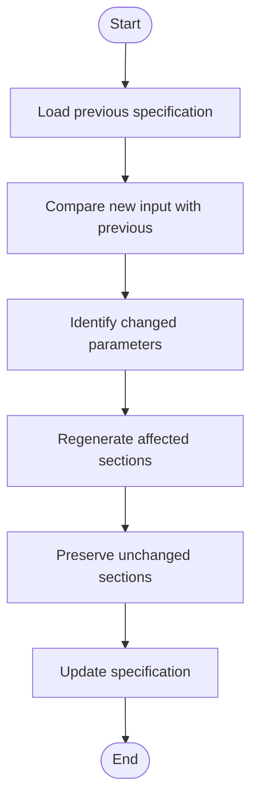

# Simics Integration Commands

<cite>
**Referenced Files in This Document**   
- [simics-device.md](file://templates/commands/simics-device.md)
- [simics-platform.md](file://templates/commands/simics-platform.md)
- [simics-validate.md](file://templates/commands/simics-validate.md)
- [device-spec-template.md](file://templates/simics/projects/device-spec-template.md)
- [platform-spec-template.md](file://templates/simics/projects/platform-spec-template.md)
- [validation-template.md](file://templates/simics/projects/validation-template.md)
- [setup-simics-device.sh](file://scripts/bash/setup-simics-device.sh)
- [setup-simics-platform.sh](file://scripts/bash/setup-simics-platform.sh)
- [setup-simics-validate.sh](file://scripts/bash/setup-simics-validate.sh)
- [setup-simics-device.ps1](file://scripts/powershell/setup-simics-device.ps1)
- [setup-simics-platform.ps1](file://scripts/powershell/setup-simics-platform.ps1)
- [setup-simics-validate.ps1](file://scripts/powershell/setup-simics-validate.ps1)
- [simics_validation.py](file://src/specify_cli/simics_validation.py)
</cite>

## Table of Contents
1. [Simics Command Architecture](#simics-command-architecture)
2. [Command Implementation Details](#command-implementation-details)
3. [Domain Model of Simics Specifications](#domain-model-of-simics-specifications)
4. [Template and Script Interaction](#template-and-script-interaction)
5. [Common Integration Issues and Solutions](#common-integration-issues-and-solutions)
6. [Performance Optimization Strategies](#performance-optimization-strategies)
7. [Validation Framework](#validation-framework)

## Simics Command Architecture

The Simics integration commands follow a consistent architectural pattern that combines command templates with execution scripts to generate comprehensive specifications for device modeling, platform configuration, and validation frameworks. Each command operates through a well-defined execution flow that ensures consistency and completeness in the generated specifications.

The three primary commands—`simics-device`, `simics-platform`, and `simics-validate`—share a common architecture that separates the command definition from the execution logic. This separation allows for platform-agnostic command definitions while supporting both Bash and PowerShell execution environments. The commands are designed to create specifications that focus on WHAT needs to be implemented rather than HOW to implement it, ensuring that the specifications serve as clear requirements documents for development teams.

**Section sources**
- [simics-device.md](file://templates/commands/simics-device.md)
- [simics-platform.md](file://templates/commands/simics-platform.md)
- [simics-validate.md](file://templates/commands/simics-validate.md)

## Command Implementation Details

### simics-device Command

The `simics-device` command generates comprehensive device model specifications for Simics device development. It processes device descriptions to create structured specifications that define device behavior, interfaces, and validation requirements. The command follows a ten-step execution flow that begins with parsing the device description and extracting device characteristics such as device type, interfaces, and behavioral requirements.

When invoked, the command first runs the corresponding script (`setup-simics-device.sh` or `setup-simics-device.ps1`) with JSON output enabled to obtain configuration parameters including the branch name, specification file path, device type, and Simics version. The command then loads the device specification template and populates it with the extracted information, replacing placeholders like [DEVICE_NAME] with actual values derived from the input description.

The generated specification includes mandatory sections such as Device Overview, Behavioral Model, Register Interface, Memory Interface, Simics Interface, and Validation Scenarios. The command ensures that all implementation details are excluded from the specification, focusing instead on behavioral requirements and interface definitions. Any ambiguous areas are marked with [NEEDS CLARIFICATION: specific question] to highlight areas requiring further input.

**Section sources**
- [simics-device.md](file://templates/commands/simics-device.md)
- [device-spec-template.md](file://templates/simics/projects/device-spec-template.md)
- [setup-simics-device.sh](file://scripts/bash/setup-simics-device.sh)
- [setup-simics-device.ps1](file://scripts/powershell/setup-simics-device.ps1)

### simics-platform Command

The `simics-platform` command creates comprehensive virtual platform specifications for Simics platform development. It processes platform descriptions to generate structured specifications that define system architecture, device integration, and validation requirements. The command follows an eleven-step execution flow that begins with parsing the platform description and extracting system characteristics such as target hardware, component list, and performance requirements.

When executed, the command invokes the corresponding script (`setup-simics-platform.sh` or `setup-simics-platform.ps1`) to obtain configuration parameters including the branch name, specification file path, platform type, component list, and target system. The command then loads the platform specification template and populates it with the extracted information, replacing placeholders like [PLATFORM_NAME] with actual values derived from the input description.

The generated specification includes mandatory sections such as Platform Overview, System Architecture, Device Integration, Memory Map, Timing Model, Configuration Management, and Validation Scenarios. The command ensures that all implementation details are excluded from the specification, focusing instead on architectural requirements and integration points. Any ambiguous integration points are marked with [NEEDS CLARIFICATION: specific question] to highlight areas requiring further clarification.

**Section sources**
- [simics-platform.md](file://templates/commands/simics-platform.md)
- [platform-spec-template.md](file://templates/simics/projects/platform-spec-template.md)
- [setup-simics-platform.sh](file://scripts/bash/setup-simics-platform.sh)
- [setup-simics-platform.ps1](file://scripts/powershell/setup-simics-platform.ps1)

### simics-validate Command

The `simics-validate` command generates comprehensive validation framework specifications for Simics model validation. It processes validation requirements to create structured specifications that define validation strategy, test scenarios, and success criteria. The command follows an eleven-step execution flow that begins with parsing the validation requirements and extracting validation scope, test categories, and coverage requirements.

When executed, the command invokes the corresponding script (`setup-simics-validate.sh` or `setup-simics-validate.ps1`) to obtain configuration parameters including the branch name, specification file path, model type, validation scope, and test categories. The command then loads the validation specification template and populates it with the extracted information, replacing placeholders like [MODEL_NAME] with actual values derived from the input description.

The generated specification includes mandatory sections such as Validation Overview, Strategy, Test Scenarios, Coverage Requirements, Test Environment, and Automation Strategy. The command ensures that all implementation details are excluded from the specification, focusing instead on validation objectives and success criteria. Any ambiguous test requirements are marked with [NEEDS CLARIFICATION: specific question] to highlight areas requiring further clarification.

**Section sources**
- [simics-validate.md](file://templates/commands/simics-validate.md)
- [validation-template.md](file://templates/simics/projects/validation-template.md)
- [setup-simics-validate.sh](file://scripts/bash/setup-simics-validate.sh)
- [setup-simics-validate.ps1](file://scripts/powershell/setup-simics-validate.ps1)

## Domain Model of Simics Specifications

The domain model of Simics specifications is structured around three primary entities: device specifications, platform specifications, and validation specifications. Each entity has a well-defined structure with mandatory and optional sections that ensure completeness and consistency across different specifications.

### Device Specification Model

The device specification model focuses on defining the behavioral and interface requirements of individual device models. The core components of the device specification include:

- **Device Overview**: Provides context about the device type, purpose, and target system integration requirements
- **Device Behavioral Model**: Describes the core functionality, state management, and data processing capabilities of the device
- **Register Interface Specifications**: Defines the register map, bit fields, and access patterns for device registers
- **Memory Interface Requirements**: Specifies address space requirements, memory access patterns, and cache coherency requirements
- **Simics Interface Implementation**: Identifies required Simics interfaces and their implementation requirements
- **Validation and Testing Scenarios**: Outlines functional, performance, and error scenario testing requirements

The model emphasizes behavioral requirements over implementation details, ensuring that specifications focus on WHAT the device does rather than HOW it is implemented in DML or Python.

### Platform Specification Model

The platform specification model focuses on defining the architectural and integration requirements of virtual platforms. The core components of the platform specification include:

- **Platform Overview**: Provides context about the target system, simulation purpose, and platform characteristics
- **System Architecture**: Describes the component topology, processing elements, memory hierarchy, and system interconnect
- **Device Integration Requirements**: Specifies device component lists, interface connections, interrupt routing, and clock distribution
- **Memory Map and Address Space**: Defines the global address map, device address assignments, and memory protection requirements
- **Timing and Synchronization Model**: Specifies clock domain organization, synchronization requirements, and performance targets
- **Configuration Management**: Defines system configuration parameters, runtime configuration options, and configuration dependencies
- **Platform Validation Scenarios**: Outlines system-level functional, performance, integration, and software compatibility validation requirements

The model emphasizes system architecture and integration requirements over implementation details, ensuring that specifications focus on the overall system organization rather than specific Simics configuration scripts.

### Validation Specification Model

The validation specification model focuses on defining the validation strategy and success criteria for Simics models. The core components of the validation specification include:

- **Validation Overview**: Provides context about the validation scope, objectives, and success criteria
- **Validation Strategy**: Defines the testing approach, test categories, priorities, and risk-based testing focus
- **Test Scenario Specifications**: Details functional, behavioral, integration, and software integration test scenarios
- **Coverage Requirements and Metrics**: Specifies functional, structural, and test coverage targets with measurement methods
- **Performance Validation Criteria**: Defines performance requirements, test scenarios, and regression prevention measures
- **Test Environment Setup Requirements**: Specifies hardware, software, Simics configuration, and test infrastructure requirements
- **Validation Automation Strategy**: Outlines automation scope, test execution strategy, and test result management

The model emphasizes validation requirements and success criteria over implementation details, ensuring that specifications focus on WHAT to validate and how to measure success rather than specific test scripts or Simics commands.

**Section sources**
- [device-spec-template.md](file://templates/simics/projects/device-spec-template.md)
- [platform-spec-template.md](file://templates/simics/projects/platform-spec-template.md)
- [validation-template.md](file://templates/simics/projects/validation-template.md)

## Template and Script Interaction

The Simics integration commands utilize a sophisticated template and script interaction model that combines Markdown templates with executable scripts in both Bash and PowerShell. This dual-language support ensures cross-platform compatibility and accessibility for development teams using different operating systems and scripting preferences.

### Command Template Structure

Each command template follows a consistent structure with YAML frontmatter that defines the command description and script variants. The frontmatter includes:

- **description**: A brief description of the command's purpose and functionality
- **scripts**: A mapping of script variants for different execution environments, with `sh` for Bash scripts and `ps` for PowerShell scripts
- **placeholders**: Template variables such as `{SCRIPT}` and `{ARGS}` that are replaced during command execution

The template body contains a detailed execution flow that guides the command processing, including steps for parsing input, extracting characteristics, generating specifications, and validating output. The templates also include comprehensive guidelines and section requirements to ensure consistency across generated specifications.

### Script Implementation

The execution scripts are implemented in both Bash and PowerShell, providing identical functionality across different platforms. Each script pair (`setup-simics-device.sh`/`setup-simics-device.ps1`, etc.) follows the same design principles:

- **Argument parsing**: Both scripts support `--json` and `--debug` flags for JSON output and debugging
- **Information extraction**: Scripts extract relevant information from input descriptions using pattern matching
- **Project setup**: Scripts create the necessary directory structure and initialize specification files
- **JSON output**: When called with `--json`, scripts output structured data including branch name, specification file path, and other relevant parameters

The scripts are designed with robust error handling, including the `set -euo pipefail` directive in Bash scripts to ensure that errors are caught and reported. PowerShell scripts use similar error handling mechanisms to ensure reliable execution.

### Template-Script Workflow

The interaction between templates and scripts follows a well-defined workflow:

1. The command processes the input description and determines which script to execute
2. The script is invoked with JSON output enabled to obtain configuration parameters
3. The command loads the appropriate specification template
4. Template placeholders are replaced with values obtained from the script output
5. The execution flow defined in the template is followed to generate the complete specification
6. The generated specification is validated against the template requirements

This workflow ensures that the generated specifications are consistent, complete, and aligned with the intended design patterns.

**Diagram sources**
- [simics-device.md](file://templates/commands/simics-device.md)
- [simics-platform.md](file://templates/commands/simics-platform.md)
- [simics-validate.md](file://templates/commands/simics-validate.md)
- [setup-simics-device.sh](file://scripts/bash/setup-simics-device.sh)
- [setup-simics-device.ps1](file://scripts/powershell/setup-simics-device.ps1)

**Section sources**
- [simics-device.md](file://templates/commands/simics-device.md)
- [simics-platform.md](file://templates/commands/simics-platform.md)
- [simics-validate.md](file://templates/commands/simics-validate.md)
- [setup-simics-device.sh](file://scripts/bash/setup-simics-device.sh)
- [setup-simics-platform.sh](file://scripts/bash/setup-simics-platform.sh)
- [setup-simics-validate.sh](file://scripts/bash/setup-simics-validate.sh)
- [setup-simics-device.ps1](file://scripts/powershell/setup-simics-device.ps1)
- [setup-simics-platform.ps1](file://scripts/powershell/setup-simics-platform.ps1)
- [setup-simics-validate.ps1](file://scripts/powershell/setup-simics-validate.ps1)

## Common Integration Issues and Solutions

Despite the robust design of the Simics integration commands, several common integration issues may arise during usage. These issues typically fall into three categories: version mismatches, parameter errors, and validation failures.

### Mismatched Simics Versions

One common issue is the use of Simics features that are not available in the target Simics version. This can occur when specifications reference interfaces or capabilities that were introduced in later Simics versions than the one specified in the configuration.

**Solution**: Always verify the Simics version specified in the script output and consult the Simics documentation for the specific version to ensure compatibility. The `determine_simics_version()` function in the setup scripts should be updated to reflect the actual Simics versions available in the development environment.

**Diagram sources**
- [setup-simics-device.sh](file://scripts/bash/setup-simics-device.sh)
- [setup-simics-platform.sh](file://scripts/bash/setup-simics-platform.sh)
- [setup-simics-validate.sh](file://scripts/bash/setup-simics-validate.sh)

### Incorrect Device Parameters

Another common issue is the extraction of incorrect device parameters from the input description. This can occur when the pattern matching in the `extract_device_name()` and `determine_device_type()` functions does not accurately capture the intended device characteristics.

**Solution**: Review the pattern matching logic in the setup scripts and update the regular expressions to better match the expected device descriptions. For complex device types, consider adding additional pattern matching rules or implementing a more sophisticated natural language processing approach.

**Diagram sources**
- [setup-simics-device.sh](file://scripts/bash/setup-simics-device.sh)
- [setup-simics-device.ps1](file://scripts/powershell/setup-simics-device.ps1)

### Validation Failures

Validation failures can occur when the generated specification does not meet the requirements defined in the template. Common causes include missing mandatory sections, implementation details in the specification, or unresolved [NEEDS CLARIFICATION] markers.

**Solution**: Use the automated validation checks provided by the templates to identify and address issues before finalizing the specification. Pay particular attention to the Review & Acceptance Checklist in each template, which provides specific criteria for specification completeness and quality.

**Diagram sources**
- [device-spec-template.md](file://templates/simics/projects/device-spec-template.md)
- [platform-spec-template.md](file://templates/simics/projects/platform-spec-template.md)
- [validation-template.md](file://templates/simics/projects/validation-template.md)

**Section sources**
- [setup-simics-device.sh](file://scripts/bash/setup-simics-device.sh)
- [setup-simics-platform.sh](file://scripts/bash/setup-simics-platform.sh)
- [setup-simics-validate.sh](file://scripts/bash/setup-simics-validate.sh)
- [device-spec-template.md](file://templates/simics/projects/device-spec-template.md)
- [platform-spec-template.md](file://templates/simics/projects/platform-spec-template.md)
- [validation-template.md](file://templates/simics/projects/validation-template.md)

## Performance Optimization Strategies

For large-scale device modeling and batch processing scenarios, several performance optimization strategies can be employed to improve efficiency and reduce processing time.

### Template Caching

One effective optimization is to implement template caching to avoid repeatedly reading and parsing template files. Since the specification templates are static, they can be loaded once and reused across multiple command executions.

**Implementation**: Create a template cache that stores parsed templates in memory. When a command is executed, check the cache for the required template before reading from disk.

**Diagram sources**
- [device-spec-template.md](file://templates/simics/projects/device-spec-template.md)
- [platform-spec-template.md](file://templates/simics/projects/platform-spec-template.md)
- [validation-template.md](file://templates/simics/projects/validation-template.md)

### Parallel Processing

For batch processing of multiple device or platform specifications, parallel processing can significantly reduce overall processing time. This is particularly effective when generating specifications for independent devices or platforms.

**Implementation**: Use parallel execution to process multiple specifications simultaneously. This can be achieved using background processes in Bash or PowerShell, or by implementing a multi-threaded approach in a higher-level language.

**Diagram sources**
- [setup-simics-device.sh](file://scripts/bash/setup-simics-device.sh)
- [setup-simics-platform.sh](file://scripts/bash/setup-simics-platform.sh)
- [setup-simics-validate.sh](file://scripts/bash/setup-simics-validate.sh)

### Incremental Generation

For large device models with complex specifications, incremental generation can improve performance by only regenerating sections that have changed rather than recreating the entire specification.

**Implementation**: Implement a change detection mechanism that identifies which parts of the input description have changed since the last generation. Only regenerate the affected sections of the specification, preserving unchanged sections.

**Diagram sources**
- [device-spec-template.md](file://templates/simics/projects/device-spec-template.md)
- [platform-spec-template.md](file://templates/simics/projects/platform-spec-template.md)
- [validation-template.md](file://templates/simics/projects/validation-template.md)

**Section sources**
- [setup-simics-device.sh](file://scripts/bash/setup-simics-device.sh)
- [setup-simics-platform.sh](file://scripts/bash/setup-simics-platform.sh)
- [setup-simics-validate.sh](file://scripts/bash/setup-simics-validate.sh)

## Validation Framework

The Simics integration includes a comprehensive validation framework implemented in `simics_validation.py` that ensures the integrity and correctness of the specification templates, scripts, and generated projects. The framework consists of three main components: `SimicsTemplateValidator`, `SimicsProjectValidator`, and `SimicsScriptTester`.

### Template Validation

The `SimicsTemplateValidator` class validates the structure and content of Simics integration templates. It checks for:

- Required directory structure in the templates/simics directory
- Presence of required command templates (simics-device.md, simics-platform.md, simics-validate.md)
- Proper YAML frontmatter in command templates
- Required fields in command template frontmatter (description, scripts)
- Presence of both Bash and PowerShell script variants
- Required template placeholders ({SCRIPT}, {ARGS})
- Presence of key project templates (device-spec-template.md, platform-spec-template.md, validation-template.md)
- Required sections in project templates (Execution Flow, Review & Acceptance Checklist, Execution Status)

The validation process helps ensure that all necessary components are present and correctly structured before attempting to generate specifications.

### Project Validation

The `SimicsProjectValidator` class validates Simics projects created with the spec-kit. It checks for:

- Required project directories (.specify, .specify/templates, .specify/templates/simics, .specify/scripts)
- Availability of Simics templates in the project
- Presence of key template files in the project
- Availability of Simics setup scripts in the project
- Presence of either Bash or PowerShell scripts

This validation ensures that projects have the necessary structure and resources to support Simics integration.

### Script Testing

The `SimicsScriptTester` class tests the functionality of Simics setup scripts. It:

- Tests Bash scripts on non-Windows platforms
- Tests PowerShell scripts on all platforms
- Executes scripts with minimal input and JSON output
- Validates that scripts return successful exit codes
- Verifies that scripts produce valid JSON output
- Checks that the JSON output contains expected fields

The testing framework helps ensure that the setup scripts function correctly and produce the expected output for integration with the command templates.

**Diagram sources**
- [simics_validation.py](file://src/specify_cli/simics_validation.py)

**Section sources**
- [simics_validation.py](file://src/specify_cli/simics_validation.py)