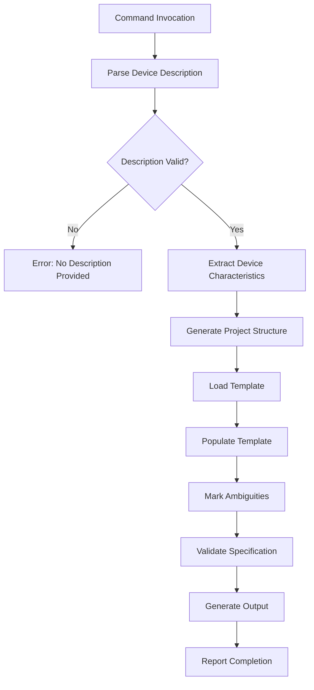
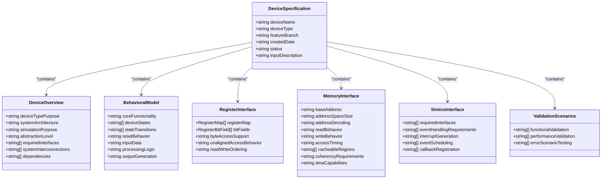
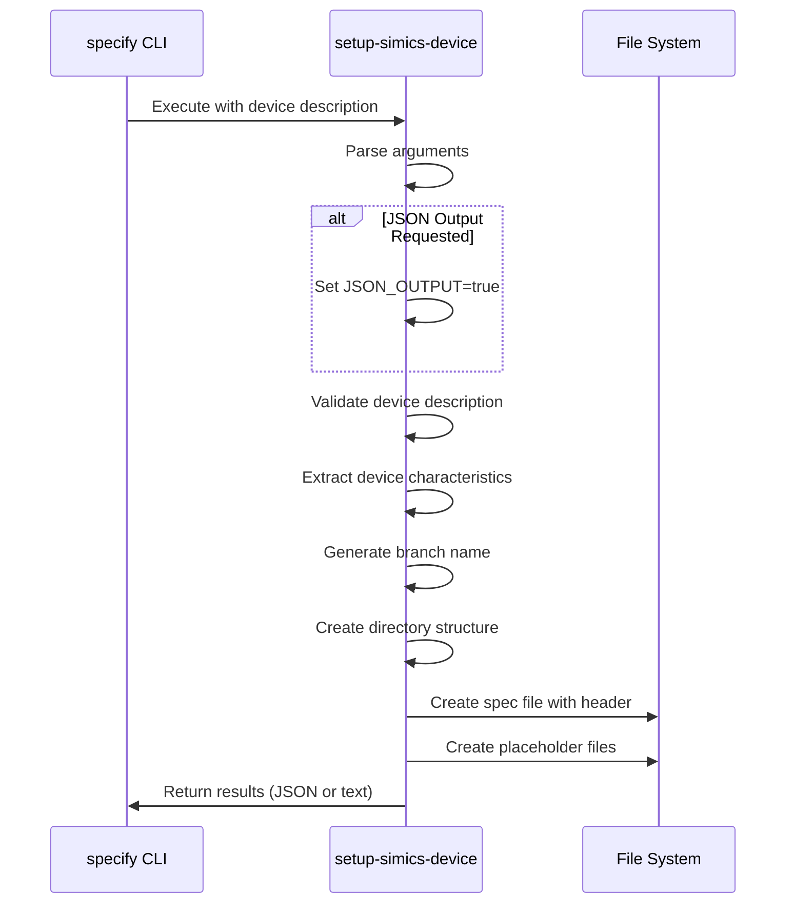

# simics-device Command

<cite>
**Referenced Files in This Document**   
- [setup-simics-device.sh](file://scripts/bash/setup-simics-device.sh)
- [setup-simics-device.ps1](file://scripts/powershell/setup-simics-device.ps1)
- [device-spec-template.md](file://templates/simics/projects/device-spec-template.md)
- [simics-device.md](file://templates/commands/simics-device.md)
- [__init__.py](file://src/specify_cli/__init__.py)
</cite>

## Table of Contents
1. [Introduction](#introduction)
2. [Implementation Flow](#implementation-flow)
3. [Domain Model](#domain-model)
4. [Template Structure](#template-structure)
5. [Script Execution and JSON Interface](#script-execution-and-json-interface)
6. [Common Issues and Troubleshooting](#common-issues-and-troubleshooting)
7. [Performance Considerations](#performance-considerations)
8. [Best Practices](#best-practices)
9. [Conclusion](#conclusion)

## Introduction

The `simics-device` command is a core component of the spec-kit framework designed to generate comprehensive device model specifications for Simics development. This command transforms natural language device descriptions into structured, standardized specifications that serve as the foundation for Simics device implementation. The system is designed to bridge the gap between high-level device requirements and detailed technical specifications required for simulation development.

The command operates through a well-defined workflow that begins with parsing device descriptions and culminates in the generation of complete device specifications. It leverages a combination of template-driven content generation and script-based project initialization to ensure consistency across device models. The output serves hardware architects and simulation developers by focusing on device behavior and interfaces rather than implementation details.

This documentation provides a comprehensive analysis of the `simics-device` command, detailing its implementation flow, domain model, template structure, and integration with supporting scripts. It also addresses common issues, performance considerations, and best practices for creating effective device descriptions.

**Section sources**
- [simics-device.md](file://templates/commands/simics-device.md)
- [__init__.py](file://src/specify_cli/__init__.py)

## Implementation Flow

The `simics-device` command follows a structured implementation flow that systematically transforms device descriptions into comprehensive specifications. This flow begins with the invocation of setup scripts and proceeds through template processing, specification generation, and validation.

The process starts when the command is executed with a device description argument. The CLI framework routes this request to the appropriate script based on the operating environment—either the bash script `setup-simics-device.sh` for Unix-like systems or the PowerShell script `setup-simics-device.ps1` for Windows environments. Both scripts implement identical functionality through their respective shell languages, ensuring cross-platform consistency.

The initial phase involves parsing the device description and extracting key characteristics. The scripts analyze the input text to identify device type, interfaces, behavioral requirements, and performance constraints. This extraction process uses pattern matching to categorize devices based on keywords in the description (e.g., "uart" for UART controllers, "timer" for timer devices). The extracted information is used to generate a unique feature branch name and initialize the project directory structure.

Following project initialization, the command loads the device specification template from `device-spec-template.md`. This template provides the structural framework for the specification document, including mandatory sections such as Device Overview, Behavioral Model, Register Interface Specifications, and Validation Scenarios. The command populates this template with the extracted device characteristics, replacing placeholders with concrete information derived from the description.

Throughout the generation process, the system identifies and marks areas of ambiguity using the `[NEEDS CLARIFICATION: specific question]` notation. This ensures that incomplete or unclear aspects of the device description are explicitly highlighted in the output specification, preventing assumptions that could lead to implementation errors.

The final phase involves validation of the generated specification against predefined quality criteria. The system checks for the absence of implementation details (such as DML code or Python classes), verifies that all mandatory sections are complete, and confirms that register and memory interfaces are adequately specified. The process concludes with the creation of a comprehensive specification file ready for implementation planning.

**Diagram sources**
- [setup-simics-device.sh](file://scripts/bash/setup-simics-device.sh)
- [setup-simics-device.ps1](file://scripts/powershell/setup-simics-device.ps1)
- [device-spec-template.md](file://templates/simics/projects/device-spec-template.md)

**Section sources**
- [setup-simics-device.sh](file://scripts/bash/setup-simics-device.sh#L1-L202)
- [setup-simics-device.ps1](file://scripts/powershell/setup-simics-device.ps1#L1-L201)
- [simics-device.md](file://templates/commands/simics-device.md)

## Domain Model

The domain model for the `simics-device` command encompasses several key concepts that define the structure and behavior of device specifications. This model serves as the conceptual foundation for translating device descriptions into standardized specifications.

At the core of the domain model is the **Device Type**, which categorizes devices based on their primary function and characteristics. The system recognizes several device types including processor, memory, peripheral, controller, timing, and network devices. This classification is determined through pattern matching on the device description, with specific keywords triggering the appropriate type assignment (e.g., "processor" or "cpu" for processor devices, "memory" or "ram" for memory devices).

The **Interfaces** component defines the various ways a device interacts with the system. This includes required Simics interfaces such as `processor_info_v2`, `int_register`, and `memory_space`, as well as system interconnections like bus connections, memory mappings, and interrupt lines. The model also accounts for dependencies on other device models or system components that may be necessary for proper operation.

**Behavioral Requirements** capture the functional aspects of device operation, including core functionality, state management, and data processing. The domain model distinguishes between operational states, state transitions, reset behavior, input data handling, processing logic, and output generation. This ensures that the specification focuses on what the device does rather than how it is implemented.

**Performance Constraints** encompass the non-functional requirements that affect device operation, including throughput requirements, latency expectations, memory footprint, and CPU utilization in simulation. These constraints are critical for ensuring that the simulated device behaves realistically under various conditions.

The domain model also includes **Validation Scenarios** that define how the device should be tested. These scenarios cover functional validation (register access, behavioral validation), integration validation (system boot sequence, inter-device communication), and error scenario testing (invalid access patterns, boundary conditions, fault injection).

**Diagram sources**
- [device-spec-template.md](file://templates/simics/projects/device-spec-template.md)
- [setup-simics-device.sh](file://scripts/bash/setup-simics-device.sh#L100-L150)

**Section sources**
- [device-spec-template.md](file://templates/simics/projects/device-spec-template.md)
- [setup-simics-device.sh](file://scripts/bash/setup-simics-device.sh#L50-L150)
- [setup-simics-device.ps1](file://scripts/powershell/setup-simics-device.ps1#L50-L150)

## Template Structure

The `device-spec-template.md` file provides the structural foundation for all device specifications generated by the `simics-device` command. This template enforces consistency across device models while accommodating the specific requirements of different device types.

The template follows a hierarchical structure beginning with metadata and execution flow information, followed by detailed sections covering various aspects of device modeling. The metadata section includes placeholders for device name, feature branch, creation date, status, and the original device description input. This information provides context for the specification and tracks its development lifecycle.

The execution flow section outlines the 10-step process that the `simics-device` command follows when generating specifications. This transparent workflow shows how device descriptions are parsed, characteristics extracted, ambiguities marked, and various interface specifications generated. The flow concludes with a review checklist and execution status tracking, providing visibility into the specification generation process.

The template organizes device modeling requirements into several mandatory sections:

- **Device Overview**: Covers device type and purpose, target system context, and integration requirements
- **Device Behavioral Model**: Describes core functionality, state management, and data processing
- **Register Interface Specifications**: Defines register maps, bit fields, and access patterns
- **Memory Interface Requirements**: Specifies address space requirements, memory access patterns, and coherency requirements
- **Simics Interface Implementation**: Identifies required Simics interfaces and event handling requirements
- **Validation and Testing Scenarios**: Outlines functional, performance, and error scenario testing

Optional sections such as Integration and Connectivity are included only when relevant to the device type. The template provides guidance on when to include these sections and emphasizes removing sections that do not apply rather than marking them as "N/A".

The template also includes a comprehensive review and acceptance checklist that ensures specification quality. This checklist verifies that no implementation details are included, that all mandatory sections are completed, and that interface specifications are complete and unambiguous. The checklist serves as a gate for specification completeness and readiness for implementation planning.

```mermaid
flowchart TD
A[Template Structure] --> B[Metadata Section]
A --> C[Execution Flow]
A --> D[Device Overview]
A --> E[Behavioral Model]
A --> F[Register Interface]
A --> G[Memory Interface]
A --> H[Simics Interface]
A --> I[Validation Scenarios]
A --> J[Review Checklist]
A --> K[Execution Status]
B --> B1[Device Name]
B --> B2[Feature Branch]
B --> B3[Creation Date]
B --> B4[Status]
B --> B5[Input Description]
D --> D1[Device Type Purpose]
D --> D2[System Architecture]
D --> D3[Simulation Purpose]
D --> D4[Abstraction Level]
D --> D5[Required Interfaces]
D --> D6[System Interconnections]
D --> D7[Dependencies]
E --> E1[Core Functionality]
E --> E2[Device States]
E --> E3[State Transitions]
E --> E4[Reset Behavior]
E --> E5[Input Data]
E --> E6[Processing Logic]
E --> E7[Output Generation]
F --> F1[Register Map]
F --> F2[Bit Fields]
F --> F3[Access Patterns]
G --> G1[Address Space]
G --> G2[Access Patterns]
G --> G3[Coherency Requirements]
H --> H1[Required Interfaces]
H --> H2[Event Handling]
I --> I1[Functional Validation]
I --> I2[Performance Validation]
I --> I3[Error Scenarios]
J --> J1[Completeness Check]
J --> J2[Quality Check]
J --> J3[Integration Readiness]
```

**Diagram sources**
- [device-spec-template.md](file://templates/simics/projects/device-spec-template.md)

**Section sources**
- [device-spec-template.md](file://templates/simics/projects/device-spec-template.md)

## Script Execution and JSON Interface

The `simics-device` command relies on script execution and a JSON interface to initialize device projects and exchange structured data between components. This architecture enables cross-platform compatibility and facilitates integration with the broader spec-kit framework.

The command invokes either `setup-simics-device.sh` (for Unix-like systems) or `setup-simics-device.ps1` (for Windows) based on the execution environment. Both scripts implement identical functionality through their respective shell languages, ensuring consistent behavior across platforms. The scripts accept input through command-line arguments, with support for both direct device descriptions and JSON-formatted input.

The JSON interface serves as the primary mechanism for structured data exchange. When invoked with the `--json` parameter (bash) or `-Json` parameter (PowerShell), the scripts output their results in JSON format. This output includes critical information such as the generated branch name, specification file path, device name, device type, Simics version, and directory structure paths. The JSON format enables programmatic consumption of these results by other tools in the development workflow.

The script execution process follows a well-defined sequence:

1. Argument parsing to extract the device description and determine output format
2. Device characteristic extraction using pattern matching on the description
3. Generation of a unique feature branch name incorporating timestamp and random suffix
4. Creation of the project directory structure with appropriate subdirectories
5. Initialization of the specification file with metadata and template references
6. Creation of placeholder files for various specification components
7. Output of results in the requested format (text or JSON)

The scripts implement robust error handling, validating that a device description is provided and exiting with an appropriate error message and non-zero status code if this requirement is not met. They also support debug mode, which outputs detailed processing information to aid in troubleshooting.

The directory structure created by the scripts follows a standardized pattern with separate directories for specifications, contracts, Simics-specific configurations, and implementation details. This organization promotes separation of concerns and facilitates collaboration among team members with different responsibilities.

**Diagram sources**
- [setup-simics-device.sh](file://scripts/bash/setup-simics-device.sh)
- [setup-simics-device.ps1](file://scripts/powershell/setup-simics-device.ps1)

**Section sources**
- [setup-simics-device.sh](file://scripts/bash/setup-simics-device.sh)
- [setup-simics-device.ps1](file://scripts/powershell/setup-simics-device.ps1)
- [simics-device.md](file://templates/commands/simics-device.md)

## Common Issues and Troubleshooting

The `simics-device` command may encounter several common issues during operation, primarily related to ambiguous device descriptions, missing behavioral definitions, or invalid register mappings. Understanding these issues and their resolution strategies is essential for effective use of the tool.

**Ambiguous Device Descriptions**: One of the most frequent issues occurs when device descriptions lack sufficient detail or contain vague terminology. The system addresses this by marking unclear aspects with `[NEEDS CLARIFICATION: specific question]` in the generated specification. For example, if a description mentions "a UART controller" without specifying register layout or communication parameters, the tool will flag these areas for clarification.

**Missing Behavioral Definitions**: When device descriptions fail to specify core functionality or state management, the command cannot generate a complete behavioral model. The validation process will detect this and return an error: "Cannot determine device functionality". To resolve this issue, provide more detailed descriptions of the device's intended behavior, including state transitions, reset behavior, and data processing logic.

**Invalid Register Mappings**: Incomplete or contradictory register specifications are another common problem. The template specifically highlights areas where register bit field definitions, access patterns, or reset values are missing. When such issues are detected, the system marks them explicitly in the Register Interface Specifications section, prompting the user to provide the necessary details.

**Troubleshooting Steps**:

1. **Verify Input Description**: Ensure the device description is provided and contains sufficient detail about the device's purpose, interfaces, and behavior.

2. **Check Script Execution**: If the command fails to execute, verify that the appropriate script variant (bash or PowerShell) is available and executable in the current environment.

3. **Review JSON Output**: When using JSON output, validate that the response contains the expected fields and that the "success" flag is true.

4. **Examine Generated Files**: Check that the specification file and directory structure were created in the expected location with the correct content.

5. **Address Clarification Markers**: Review all `[NEEDS CLARIFICATION]` markers in the generated specification and provide additional details as needed.

6. **Validate Against Checklist**: Use the Review & Acceptance Checklist in the template to verify that all mandatory sections are complete and that no implementation details have been included.

7. **Test with Examples**: Refer to the UART controller example in the documentation to ensure your device description follows a similar level of detail and structure.

The system is designed to fail gracefully when encountering issues, providing clear error messages and maintaining the integrity of existing files. This approach ensures that incomplete or incorrect specifications do not proceed to the implementation phase.

**Section sources**
- [device-spec-template.md](file://templates/simics/projects/device-spec-template.md)
- [setup-simics-device.sh](file://scripts/bash/setup-simics-device.sh#L20-L50)
- [setup-simics-device.ps1](file://scripts/powershell/setup-simics-device.ps1#L20-L50)

## Performance Considerations

The `simics-device` command is designed with performance considerations that ensure efficient processing of device descriptions and generation of specifications, even for complex devices. These considerations span both the computational efficiency of the scripts and the quality of the generated specifications.

The bash and PowerShell scripts are optimized for fast execution, with minimal dependencies and efficient text processing. The scripts use built-in shell capabilities for string manipulation, pattern matching, and file operations, avoiding external dependencies that could impact performance. The execution time is primarily determined by the complexity of the device description and the file system operations required to create the project structure.

For complex devices with numerous registers, intricate state machines, or multiple interfaces, the specification generation process may require more processing time. However, the impact is generally negligible since the operation is primarily I/O bound rather than CPU intensive. The most time-consuming aspects are file creation and directory structure initialization, which depend on the underlying file system performance.

The template-based approach contributes to consistent performance characteristics regardless of device complexity. While more complex devices result in larger specification files, the template processing overhead remains relatively constant. The system handles complexity by organizing information into structured sections rather than increasing processing complexity.

When processing multiple device descriptions in sequence, performance can be optimized by ensuring adequate disk I/O capacity and minimizing contention with other file-intensive processes. The scripts do not maintain state between executions, allowing them to be run in parallel for different devices without interference.

The JSON output format provides a performance advantage for automated workflows, as it enables efficient parsing and integration with other tools compared to text-based output. This is particularly beneficial in continuous integration environments where specification generation is part of a larger automation pipeline.

To maximize performance when working with complex devices:
- Ensure sufficient disk space and I/O bandwidth
- Use solid-state storage for faster file operations
- Minimize the number of concurrent file-intensive processes
- Leverage the JSON output for automated processing
- Process device descriptions in batches when possible

**Section sources**
- [setup-simics-device.sh](file://scripts/bash/setup-simics-device.sh)
- [setup-simics-device.ps1](file://scripts/powershell/setup-simics-device.ps1)

## Best Practices

Adhering to best practices when using the `simics-device` command ensures the generation of high-quality, comprehensive device specifications that effectively serve as blueprints for Simics development.

**Writing Effective Device Descriptions**:
- Provide clear, detailed descriptions of the device's purpose and functionality
- Specify the device type explicitly (e.g., "UART controller" rather than just "serial device")
- Include information about required interfaces and system integration points
- Describe behavioral requirements, including state management and data processing
- Specify performance constraints and timing requirements when known
- Avoid implementation details such as DML code structures or specific API calls

**Structuring Specifications**:
- Focus on what the device does rather than how it is implemented
- Complete all mandatory sections for the device type
- Include optional sections only when relevant to the device
- Remove sections that do not apply rather than marking them as "N/A"
- Use the `[NEEDS CLARIFICATION]` marker for any assumptions or missing information
- Ensure register specifications are complete, including bit field definitions and access patterns
- Define memory interface requirements with specific address ranges and access characteristics

**Process Workflow**:
- Review the generated specification against the Review & Acceptance Checklist
- Address all `[NEEDS CLARIFICATION]` markers before proceeding to implementation
- Validate that no implementation details (DML code, Python classes) are included
- Ensure validation scenarios cover functional, performance, and error conditions
- Use the execution status section to track completion of specification generation steps
- Collaborate with hardware architects and simulation developers to verify specification accuracy

**Integration with Development Workflow**:
- Use the generated feature branch name for version control integration
- Treat the specification as a living document that evolves with device understanding
- Update the specification when new information becomes available
- Use the specification as the basis for implementation planning and task breakdown
- Reference the specification in implementation code comments and documentation
- Maintain traceability between specification requirements and implementation

Following these best practices ensures that the `simics-device` command produces specifications that are comprehensive, unambiguous, and directly useful for Simics device development.

**Section sources**
- [device-spec-template.md](file://templates/simics/projects/device-spec-template.md)
- [simics-device.md](file://templates/commands/simics-device.md)

## Conclusion

The `simics-device` command represents a sophisticated solution for generating comprehensive device model specifications in the Simics development ecosystem. By automating the transformation of device descriptions into structured specifications, it bridges the gap between conceptual device requirements and detailed technical documentation needed for simulation implementation.

The command's architecture demonstrates a thoughtful approach to cross-platform compatibility, utilizing parallel bash and PowerShell scripts that provide identical functionality across different operating environments. This design ensures that developers can work effectively regardless of their platform choice while maintaining consistency in output.

The template-driven specification generation process enforces quality and completeness through a well-structured framework that covers