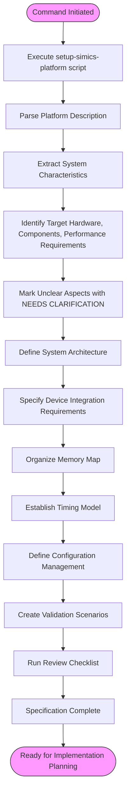
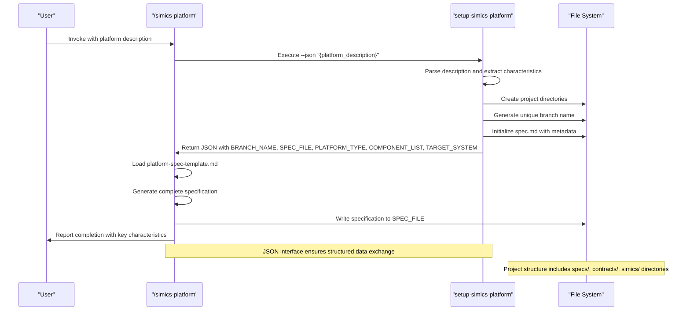

# simics-platform Command

<cite>
**Referenced Files in This Document**   
- [simics-platform.md](file://templates/commands/simics-platform.md)
- [platform-spec-template.md](file://templates/simics/projects/platform-spec-template.md)
- [setup-simics-platform.sh](file://scripts/bash/setup-simics-platform.sh)
- [setup-simics-platform.ps1](file://scripts/powershell/setup-simics-platform.ps1)
</cite>

## Table of Contents
1. [Introduction](#introduction)
2. [Command Implementation Flow](#command-implementation-flow)
3. [Platform Specification Template](#platform-specification-template)
4. [Script Execution and JSON Interface](#script-execution-and-json-interface)
5. [Domain Model and System Characteristics](#domain-model-and-system-characteristics)
6. [Common Integration Challenges](#common-integration-challenges)
7. [Optimization Tips for Large-Scale Platforms](#optimization-tips-for-large-scale-platforms)
8. [Best Practices for Platform Descriptions](#best-practices-for-platform-descriptions)
9. [Conclusion](#conclusion)

## Introduction

The `/simics-platform` command is a core component of the specification toolkit designed to generate comprehensive virtual platform specifications for system-level Simics development. This command transforms natural language platform descriptions into structured architectural specifications that serve as the foundation for Simics system configuration and integration. The specification focuses on WHAT the platform provides rather than HOW to configure it in Simics, ensuring that the output remains implementation-agnostic and focused on system architecture and integration requirements.

The command orchestrates a multi-step process that begins with parsing platform descriptions and culminates in the generation of a complete platform specification document. It leverages a standardized template structure and interacts with platform setup scripts to initialize the project environment. The resulting specifications are designed for system architects and platform developers, providing a clear roadmap for implementation planning while avoiding low-level Simics configuration details.

**Section sources**
- [simics-platform.md](file://templates/commands/simics-platform.md#L1-L46)

## Command Implementation Flow

The `/simics-platform` command follows a systematic execution flow to transform platform descriptions into comprehensive specifications. The process begins with script execution, where the command runs either `setup-simics-platform.sh` (on Unix-like systems) or `setup-simics-platform.ps1` (on Windows) with JSON-formatted arguments containing the platform description. The script processes this input and returns structured JSON output containing essential project metadata.

The implementation flow consists of eleven sequential steps as defined in the platform specification template:

1. **Parse platform description from Input** - The command extracts the platform description provided as an argument, with validation to ensure content is present
2. **Extract system characteristics** - Key elements such as target hardware, component list, performance requirements, and use cases are identified from the description
3. **Mark unclear aspects** - Any ambiguous requirements are flagged with `[NEEDS CLARIFICATION: specific question]` to prevent assumptions
4. **Fill System Architecture section** - High-level system organization and component relationships are documented, with validation to ensure topology is determinable
5. **Generate Device Integration Requirements** - Device connections are specified with attention to protocols and interface requirements
6. **Define Memory Map and Address Space** - Global address mapping and device-specific address assignments are established
7. **Specify Timing and Synchronization Model** - Clock domains, synchronization requirements, and performance targets are detailed
8. **Generate Configuration Management Requirements** - System configuration parameters and runtime options are defined
9. **Define Platform Validation Scenarios** - Comprehensive test cases for system-level functionality and integration are created
10. **Run Review Checklist** - Automated validation ensures no implementation details are included and all mandatory sections are complete
11. **Return success status** - The process completes when the platform specification is ready for implementation planning

This flow ensures that specifications are complete, unambiguous, and focused on system integration requirements rather than implementation details.

**Diagram sources**
- [platform-spec-template.md](file://templates/simics/projects/platform-spec-template.md#L7-L31)
- [simics-platform.md](file://templates/commands/simics-platform.md#L4-L46)

**Section sources**
- [platform-spec-template.md](file://templates/simics/projects/platform-spec-template.md#L7-L31)
- [simics-platform.md](file://templates/commands/simics-platform.md#L4-L46)

## Platform Specification Template

The platform specification template (`platform-spec-template.md`) provides a comprehensive structure for virtual platform specifications, ensuring consistency and completeness across different platform types. The template is organized into mandatory and optional sections, with clear guidelines for when each section should be included.

Mandatory sections that must be completed for every virtual platform include:
- **Platform Overview**: Describes the target system, simulation purpose, and platform characteristics
- **System Architecture**: Details component topology, processing elements, memory hierarchy, and system interconnect
- **Device Integration Requirements**: Specifies device components, interface connections, interrupt routing, and clock distribution
- **Memory Map and Address Space**: Defines the global address map, device address assignments, and memory protection
- **Timing and Synchronization Model**: Outlines clock domain organization, synchronization requirements, and performance targets
- **Configuration Management**: Documents system configuration parameters, runtime options, and configuration dependencies
- **Platform Validation Scenarios**: Provides system-level functional validation, performance validation, and software compatibility testing

The template also includes optional sections such as **Boot and Initialization Sequence**, which should only be included when the platform has specific boot requirements. When a section doesn't apply to a particular platform, it should be removed entirely rather than marked as "N/A."

The template enforces a clear separation between architectural requirements and implementation details, focusing on system integration requirements rather than Simics-specific configuration. It includes a comprehensive review checklist that validates the specification's completeness, ensuring that no implementation details are included and that all integration requirements are unambiguous.

**Section sources**
- [platform-spec-template.md](file://templates/simics/projects/platform-spec-template.md#L1-L269)

## Script Execution and JSON Interface

The `/simics-platform` command interfaces with platform setup scripts through a JSON-based communication protocol. When invoked, the command executes either `setup-simics-platform.sh` (on Unix-like systems) or `setup-simics-platform.ps1` (on Windows) with the `--json` flag followed by a JSON-formatted string containing the platform description. This design enables cross-platform compatibility and structured data exchange between the command and the setup scripts.

The setup scripts perform several critical functions:
- **Platform information extraction**: Parsing the platform description to identify platform name, type, component list, and target system
- **Project structure initialization**: Creating the directory structure for the platform specification, including subdirectories for contracts, Simics configuration, and implementation details
- **Branch name generation**: Creating unique feature branch names based on the platform description and timestamp
- **Specification file creation**: Initializing the main specification file with metadata and template references

Both the Bash and PowerShell scripts implement identical functionality with platform-appropriate syntax. They extract system characteristics from the description by analyzing keywords related to architecture (ARM, x86, RISC-V), platform type (server, embedded, mobile), and component list (processor, memory, UART, etc.). The scripts return JSON output containing essential metadata including `BRANCH_NAME`, `SPEC_FILE`, `PLATFORM_TYPE`, `COMPONENT_LIST`, and `TARGET_SYSTEM`, all with absolute file paths to avoid path resolution issues.

The JSON interface ensures that the `/simics-platform` command can reliably parse the script output and proceed with specification generation. This separation of concerns allows the setup scripts to focus on project initialization while the main command handles the detailed specification creation based on the extracted platform characteristics.

**Diagram sources**
- [setup-simics-platform.sh](file://scripts/bash/setup-simics-platform.sh#L1-L263)
- [setup-simics-platform.ps1](file://scripts/powershell/setup-simics-platform.ps1#L1-L237)

**Section sources**
- [setup-simics-platform.sh](file://scripts/bash/setup-simics-platform.sh#L1-L263)
- [setup-simics-platform.ps1](file://scripts/powershell/setup-simics-platform.ps1#L1-L237)
- [simics-platform.md](file://templates/commands/simics-platform.md#L4-L46)

## Domain Model and System Characteristics

The domain model for the `/simics-platform` command encompasses several key dimensions of virtual platform development: target hardware, component integration, performance requirements, and use cases. This model provides the conceptual framework for interpreting platform descriptions and generating comprehensive specifications.

**Target hardware** identification is a critical first step in the process. The system analyzes the platform description to determine the processor architecture (ARM Cortex-A/M, x86-64/32, RISC-V, MIPS), which informs subsequent decisions about system organization, memory hierarchy, and device compatibility. The target system classification influences the default assumptions about performance characteristics, power management features, and typical use cases.

**Component integration** focuses on how various hardware elements connect and interact within the system. The model requires explicit specification of device interconnections, including bus types (AXI, AHB, APB), interface protocols (UART, I2C, SPI, PCIe), and interrupt routing mechanisms. The specification process identifies potential integration challenges such as clock domain crossings, bus arbitration requirements, and memory-mapped I/O conflicts.

**Performance requirements** are derived from the platform description and use cases. These include simulation performance goals (target simulation speed, host resource usage), bus bandwidth requirements, memory subsystem performance targets, and interrupt latency constraints. The model distinguishes between functional accuracy and timing accuracy requirements based on the intended use case.

**Use cases** determine the scope and depth of the specification. Common use cases include software development, hardware validation, education, and research. Each use case implies different requirements for abstraction level (functional, cycle-accurate, mixed-level modeling), validation scenarios, and extensibility requirements. For example, a platform intended for hardware validation will require more detailed timing models than one designed for software development.

The domain model also considers **platform characteristics** such as system complexity (number of cores, devices, memory hierarchy levels), target accuracy (functional correctness vs. timing accuracy), and extensibility requirements (ability to add/modify components). These characteristics influence the level of detail required in the specification and the complexity of the validation scenarios.

**Section sources**
- [platform-spec-template.md](file://templates/simics/projects/platform-spec-template.md#L1-L269)
- [simics-platform.md](file://templates/commands/simics-platform.md#L4-L46)

## Common Integration Challenges

The `/simics-platform` command addresses several common integration challenges that arise when specifying virtual platforms. These challenges typically stem from ambiguous or incomplete platform descriptions and can significantly impact the quality and implementability of the resulting specification.

**Ambiguous system topologies** occur when the platform description lacks sufficient detail about component relationships and system organization. This challenge is addressed by the command's requirement to mark unclear aspects with `[NEEDS CLARIFICATION: specific question]` rather than making assumptions. The specification process will fail if it cannot determine the system architecture, ensuring that incomplete descriptions do not result in flawed specifications.

**Undefined device connections** represent another frequent challenge, where the description mentions devices but fails to specify how they connect to the system or to each other. The command's device integration requirements section forces explicit specification of interface connections, bus topology, interrupt routing, and clock distribution. When connection details are missing, the system flags these areas for clarification rather than omitting them.

**Incomplete memory mappings** are a critical issue that can prevent successful platform implementation. The command requires a complete global address map with base addresses, end addresses, sizes, components, and access types for all memory regions. It also requires device-specific address assignments with register maps. The template's memory protection and access control section ensures that security considerations are addressed when applicable.

Other common challenges include:
- **Unspecified timing relationships** - Addressed by the timing and synchronization model section
- **Missing configuration parameters** - Handled by the configuration management requirements
- **Inadequate validation scenarios** - Mitigated by the comprehensive platform validation section
- **Conflicting requirements** - Identified during the review checklist phase

The command's execution flow includes validation steps that detect these issues early in the process. For example, step 4 validates that the system architecture can be determined, and step 10 runs a review checklist that flags any remaining `[NEEDS CLARIFICATION]` markers or implementation details that should not be present in the specification.

**Section sources**
- [platform-spec-template.md](file://templates/simics/projects/platform-spec-template.md#L1-L269)
- [simics-platform.md](file://templates/commands/simics-platform.md#L4-L46)

## Optimization Tips for Large-Scale Platforms

When modeling large-scale platforms with the `/simics-platform` command, several optimization strategies can improve specification clarity, maintainability, and implementation efficiency.

**Hierarchical specification organization** is essential for complex platforms. Instead of creating a monolithic specification, break the platform into subsystems (processing subsystem, memory subsystem, I/O subsystem) and create separate but linked specification documents. This approach improves readability and allows different teams to work on different subsystems concurrently.

**Modular device definitions** enhance reusability across platforms. Define common devices (UART, timer, interrupt controller) in reusable templates that can be referenced in multiple platform specifications. This ensures consistency and reduces specification effort for platforms that share common components.

**Parameterized configurations** allow a single specification to support multiple platform variants. Define configuration parameters for key aspects such as memory size, number of cores, and device enablement. Document parameter constraints and mutual exclusions to prevent invalid configurations.

**Incremental specification development** follows the principle of starting with a minimal viable specification and adding detail incrementally. Begin with the core system architecture and essential devices, then add optional components and advanced features in subsequent iterations. This approach allows for early validation and reduces the risk of specification errors.

**Automated consistency checking** can be implemented through custom scripts that validate the specification against architectural rules. For example, verify that all memory-mapped devices have non-overlapping address ranges, or that interrupt lines are not over-subscribed. These checks can be integrated into the review checklist phase.

**Performance-aware modeling** involves making explicit trade-offs between simulation accuracy and performance. For large-scale platforms, consider using functional models for non-critical components while maintaining cycle-accurate models for performance-critical paths. Document these modeling decisions in the specification to ensure transparency.

**Cross-reference management** becomes critical in large specifications. Use consistent naming conventions and create a central glossary of terms. Implement a cross-referencing system that links related requirements across different sections (e.g., linking a device in the component list to its detailed interface specification).

**Section sources**
- [platform-spec-template.md](file://templates/simics/projects/platform-spec-template.md#L1-L269)
- [simics-platform.md](file://templates/commands/simics-platform.md#L4-L46)

## Best Practices for Platform Descriptions

To maximize specification clarity and minimize integration challenges, platform descriptions should follow several best practices when used with the `/simics-platform` command.

**Be specific about target hardware** by including the exact processor architecture and model (e.g., "ARM Cortex-A53" rather than just "ARM processor"). Specify memory types and sizes precisely (e.g., "4GB DDR4" rather than "lots of memory"). This specificity enables accurate system architecture definition and appropriate component selection.

**Define system topology explicitly** by describing how components connect and interact. Instead of simply listing devices, specify their interconnections (e.g., "UART connected via APB bus to system controller" rather than just "UART peripheral"). Include information about bus types, interface protocols, and any bridge components.

**Specify performance requirements quantitatively** rather than qualitatively. Instead of "high performance," provide specific targets such as "support 10 Gbps network throughput" or "achieve 1 million IOPS for storage." Include simulation performance goals like "maintain 10 million instructions per second simulation speed."

**Clarify use cases and abstraction levels** by stating the primary purpose of the platform (software development, hardware validation, education) and the required abstraction level (functional, cycle-accurate, mixed-level). This information guides the level of detail needed in timing models and validation scenarios.

**Include configuration options and variants** by documenting supported configurations (e.g., "supports 1-4GB memory configurations" or "available with or without GPU"). Specify any configuration dependencies or mutual exclusions.

**Address power management requirements** for platforms where this is relevant. Specify low-power states, clock gating requirements, and power domain organization. This information is critical for accurate modeling of modern systems.

**Provide context about software ecosystem** by mentioning the target operating systems, applications, and development tools. This helps define appropriate validation scenarios and ensures the platform meets software compatibility requirements.

Following these best practices ensures that the `/simics-platform` command can generate comprehensive, unambiguous specifications that accurately reflect the intended platform architecture and requirements.

**Section sources**
- [platform-spec-template.md](file://templates/simics/projects/platform-spec-template.md#L1-L269)
- [simics-platform.md](file://templates/commands/simics-platform.md#L4-L46)

## Conclusion

The `/simics-platform` command provides a robust framework for generating virtual platform specifications that serve as the foundation for Simics system configuration and integration. By following a systematic implementation flow, leveraging a comprehensive template structure, and interfacing with platform setup scripts through a JSON-based protocol, the command transforms natural language platform descriptions into detailed architectural specifications.

The command's strength lies in its focus on system architecture and integration requirements rather than implementation details, ensuring that specifications remain implementation-agnostic and focused on what the platform provides. The domain model encompasses target hardware, component integration, performance requirements, and use cases, providing a comprehensive framework for interpreting platform descriptions.

By addressing common integration challenges such as ambiguous system topologies, undefined device connections, and incomplete memory mappings, the command ensures that specifications are complete and implementable. The optimization tips and best practices outlined in this document further enhance the quality and clarity of the resulting specifications, particularly for large-scale platforms.

The `/simics-platform` command represents a significant advancement in specification-driven development for virtual platforms, enabling more efficient, consistent, and reliable platform creation for Simics-based system development.