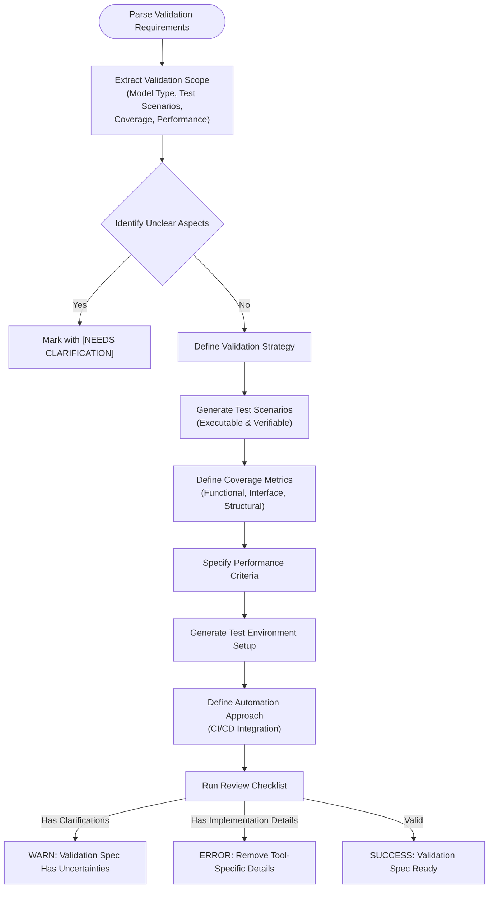
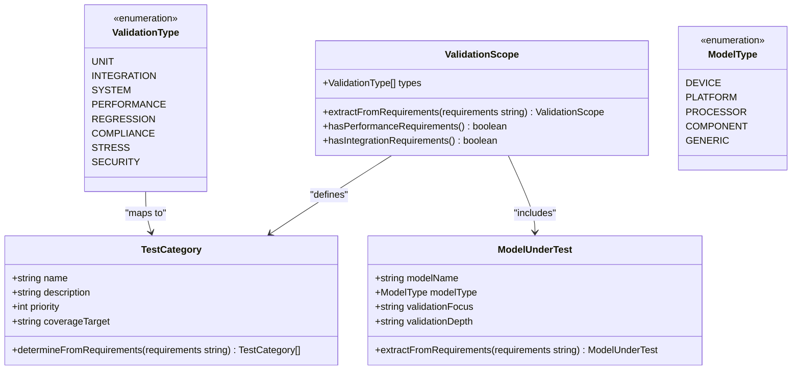
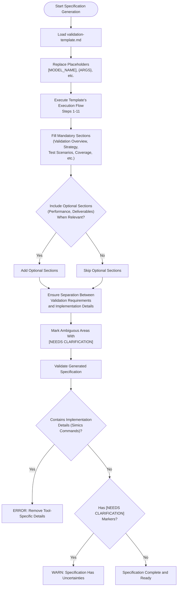
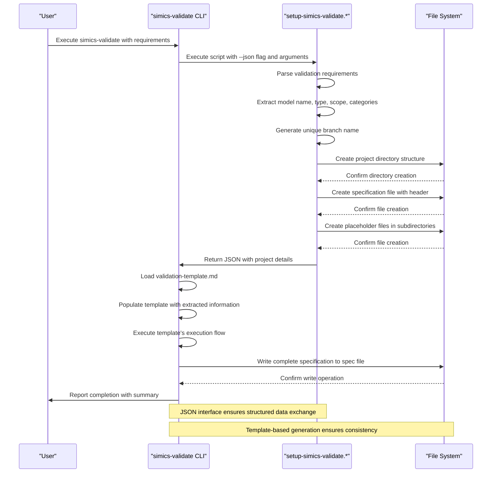
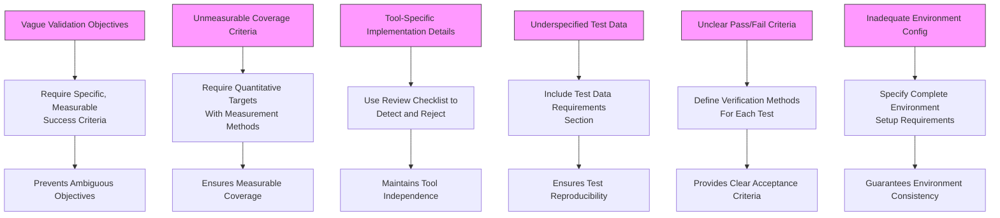
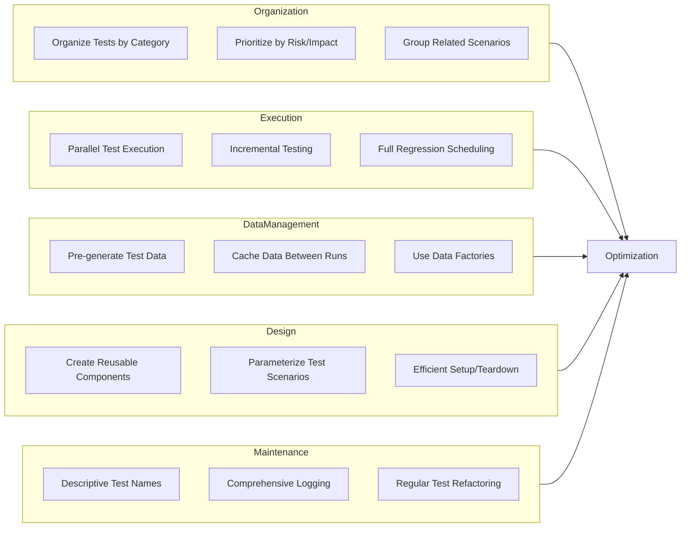
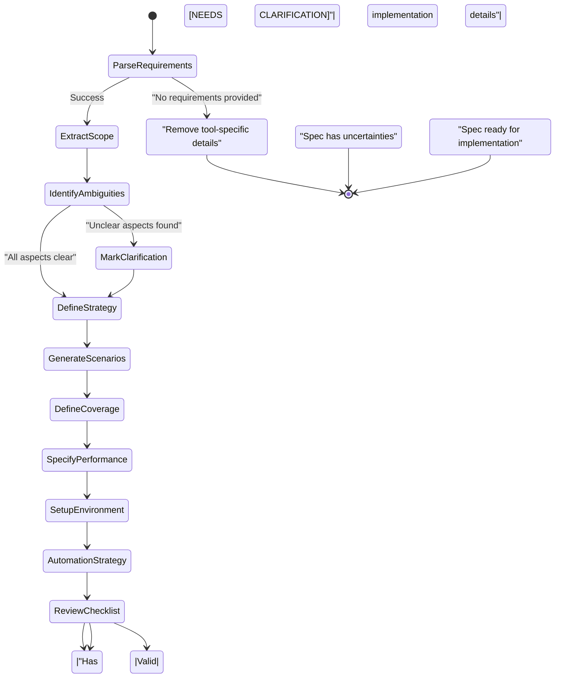

# simics-validate Command

<cite>
**Referenced Files in This Document**   
- [simics_validation.py](file://src/specify_cli/simics_validation.py)
- [validation-template.md](file://templates/simics/projects/validation-template.md)
- [simics-validate.md](file://templates/commands/simics-validate.md)
- [setup-simics-validate.sh](file://scripts/bash/setup-simics-validate.sh)
- [setup-simics-validate.ps1](file://scripts/powershell/setup-simics-validate.ps1)
</cite>

## Table of Contents
1. [Introduction](#introduction)
2. [Implementation Workflow](#implementation-workflow)
3. [Domain Model and Validation Types](#domain-model-and-validation-types)
4. [Template Structure and Output Generation](#template-structure-and-output-generation)
5. [Script Execution and JSON Interface](#script-execution-and-json-interface)
6. [Common Issues and Solutions](#common-issues-and-solutions)
7. [Performance Optimization and Best Practices](#performance-optimization-and-best-practices)
8. [Validation Framework Execution Flow](#validation-framework-execution-flow)

## Introduction

The `simics-validate` command generates comprehensive validation framework specifications for Simics device and platform models. It transforms high-level validation requirements into structured, executable test specifications using a standardized template and automation workflow. The command orchestrates the creation of validation projects by parsing requirements, determining scope, generating test strategies, and establishing measurable coverage metrics. This documentation details the implementation workflow, domain model, template structure, and best practices for creating effective validation frameworks that ensure robust testing of Simics models.

**Section sources**
- [simics-validate.md](file://templates/commands/simics-validate.md#L1-L47)

## Implementation Workflow

The `simics-validate` command follows a systematic workflow to convert validation requirements into comprehensive test specifications. The process begins with parsing the input validation requirements and extracting key information about the model type, test coverage needs, and performance targets. The command then determines the validation scope by analyzing the requirements for functional, performance, integration, compliance, regression, and stress testing needs. Based on this analysis, it generates appropriate validation strategies that define the testing approach, methodology, and stages. The workflow continues with defining specific test scenarios that are executable and verifiable, establishing clear coverage metrics for functional, interface, and structural coverage, and specifying automation approaches for continuous integration. Throughout this process, the command identifies and marks any ambiguous requirements with [NEEDS CLARIFICATION] indicators to ensure all test specifications are complete and measurable.

**Diagram sources**
- [validation-template.md](file://templates/simics/projects/validation-template.md#L4-L31)
- [simics-validate.md](file://templates/commands/simics-validate.md#L5-L10)

**Section sources**
- [validation-template.md](file://templates/simics/projects/validation-template.md#L4-L31)
- [simics-validate.md](file://templates/commands/simics-validate.md#L5-L10)

## Domain Model and Validation Types

The validation framework supports multiple testing domains including unit testing, integration testing, system-level validation, performance verification, and regression testing. Unit testing focuses on individual components or modules, verifying their functionality in isolation. Integration testing examines how different components interact within the system, ensuring proper interface behavior and data flow. System-level validation assesses the complete platform under realistic conditions, validating end-to-end workflows and system integration. Performance verification establishes quantitative metrics for throughput, latency, and resource usage, with specific acceptance thresholds. Regression testing ensures that new changes do not degrade existing functionality, with defined scope and frequency. The framework also supports compliance testing against standards and specifications, stress testing under extreme conditions, and security/safety validation for critical systems.

**Diagram sources**
- [setup-simics-validate.sh](file://scripts/bash/setup-simics-validate.sh#L85-L118)
- [setup-simics-validate.ps1](file://scripts/powershell/setup-simics-validate.ps1#L68-L85)

**Section sources**
- [setup-simics-validate.sh](file://scripts/bash/setup-simics-validate.sh#L85-L118)
- [setup-simics-validate.ps1](file://scripts/powershell/setup-simics-validate.ps1#L68-L85)

## Template Structure and Output Generation

The `simics-validate` command uses the `validation-template.md` file to structure its output, ensuring consistency across all validation specifications. The template provides a comprehensive framework with mandatory sections including Validation Overview, Validation Strategy, Test Scenario Specifications, Coverage Requirements and Metrics, Test Environment Setup Requirements, and Validation Automation Strategy. The command replaces placeholders in the template with concrete details derived from the validation requirements, such as the model name, validation scope, and test categories. It preserves the template's structure while filling in specific content, ensuring all mandatory sections are completed and optional sections are included only when relevant. The template also includes a Review & Acceptance Checklist that validates the specification's completeness, ensuring no implementation details are included and all test scenarios are measurable and verifiable.

**Diagram sources**
- [validation-template.md](file://templates/simics/projects/validation-template.md#L1-L304)
- [simics-validate.md](file://templates/commands/simics-validate.md#L20-L30)

**Section sources**
- [validation-template.md](file://templates/simics/projects/validation-template.md#L1-L304)
- [simics-validate.md](file://templates/commands/simics-validate.md#L20-L30)

## Script Execution and JSON Interface

The `simics-validate` command executes either the `setup-simics-validate.sh` (Bash) or `setup-simics-validate.ps1` (PowerShell) script with JSON input to initialize the validation framework project. The scripts parse the validation requirements and extract key information including model name, model type, validation scope, and test categories. They generate a unique feature branch name and create the project directory structure with appropriate subdirectories for specifications, contracts, Simics configuration, implementation details, and tests. The scripts output their results in JSON format when the `--json` flag is used, providing structured data that includes the branch name, specification file path, model information, and directory locations. This JSON output is then used by the `simics-validate` command to populate the validation template and generate the complete specification. The scripts also create placeholder files for various components of the validation framework, establishing the foundation for detailed test development.

**Diagram sources**
- [setup-simics-validate.sh](file://scripts/bash/setup-simics-validate.sh#L155-L272)
- [setup-simics-validate.ps1](file://scripts/powershell/setup-simics-validate.ps1#L108-L245)
- [simics-validate.md](file://templates/commands/simics-validate.md#L1-L15)

**Section sources**
- [setup-simics-validate.sh](file://scripts/bash/setup-simics-validate.sh#L155-L272)
- [setup-simics-validate.ps1](file://scripts/powershell/setup-simics-validate.ps1#L108-L245)
- [simics-validate.md](file://templates/commands/simics-validate.md#L1-L15)

## Common Issues and Solutions

The validation framework addresses several common issues in test specification. Vague validation objectives are handled by requiring specific, measurable success criteria and marking ambiguous areas with [NEEDS CLARIFICATION] indicators. Unmeasurable coverage criteria are prevented by requiring quantitative targets for functional, interface, and structural coverage, with specific measurement methods and reporting frequencies. Tool-specific implementation details in specifications are detected and rejected by the Review & Acceptance Checklist, which ensures specifications focus on WHAT to validate rather than HOW to implement tests. Other common issues include underspecified test data requirements, unclear pass/fail criteria for complex behavioral tests, and inadequate test environment configuration details. The framework addresses these by providing structured sections for test data requirements, verification methods, and environment setup, ensuring all specifications are complete, measurable, and verifiable.

**Diagram sources**
- [validation-template.md](file://templates/simics/projects/validation-template.md#L45-L74)
- [simics_validation.py](file://src/specify_cli/simics_validation.py#L14-L208)

**Section sources**
- [validation-template.md](file://templates/simics/projects/validation-template.md#L45-L74)
- [simics_validation.py](file://src/specify_cli/simics_validation.py#L14-L208)

## Performance Optimization and Best Practices

For large test suites, performance optimization is critical. The framework recommends organizing tests into logical categories (functional, performance, integration) and prioritizing execution based on risk and impact. Parallel test execution should be leveraged when possible, with independent test scenarios running concurrently. Test data should be pre-generated and cached to avoid runtime overhead. The automation strategy should include incremental testing, where only affected tests run for small changes, and full regression testing scheduled for major milestones. Best practices include creating reusable test components, parameterizing test scenarios to reduce duplication, and implementing efficient test setup and teardown procedures. The framework also emphasizes the importance of clear, descriptive test names and comprehensive logging to facilitate debugging and maintenance of large test suites.

**Diagram sources**
- [validation-template.md](file://templates/simics/projects/validation-template.md#L200-L250)
- [simics-validate.md](file://templates/commands/simics-validate.md#L35-L40)

**Section sources**
- [validation-template.md](file://templates/simics/projects/validation-template.md#L200-L250)
- [simics-validate.md](file://templates/commands/simics-validate.md#L35-L40)

## Validation Framework Execution Flow

The validation framework follows a defined execution flow that ensures comprehensive and consistent test specification. The process begins with parsing validation requirements and extracting the validation scope, including model type, test scenarios, coverage requirements, and performance targets. Any unclear aspects are marked with [NEEDS CLARIFICATION] indicators. The framework then fills the Validation Strategy section, generating test scenario specifications that are executable and verifiable. Coverage requirements and metrics are defined with specific targets and measurement methods. Performance validation criteria are specified when relevant, including baseline measurements and regression thresholds. The test environment setup requirements are generated, detailing hardware, software, and configuration needs. Finally, the validation automation strategy is defined, specifying which tests will be automated and how they integrate with CI/CD pipelines. The process concludes with a review checklist that validates the specification's completeness and quality.

**Diagram sources**
- [validation-template.md](file://templates/simics/projects/validation-template.md#L4-L31)
- [setup-simics-validate.sh](file://scripts/bash/setup-simics-validate.sh#L155-L272)

**Section sources**
- [validation-template.md](file://templates/simics/projects/validation-template.md#L4-L31)
- [setup-simics-validate.sh](file://scripts/bash/setup-simics-validate.sh#L155-L272)