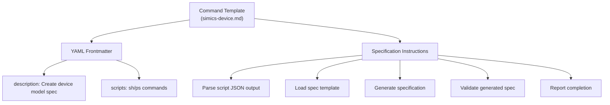
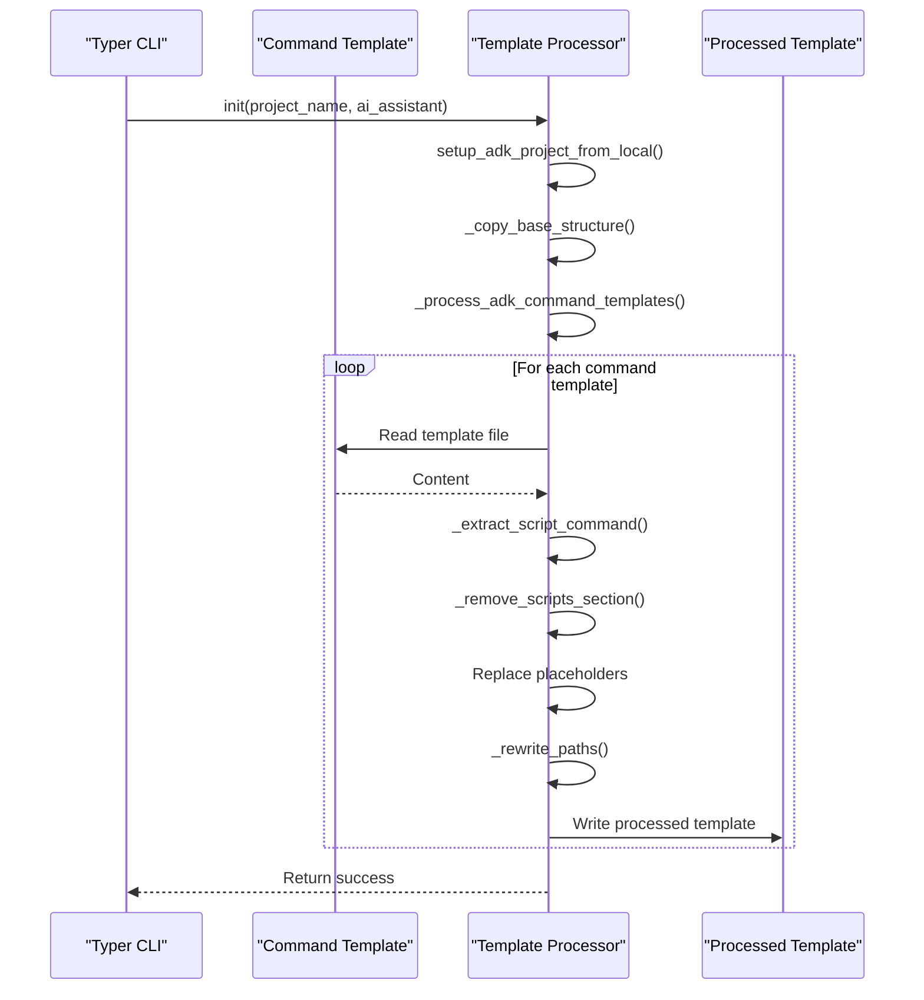
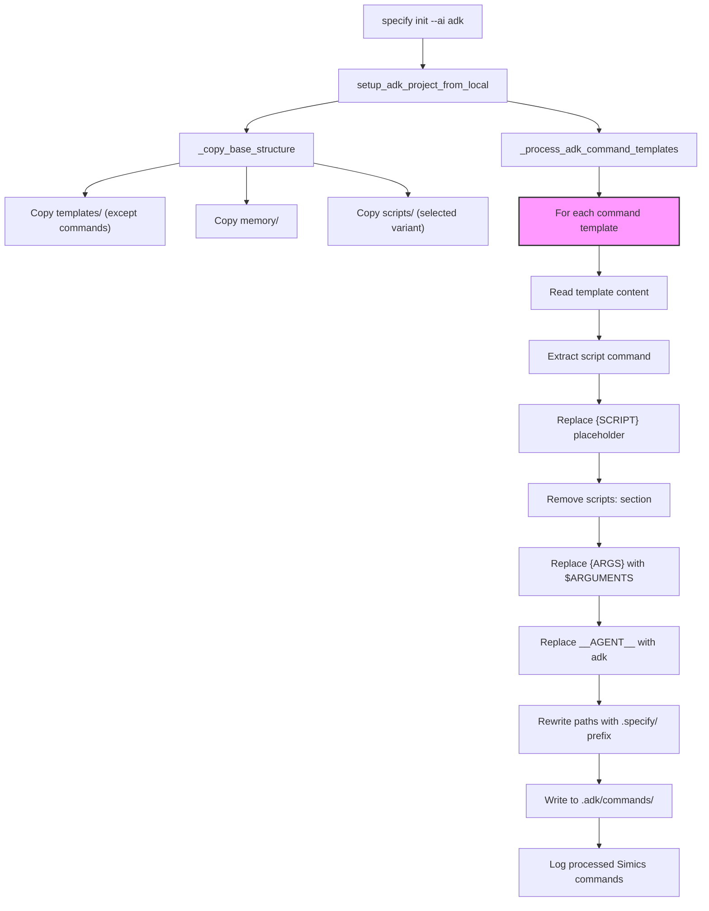
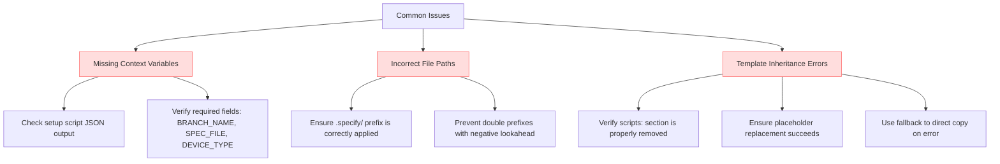

# Command Templates

<cite>
**Referenced Files in This Document**   
- [__init__.py](file://src/specify_cli/__init__.py)
- [simics-device.md](file://templates/commands/simics-device.md)
- [simics-platform.md](file://templates/commands/simics-platform.md)
- [simics-validate.md](file://templates/commands/simics-validate.md)
- [device-spec-template.md](file://templates/simics/projects/device-spec-template.md)
- [platform-spec-template.md](file://templates/simics/projects/platform-spec-template.md)
- [validation-template.md](file://templates/simics/projects/validation-template.md)
</cite>

## Table of Contents
1. [Introduction](#introduction)
2. [Command Template Structure](#command-template-structure)
3. [Template Syntax and Variables](#template-syntax-and-variables)
4. [Integration with Typer CLI](#integration-with-typer-cli)
5. [Template Processing Workflow](#template-processing-workflow)
6. [Common Issues and Troubleshooting](#common-issues-and-troubleshooting)
7. [Extending and Customizing Templates](#extending-and-customizing-templates)
8. [Conclusion](#conclusion)

## Introduction

The command templates in the Specify CLI system are the foundation for generating structured, project-specific documentation and configuration files. These templates are used by the CLI to transform user input into comprehensive specifications for Simics device models, virtual platforms, and validation frameworks. The templates follow a consistent structure and leverage Jinja-style variable interpolation to create dynamic, context-aware output. This document explains how these templates work, their integration with the Typer CLI, and how to extend them for new workflows.

**Section sources**
- [__init__.py](file://src/specify_cli/__init__.py#L1027-L1299)

## Command Template Structure

The command templates are located in the `templates/commands/` directory and include `simics-device.md`, `simics-platform.md`, and `simics-validate.md`. Each template follows a consistent structure with YAML frontmatter that defines metadata and script commands, followed by a detailed set of instructions for generating the specification.

The YAML frontmatter contains a `description` field that explains the purpose of the command and a `scripts` section that defines the shell and PowerShell commands to be executed. These scripts are parameterized with `{ARGS}` and `{SCRIPT}` placeholders that are replaced during template processing. The main body of the template contains a step-by-step guide for generating the specification, including instructions to parse JSON output from scripts, load specification templates, and generate comprehensive documentation.



**Diagram sources**
- [simics-device.md](file://templates/commands/simics-device.md#L1-L46)
- [simics-platform.md](file://templates/commands/simics-platform.md#L1-L47)
- [simics-validate.md](file://templates/commands/simics-validate.md#L1-L47)

**Section sources**
- [simics-device.md](file://templates/commands/simics-device.md#L1-L46)
- [simics-platform.md](file://templates/commands/simics-platform.md#L1-L47)
- [simics-validate.md](file://templates/commands/simics-validate.md#L1-L47)

## Template Syntax and Variables

The command templates use a simple placeholder syntax for variable interpolation, with `{ARGS}`, `{SCRIPT}`, and `__AGENT__` being the primary placeholders. The `{ARGS}` placeholder is replaced with the arguments passed to the command, typically in JSON format. The `{SCRIPT}` placeholder is replaced with the appropriate shell or PowerShell command from the YAML frontmatter. The `__AGENT__` placeholder is replaced with the name of the AI agent being used (e.g., "adk").

The templates also use special markers like `[NEEDS CLARIFICATION: specific question]` to indicate areas where additional information is required. These markers are preserved in the generated specification to highlight ambiguities that need to be resolved. The templates reference other templates in the `templates/simics/projects/` directory using relative paths, such as `templates/simics/projects/device-spec-template.md`.

```mermaid
classDiagram
class CommandTemplate {
+description : string
+scripts : dict
+{ARGS} : string
+{SCRIPT} : string
+__AGENT__ : string
+[NEEDS CLARIFICATION] : string
}
class DeviceSpecTemplate {
+[DEVICE_NAME] : string
+$ARGUMENTS : string
+[###-device-name] : string
}
class PlatformSpecTemplate {
+[PLATFORM_NAME] : string
+$ARGUMENTS : string
+[###-platform-name] : string
}
class ValidationSpecTemplate {
+[MODEL_NAME] : string
+$ARGUMENTS : string
+[###-validation-name] : string
}
CommandTemplate --> DeviceSpecTemplate : "uses"
CommandTemplate --> PlatformSpecTemplate : "uses"
CommandTemplate --> ValidationSpecTemplate : "uses"
```

**Diagram sources**
- [simics-device.md](file://templates/commands/simics-device.md#L1-L46)
- [device-spec-template.md](file://templates/simics/projects/device-spec-template.md#L1-L231)
- [platform-spec-template.md](file://templates/simics/projects/platform-spec-template.md#L1-L269)
- [validation-template.md](file://templates/simics/projects/validation-template.md#L1-L304)

**Section sources**
- [simics-device.md](file://templates/commands/simics-device.md#L1-L46)
- [device-spec-template.md](file://templates/simics/projects/device-spec-template.md#L1-L231)

## Integration with Typer CLI

The command templates are integrated with the Typer CLI through the `__init__.py` file in the `src/specify_cli/` directory. The CLI uses the `download_and_extract_template` function to process templates when initializing a new project. For the ADK (Agent Development Kit) platform, the CLI uses local repository files instead of downloading from GitHub, as specified in the `setup_adk_project_from_local` function.

The template processing workflow involves several steps: copying the base structure, processing command templates with placeholder replacement, and handling any errors by falling back to direct copying. The `_process_adk_command_templates` function reads each command template, extracts the script command from the YAML frontmatter, removes the scripts section, applies substitutions for `{ARGS}`, `{SCRIPT}`, and `__AGENT__`, rewrites paths to use the `.specify/` prefix, and writes the processed template to the `.adk/commands` directory.



**Diagram sources**
- [__init__.py](file://src/specify_cli/__init__.py#L425-L563)
- [simics-device.md](file://templates/commands/simics-device.md#L1-L46)

**Section sources**
- [__init__.py](file://src/specify_cli/__init__.py#L425-L563)

## Template Processing Workflow

The template processing workflow begins when the user runs the `specify init` command with the `--ai adk` option. The CLI determines the repository root from the location of the `__init__.py` file and creates the required directory structure in the project directory. The `.adk/commands` directory is created for the processed command templates, and the `.specify` directory is created for the base structure.

The `_copy_base_structure` function copies the base structure from the repository to the project's `.specify` directory, excluding the `commands` directory. This includes templates (except commands), memory, and scripts. The appropriate script variant (bash or PowerShell) is copied based on the user's selection. The `_process_adk_command_templates` function then processes each command template in the `templates/commands/` directory.

For each command template, the processor reads the content, extracts the script command for the selected script type, replaces the `{SCRIPT}` placeholder, removes the `scripts:` section from the YAML frontmatter, replaces `{ARGS}` with `$ARGUMENTS`, replaces `__AGENT__` with "adk", rewrites paths to use the `.specify/` prefix, and writes the processed template to the `.adk/commands` directory. If any step fails, the processor falls back to direct copying of the template files.



**Diagram sources**
- [__init__.py](file://src/specify_cli/__init__.py#L425-L563)

**Section sources**
- [__init__.py](file://src/specify_cli/__init__.py#L425-L563)

## Common Issues and Troubleshooting

Several common issues can occur during template processing, including missing context variables, incorrect file paths, and template inheritance errors. Missing context variables typically occur when the JSON output from the setup scripts does not contain the expected fields (e.g., `BRANCH_NAME`, `SPEC_FILE`, `DEVICE_TYPE`). This can be resolved by ensuring the setup scripts are correctly configured and return the required JSON structure.

Incorrect file paths can occur when the repository structure is not properly preserved during template processing. The `_rewrite_paths` function addresses this by adding the `.specify/` prefix to paths for memory, scripts, and templates, but only if the prefix is not already present. This prevents double prefixes and ensures correct relative paths.

Template inheritance errors can occur when the processor fails to properly remove the `scripts:` section from the YAML frontmatter or when placeholder replacement fails. The `_remove_scripts_section` function carefully preserves the YAML structure while removing the scripts section, and the processor includes fallback logic to copy templates directly if processing fails.



**Diagram sources**
- [__init__.py](file://src/specify_cli/__init__.py#L581-L623)
- [simics-device.md](file://templates/commands/simics-device.md#L1-L46)

**Section sources**
- [__init__.py](file://src/specify_cli/__init__.py#L581-L623)

## Extending and Customizing Templates

The command templates can be extended or customized for new workflows or organizational standards by modifying the existing templates or creating new ones. To create a new command template, add a new `.md` file in the `templates/commands/` directory with the appropriate YAML frontmatter and specification instructions. The template should follow the same structure as the existing templates, with a description, scripts section, and detailed instructions.

To customize existing templates, modify the specification instructions to include additional sections or change the structure to meet organizational requirements. The templates can be extended to include new placeholders or conditional logic by modifying the template processing functions in `__init__.py`. For example, new placeholders can be added by extending the `_process_adk_command_templates` function to replace additional variables.

When extending templates, it's important to maintain compatibility with the existing template processing workflow and ensure that the processed templates are correctly written to the `.adk/commands` directory. The fallback mechanism in `_process_adk_command_templates` provides resilience against processing errors, but custom templates should be tested thoroughly to ensure they are processed correctly.

**Section sources**
- [__init__.py](file://src/specify_cli/__init__.py#L510-L563)
- [simics-device.md](file://templates/commands/simics-device.md#L1-L46)

## Conclusion

The command templates in the Specify CLI system provide a powerful mechanism for generating structured, project-specific documentation and configuration files. By leveraging Jinja-style variable interpolation and a consistent template structure, these templates enable the creation of comprehensive specifications for Simics device models, virtual platforms, and validation frameworks. The integration with the Typer CLI through the `__init__.py` file ensures that templates are processed correctly and efficiently, with fallback mechanisms to handle errors. By understanding the template syntax, processing workflow, and common issues, users can effectively extend and customize the templates to meet their specific needs.