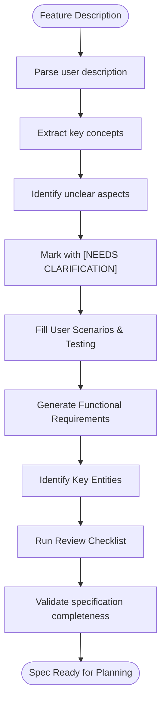
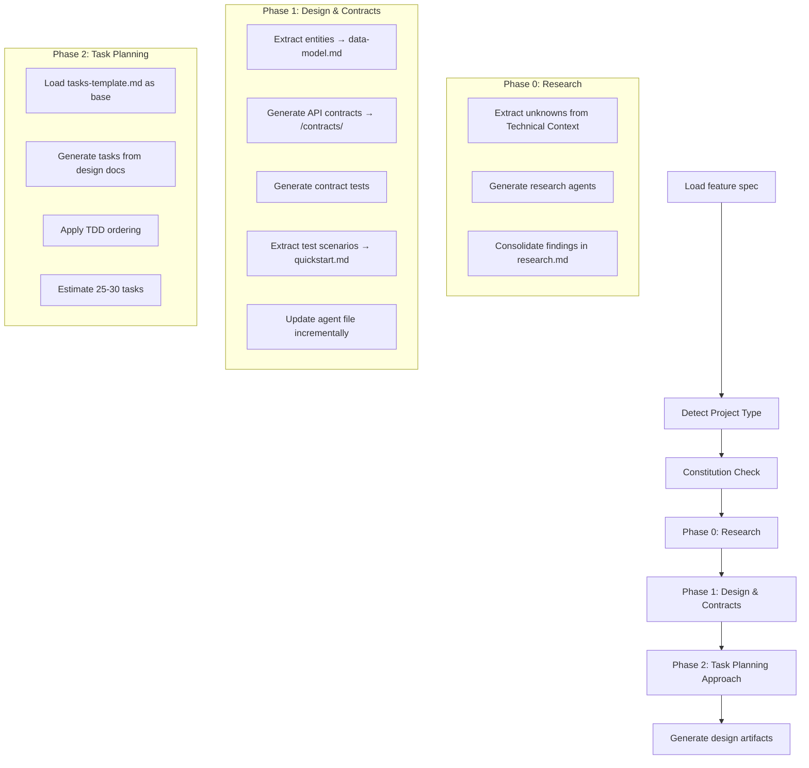
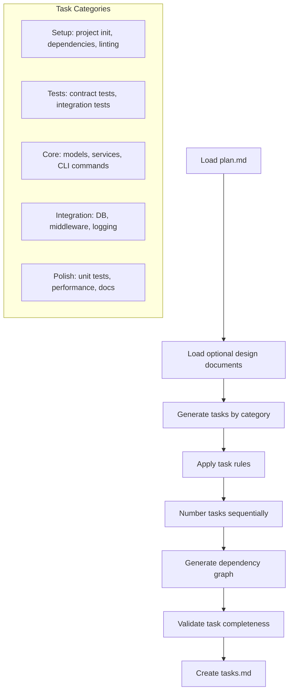
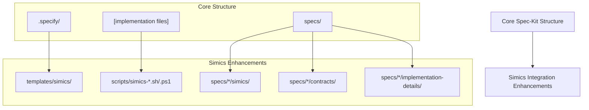
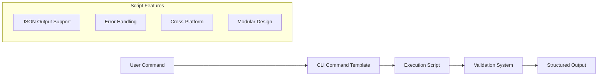

# Project Structure Templates

<cite>
**Referenced Files in This Document**   
- [spec-template.md](file://templates/spec-template.md)
- [plan-template.md](file://templates/plan-template.md)
- [tasks-template.md](file://templates/tasks-template.md)
- [agent-file-template.md](file://templates/agent-file-template.md)
- [project-structure.md](file://templates/simics/projects/project-structure.md)
- [setup-simics-device.sh](file://scripts/bash/setup-simics-device.sh)
- [simics_validation.py](file://src/specify_cli/simics_validation.py)
- [device-spec-template.md](file://templates/simics/projects/device-spec-template.md)
- [platform-spec-template.md](file://templates/simics/projects/platform-spec-template.md)
- [validation-template.md](file://templates/simics/projects/validation-template.md)
- [specify.md](file://templates/commands/specify.md)
- [plan.md](file://templates/commands/plan.md)
- [tasks.md](file://templates/commands/tasks.md)
- [create-new-feature.sh](file://scripts/bash/create-new-feature.sh)
- [setup-plan.sh](file://scripts/bash/setup-plan.sh)
</cite>

## Table of Contents
1. [Introduction](#introduction)
2. [Core Template Architecture](#core-template-architecture)
3. [Specification Template](#specification-template)
4. [Implementation Planning Template](#implementation-planning-template)
5. [Task Management Template](#task-management-template)
6. [Agent Configuration Template](#agent-configuration-template)
7. [Simics Project Structure](#simics-project-structure)
8. [Template Integration with CLI Commands](#template-integration-with-cli-commands)
9. [Script System Integration](#script-system-integration)
10. [Common Issues and Solutions](#common-issues-and-solutions)
11. [Customization and Interoperability](#customization-and-interoperability)
12. [Conclusion](#conclusion)

## Introduction

The spec-kit framework provides a comprehensive template system that standardizes project architecture, development workflows, and documentation practices. These templates serve as foundational blueprints that ensure consistency across teams and projects while enabling automation through integrated scripts and CLI commands. The system is designed to guide development from initial specification through implementation planning to task execution, with special extensions for Simics-based projects. This document details the core templates, their relationships, and their integration with the broader toolchain.

## Core Template Architecture

The spec-kit template system follows a hierarchical structure where each template serves a specific purpose in the development lifecycle. The architecture is designed to be extensible, allowing for domain-specific templates while maintaining core principles of consistency and automation. The templates are organized in the `.specify/templates/` directory and are categorized by function: specification, planning, task management, and domain-specific extensions. This structure ensures that all projects follow standardized patterns while allowing for specialization through inheritance and extension mechanisms.

**Section sources**
- [spec-template.md](file://templates/spec-template.md#L1-L116)
- [plan-template.md](file://templates/plan-template.md#L1-L217)
- [tasks-template.md](file://templates/tasks-template.md#L1-L126)

## Specification Template

The `spec-template.md` serves as the master specification blueprint for all features in the spec-kit ecosystem. It provides a structured framework for capturing feature requirements in a standardized format that focuses on user needs and business value rather than implementation details. The template enforces a clear separation between what needs to be achieved and how it will be implemented, ensuring that specifications remain accessible to non-technical stakeholders.

The template includes mandatory sections such as User Scenarios & Testing and Functional Requirements, which must be completed for every feature. It also incorporates an execution flow that guides the specification process, including steps for parsing user descriptions, extracting key concepts, identifying ambiguities, and generating testable requirements. The template uses a system of [NEEDS CLARIFICATION] markers to highlight areas requiring additional information, ensuring that incomplete specifications are easily identifiable.

A key feature of the specification template is its focus on testability and ambiguity elimination. Each requirement must be verifiable through acceptance scenarios written in the Given-When-Then format. The template also includes a comprehensive review checklist that validates content quality, requirement completeness, and scope definition before the specification is considered complete.

**Diagram sources**
- [spec-template.md](file://templates/spec-template.md#L1-L116)

**Section sources**
- [spec-template.md](file://templates/spec-template.md#L1-L116)

## Implementation Planning Template

The `plan-template.md` structures the development timeline and milestones by providing a comprehensive implementation planning framework. This template transforms high-level specifications into actionable technical plans, bridging the gap between requirements and implementation. It follows a phased approach that begins with technical context analysis and progresses through research, design, and task planning.

The planning template incorporates a sophisticated execution flow that includes constitution checks to ensure alignment with architectural principles, technical context analysis to identify technology stacks and constraints, and a structured approach to project structure definition. The template supports three primary project types (single, web, and mobile) and automatically selects the appropriate structure based on the technical context.

The planning process is divided into distinct phases: Phase 0 focuses on research and unknown resolution, Phase 1 covers design and contract generation, and Phase 2 outlines the task planning approach. The template generates key artifacts including research.md, data-model.md, contracts/, and quickstart.md, all of which serve as inputs for subsequent development phases. A complexity tracking system documents any deviations from architectural principles, ensuring transparency in design decisions.

**Diagram sources**
- [plan-template.md](file://templates/plan-template.md#L1-L217)

**Section sources**
- [plan-template.md](file://templates/plan-template.md#L1-L217)

## Task Management Template

The `tasks-template.md` organizes work breakdowns by providing a structured framework for generating actionable, dependency-ordered tasks from design artifacts. This template transforms high-level plans into granular implementation steps that can be executed by development teams or automation agents. It follows Test-Driven Development (TDD) principles by requiring test creation before implementation.

The task template categorizes work into five phases: Setup, Tests First, Core Implementation, Integration, and Polish. Each task is numbered sequentially (T001, T002, etc.) and includes file paths to ensure specificity. The template uses [P] markers to indicate tasks that can be executed in parallel, enabling efficient workflow management. Dependencies between tasks are explicitly documented to prevent conflicts.

Task generation follows specific rules based on input artifacts: each contract file generates a contract test task, each entity in the data model generates a model creation task, and each user story generates an integration test task. The template ensures comprehensive coverage by validating that all contracts have corresponding tests, all entities have model tasks, and all tests precede implementation.

**Diagram sources**
- [tasks-template.md](file://templates/tasks-template.md#L1-L126)

**Section sources**
- [tasks-template.md](file://templates/tasks-template.md#L1-L126)

## Agent Configuration Template

The `agent-file-template.md` supports agent-based automation scripts by providing a standardized format for documenting project-specific guidelines and configurations. This template is auto-generated from all feature plans and serves as a central reference for AI assistants and automation agents working on the project.

The template captures key project information including active technologies, project structure, commands, code style, and recent changes. It uses a structured format with clearly defined sections that can be easily parsed by automation tools. The template includes manual addition markers that preserve human-curated content while allowing automated updates to other sections.

A critical feature of the agent configuration template is its incremental update mechanism. When new features are planned, the template is updated to include only the new technologies from the current plan, preserving existing content and manual additions. This ensures that the agent configuration remains current without losing valuable human insights. The template is also optimized for token efficiency by limiting the recent changes section to the last three features.

**Section sources**
- [agent-file-template.md](file://templates/agent-file-template.md#L1-L22)

## Simics Project Structure

The `project-structure.md` enforces directory and file organization standards for Simics projects by extending the core spec-kit structure with domain-specific enhancements. This template provides comprehensive support for Simics device modeling, virtual platform development, and validation framework projects while maintaining backward compatibility with standard projects.

The enhanced structure introduces Simics-specific directories and files organized under the `.specify/templates/simics/` hierarchy. It includes specialized templates for device specifications, platform specifications, and validation frameworks, each with domain-appropriate sections and requirements. The structure also adds Simics-specific scripts for project setup and configuration.

Project type detection logic automatically selects the appropriate structure variant based on specification content analysis. Device model projects include register interface specifications and DML implementation details, while virtual platform projects feature system architecture descriptions and memory map definitions. Validation framework projects include comprehensive test scenario specifications and coverage metrics.

The template follows additive enhancement principles, preserving the core spec-kit structure while adding Simics-specific components. This ensures that existing projects continue to work without modification while providing enhanced capabilities for Simics integration.

**Diagram sources**
- [project-structure.md](file://templates/simics/projects/project-structure.md#L1-L194)

**Section sources**
- [project-structure.md](file://templates/simics/projects/project-structure.md#L1-L194)

## Template Integration with CLI Commands

The templates are tightly integrated with CLI commands that instantiate and execute them, creating a seamless workflow from specification to implementation. The `specify init` command and related commands use YAML frontmatter in command templates to determine which scripts to execute and how to process the templates.

The `specify.md` command template orchestrates feature specification creation by running the `create-new-feature.sh` script, which generates a new branch and initializes the specification file. The `plan.md` command template executes the implementation planning workflow by running `setup-plan.sh` and processing the plan template according to its execution flow. The `tasks.md` command template generates actionable tasks by analyzing available design artifacts and applying task generation rules.

Each command template follows a consistent pattern: it specifies bash and PowerShell script variants in the YAML frontmatter, defines the execution context, and outlines the processing steps. The scripts return JSON output that the command templates parse to obtain file paths and other context information. This integration ensures that template processing is consistent across different operating systems and execution environments.

**Section sources**
- [specify.md](file://templates/commands/specify.md#L1-L15)
- [plan.md](file://templates/commands/plan.md#L1-L39)
- [tasks.md](file://templates/commands/tasks.md#L1-L61)

## Script System Integration

The template system is integrated with a comprehensive script system that automates project setup, configuration, and validation. Bash and PowerShell scripts provide cross-platform support for all major operations, ensuring consistent behavior across different development environments.

The script system follows a modular architecture with shared functionality in common.sh and common.ps1 files. Each script supports JSON output mode for programmatic consumption by higher-level tools and automation agents. Error handling is standardized across scripts using set -euo pipefail in bash scripts and appropriate exception handling in PowerShell scripts.

Key scripts include `create-new-feature.sh` for initializing feature branches, `setup-plan.sh` for preparing implementation planning, and `setup-simics-device.sh` for configuring Simics-specific projects. The Simics validation system includes comprehensive testing capabilities through the `simics_validation.py` module, which validates template structure, content, and script functionality.

**Diagram sources**
- [setup-simics-device.sh](file://scripts/bash/setup-simics-device.sh#L1-L201)
- [simics_validation.py](file://src/specify_cli/simics_validation.py#L1-L431)

**Section sources**
- [setup-simics-device.sh](file://scripts/bash/setup-simics-device.sh#L1-L201)
- [create-new-feature.sh](file://scripts/bash/create-new-feature.sh#L1-L58)
- [setup-plan.sh](file://scripts/bash/setup-plan.sh#L1-L17)
- [simics_validation.py](file://src/specify_cli/simics_validation.py#L1-L431)

## Common Issues and Solutions

Several common issues can arise when working with the template system, including structural deviations, missing template files, and version drift. Structural deviations occur when teams modify the standard project structure, breaking automation assumptions. This is addressed through the constitution check system in the planning template, which validates adherence to architectural principles.

Missing template files typically result from incomplete repository setup or version control issues. The system detects these issues during command execution and provides clear error messages. The validation system in `simics_validation.py` includes comprehensive checks for template availability and structure.

Version drift occurs when template modifications are not properly propagated across projects. This is mitigated through the template inheritance system, where domain-specific templates extend rather than replace core templates. The agent configuration template's incremental update mechanism also helps prevent version drift by preserving manual additions while updating automated content.

Other common issues include ambiguous requirements, incomplete specifications, and circular dependencies. The template system addresses these through mandatory review checklists, [NEEDS CLARIFICATION] markers, and dependency validation in the task generation process.

**Section sources**
- [plan-template.md](file://templates/plan-template.md#L1-L217)
- [tasks-template.md](file://templates/tasks-template.md#L1-L126)
- [simics_validation.py](file://src/specify_cli/simics_validation.py#L1-L431)

## Customization and Interoperability

The template system supports customization to align with team workflows while preserving interoperability through several mechanisms. Teams can extend templates by adding optional sections or modifying non-mandatory content, but changes to mandatory sections and execution flows are discouraged to maintain consistency.

The agent configuration template provides a safe zone for team-specific customizations through the manual additions section. This allows teams to document workflow preferences, coding standards, and tool configurations without affecting the automated portions of the template.

Interoperability is maintained through strict adherence to the core template structure and execution flows. Customizations are limited to content within predefined sections, ensuring that automation tools can reliably parse and process templates. The system also provides validation capabilities to verify template compliance before execution.

For Simics-specific projects, the template system supports domain-specific extensions through the `simics/` directory structure. These extensions inherit from core templates while adding specialized sections for device modeling, platform architecture, and validation requirements. This approach ensures that Simics projects maintain compatibility with the broader spec-kit ecosystem.

**Section sources**
- [agent-file-template.md](file://templates/agent-file-template.md#L1-L22)
- [project-structure.md](file://templates/simics/projects/project-structure.md#L1-L194)

## Conclusion

The spec-kit template system provides a comprehensive framework for standardizing project architecture, development workflows, and documentation practices. By combining structured templates with automated scripts and CLI commands, the system ensures consistency across teams and projects while enabling efficient automation. The hierarchical template architecture supports both general development workflows and domain-specific requirements for Simics integration. Through careful design of execution flows, validation mechanisms, and customization options, the system balances standardization with flexibility, making it a powerful tool for managing complex software development projects.