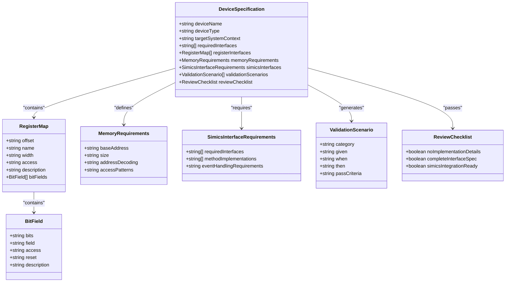
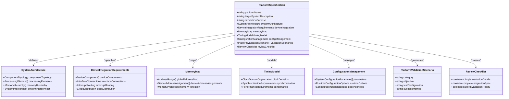

# Simics Project Templates

<cite>
**Referenced Files in This Document**   
- [device-spec-template.md](file://templates/simics/projects/device-spec-template.md)
- [platform-spec-template.md](file://templates/simics/projects/platform-spec-template.md)
- [validation-template.md](file://templates/simics/projects/validation-template.md)
- [uart-controller-example.md](file://templates/simics/examples/uart-controller-example.md)
- [simics_validation.py](file://src/specify_cli/simics_validation.py)
</cite>

## Table of Contents
1. [Introduction](#introduction)
2. [Template Overview](#template-overview)
3. [Device Specification Template](#device-specification-template)
4. [Platform Specification Template](#platform-specification-template)
5. [Validation Template](#validation-template)
6. [Template Syntax and Structure](#template-syntax-and-structure)
7. [Example: UART Controller](#example-uart-controller)
8. [Template Execution Flow](#template-execution-flow)
9. [Validation Framework Integration](#validation-framework-integration)
10. [Common Issues and Troubleshooting](#common-issues-and-troubleshooting)
11. [Best Practices](#best-practices)
12. [Conclusion](#conclusion)

## Introduction

The Simics project templates provide a standardized framework for creating specifications for hardware simulation models. These templates ensure consistency, completeness, and proper integration with the Simics simulation environment. The template system supports three primary specification types: device models, virtual platforms, and validation frameworks. Each template follows a structured approach that separates specification from implementation, focusing on behavioral requirements rather than technical implementation details.

The templates are invoked through specific commands (`specify simics-device`, `specify simics-platform`, `specify simics-validate`) and integrate with a validation framework that ensures specifications meet quality standards before implementation begins. This documentation explains the purpose, structure, and usage of each template, along with best practices for maintaining consistency across large-scale Simics projects.

**Section sources**
- [device-spec-template.md](file://templates/simics/projects/device-spec-template.md)
- [platform-spec-template.md](file://templates/simics/projects/platform-spec-template.md)
- [validation-template.md](file://templates/simics/projects/validation-template.md)

## Template Overview

The Simics template system consists of three core specification templates, each serving a distinct purpose in the hardware modeling workflow:

1. **Device Specification Template**: Defines individual hardware components with focus on behavior, interfaces, and register-level details
2. **Platform Specification Template**: Describes system-level integration of multiple components, including memory maps and interconnect topology
3. **Validation Template**: Specifies test and verification criteria for both device and platform models

These templates follow a consistent structure with mandatory sections, execution flows, and review checklists. They use markdown-based syntax with placeholders for dynamic data injection and are designed to be both human-readable and machine-processable. The templates are invoked through command-line interfaces that parse input descriptions and generate structured specifications following the template format.

The template system enforces a specification-first approach, ensuring that all implementation details are preceded by a complete and validated specification. This approach improves quality, reduces rework, and ensures traceability from requirements to implementation.

**Diagram sources**
- [device-spec-template.md](file://templates/simics/projects/device-spec-template.md)
- [platform-spec-template.md](file://templates/simics/projects/platform-spec-template.md)
- [validation-template.md](file://templates/simics/projects/validation-template.md)

**Section sources**
- [device-spec-template.md](file://templates/simics/projects/device-spec-template.md)
- [platform-spec-template.md](file://templates/simics/projects/platform-spec-template.md)
- [validation-template.md](file://templates/simics/projects/validation-template.md)

## Device Specification Template

The device-spec-template serves as the foundation for modeling individual hardware components in Simics. This template focuses on defining the behavior and interfaces of a single device without specifying implementation details. It is invoked through the `specify simics-device` command and generates a comprehensive specification based on a natural language description of the device.

The template includes mandatory sections that capture essential device characteristics: Device Overview, Device Behavioral Model, Register Interface Specifications, Memory Interface Requirements, Simics Interface Implementation, and Validation and Testing Scenarios. Each section follows a structured format with specific requirements for completeness and clarity.

Key aspects of the device template include:
- Focus on behavioral requirements rather than implementation details
- Clear separation between specification and technical implementation
- Standardized register map format with access patterns and bit field definitions
- Integration requirements for Simics interfaces like processor_info_v2 and int_register
- Built-in validation scenarios that ensure testability of the specification

The template also includes a review checklist that is automatically evaluated during specification generation, ensuring that all mandatory sections are complete and that no implementation details have been included in the specification.

**Diagram sources**
- [device-spec-template.md](file://templates/simics/projects/device-spec-template.md)

**Section sources**
- [device-spec-template.md](file://templates/simics/projects/device-spec-template.md)

## Platform Specification Template

The platform-spec-template provides a framework for specifying virtual platforms that integrate multiple hardware components into a complete system model. This template focuses on system architecture, component integration, and platform-level requirements rather than individual device details. It is invoked through the `specify simics-platform` command and generates a comprehensive platform specification based on a system description.

The template includes mandatory sections that capture essential platform characteristics: Platform Overview, System Architecture, Device Integration Requirements, Memory Map and Address Space, Timing and Synchronization Model, Configuration Management, and Platform Validation Scenarios. These sections ensure that all aspects of system integration are properly specified before implementation begins.

Key aspects of the platform template include:
- Focus on system-level architecture and integration requirements
- Comprehensive device integration matrix with address assignments and dependencies
- Detailed memory map specification with address ranges and access types
- Timing and synchronization model that defines clock domains and performance requirements
- Configuration management framework for runtime parameters and dependencies
- Platform-level validation scenarios that test system integration and software compatibility

The template also includes a review checklist that validates the completeness of the platform specification, ensuring that all integration points are defined and that no implementation details have been included in the specification.

**Diagram sources**
- [platform-spec-template.md](file://templates/simics/projects/platform-spec-template.md)

**Section sources**
- [platform-spec-template.md](file://templates/simics/projects/platform-spec-template.md)

## Validation Template

The validation-template provides a structured framework for defining test and verification criteria for both device models and virtual platforms. This template focuses on specifying what needs to be validated and how success will be measured, without specifying the implementation of test scripts or tools. It is invoked through the `specify simics-validate` command and generates a comprehensive validation specification based on validation requirements.

The template includes mandatory sections that capture essential validation characteristics: Validation Overview, Validation Strategy, Test Scenario Specifications, Coverage Requirements and Metrics, Performance Validation Criteria, Test Environment Setup Requirements, Validation Automation Strategy, and Review & Acceptance Checklist. These sections ensure that validation is comprehensive, measurable, and aligned with project objectives.

Key aspects of the validation template include:
- Focus on validation objectives and success criteria rather than test implementation
- Structured test scenario format with clear pass/fail criteria
- Comprehensive coverage requirements including functional, interface, and structural coverage
- Performance validation criteria with specific thresholds and measurement methods
- Test environment requirements that ensure consistency across test executions
- Automation strategy that defines the scope and approach for test automation

The template also includes a review checklist that validates the completeness of the validation specification, ensuring that all test scenarios are executable and that success criteria are unambiguous.

**Diagram sources**
- [validation-template.md](file://templates/simics/projects/validation-template.md)

**Section sources**
- [validation-template.md](file://templates/simics/projects/validation-template.md)

## Template Syntax and Structure

The Simics project templates follow a consistent markdown-based syntax with standardized sections, placeholders, and formatting conventions. This structure ensures uniformity across specifications while allowing for dynamic data injection and automated processing.

Each template begins with metadata in the header section, including the specification name, feature branch, creation date, status, and input description. The metadata uses placeholders (e.g., `[DEVICE_NAME]`, `[DATE]`, `$ARGUMENTS`) that are replaced with actual values during template instantiation.

The core structure of each template includes:
- **Execution Flow**: A code block showing the step-by-step process for generating the specification
- **Guidelines**: Best practices and rules for completing the specification
- **Mandatory and Optional Sections**: Clearly marked sections that must or may be included
- **Structured Tables**: For register maps, memory layouts, configuration parameters, and other tabular data
- **Behavioral Descriptions**: Natural language descriptions of functionality and requirements
- **Validation Scenarios**: Gherkin-style "Given-When-Then" test scenarios
- **Review Checklist**: Automated validation criteria that ensure specification quality

Placeholders are used throughout the templates for dynamic data injection:
- `[PLACE