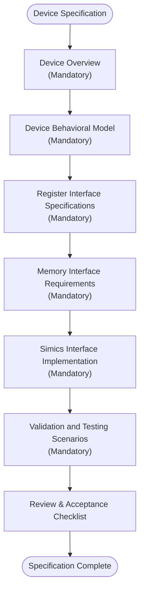
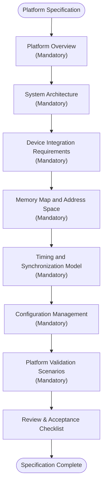
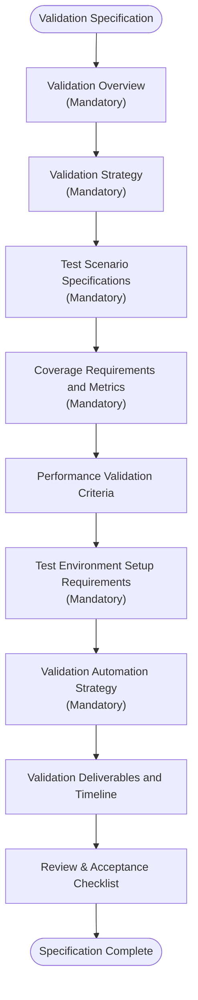
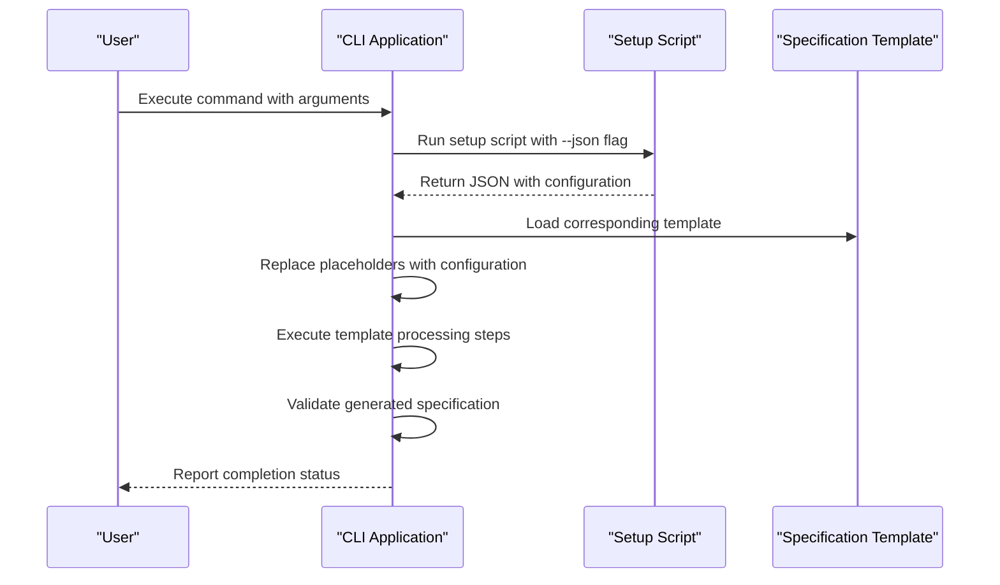
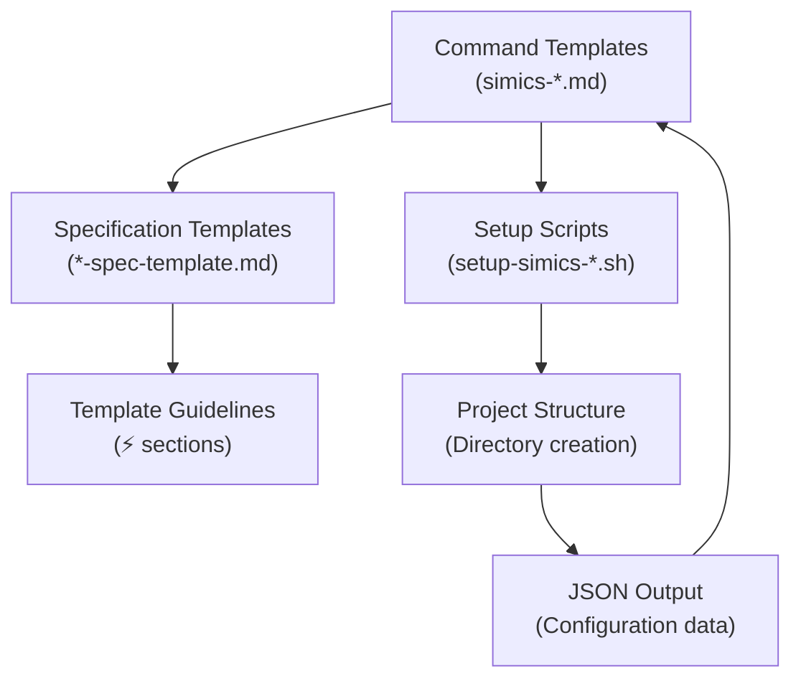

# Template System

<cite>
**Referenced Files in This Document**   
- [device-spec-template.md](file://templates/simics/projects/device-spec-template.md)
- [platform-spec-template.md](file://templates/simics/projects/platform-spec-template.md)
- [validation-template.md](file://templates/simics/projects/validation-template.md)
- [simics-device.md](file://templates/commands/simics-device.md)
- [simics-platform.md](file://templates/commands/simics-platform.md)
- [simics-validate.md](file://templates/commands/simics-validate.md)
- [setup-simics-device.sh](file://scripts/bash/setup-simics-device.sh)
- [setup-simics-platform.sh](file://scripts/bash/setup-simics-platform.sh)
- [setup-simics-validate.sh](file://scripts/bash/setup-simics-validate.sh)
- [__init__.py](file://src/specify_cli/__init__.py)
</cite>

## Table of Contents
1. [Introduction](#introduction)
2. [Template Processing System](#template-processing-system)
3. [Core Template Types](#core-template-types)
4. [CLI Command Integration](#cli-command-integration)
5. [Data Flow and Processing](#data-flow-and-processing)
6. [Template Customization](#template-customization)
7. [Template Relationships](#template-relationships)
8. [Common Template Issues](#common-template-issues)
9. [Performance Considerations](#performance-considerations)
10. [Conclusion](#conclusion)

## Introduction
The template system in the spec-kit repository provides a standardized framework for generating comprehensive specifications for Simics development projects. This system enables consistent documentation and planning across device models, virtual platforms, and validation frameworks through a structured template processing approach. The templates serve as blueprints that guide the creation of detailed specifications while maintaining focus on behavioral requirements rather than implementation details.

**Section sources**
- [device-spec-template.md](file://templates/simics/projects/device-spec-template.md)
- [platform-spec-template.md](file://templates/simics/projects/platform-spec-template.md)
- [validation-template.md](file://templates/simics/projects/validation-template.md)

## Template Processing System
The template processing system drives project generation and standardization by transforming user input into structured specification documents. This system follows a consistent pattern across all template types, beginning with user-provided arguments that describe the target system or component. The CLI application processes these templates during command execution by first running the appropriate setup script to initialize the project structure and then populating the specification file with content derived from the corresponding template.

The processing workflow involves several key steps: parsing user input, extracting relevant characteristics, generating structured content based on template guidelines, and validating the final specification. Each template contains an execution flow section that outlines the processing steps, ensuring consistent application of the specification methodology. The system uses placeholder replacement to customize generic templates with specific project details, maintaining the template structure while populating it with relevant information.

**Section sources**
- [__init__.py](file://src/specify_cli/__init__.py#L458-L675)
- [simics-device.md](file://templates/commands/simics-device.md)
- [simics-platform.md](file://templates/commands/simics-platform.md)
- [simics-validate.md](file://templates/commands/simics-validate.md)

## Core Template Types

### Device Specification Template
The device-spec-template.md provides a comprehensive structure for creating device model specifications. This template focuses on behavioral modeling and interface requirements for individual hardware components. It includes mandatory sections such as Device Overview, Behavioral Model, Register Interface Specifications, Memory Interface Requirements, and Simics Interface Implementation. The template guides users to describe device functionality without specifying implementation details in DML or Python.

**Diagram sources**
- [device-spec-template.md](file://templates/simics/projects/device-spec-template.md#L1-L231)

**Section sources**
- [device-spec-template.md](file://templates/simics/projects/device-spec-template.md#L1-L231)

### Platform Specification Template
The platform-spec-template.md serves as a blueprint for virtual platform specifications, focusing on system architecture and integration requirements. This template emphasizes the relationships between components rather than individual device details. Key sections include System Architecture, Device Integration Requirements, Memory Map and Address Space, Timing and Synchronization Model, and Configuration Management. The template ensures that platform specifications address system-level concerns such as component topology, interconnect architecture, and boot sequence.

**Diagram sources**
- [platform-spec-template.md](file://templates/simics/projects/platform-spec-template.md#L1-L269)

**Section sources**
- [platform-spec-template.md](file://templates/simics/projects/platform-spec-template.md#L1-L269)

### Validation Specification Template
The validation-template.md provides a framework for creating validation frameworks that ensure Simics models meet their requirements. This template focuses on test strategy, coverage requirements, and success criteria rather than specific test implementation details. It includes sections for Validation Strategy, Test Scenario Specifications, Coverage Requirements and Metrics, Performance Validation Criteria, and Validation Automation Strategy. The template guides users to define measurable validation objectives and comprehensive test scenarios.

**Diagram sources**
- [validation-template.md](file://templates/simics/projects/validation-template.md#L1-L304)

**Section sources**
- [validation-template.md](file://templates/simics/projects/validation-template.md#L1-L304)

## CLI Command Integration
The template system integrates with the CLI application through command templates that define the execution workflow for each specification type. These command templates, located in the templates/commands directory, specify the scripts to execute and the processing steps to follow. The integration follows a consistent pattern across all command types, with each command template referencing the corresponding setup script and specification template.

The CLI processes these templates by first executing the designated setup script with JSON output to initialize the project structure and extract configuration details. It then loads the appropriate specification template, replaces placeholders with extracted information, and populates the specification file according to the template's execution flow. The command templates include YAML frontmatter that specifies the scripts for both bash and PowerShell environments, ensuring cross-platform compatibility.

**Diagram sources**
- [simics-device.md](file://templates/commands/simics-device.md#L1-L46)
- [simics-platform.md](file://templates/commands/simics-platform.md#L1-L47)
- [simics-validate.md](file://templates/commands/simics-validate.md#L1-L47)

**Section sources**
- [simics-device.md](file://templates/commands/simics-device.md#L1-L46)
- [simics-platform.md](file://templates/commands/simics-platform.md#L1-L47)
- [simics-validate.md](file://templates/commands/simics-validate.md#L1-L47)

## Data Flow and Processing
The data flow from user input to rendered specification files follows a standardized processing pipeline. When a user invokes a Simics command with specific arguments, the CLI application initiates a sequence of operations that transform the input into a complete specification document. The process begins with the execution of a setup script that creates the project directory structure and extracts relevant information from the user input.

The extracted information, returned as JSON, includes details such as branch name, specification file path, model type, and other configuration parameters. This data is then used to populate the appropriate template, replacing placeholders like [DEVICE_NAME], [PLATFORM_NAME], or [MODEL_NAME] with the actual values. The template processing follows the execution flow defined in each template, systematically addressing each section and ensuring all mandatory components are included.

```mermaid
flowchart LR
UserInput["User Input\n(Device/Platform/Validation Description)"] --> ScriptExecution["Execute Setup Script\n(setup-simics-*.sh)"]
ScriptExecution --> JSONOutput["JSON Output\n(Branch, Paths, Type, etc.)"]
JSONOutput --> TemplateLoading["Load Specification Template"]
TemplateLoading --> PlaceholderReplacement["Replace Template Placeholders"]
PlaceholderReplacement --> ContentGeneration["Generate Section Content\n(Following Execution Flow)"]
ContentGeneration --> FileWriting["Write to Specification File"]
FileWriting --> Validation["Validate Specification\n(Review Checklist)"]
Validation --> Completion["Report Completion Status"]
```

**Diagram sources**
- [setup-simics-device.sh](file://scripts/bash/setup-simics-device.sh#L1-L202)
- [setup-simics-platform.sh](file://scripts/bash/setup-simics-platform.sh#L1-L263)
- [setup-simics-validate.sh](file://scripts/bash/setup-simics-validate.sh#L1-L273)

**Section sources**
- [setup-simics-device.sh](file://scripts/bash/setup-simics-device.sh#L1-L202)
- [setup-simics-platform.sh](file://scripts/bash/setup-simics-platform.sh#L1-L263)
- [setup-simics-validate.sh](file://scripts/bash/setup-simics-validate.sh#L1-L273)

## Template Customization
Template customization allows users to adapt the standard templates for specific hardware models or platform configurations. The system supports customization through placeholder replacement, where generic template elements are substituted with specific project details. For example, when creating a device specification, the [DEVICE_NAME] placeholder is replaced with the actual device name extracted from the user input.

The customization process preserves the template structure while allowing for content adaptation based on the specific requirements of the target system. Users can extend the templates by adding optional sections when relevant to their particular use case, but they should remove sections that do not apply rather than leaving them as "N/A". The system also supports conditional content inclusion based on the type of device or platform being specified, ensuring that only relevant sections are included in the final document.

**Section sources**
- [device-spec-template.md](file://templates/simics/projects/device-spec-template.md#L1-L231)
- [platform-spec-template.md](file://templates/simics/projects/platform-spec-template.md#L1-L269)
- [validation-template.md](file://templates/simics/projects/validation-template.md#L1-L304)

## Template Relationships
The template system features a hierarchical relationship between template types and their corresponding scripts and commands. Each specification template (device, platform, validation) is paired with a command template that defines how it should be processed, and a setup script that initializes the project structure. This triad of files works together to create a cohesive specification generation workflow.

The command templates serve as the integration point between the CLI application and the underlying scripts and specification templates. They reference the setup scripts through the scripts section in their YAML frontmatter and specify the processing steps that involve loading and populating the corresponding specification template. This relationship ensures that changes to one component of the system are reflected consistently across related components, maintaining the integrity of the specification generation process.

**Diagram sources**
- [simics-device.md](file://templates/commands/simics-device.md#L1-L46)
- [device-spec-template.md](file://templates/simics/projects/device-spec-template.md#L1-L231)
- [setup-simics-device.sh](file://scripts/bash/setup-simics-device.sh#L1-L202)

**Section sources**
- [simics-device.md](file://templates/commands/simics-device.md#L1-L46)
- [simics-platform.md](file://templates/commands/simics-platform.md#L1-L47)
- [simics-validate.md](file://templates/commands/simics-validate.md#L1-L47)

## Common Template Issues
Several common issues can arise when working with the template system, particularly related to syntax errors, missing variables, and inheritance problems. Syntax errors often occur when users modify the template structure incorrectly, such as by removing required section headers or altering the YAML frontmatter in command templates. These errors can prevent proper template processing and specification generation.

Missing variables represent another frequent issue, occurring when placeholder replacement fails due to incorrect variable names or missing data from the setup scripts. This typically results in templates containing unresolved placeholders like [DEVICE_NAME] or [PLATFORM_NAME] in the final specification. Inheritance problems can arise when custom templates fail to properly extend the base templates, leading to missing sections or inconsistent formatting.

To address these issues, the system includes validation checks that verify template completeness and consistency. Users should ensure that all mandatory sections are present and properly formatted, that placeholder names match exactly between templates and processing scripts, and that custom templates maintain the required structure and syntax of the base templates.

**Section sources**
- [__init__.py](file://src/specify_cli/__init__.py#L516-L547)
- [test_simics_integration.py](file://tests/test_simics_integration.py#L159-L199)

## Performance Considerations
Template compilation and large-scale specification generation performance depends on several factors, including template complexity, the efficiency of placeholder replacement, and the overhead of validation checks. The current implementation processes templates sequentially, which can become a bottleneck when generating multiple specifications or working with particularly complex templates.

The system's performance is optimized through efficient file operations and minimal processing overhead. The setup scripts execute quickly by focusing on essential project initialization tasks, and the template processing logic avoids unnecessary computations. However, performance may degrade when handling very large specifications or when validation checks become increasingly complex.

To optimize performance for large-scale specification generation, users can implement batch processing strategies and leverage caching mechanisms for frequently used template components. The system's modular design allows for potential parallelization of template processing tasks, which could significantly improve performance when generating multiple specifications simultaneously.

**Section sources**
- [__init__.py](file://src/specify_cli/__init__.py#L458-L675)
- [setup-simics-device.sh](file://scripts/bash/setup-simics-device.sh#L1-L202)

## Conclusion
The template system in the spec-kit repository provides a robust framework for standardizing Simics development through structured specification generation. By leveraging specialized templates for device models, virtual platforms, and validation frameworks, the system ensures consistent documentation practices across different project types. The integration of templates with CLI commands and setup scripts creates an automated workflow that transforms user input into comprehensive specifications while maintaining focus on behavioral requirements rather than implementation details.

This system promotes spec-driven development by establishing clear guidelines for what should be specified at each level of the development process. The hierarchical relationship between template types, command definitions, and setup scripts creates a cohesive ecosystem that supports efficient project initialization and standardization. As the system continues to evolve, opportunities exist to enhance performance through parallel processing and to expand template capabilities while maintaining the core principles of clarity, consistency, and separation of concerns.