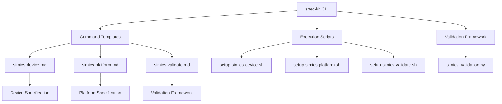
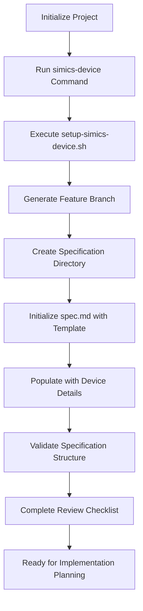

# Tool Overview & Core Value

<cite>
**Referenced Files in This Document**   
- [README.md](file://README.md)
- [spec-driven.md](file://spec-driven.md)
- [SIMICS_INTEGRATION_PLAN.md](file://SIMICS_INTEGRATION_PLAN.md)
- [templates/commands/simics-device.md](file://templates/commands/simics-device.md)
- [templates/commands/simics-platform.md](file://templates/commands/simics-platform.md)
- [templates/commands/simics-validate.md](file://templates/commands/simics-validate.md)
- [templates/simics/projects/device-spec-template.md](file://templates/simics/projects/device-spec-template.md)
- [templates/simics/projects/platform-spec-template.md](file://templates/simics/projects/platform-spec-template.md)
- [templates/simics/projects/validation-template.md](file://templates/simics/projects/validation-template.md)
- [scripts/bash/setup-simics-device.sh](file://scripts/bash/setup-simics-device.sh)
- [scripts/bash/setup-simics-platform.sh](file://scripts/bash/setup-simics-platform.sh)
- [scripts/bash/setup-simics-validate.sh](file://scripts/bash/setup-simics-validate.sh)
- [src/specify_cli/simics_validation.py](file://src/specify_cli/simics_validation.py)
- [src/specify_cli/__init__.py](file://src/specify_cli/__init__.py)
</cite>

## Table of Contents
1. [Introduction](#introduction)
2. [Architectural Vision](#architectural-vision)
3. [Core Principles of Spec-Driven Development](#core-principles-of-spec-driven-development)
4. [Key Benefits and Features](#key-benefits-and-features)
5. [Workflow Integration](#workflow-integration)
6. [Real-World Use Cases](#real-world-use-cases)
7. [Onboarding and Extensibility](#onboarding-and-extensibility)

## Introduction

The spec-kit CLI tool is a specification-driven development toolkit designed to streamline Intel Simics device and platform modeling workflows. It provides a structured framework for creating comprehensive specifications that serve as executable blueprints for Simics-based simulations. By automating project setup, enforcing standardized templates, and integrating validation capabilities, spec-kit enables developers to focus on high-level design rather than implementation details. The tool extends the core spec-driven development methodology to hardware modeling, providing specialized commands for device specification, platform integration, and validation framework creation.

**Section sources**
- [README.md](file://README.md#L0-L443)
- [spec-driven.md](file://spec-driven.md#L0-L403)

## Architectural Vision

The spec-kit architecture follows a modular design that separates concerns between specification templates, execution scripts, and validation frameworks. The system is built around three primary components: command templates that define the specification workflow, cross-platform scripts that handle project initialization, and validation mechanisms that ensure template integrity. This separation allows for consistent specification generation across different operating systems while maintaining a unified development experience. The architecture extends the existing spec-kit framework by adding Simics-specific templates and commands without modifying the core CLI functionality, ensuring backward compatibility and seamless integration with existing workflows.

**Diagram sources**
- [templates/commands/simics-device.md](file://templates/commands/simics-device.md#L0-L45)
- [templates/commands/simics-platform.md](file://templates/commands/simics-platform.md#L0-L46)
- [templates/commands/simics-validate.md](file://templates/commands/simics-validate.md#L0-L46)
- [scripts/bash/setup-simics-device.sh](file://scripts/bash/setup-simics-device.sh#L0-L201)
- [scripts/bash/setup-simics-platform.sh](file://scripts/bash/setup-simics-platform.sh#L0-L262)
- [scripts/bash/setup-simics-validate.sh](file://scripts/bash/setup-simics-validate.sh#L0-L272)
- [src/specify_cli/simics_validation.py](file://src/specify_cli/simics_validation.py#L0-L431)

**Section sources**
- [SIMICS_INTEGRATION_PLAN.md](file://SIMICS_INTEGRATION_PLAN.md#L0-L386)
- [src/specify_cli/__init__.py](file://src/specify_cli/__init__.py#L0-L799)

## Core Principles of Spec-Driven Development

Spec-driven development in spec-kit emphasizes executable specifications as the primary source of truth, with code serving as a generated implementation rather than the foundation. The methodology enforces a clear separation between what needs to be built and how it should be implemented, ensuring specifications remain technology-agnostic and focused on behavioral requirements. Key principles include intent-driven development, where specifications capture user needs and system behavior; template-driven quality, which uses structured templates to prevent premature implementation details; and continuous refinement, where specifications evolve through iterative validation and feedback. The system incorporates constitutional principles that enforce architectural discipline, including library-first design, test-first implementation, and simplicity over complexity.

**Section sources**
- [spec-driven.md](file://spec-driven.md#L0-L403)
- [templates/simics/projects/device-spec-template.md](file://templates/simics/projects/device-spec-template.md#L0-L230)
- [templates/simics/projects/platform-spec-template.md](file://templates/simics/projects/platform-spec-template.md#L0-L268)
- [templates/simics/projects/validation-template.md](file://templates/simics/projects/validation-template.md#L0-L303)

## Key Benefits and Features

spec-kit provides several key benefits for Simics-based development projects. Standardized templates ensure consistency across device and platform specifications, reducing ambiguity and improving team collaboration. Automated project setup through cross-platform scripts eliminates manual configuration errors and accelerates development initiation. The integrated validation framework verifies template completeness and structural integrity, catching issues early in the development process. The tool supports both bash and PowerShell scripting environments, enabling seamless operation across different operating systems. Specification templates include comprehensive execution flows and review checklists that guide developers through the specification process while ensuring critical aspects are not overlooked. The system's modular design allows for easy extension and customization to meet specific project requirements.

**Section sources**
- [README.md](file://README.md#L0-L443)
- [SIMICS_INTEGRATION_PLAN.md](file://SIMICS_INTEGRATION_PLAN.md#L0-L386)
- [src/specify_cli/simics_validation.py](file://src/specify_cli/simics_validation.py#L0-L431)

## Workflow Integration

The spec-kit workflow integrates seamlessly with the Simics development lifecycle, providing a structured progression from project initialization to validation. The process begins with command execution that triggers script-based project setup, followed by template-driven specification generation. Each command follows a defined execution flow that parses input requirements, extracts system characteristics, and generates comprehensive specifications using predefined templates. The workflow incorporates automatic validation checks at multiple stages, ensuring specifications meet quality criteria before proceeding to implementation. Integration points extend core spec-kit commands to support Simics-specific development patterns, enhancing the `/specify` command for device modeling, the `/plan` command for implementation planning, and the `/tasks` command for validation workflows.

**Diagram sources**
- [templates/commands/simics-device.md](file://templates/commands/simics-device.md#L0-L45)
- [scripts/bash/setup-simics-device.sh](file://scripts/bash/setup-simics-device.sh#L0-L201)
- [templates/simics/projects/device-spec-template.md](file://templates/simics/projects/device-spec-template.md#L0-L230)

**Section sources**
- [SIMICS_INTEGRATION_PLAN.md](file://SIMICS_INTEGRATION_PLAN.md#L0-L386)
- [templates/commands/simics-device.md](file://templates/commands/simics-device.md#L0-L45)

## Real-World Use Cases

In practice, spec-kit enables developers to rapidly create comprehensive specifications for Simics-based projects. For device modeling, engineers use the `simics-device` command to generate detailed specifications that include register interface definitions, memory requirements, and validation scenarios. Platform architects employ the `simics-platform` command to define system-level integration requirements, component topologies, and timing models. Validation teams utilize the `simics-validate` command to establish comprehensive test frameworks with defined coverage requirements and performance criteria. The tool supports parallel implementation exploration by allowing multiple teams to generate different implementation approaches from the same specification, facilitating comparison of optimization targets such as performance, maintainability, and user experience. Real-world examples include creating UART controller specifications, defining virtual platform architectures for embedded systems, and establishing validation frameworks for processor models.

**Section sources**
- [templates/commands/simics-device.md](file://templates/commands/simics-device.md#L0-L45)
- [templates/commands/simics-platform.md](file://templates/commands/simics-platform.md#L0-L46)
- [templates/commands/simics-validate.md](file://templates/commands/simics-validate.md#L0-L46)
- [templates/simics/projects/device-spec-template.md](file://templates/simics/projects/device-spec-template.md#L0-L230)
- [templates/simics/projects/platform-spec-template.md](file://templates/simics/projects/platform-spec-template.md#L0-L268)
- [templates/simics/projects/validation-template.md](file://templates/simics/projects/validation-template.md#L0-L303)

## Onboarding and Extensibility

spec-kit provides a structured onboarding path for new developers while supporting advanced customization for experienced users. Beginners benefit from comprehensive templates and automated workflows that guide them through the specification process, with clear execution flows and review checklists ensuring critical aspects are addressed. The system's modular design allows experts to extend functionality by creating custom templates, modifying scripts, or adding new validation rules. The separation between templates and execution logic enables organizations to adapt spec-kit to their specific development practices without modifying the core tool. Extensibility features include support for custom command templates, configurable script variants, and pluggable validation mechanisms, allowing teams to tailor the tool to their unique requirements while maintaining consistency across projects.

**Section sources**
- [README.md](file://README.md#L0-L443)
- [spec-driven.md](file://spec-driven.md#L0-L403)
- [SIMICS_INTEGRATION_PLAN.md](file://SIMICS_INTEGRATION_PLAN.md#L0-L386)
- [src/specify_cli/__init__.py](file://src/specify_cli/__init__.py#L0-L799)