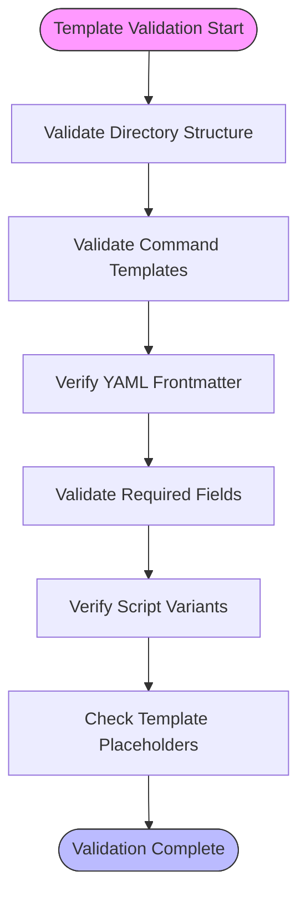
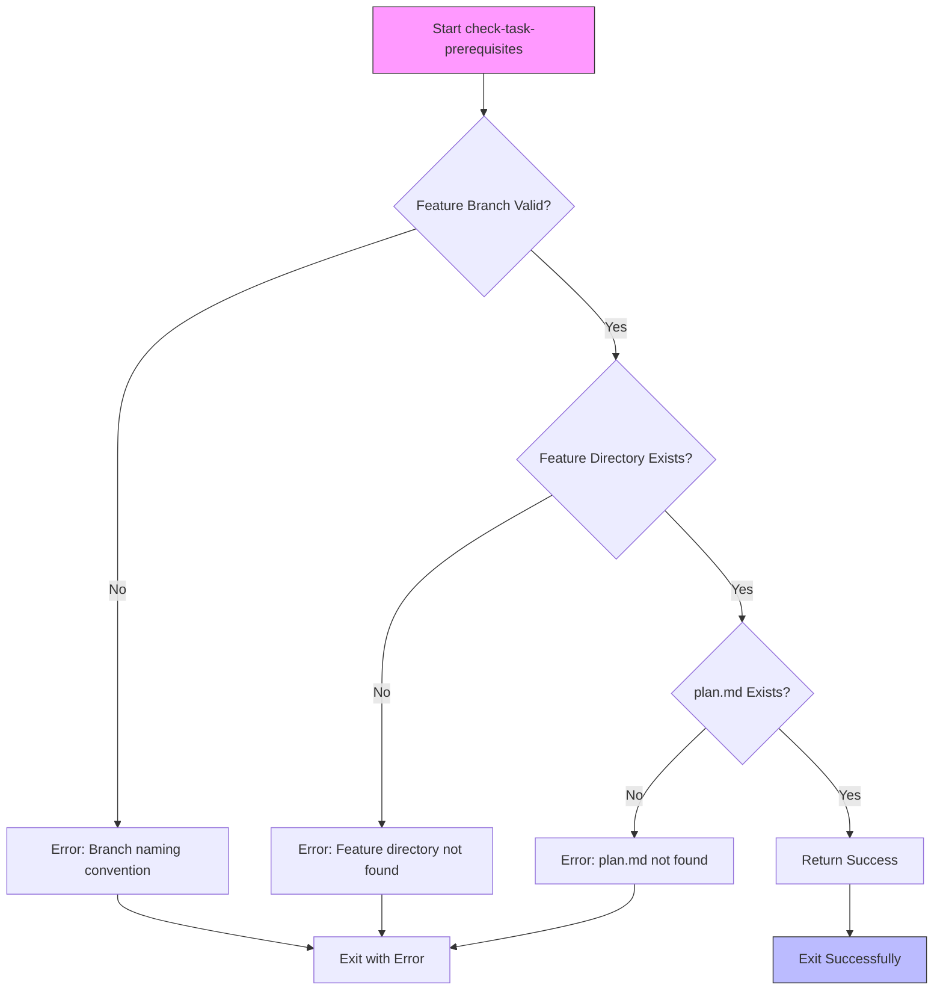
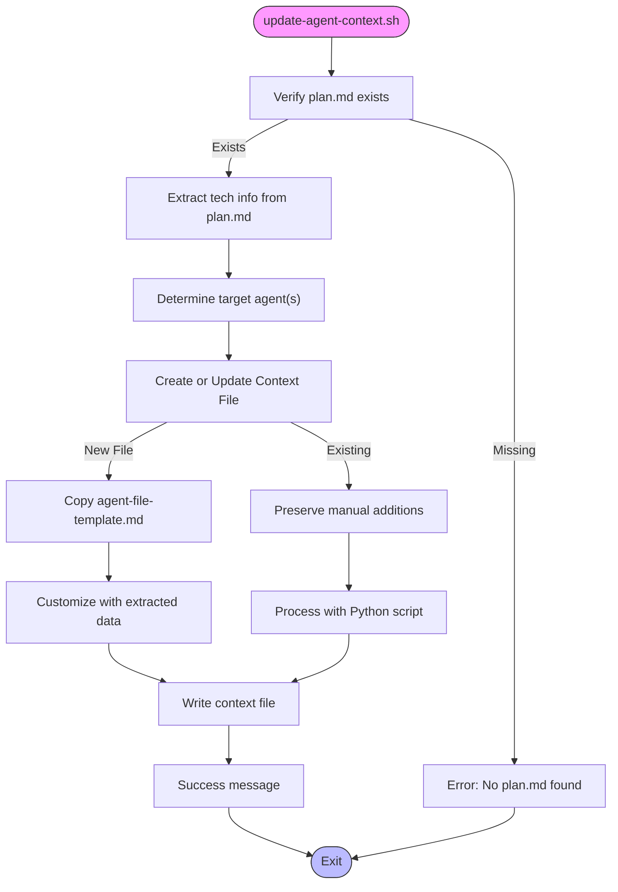

# Troubleshooting Guide

<cite>
**Referenced Files in This Document**   
- [check-task-prerequisites.sh](file://scripts/bash/check-task-prerequisites.sh)
- [update-agent-context.sh](file://scripts/bash/update-agent-context.sh)
- [common.sh](file://scripts/bash/common.sh)
- [simics_validation.py](file://src/specify_cli/simics_validation.py)
- [SUPPORT.md](file://SUPPORT.md)
- [SECURITY.md](file://SECURITY.md)
- [README.md](file://README.md)
</cite>

## Table of Contents
1. [Introduction](#introduction)
2. [Command Execution Failures](#command-execution-failures)
3. [Template Rendering Errors](#template-rendering-errors)
4. [Script Permission Issues](#script-permission-issues)
5. [Validation Timeouts](#validation-timeouts)
6. [Missing Prerequisites in Scripts](#missing-prerequisites-in-scripts)
7. [Agent Context Update Failures](#agent-context-update-failures)
8. [Interpreting Error Messages](#interpreting-error-messages)
9. [Security Concerns](#security-concerns)
10. [Performance Troubleshooting](#performance-troubleshooting)
11. [Support and Reporting](#support-and-reporting)

## Introduction
This guide provides systematic methodologies for diagnosing and resolving common issues encountered when using spec-kit. It covers error categories such as command execution failures, template rendering errors, script permission issues, and validation timeouts. The document includes specific solutions for known issues documented in the codebase, explains how to interpret error messages from both Python and shell layers, and addresses security-related concerns.

## Command Execution Failures
Command execution failures typically occur due to missing dependencies, incorrect environment setup, or invalid command syntax. Common symptoms include exit codes, missing command errors, or unexpected behavior during script execution.

To diagnose command execution issues:
1. Verify that all prerequisites are installed using `specify check`
2. Ensure the correct script variant (bash/PowerShell) is being used for your platform
3. Check that the working directory is correct when executing commands
4. Validate that required environment variables are properly set

The `check-task-prerequisites.sh` script implements validation for feature branches and required files, exiting with appropriate error messages when prerequisites are not met.

**Section sources**
- [check-task-prerequisites.sh](file://scripts/bash/check-task-prerequisites.sh#L0-L15)
- [common.sh](file://scripts/bash/common.sh#L0-L37)

## Template Rendering Errors
Template rendering errors occur when the system fails to properly process or generate content from templates. These issues commonly manifest when:
- YAML frontmatter is missing or malformed in command templates
- Required placeholders like `{SCRIPT}` or `{ARGS}` are absent
- Script variants (bash/PowerShell) are not properly defined in template metadata

The `SimicsTemplateValidator` class in `simics_validation.py` contains specific validation rules for template structure, including checks for required directories, command templates, and proper YAML frontmatter with essential fields like 'description' and 'scripts'.

**Diagram sources**
- [simics_validation.py](file://src/specify_cli/simics_validation.py#L100-L138)

**Section sources**
- [simics_validation.py](file://src/specify_cli/simics_validation.py#L75-L195)

## Script Permission Issues
Script permission issues commonly occur on Unix-like systems when executable permissions are not properly set. Symptoms include "Permission denied" errors when attempting to execute scripts.

To resolve script permission issues:
1. Ensure scripts have proper execute permissions: `chmod +x script_name.sh`
2. Verify the shebang line is present and correct (e.g., `#!/usr/bin/env bash`)
3. Check that the script is being executed with appropriate privileges

The validation framework checks for proper shebangs in bash scripts and reports warnings when they are missing, helping to prevent execution issues.

**Section sources**
- [simics_validation.py](file://src/specify_cli/simics_validation.py#L151-L154)
- [check-task-prerequisites.sh](file://scripts/bash/check-task-prerequisites.sh#L0-L15)

## Validation Timeouts
Validation timeouts occur when operations exceed their allotted time limits, particularly during script testing. The `SimicsScriptTester` class implements a 30-second timeout for script execution tests, which may be insufficient for complex operations.

To address validation timeouts:
1. Optimize scripts to complete within the timeout window
2. Consider increasing the timeout value in the testing framework for specific use cases
3. Ensure system resources are adequate for the validation tasks

The framework captures timeout exceptions and reports them as test failures, providing clear diagnostic information.

**Section sources**
- [simics_validation.py](file://src/specify_cli/simics_validation.py#L357-L365)

## Missing Prerequisites in Scripts
Missing prerequisites in scripts, particularly in `check-task-prerequisites.sh`, can prevent proper workflow execution. The script validates several requirements:
- Feature branches must follow the naming convention `001-feature-name`
- Required feature directories must exist
- Essential files like `plan.md` must be present

When prerequisites are missing, the script provides specific error messages indicating what is missing and how to resolve it (e.g., "Run /plan first" when `plan.md` is missing).

**Diagram sources**
- [check-task-prerequisites.sh](file://scripts/bash/check-task-prerequisites.sh#L0-L15)
- [common.sh](file://scripts/bash/common.sh#L10-L17)

**Section sources**
- [check-task-prerequisites.sh](file://scripts/bash/check-task-prerequisites.sh#L0-L15)

## Agent Context Update Failures
Agent context update failures occur in the `update-agent-context.sh` script when:
- `plan.md` is missing from the feature directory
- Template files are not found
- Python processing fails during context file updates
- Invalid agent types are specified

The script extracts technology information from `plan.md` (language, framework, storage) and updates agent-specific context files (CLAUDE.md, GEMINI.md, etc.) accordingly. It handles both creation of new context files and updating existing ones while preserving manual additions.

Common failure points include:
- Missing `plan.md` file (script exits immediately)
- Template file not found during creation of new context files
- Invalid agent type parameter
- Python script execution errors during content modification

**Diagram sources**
- [update-agent-context.sh](file://scripts/bash/update-agent-context.sh#L0-L68)
- [agent-file-template.md](file://templates/agent-file-template.md)

**Section sources**
- [update-agent-context.sh](file://scripts/bash/update-agent-context.sh#L0-L68)

## Interpreting Error Messages
Understanding error messages from both Python and shell layers is crucial for effective troubleshooting:

### Shell Layer Errors
- "ERROR: Not on a feature branch" - Branch name doesn't follow `001-feature-name` pattern
- "Feature directory not found" - Missing feature directory in `specs/` folder
- "plan.md not found" - Implementation plan not generated yet
- "Unknown agent type" - Invalid parameter passed to `update-agent-context.sh`

### Python Layer Errors
- "Missing required directory" - Expected directory structure not present
- "Missing command template" - Required template file is absent
- "Malformed YAML frontmatter" - Invalid template metadata format
- "Invalid JSON output" - Script failed to produce valid JSON when requested

The validation framework categorizes issues as errors (blocking issues) or warnings (non-blocking recommendations), helping users prioritize fixes.

**Section sources**
- [simics_validation.py](file://src/specify_cli/simics_validation.py#L0-L431)
- [check-task-prerequisites.sh](file://scripts/bash/check-task-prerequisites.sh#L0-L15)

## Security Concerns
Security concerns in spec-kit primarily involve secure script execution and certificate validation:

### Certificate Validation (Truststore)
The `--skip-tls` flag in `specify init` allows skipping SSL/TLS verification, but this is not recommended for production use. The system relies on the underlying platform's truststore for certificate validation during repository operations and external resource access.

### Secure Script Execution
Scripts should be reviewed before execution, especially when obtained from external sources. The framework uses shebangs and explicit interpreter calls to ensure scripts run in the intended environment.

### Input Validation
Scripts perform validation of input parameters and file existence before processing, reducing the risk of path traversal or injection attacks.

**Section sources**
- [README.md](file://README.md#L250-L255)
- [SECURITY.md](file://SECURITY.md#L0-L30)

## Performance Troubleshooting
Performance issues may manifest as slow command execution or high memory usage. Strategies for addressing these include:

### Slow Command Execution
1. Check system resources (CPU, memory, disk I/O)
2. Verify network connectivity for operations requiring external resources
3. Profile script execution to identify bottlenecks
4. Consider parallel execution of independent tasks

### High Memory Usage
1. Monitor memory consumption during operations
2. Check for memory leaks in long-running processes
3. Optimize data structures and algorithms in scripts
4. Implement proper resource cleanup

The validation framework is designed to be memory-efficient by processing files incrementally rather than loading large datasets into memory.

**Section sources**
- [README.md](file://README.md#L250-L255)
- [simics_validation.py](file://src/specify_cli/simics_validation.py#L0-L431)

## Support and Reporting
For assistance with spec-kit, follow these support pathways:

### Getting Help
- Open a [GitHub issue](https://github.com/github/spec-kit/issues/new) for bug reports, feature requests, or questions
- Consult the [comprehensive guide](./spec-driven.md) for detailed documentation
- Review the [README](./README.md) for getting started instructions and troubleshooting tips

### Reporting Security Issues
**Do not report security vulnerabilities through public GitHub issues, discussions, or pull requests.**

Instead:
1. Email opensource-security[@]github.com
2. Include detailed information about the issue:
   - Type of issue (e.g., buffer overflow, SQL injection)
   - Full paths of affected source files
   - Location of affected code (tag/branch/commit)
   - Special configuration requirements
   - Step-by-step reproduction instructions
   - Proof-of-concept or exploit code (if possible)
   - Impact assessment

The project is under active development and maintained by GitHub staff and the community, with efforts to respond to support requests in a timely manner.

**Section sources**
- [SUPPORT.md](file://SUPPORT.md#L0-L19)
- [SECURITY.md](file://SECURITY.md#L0-L30)