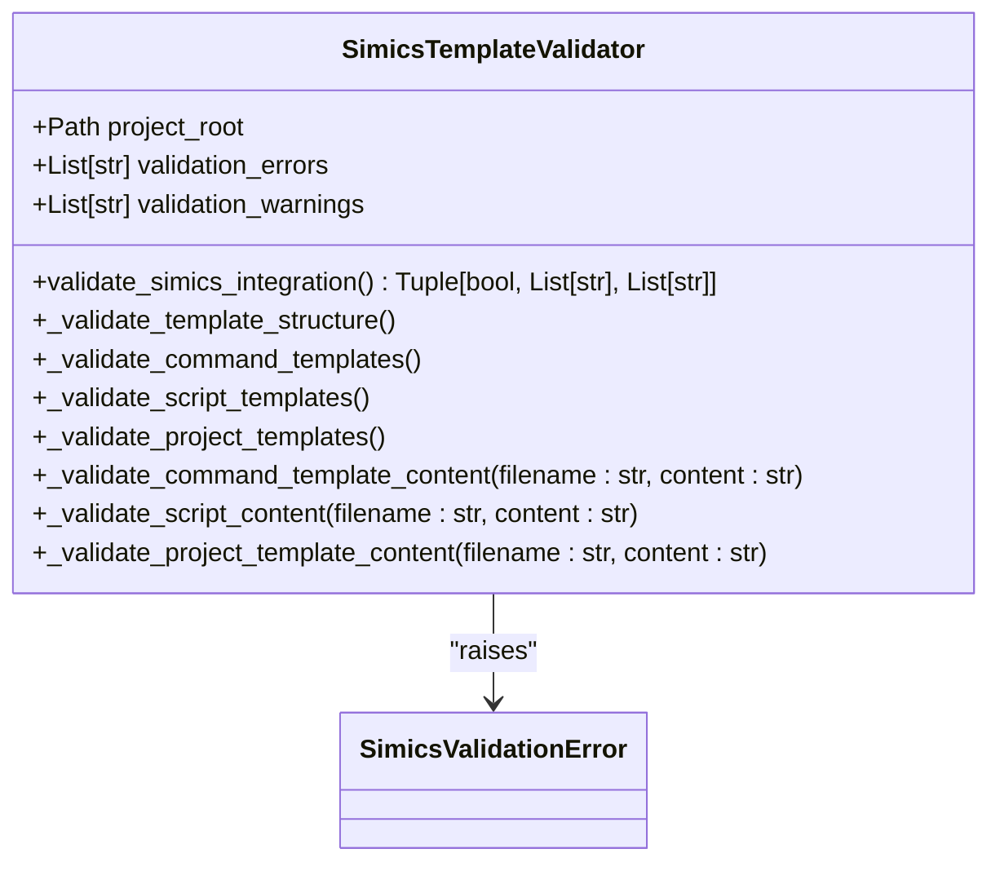
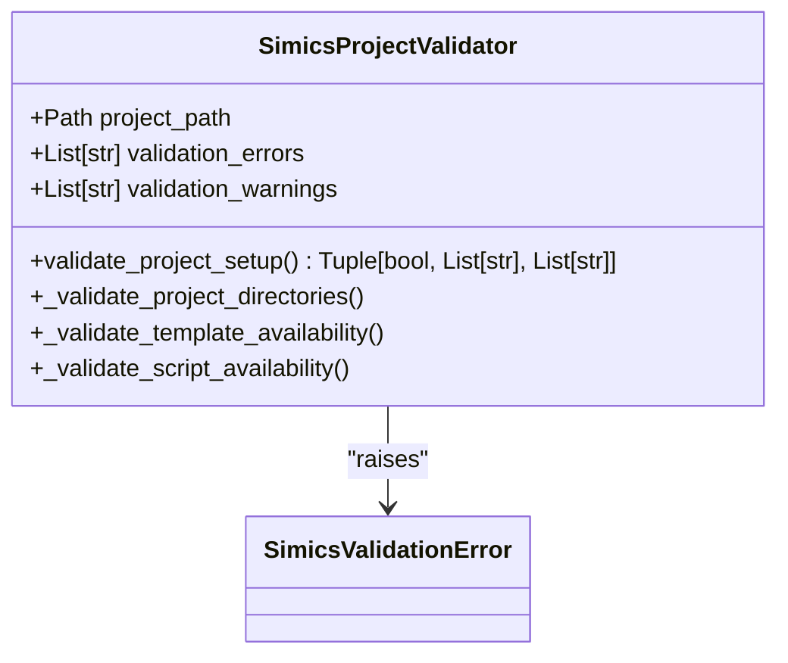
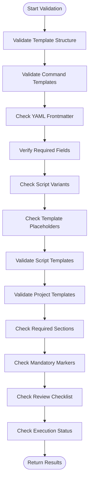
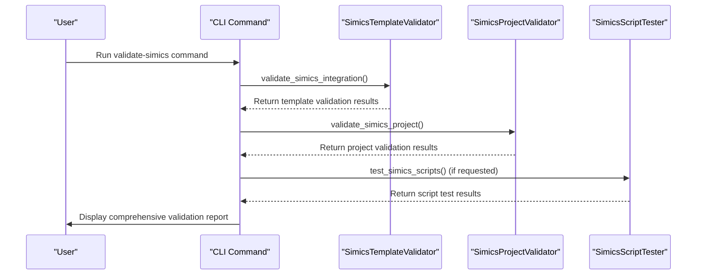

# Core Validation Logic

<cite>
**Referenced Files in This Document**   
- [simics_validation.py](file://src/specify_cli/simics_validation.py)
- [device-spec-template.md](file://templates/simics/projects/device-spec-template.md)
- [simics-device.md](file://templates/commands/simics-device.md)
- [setup-simics-device.sh](file://scripts/bash/setup-simics-device.sh)
</cite>

## Table of Contents
1. [Introduction](#introduction)
2. [Core Validation Components](#core-validation-components)
3. [SimicsTemplateValidator Implementation](#simicstemplatevalidator-implementation)
4. [SimicsProjectValidator Implementation](#simicsprojectvalidator-implementation)
5. [Validation Error Handling](#validation-error-handling)
6. [Domain Model of Validation Results](#domain-model-of-validation-results)
7. [Template Content Validation Workflow](#template-content-validation-workflow)
8. [Integration with Template System and CLI](#integration-with-template-system-and-cli)
9. [Common Validation Issues and Solutions](#common-validation-issues-and-solutions)
10. [Best Practices for Extending Validators](#best-practices-for-extending-validators)

## Introduction
The core validation logic in the spec-kit system ensures the integrity and correctness of Simics integration templates and projects. This documentation provides a comprehensive analysis of the validation framework, focusing on the SimicsTemplateValidator and SimicsProjectValidator classes that enforce structural and content requirements across the system. The validation system plays a critical role in maintaining consistency between templates, scripts, and project configurations, ensuring that all components adhere to the expected standards before deployment. By validating both the template structure and project setup, the system prevents common integration issues and enforces best practices in Simics development workflows.

## Core Validation Components
The validation framework consists of two primary validator classes that work in tandem to ensure system integrity. The SimicsTemplateValidator focuses on validating the template structure and content, ensuring that all required directories, command templates, script templates, and project structure templates are present and correctly formatted. This validator operates at the repository level, checking the integrity of the template system itself. The SimicsProjectValidator complements this by validating individual project setups, ensuring that projects created with the spec-kit have the necessary directory structure, templates, and scripts available. Together, these validators form a comprehensive validation system that checks both the template foundation and the instantiated projects. The framework also includes error handling through the SimicsValidationError exception and integrates with the CLI to provide actionable feedback during the validation process.

**Section sources**
- [simics_validation.py](file://src/specify_cli/simics_validation.py#L9-L11)
- [simics_validation.py](file://src/specify_cli/simics_validation.py#L14-L290)

## SimicsTemplateValidator Implementation
The SimicsTemplateValidator class is responsible for validating the complete Simics integration setup within a project. It performs four main validation tasks: template structure validation, command template validation, script template validation, and project structure template validation. The template structure validation ensures that required directories such as "templates/simics", "templates/simics/projects", "templates/simics/commands", and "templates/simics/examples" exist and are properly configured. Command template validation checks for the presence of essential command files like "simics-device.md", "simics-platform.md", and "simics-validate.md", while also validating their content structure, including YAML frontmatter, required fields, and script variants. Script template validation verifies that both bash and PowerShell script variants exist for setup operations, checking for proper shebangs, main functions, JSON output support, and error handling mechanisms. Project structure template validation ensures that key project templates such as "device-spec-template.md", "platform-spec-template.md", and "validation-template.md" are present and contain required sections like execution flow, review checklists, and execution status.

**Diagram sources **
- [simics_validation.py](file://src/specify_cli/simics_validation.py#L14-L208)

**Section sources**
- [simics_validation.py](file://src/specify_cli/simics_validation.py#L14-L208)

## SimicsProjectValidator Implementation
The SimicsProjectValidator class focuses on validating individual Simics projects created with the spec-kit system. It performs three main validation tasks: project directory structure validation, template availability validation, and script availability validation. The project directory structure validation ensures that required directories such as ".specify", ".specify/templates", ".specify/templates/simics", and ".specify/scripts" exist within the project. Template availability validation checks that the Simics templates are properly copied to the project's ".specify/templates/simics" directory and verifies the presence of key template files including "projects/device-spec-template.md", "projects/platform-spec-template.md", and "projects/validation-template.md". Script availability validation confirms that either bash or PowerShell scripts are available in the project's ".specify/scripts" directory, specifically checking for setup scripts that begin with "setup-simics-". This validator is particularly important for ensuring that projects maintain the necessary structure and resources after being created from templates, preventing issues that could arise from incomplete or corrupted project setups.

**Diagram sources **
- [simics_validation.py](file://src/specify_cli/simics_validation.py#L211-L290)

**Section sources**
- [simics_validation.py](file://src/specify_cli/simics_validation.py#L211-L290)

## Validation Error Handling
The validation framework implements a comprehensive error handling system through the SimicsValidationError exception and structured error reporting. When validation issues are detected, they are categorized as either errors or warnings, with errors indicating critical issues that prevent successful validation and warnings indicating potential problems that don't block validation. The SimicsValidationError exception is raised when validation fails, providing a clear indication of validation failure that can be caught and handled by higher-level components. Each validator maintains separate lists for validation errors and warnings, allowing for detailed reporting of issues. The validation results are returned as tuples containing a boolean success indicator, a list of error messages, and a list of warning messages, enabling consumers to understand both the overall validation outcome and the specific issues encountered. This structured approach to error handling ensures that users receive actionable feedback about validation problems, making it easier to identify and resolve issues in their templates or projects.

**Section sources**
- [simics_validation.py](file://src/specify_cli/simics_validation.py#L9-L11)
- [simics_validation.py](file://src/specify_cli/simics_validation.py#L22-L39)

## Domain Model of Validation Results
The validation system employs a well-defined domain model for representing validation results, with both validators following a consistent pattern for result aggregation and reporting. Each validator maintains internal lists of validation errors and warnings that are cleared at the beginning of each validation run. As validation proceeds, specific issues are appended to these lists with descriptive messages that identify the nature and location of the problem. The validation process returns a tuple containing a boolean indicating overall success (true if no errors), the list of error messages, and the list of warning messages. This domain model enables comprehensive reporting of validation outcomes, allowing consumers to understand not just whether validation passed or failed, but also the specific issues that were identified. The separation between errors and warnings provides a nuanced view of validation results, distinguishing between critical blocking issues and potential areas for improvement. This approach supports both automated processing of validation results and human-readable reporting in the CLI.

**Section sources**
- [simics_validation.py](file://src/specify_cli/simics_validation.py#L22-L39)
- [simics_validation.py](file://src/specify_cli/simics_validation.py#L219-L233)

## Template Content Validation Workflow
The template content validation workflow follows a systematic process to ensure the integrity of Simics integration templates. When validating command templates, the system first checks for the presence of YAML frontmatter demarcated by "---" lines, then parses the frontmatter to verify required fields such as "description" and "scripts". It specifically checks for both bash ("sh:") and PowerShell ("ps:") script variants in the frontmatter, ensuring cross-platform compatibility. The template body is then examined for required placeholders like "{SCRIPT}" and "{ARGS}" that are essential for template functionality. For project templates, the validation workflow checks for the presence of key sections including "Execution Flow", "Review & Acceptance Checklist", and "Execution Status", while also looking for mandatory section markers indicated by "*(mandatory)*". This multi-layered validation approach ensures that templates not only exist but also contain the necessary structural elements and content to function correctly in the Simics integration workflow.

**Diagram sources **
- [simics_validation.py](file://src/specify_cli/simics_validation.py#L57-L77)
- [simics_validation.py](file://src/specify_cli/simics_validation.py#L79-L116)
- [simics_validation.py](file://src/specify_cli/simics_validation.py#L170-L190)
- [simics_validation.py](file://src/specify_cli/simics_validation.py#L192-L208)

**Section sources**
- [simics_validation.py](file://src/specify_cli/simics_validation.py#L57-L208)

## Integration with Template System and CLI
The validation system is tightly integrated with both the template system and the CLI, forming a cohesive workflow for Simics integration. The SimicsTemplateValidator and SimicsProjectValidator are invoked through CLI commands, specifically the "validate-simics" command, which orchestrates the validation process and presents results to users. The validation framework works in conjunction with template files such as "device-spec-template.md" and command templates like "simics-device.md", ensuring that these templates adhere to the required structure and content guidelines. When a user runs the validation command, the system first validates the template integration, then checks the project setup if applicable, and optionally tests script execution. The results are aggregated and presented through the CLI with clear success or failure indicators, detailed error messages, and suggestions for resolution. This integration ensures that validation is an integral part of the development workflow, providing immediate feedback on template and project integrity.

**Diagram sources **
- [simics_validation.py](file://src/specify_cli/simics_validation.py#L396-L431)
- [__init__.py](file://src/specify_cli/__init__.py#L1364-L1488)

**Section sources**
- [simics_validation.py](file://src/specify_cli/simics_validation.py#L396-L431)
- [__init__.py](file://src/specify_cli/__init__.py#L1364-L1488)

## Common Validation Issues and Solutions
The validation system addresses several common issues that arise in Simics integration projects. One frequent issue is malformed template syntax, such as missing or improperly formatted YAML frontmatter in command templates. The validator detects these issues by checking for the presence of "---" delimiters and properly structured YAML content, providing specific error messages to guide correction. Another common issue is missing required sections in project templates, such as the absence of "Review & Acceptance Checklist" or "Execution Status" sections. The validator identifies these missing sections and reports them as validation errors. Missing required directories or files is another frequent problem, which the validators detect by checking for the presence of essential directories like "templates/simics" and key template files. For script templates, common issues include missing shebangs, absence of main functions, lack of JSON output support, and inadequate error handling, all of which are detected and reported by the validation system. The solutions involve following the template structure guidelines, ensuring all required sections are present, and maintaining proper script formatting and functionality.

**Section sources**
- [simics_validation.py](file://src/specify_cli/simics_validation.py#L41-L55)
- [simics_validation.py](file://src/specify_cli/simics_validation.py#L152-L168)
- [device-spec-template.md](file://templates/simics/projects/device-spec-template.md#L1-L230)

## Best Practices for Extending Validators
When extending the validator with custom rules, several best practices should be followed to maintain system integrity and usability. First, new validation rules should be added as separate methods to maintain code organization and readability, following the existing pattern of private validation methods. Each new rule should provide clear, descriptive error messages that help users understand and resolve issues. Validation rules should be designed to be non-blocking when possible, using warnings for issues that don't prevent functionality but represent potential improvements. When adding validation for new template types or project configurations, the rules should be consistent with existing validation patterns and integrate seamlessly with the error aggregation system. Custom validators should inherit from the base validator classes when appropriate, leveraging existing functionality while adding specialized checks. Finally, comprehensive testing should be implemented for new validation rules to ensure they function correctly across various scenarios and edge cases.

**Section sources**
- [simics_validation.py](file://src/specify_cli/simics_validation.py#L14-L290)