# End-to-End Testing

<cite>
**Referenced Files in This Document**   
- [test_simics_e2e.py](file://tests/test_simics_e2e.py)
- [test_config.py](file://tests/test_config.py)
- [simics_validation.py](file://src/specify_cli/simics_validation.py)
- [run_simics_tests.py](file://run_simics_tests.py)
- [verify_simics_integration.py](file://verify_simics_integration.py)
</cite>

## Table of Contents
1. [Introduction](#introduction)
2. [Project Structure](#project-structure)
3. [Core Components](#core-components)
4. [Architecture Overview](#architecture-overview)
5. [Detailed Component Analysis](#detailed-component-analysis)
6. [Dependency Analysis](#dependency-analysis)
7. [Performance Considerations](#performance-considerations)
8. [Troubleshooting Guide](#troubleshooting-guide)
9. [Conclusion](#conclusion)

## Introduction
This document provides comprehensive documentation for the end-to-end testing framework in the spec-kit repository, focusing on the validation of Simics integration workflows. The testing framework ensures complete workflow validation from project initialization to final verification, covering environment setup, command execution, and result verification. The end-to-end tests validate system behavior across multiple components, distinguishing them from integration tests by testing the complete specification-to-validation pipeline. This documentation explains the orchestration of test workflows, common issues, and best practices for maintaining reliable tests in CI/CD pipelines.

## Project Structure
The project structure is organized to support comprehensive end-to-end testing of Simics integration workflows. The tests directory contains specialized test files for Simics functionality, while supporting utilities and configuration are distributed across the codebase.

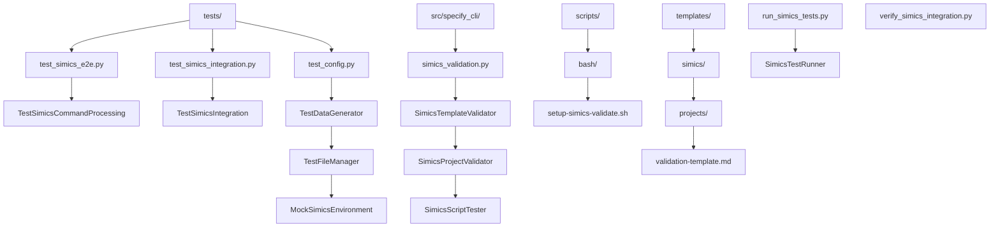

**Diagram sources**
- [test_simics_e2e.py](file://tests/test_simics_e2e.py)
- [test_config.py](file://tests/test_config.py)
- [simics_validation.py](file://src/specify_cli/simics_validation.py)
- [run_simics_tests.py](file://run_simics_tests.py)

**Section sources**
- [test_simics_e2e.py](file://tests/test_simics_e2e.py)
- [test_config.py](file://tests/test_config.py)

## Core Components
The end-to-end testing framework consists of several core components that work together to validate the complete Simics integration workflow. The TestSimicsCommandProcessing class orchestrates the validation of command processing, template generation, and result verification. Supporting components include TestDataGenerator for creating test specifications, TestFileManager for managing test project structures, and MockSimicsEnvironment for simulating the Simics environment. The framework validates the complete pipeline from specification processing to file generation and validation.

**Section sources**
- [test_simics_e2e.py](file://tests/test_simics_e2e.py#L10-L308)
- [test_config.py](file://tests/test_config.py#L59-L278)

## Architecture Overview
The end-to-end testing architecture follows a comprehensive workflow that validates the complete Simics integration process. The framework begins with environment setup, processes specifications through the CLI application, generates expected files, and verifies the results. The architecture includes specialized validators for templates, projects, and scripts, ensuring all components of the Simics integration work correctly.

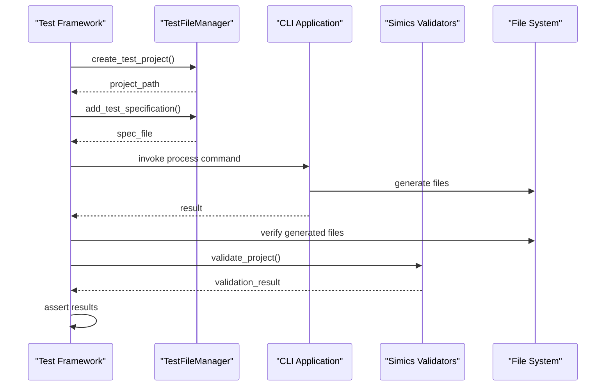

**Diagram sources**
- [test_simics_e2e.py](file://tests/test_simics_e2e.py#L18-L25)
- [test_config.py](file://tests/test_config.py#L180-L234)
- [simics_validation.py](file://src/specify_cli/simics_validation.py#L14-L393)

## Detailed Component Analysis

### Test Orchestration Analysis
The TestSimicsCommandProcessing class orchestrates end-to-end testing of Simics command processing and template generation. It validates the complete workflow from project initialization to final verification, ensuring that specifications are correctly processed and appropriate files are generated.

#### Test Setup and Teardown
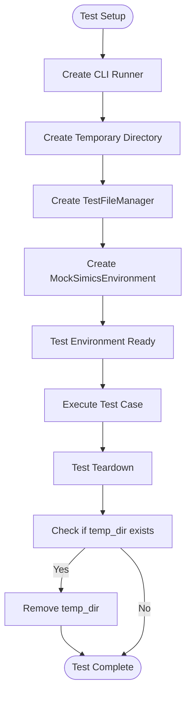

**Diagram sources**
- [test_simics_e2e.py](file://tests/test_simics_e2e.py#L18-L25)
- [test_simics_e2e.py](file://tests/test_simics_e2e.py#L25-L28)

**Section sources**
- [test_simics_e2e.py](file://tests/test_simics_e2e.py#L18-L28)

### Command Processing Analysis
The framework validates processing of various Simics commands, including device, platform, and validation commands. Each test case verifies that specifications are correctly processed and appropriate files are generated according to the command type.

#### Device Command Processing
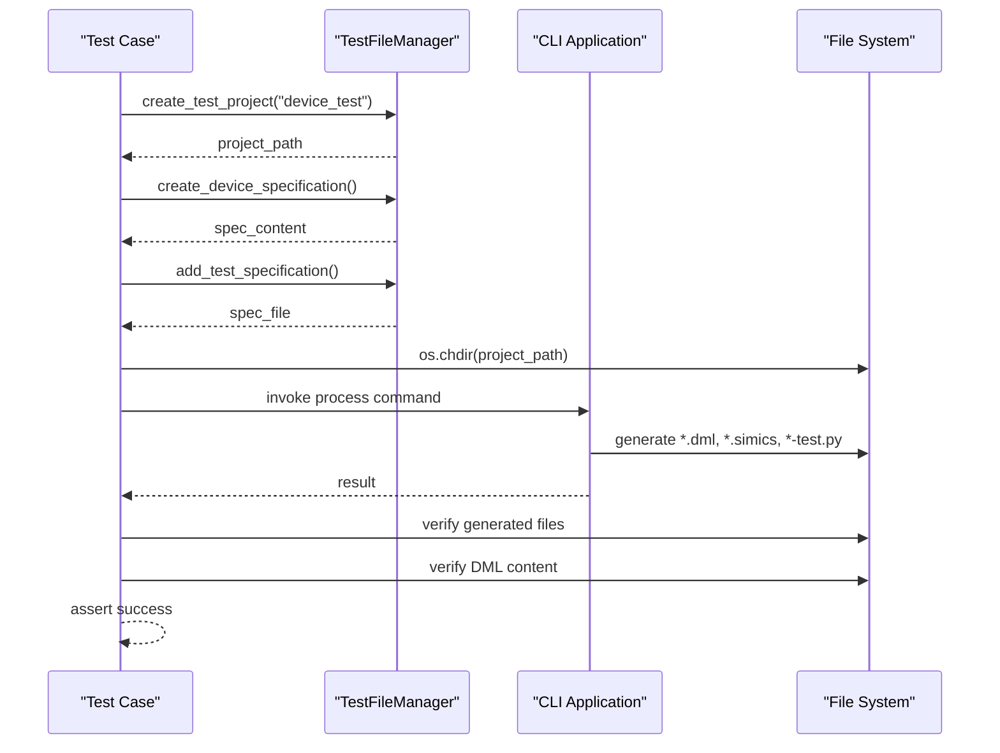

**Diagram sources**
- [test_simics_e2e.py](file://tests/test_simics_e2e.py#L30-L69)
- [test_config.py](file://tests/test_config.py#L59-L88)

**Section sources**
- [test_simics_e2e.py](file://tests/test_simics_e2e.py#L30-L69)

#### Platform Command Processing
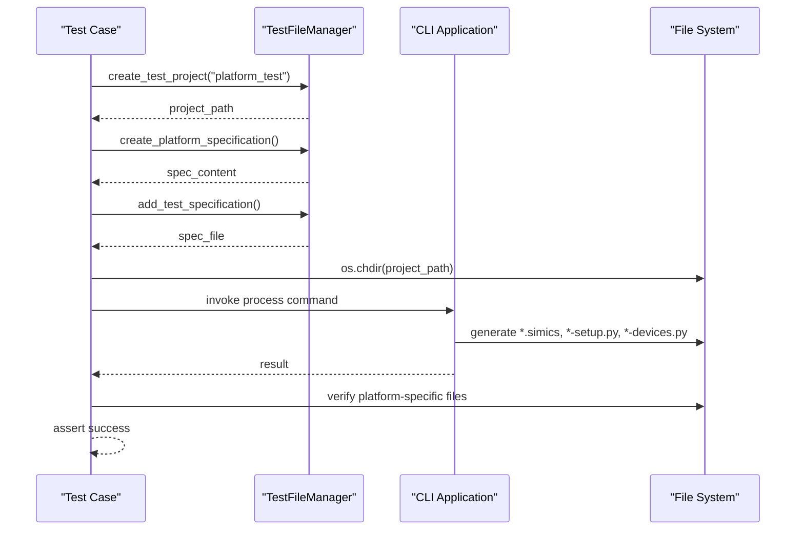

**Diagram sources**
- [test_simics_e2e.py](file://tests/test_simics_e2e.py#L71-L100)
- [test_config.py](file://tests/test_config.py#L89-L118)

**Section sources**
- [test_simics_e2e.py](file://tests/test_simics_e2e.py#L71-L100)

#### Validation Command Processing
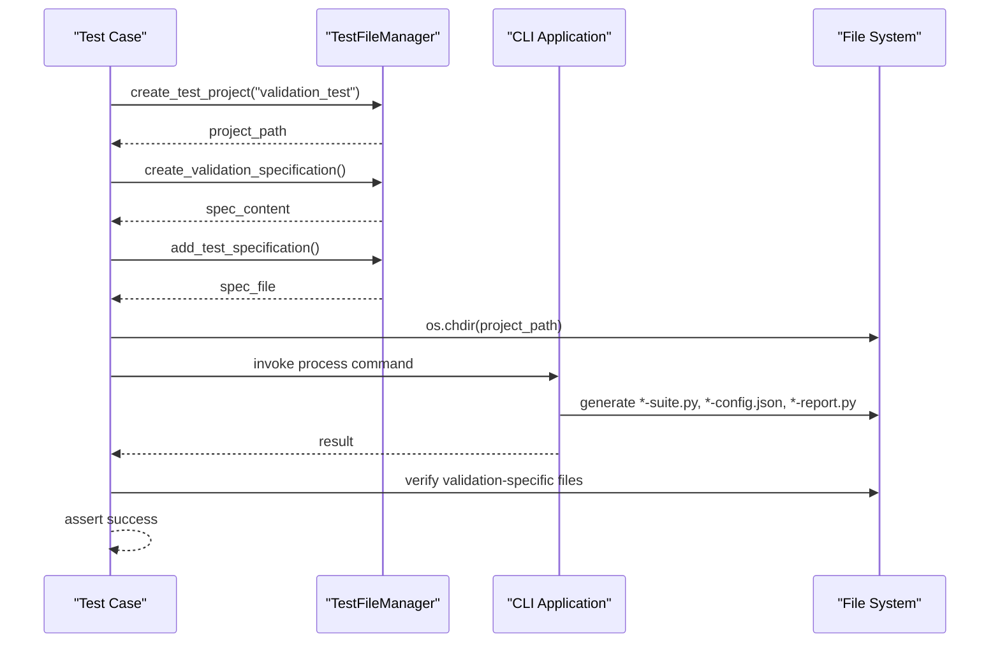

**Diagram sources**
- [test_simics_e2e.py](file://tests/test_simics_e2e.py#L102-L131)
- [test_config.py](file://tests/test_config.py#L119-L148)

**Section sources**
- [test_simics_e2e.py](file://tests/test_simics_e2e.py#L102-L131)

### Multi-Command Workflow Analysis
The framework validates processing of multiple Simics commands within a single specification, ensuring that complex workflows with interdependent components are handled correctly.

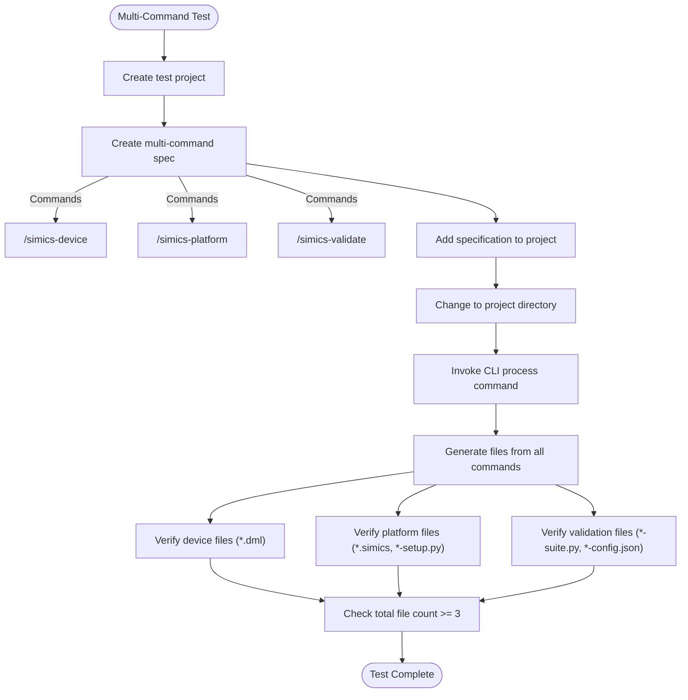

**Diagram sources**
- [test_simics_e2e.py](file://tests/test_simics_e2e.py#L133-L181)

**Section sources**
- [test_simics_e2e.py](file://tests/test_simics_e2e.py#L133-L181)

### Parameter Parsing Analysis
The framework validates the parsing of complex command parameters, ensuring that all specified options are correctly processed and reflected in the generated output.

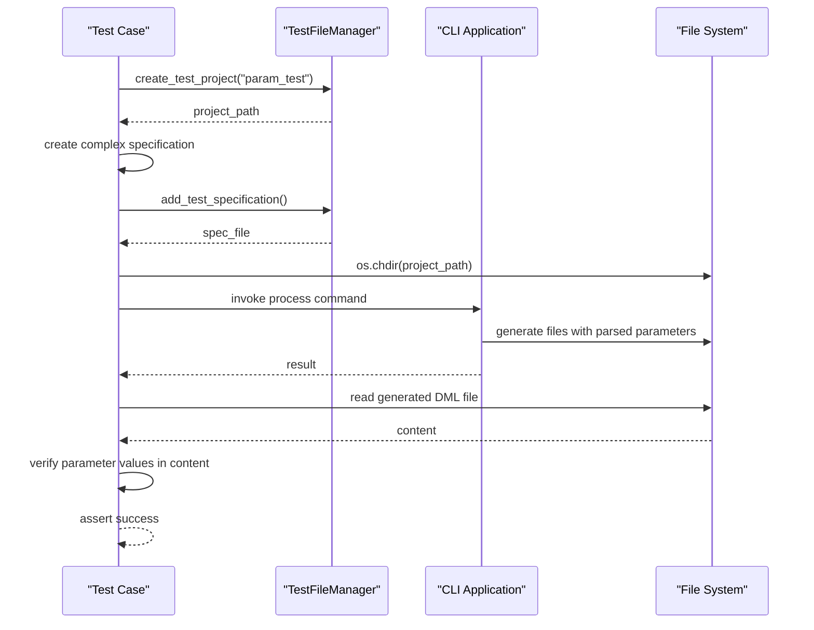

**Diagram sources**
- [test_simics_e2e.py](file://tests/test_simics_e2e.py#L183-L218)

**Section sources**
- [test_simics_e2e.py](file://tests/test_simics_e2e.py#L183-L218)

### Error Handling Analysis
The framework validates error handling for invalid commands, ensuring that the system gracefully handles malformed specifications and provides appropriate feedback.

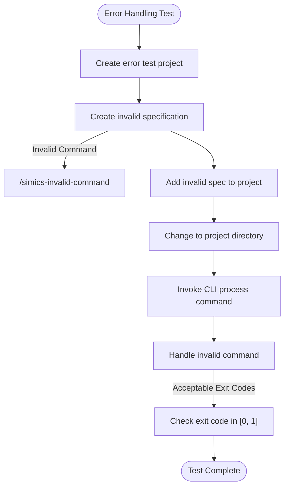

**Diagram sources**
- [test_simics_e2e.py](file://tests/test_simics_e2e.py#L220-L244)

**Section sources**
- [test_simics_e2e.py](file://tests/test_simics_e2e.py#L220-L244)

### Template Customization Analysis
The framework validates template customization and variable substitution, ensuring that template variables are properly handled during specification processing.

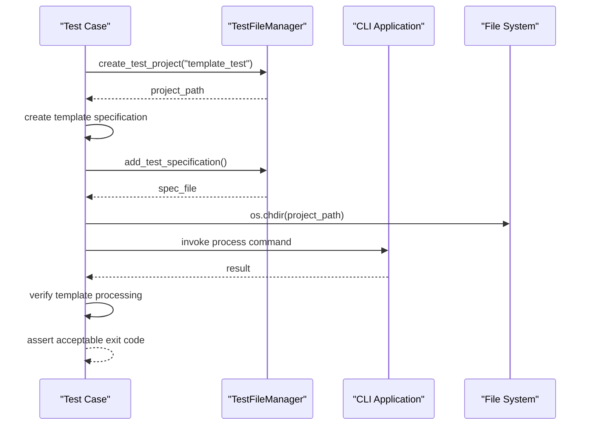

**Diagram sources**
- [test_simics_e2e.py](file://tests/test_simics_e2e.py#L246-L275)

**Section sources**
- [test_simics_e2e.py](file://tests/test_simics_e2e.py#L246-L275)

### Validation Integration Analysis
The framework validates integration between specification processing and project validation, ensuring that generated projects can be successfully validated.

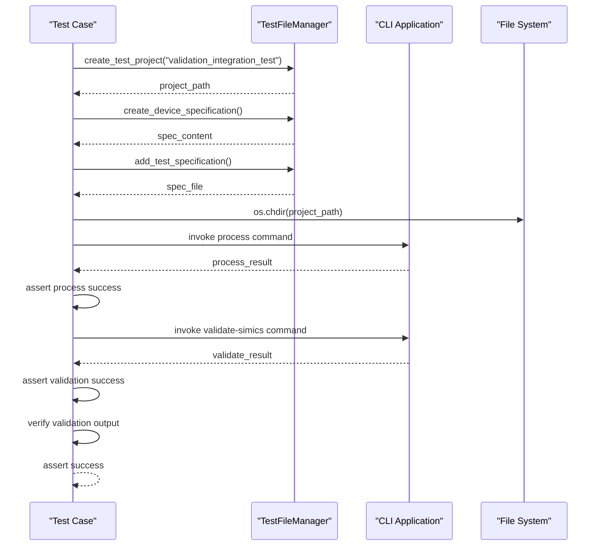

**Diagram sources**
- [test_simics_e2e.py](file://tests/test_simics_e2e.py#L277-L304)

**Section sources**
- [test_simics_e2e.py](file://tests/test_simics_e2e.py#L277-L304)

## Dependency Analysis
The end-to-end testing framework has a well-defined dependency structure that enables comprehensive validation of the Simics integration workflow. The framework depends on several key components that provide essential functionality for test execution and validation.

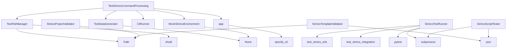

**Diagram sources**
- [test_simics_e2e.py](file://tests/test_simics_e2e.py)
- [test_config.py](file://tests/test_config.py)
- [simics_validation.py](file://src/specify_cli/simics_validation.py)
- [run_simics_tests.py](file://run_simics_tests.py)

**Section sources**
- [test_simics_e2e.py](file://tests/test_simics_e2e.py)
- [test_config.py](file://tests/test_config.py)
- [simics_validation.py](file://src/specify_cli/simics_validation.py)

## Performance Considerations
The end-to-end testing framework is designed to efficiently validate the complete Simics integration workflow while minimizing execution time. The framework uses temporary directories for test isolation, which are automatically cleaned up after each test. The test runner includes timeout protection (5 minutes) to prevent hanging tests in CI/CD environments. For performance-critical scenarios, the framework supports running tests individually to identify bottlenecks. The validation process is optimized to check only essential conditions, avoiding unnecessary file operations or complex computations that could slow down test execution.

## Troubleshooting Guide
When encountering issues with the end-to-end testing framework, consider the following common problems and solutions:

**Section sources**
- [test_simics_e2e.py](file://tests/test_simics_e2e.py)
- [run_simics_tests.py](file://run_simics_tests.py)
- [verify_simics_integration.py](file://verify_simics_integration.py)

### Environment Dependencies
Ensure all required dependencies are installed:
- pytest and pytest-cov for test execution and coverage reporting
- typer for CLI application testing
- pathlib and tempfile for file system operations
- unittest.mock for mocking functionality

Verify the environment using the verify_simics_integration.py script, which checks for the presence of required template and script files.

### Timing Constraints
The framework includes several timing-related considerations:
- Individual script tests have a 30-second timeout
- The overall test suite has a 5-minute timeout
- Long-running operations should be monitored to prevent timeouts in CI/CD pipelines

### Resource Cleanup
The framework automatically handles resource cleanup through the teardown_method, which removes temporary directories after each test. Ensure that no test cases create resources outside the designated temporary directory to prevent resource leaks.

### Common Issues
1. **Missing template files**: Verify that all required template files exist in the templates/ directory
2. **Script execution failures**: Check that scripts have appropriate permissions and required interpreters are available
3. **Validation errors**: Ensure that generated files meet the expected structure and content requirements
4. **Path resolution issues**: Verify that relative paths are correctly resolved in different execution environments

## Conclusion
The end-to-end testing framework provides comprehensive validation of the Simics integration workflow, ensuring that specifications are correctly processed and appropriate files are generated. The framework distinguishes itself from integration tests by validating system behavior across multiple components, from project initialization to final verification. By following the documented best practices and addressing common issues, teams can maintain reliable end-to-end tests in CI/CD pipelines, ensuring the quality and consistency of Simics integration across different environments and use cases.