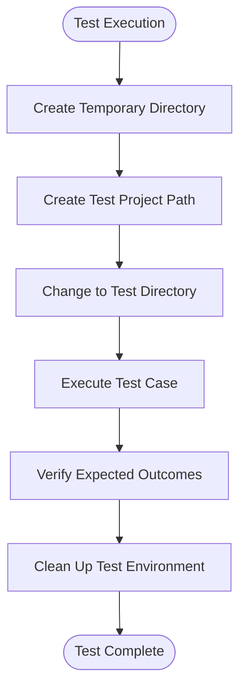
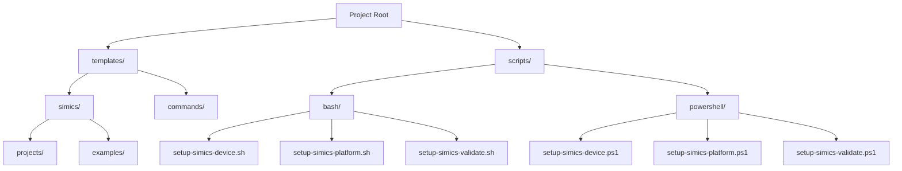
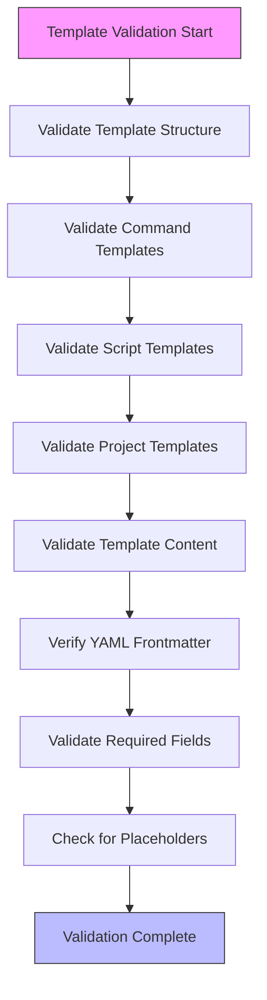
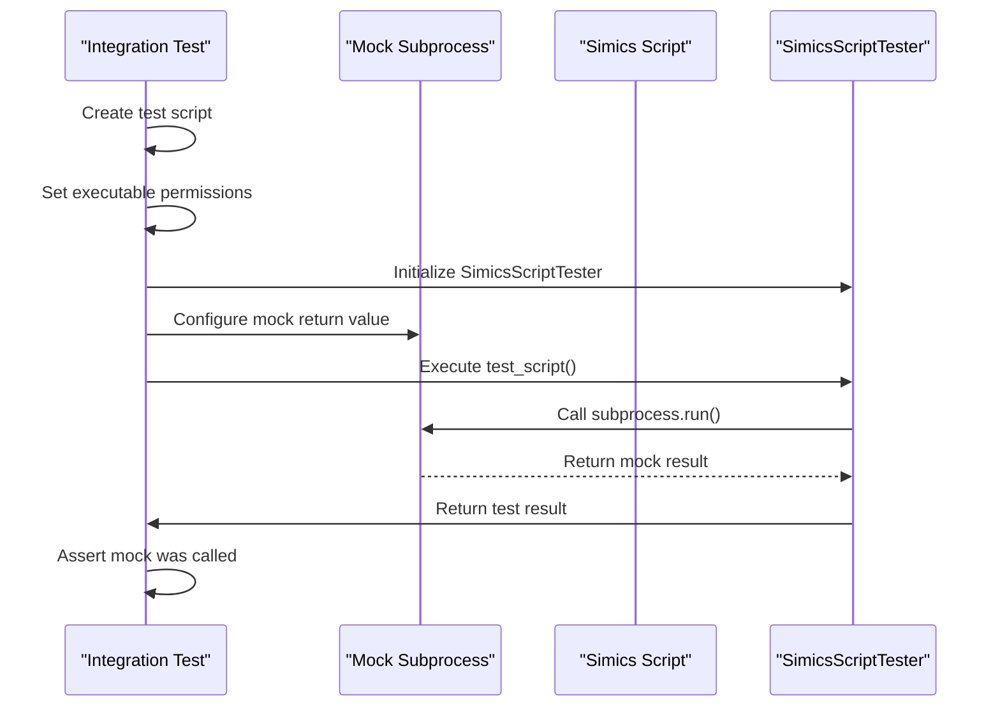
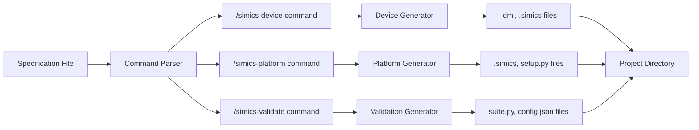
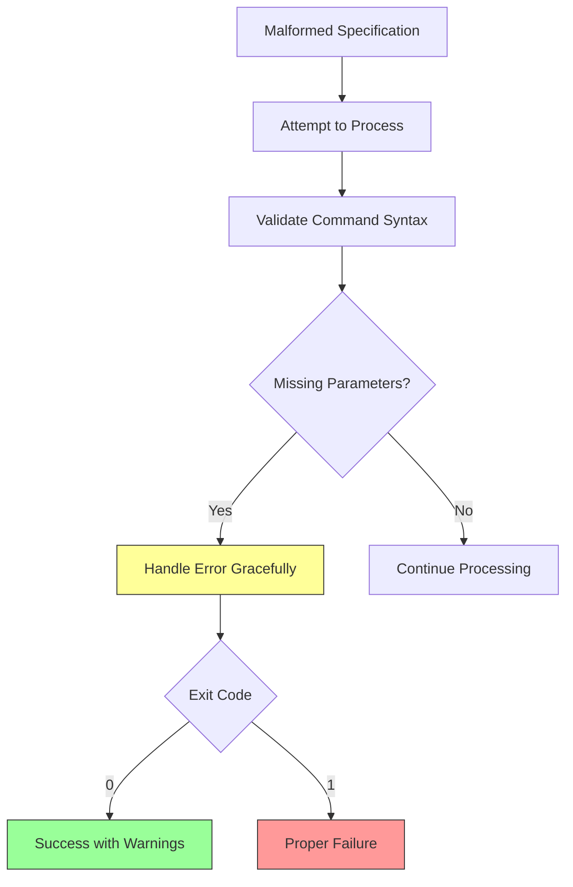
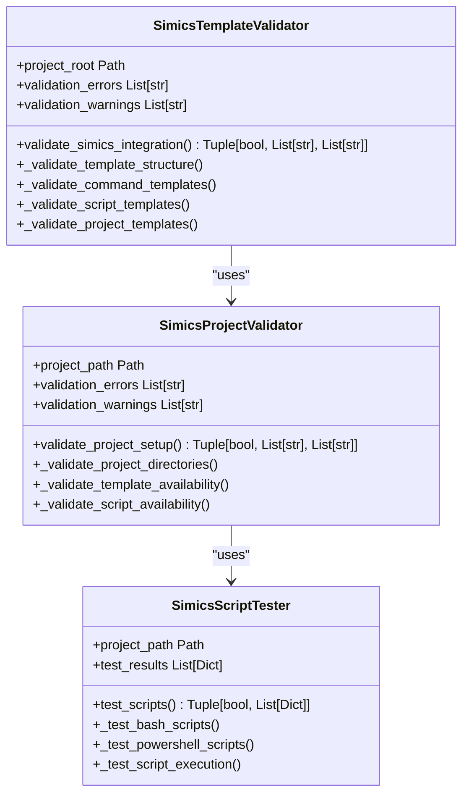
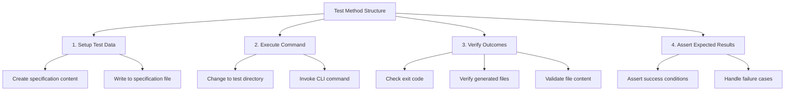

# Integration Testing

<cite>
**Referenced Files in This Document**   
- [test_simics_integration.py](file://tests/test_simics_integration.py)
- [simics_validation.py](file://src/specify_cli/simics_validation.py)
- [verify_simics_integration.py](file://verify_simics_integration.py)
</cite>

## Table of Contents
1. [Introduction](#introduction)
2. [Test Setup Process](#test-setup-process)
3. [Project Structure Validation](#project-structure-validation)
4. [Template File Validation](#template-file-validation)
5. [Script Execution Testing](#script-execution-testing)
6. [Command-Line Integration](#command-line-integration)
7. [Error Handling](#error-handling)
8. [Relationship to Core Validation Logic](#relationship-to-core-validation-logic)
9. [Common Test Failures](#common-test-failures)
10. [Writing New Integration Tests](#writing-new-integration-tests)

## Introduction
The integration testing framework for Simics functionality ensures end-to-end validation of command processing, template generation, and script execution. The primary integration test file, `test_simics_integration.py`, verifies the complete workflow of Simics commands including device creation, platform setup, and validation framework generation. These tests use pytest with Typer's CliRunner to simulate command-line interactions and validate expected outcomes in a dynamically created test environment.

## Test Setup Process
The integration tests employ a comprehensive setup process that creates a simulated project environment for testing. The `setup_method` initializes a temporary directory and test project path before each test execution, ensuring isolation and preventing side effects between test cases.

**Diagram sources**
- [test_simics_integration.py](file://tests/test_simics_integration.py#L25-L35)

**Section sources**
- [test_simics_integration.py](file://tests/test_simics_integration.py#L25-L35)

## Project Structure Validation
The integration tests validate the complete project structure by verifying directory creation, file generation, and proper organization. The `test_simics_validation_framework` method specifically tests the validation framework by creating the necessary directory structure and validating that all required components are properly generated.

**Diagram sources**
- [test_simics_integration.py](file://tests/test_simics_integration.py#L125-L135)
- [simics_validation.py](file://src/specify_cli/simics_validation.py#L24-L35)

**Section sources**
- [test_simics_integration.py](file://tests/test_simics_integration.py#L125-L158)

## Template File Validation
Template file validation is a critical component of the integration testing framework, ensuring that all required template files exist and contain the proper structure. The `test_template_file_validation` method verifies that template files in the project are correctly structured and contain the necessary components.

**Diagram sources**
- [test_simics_integration.py](file://tests/test_simics_integration.py#L309-L347)
- [simics_validation.py](file://src/specify_cli/simics_validation.py#L45-L104)

**Section sources**
- [test_simics_integration.py](file://tests/test_simics_integration.py#L309-L347)

## Script Execution Testing
The integration framework includes comprehensive testing of script execution through both real execution and mocked scenarios. The `test_script_execution_simulation` method uses unittest.mock to simulate subprocess calls, allowing for controlled testing of script behavior without actual execution.

**Diagram sources**
- [test_simics_integration.py](file://tests/test_simics_integration.py#L281-L298)
- [simics_validation.py](file://src/specify_cli/simics_validation.py#L293-L393)

**Section sources**
- [test_simics_integration.py](file://tests/test_simics_integration.py#L281-L298)

## Command-Line Integration
The integration tests verify complete command-line functionality through end-to-end testing of the Simics command suite. The `test_command_line_integration` method tests the processing of multiple Simics commands in a single specification file, validating that all expected files are generated.

**Diagram sources**
- [test_simics_integration.py](file://tests/test_simics_integration.py#L248-L279)
- [simics_validation.py](file://src/specify_cli/simics_validation.py#L396-L431)

**Section sources**
- [test_simics_integration.py](file://tests/test_simics_integration.py#L248-L279)

## Error Handling
The integration tests include comprehensive error handling verification to ensure graceful degradation when encountering malformed specifications or invalid inputs. The `test_error_handling` method specifically tests the system's response to malformed specifications.

**Diagram sources**
- [test_simics_integration.py](file://tests/test_simics_integration.py#L281-L298)
- [simics_validation.py](file://src/specify_cli/simics_validation.py#L22-L39)

**Section sources**
- [test_simics_integration.py](file://tests/test_simics_integration.py#L281-L298)

## Relationship to Core Validation Logic
The integration tests are closely tied to the core validation logic implemented in the `simics_validation.py` module. The tests validate the functionality of three primary classes: `SimicsTemplateValidator`, `SimicsProjectValidator`, and `SimicsScriptTester`, which form the foundation of the validation framework.

**Diagram sources**
- [simics_validation.py](file://src/specify_cli/simics_validation.py#L14-L208)
- [simics_validation.py](file://src/specify_cli/simics_validation.py#L211-L290)
- [simics_validation.py](file://src/specify_cli/simics_validation.py#L293-L393)

**Section sources**
- [simics_validation.py](file://src/specify_cli/simics_validation.py#L14-L431)

## Common Test Failures
Common test failures in the integration framework typically fall into several categories, each with specific diagnostic indicators and resolution strategies.

### Exit Code Failures
When tests fail with incorrect exit codes, it typically indicates issues with command processing or validation logic. The most common scenarios include:

- **Exit code 1**: Command processing failed due to syntax errors or missing parameters
- **Exit code 2**: Validation failed due to missing required components
- **Exit code -1**: Script execution timeout or crash

### Missing Validation Output
Missing validation output usually occurs when:
- Template files are not properly located in the expected directories
- Required YAML frontmatter is missing from command templates
- Script placeholders like `{SCRIPT}` or `{ARGS}` are not present
- JSON output support is not implemented in scripts

### File Generation Issues
File generation failures can stem from:
- Incorrect template paths or missing template directories
- Insufficient file permissions for script execution
- Path resolution issues in different operating systems
- Missing dependencies required for file generation

## Writing New Integration Tests
Creating new integration tests follows a standardized pattern that ensures consistency and comprehensive coverage of Simics functionality.

### Test Structure Guidelines
When writing new integration tests, follow these guidelines:

**Diagram sources**
- [test_simics_integration.py](file://tests/test_simics_integration.py#L40-L70)
- [test_simics_integration.py](file://tests/test_simics_integration.py#L80-L110)

**Section sources**
- [test_simics_integration.py](file://tests/test_simics_integration.py#L40-L347)

### Best Practices for New Tests
When developing new integration tests, adhere to the following best practices:

1. **Follow naming conventions**: Use descriptive names starting with `test_` followed by the feature being tested
2. **Use test utilities**: Leverage existing test utilities and data generators from `test_config.py`
3. **Ensure proper cleanup**: Always implement teardown methods to remove temporary files and directories
4. **Add appropriate markers**: Use pytest markers like `@pytest.mark.simics` to categorize tests
5. **Test edge cases**: Include tests for malformed inputs and error conditions
6. **Validate multiple scenarios**: Test both success and failure paths for comprehensive coverage

The integration testing framework provides a robust foundation for validating Simics functionality, ensuring that all components work together as expected in a simulated project environment.