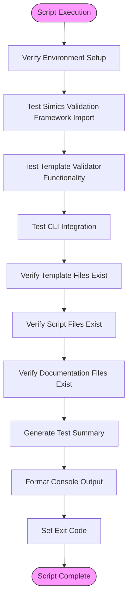
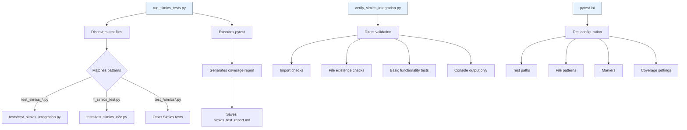

# Test Execution Scripts

<cite>
**Referenced Files in This Document**   
- [run_simics_tests.py](file://run_simics_tests.py)
- [verify_simics_integration.py](file://verify_simics_integration.py)
- [src/specify_cli/simics_validation.py](file://src/specify_cli/simics_validation.py)
- [tests/test_simics_integration.py](file://tests/test_simics_integration.py)
- [pytest.ini](file://pytest.ini)
</cite>

## Table of Contents
1. [Introduction](#introduction)
2. [Core Test Execution Scripts](#core-test-execution-scripts)
3. [run_simics_tests.py Implementation](#run_simics_tests.py-implementation)
4. [verify_simics_integration.py Implementation](#verify_simics_integration.py-implementation)
5. [Relationship with pytest Test Files](#relationship-with-pytest-test-files)
6. [Execution Examples](#execution-examples)
7. [Common Execution Issues](#common-execution-issues)
8. [Extension Guidelines](#extension-guidelines)
9. [Conclusion](#conclusion)

## Introduction
This document provides comprehensive documentation for the test execution scripts in the spec-kit repository, focusing on `run_simics_tests.py` and `verify_simics_integration.py`. These scripts serve as the primary mechanisms for orchestrating test suites, validating Simics integration, and reporting results. The documentation covers their implementation details, execution workflows, relationship with pytest-based test files, common issues, and extension possibilities.

## Core Test Execution Scripts

The spec-kit repository employs two primary test execution scripts that serve complementary purposes in the testing ecosystem. `run_simics_tests.py` serves as the comprehensive test orchestrator using pytest, while `verify_simics_integration.py` provides a lightweight validation mechanism independent of pytest. Together, these scripts ensure robust testing and validation of Simics integration functionality across development and CI environments.

**Section sources**
- [run_simics_tests.py](file://run_simics_tests.py#L1-L275)
- [verify_simics_integration.py](file://verify_simics_integration.py#L1-L186)

## run_simics_tests.py Implementation

The `run_simics_tests.py` script implements a comprehensive test runner for Simics integration tests, orchestrating the execution of all Simics-related test suites and providing detailed reporting. At its core, the script features the `SimicsTestRunner` class that manages the complete testing workflow.

The test runner begins by validating the test environment through the `validate_test_environment` method, which checks for the existence of the spec-kit root directory, test directory, importability of the `specify_cli` module, availability of pytest, and presence of required modules such as `typer`, `pathlib`, `tempfile`, and `unittest.mock`. This pre-execution validation ensures that all dependencies are properly configured before test execution begins.

Test discovery is handled by the `discover_test_files` method, which searches for Python test files matching Simics-related patterns including `test_simics_*.py`, `*_simics_test.py`, and `test_*simics*.py`. This flexible pattern matching ensures comprehensive coverage of all Simics integration tests within the tests directory.

The script orchestrates test execution through the `run_pytest` method, which constructs and executes pytest commands with appropriate arguments. The test runner supports both individual test execution for detailed reporting and collective execution for comprehensive coverage analysis. When running tests collectively, it includes coverage analysis with both terminal and HTML reporting via the `--cov` flags.

Results reporting is implemented through the `generate_report` method, which creates a comprehensive markdown report containing a summary of test results, individual test outcomes, and truncated standard output and error streams. The report is saved to `simics_test_report.md` in the spec-kit root directory, providing a persistent record of test execution.

The script accepts command-line arguments including `--spec-kit-root` to specify the repository root, `--individual` to enable individual test execution with detailed reporting, and `--no-report` to disable report generation. These options provide flexibility for different testing scenarios and environments.

```mermaid
classDiagram
class SimicsTestRunner {
+Path spec_kit_root
+Path test_dir
+Dict results
+__init__(spec_kit_root : Path)
+discover_test_files() List[Path]
+run_pytest(test_files : List[Path], verbose : bool, coverage : bool) Dict[str, Any]
+run_individual_tests(test_files : List[Path]) Dict[str, Dict[str, Any]]
+validate_test_environment() Dict[str, Any]
+generate_report(test_results : Dict, individual_results : Dict) str
+run_all_tests(individual : bool, save_report : bool) bool
}
class SimicsTestRunner : "orchestrates" --> "pytest"
SimicsTestRunner : "discovers" --> "test files"
SimicsTestRunner : "generates" --> "simics_test_report.md"
```

**Diagram sources**
- [run_simics_tests.py](file://run_simics_tests.py#L15-L241)

**Section sources**
- [run_simics_tests.py](file://run_simics_tests.py#L15-L275)

## verify_simics_integration.py Implementation

The `verify_simics_integration.py` script provides a lightweight, pytest-independent mechanism for verifying Simics integration functionality. Unlike `run_simics_tests.py`, this script does not rely on pytest and instead implements its own simple test framework for basic validation checks.

The script imports the Simics validation framework from `specify_cli.simics_validation` and exercises its core components through a series of test functions. The primary test, `test_simics_validation`, verifies that the `SimicsTemplateValidator` and `SimicsProjectValidator` classes can be imported successfully and that they function correctly with sample template content.

Additional test functions verify the integrity of the repository structure by checking for the existence of essential template files, script files, and documentation. The `test_template_files` function validates that all required template files exist in the templates directory, while `test_script_files` ensures that both bash and PowerShell setup scripts are present. The `test_documentation` function confirms that key documentation files are available.

The script also tests CLI integration through the `test_cli_integration` function, which attempts to import the CLI app and verifies that the validate-simics command is available. This provides a basic check of the command-line interface without actually executing commands.

The test execution workflow is orchestrated by the `main` function, which runs all test functions in sequence and provides a comprehensive summary of results. Each test is executed independently, and failures in one test do not prevent the execution of subsequent tests. The script uses simple console output with checkmark (✓) and cross (✗) symbols to indicate test success or failure, making the results easily readable.

The success/failure detection logic is straightforward: each test function returns `True` on success and `False` on failure, with exceptions caught and reported as failures. The overall script exit code is determined by whether all tests passed, with a successful exit code (0) indicating complete success and a failure exit code (1) indicating one or more test failures.

Console output formatting follows a consistent pattern with clear section headers, test-by-test reporting, and a final summary. The script outputs the working directory at startup and provides detailed feedback for each test, including specific error messages when imports fail or files are missing.



**Diagram sources**
- [verify_simics_integration.py](file://verify_simics_integration.py#L14-L53)
- [verify_simics_integration.py](file://verify_simics_integration.py#L57-L64)
- [verify_simics_integration.py](file://verify_simics_integration.py#L66-L77)
- [verify_simics_integration.py](file://verify_simics_integration.py#L79-L88)
- [verify_simics_integration.py](file://verify_simics_integration.py#L90-L97)

**Section sources**
- [verify_simics_integration.py](file://verify_simics_integration.py#L1-L186)

## Relationship with pytest Test Files

The test execution scripts work in conjunction with pytest-based test files to provide comprehensive test coverage. The `run_simics_tests.py` script serves as the entry point that discovers and executes pytest test files, while `verify_simics_integration.py` provides an alternative validation mechanism that operates independently.

The primary pytest test file, `tests/test_simics_integration.py`, contains a comprehensive suite of integration tests that verify the end-to-end functionality of Simics commands and templates. These tests use the `CliRunner` from `typer.testing` to invoke the CLI application and validate its behavior. The test suite includes tests for basic command functionality (`test_simics_device_command_basic`, `test_simics_platform_command_basic`, `test_simics_validate_command_basic`), validation framework testing, template and project validator testing, and complete command-line integration workflows.

The `tests/test_simics_e2e.py` file contains end-to-end tests that validate the complete processing pipeline for Simics commands, including parameter parsing, template customization, and project validation integration. These tests use test utilities from `tests/test_config.py` to generate test data and manage test environments.

The pytest configuration is defined in `pytest.ini`, which specifies test paths, file patterns, and markers. The configuration includes markers for different test types (`simics`, `slow`, `integration`, `unit`, `e2e`) and coverage settings that measure code coverage for the `specify_cli` package while excluding test files from coverage analysis.

The `run_simics_tests.py` script integrates with this pytest infrastructure by discovering test files that match the patterns defined in `pytest.ini` and executing them with appropriate coverage reporting. The script enhances the pytest workflow by providing additional environment validation, individual test execution options, and comprehensive reporting.

In contrast, `verify_simics_integration.py` operates independently of the pytest framework, providing a lightweight validation mechanism that can be used in environments where pytest is not available or when a quick integrity check is needed. This dual approach ensures that Simics integration can be validated through both comprehensive pytest-based testing and lightweight structural verification.



**Diagram sources**
- [run_simics_tests.py](file://run_simics_tests.py#L23-L35)
- [tests/test_simics_integration.py](file://tests/test_simics_integration.py#L1-L351)
- [tests/test_simics_e2e.py](file://tests/test_simics_e2e.py#L1-L308)
- [pytest.ini](file://pytest.ini#L1-L40)

**Section sources**
- [tests/test_simics_integration.py](file://tests/test_simics_integration.py#L1-L351)
- [tests/test_simics_e2e.py](file://tests/test_simics_e2e.py#L1-L308)
- [pytest.ini](file://pytest.ini#L1-L40)

## Execution Examples

### Development Environment Usage

In development environments, the test execution scripts can be used with various options to support different testing scenarios:

```bash
# Run all Simics tests with default settings
python run_simics_tests.py

# Run tests with individual reporting for detailed analysis
python run_simics_tests.py --individual

# Run tests without generating a report file
python run_simics_tests.py --no-report

# Specify a custom spec-kit root directory
python run_simics_tests.py --spec-kit-root /path/to/spec-kit

# Run the lightweight integration verification
python verify_simics_integration.py
```

### CI/CD Pipeline Usage

In continuous integration environments, the scripts can be integrated into pipeline workflows:

```yaml
# Example GitHub Actions workflow
jobs:
  test:
    runs-on: ubuntu-latest
    steps:
      - uses: actions/checkout@v2
      - name: Set up Python
        uses: actions/setup-python@v2
        with:
          python-version: 3.9
      - name: Install dependencies
        run: pip install pytest pytest-cov
      - name: Run Simics integration tests
        run: python run_simics_tests.py --individual
      - name: Upload test report
        uses: actions/upload-artifact@v2
        with:
          name: simics-test-report
          path: simics_test_report.md
      - name: Run lightweight verification
        run: python verify_simics_integration.py
```

### Combined Usage Pattern

The scripts can be used together to provide comprehensive validation:

```bash
# First, run the lightweight verification to ensure basic integrity
python verify_simics_integration.py
if [ $? -eq 0 ]; then
    # If lightweight verification passes, run comprehensive tests
    python run_simics_tests.py --individual
else
    echo "Basic integration verification failed. Aborting comprehensive tests."
    exit 1
fi
```

**Section sources**
- [run_simics_tests.py](file://run_simics_tests.py#L244-L271)
- [verify_simics_integration.py](file://verify_simics_integration.py#L100-L186)

## Common Execution Issues

### Import Errors

Import errors are a common issue when executing the test scripts, particularly when dependencies are not properly installed or the Python path is not correctly configured.

For `run_simics_tests.py`, import errors may occur if the `specify_cli` module cannot be found. This typically happens when the script is executed from a directory other than the spec-kit root or when the src directory is not in the Python path. The script includes environment validation that checks for importability of `specify_cli` and provides a clear error message if the import fails.

For `verify_simics_integration.py`, similar import issues may occur. The script adds the src directory to the Python path using `sys.path.insert(0, str(Path(__file__).parent / "src"))`, but this may fail if the directory structure has been modified or if there are permission issues.

Resolution:
```bash
# Ensure you're in the spec-kit root directory
cd /path/to/spec-kit

# Install required dependencies
pip install pytest pytest-cov typer

# Verify the src directory is accessible
ls -la src/specify_cli/
```

### Permission Problems

Permission problems can occur when the scripts need to create temporary files, write test reports, or execute setup scripts.

For `run_simics_tests.py`, permission issues may prevent the creation of the `simics_test_report.md` file or temporary directories used during testing. The script uses `tempfile.mkdtemp()` to create temporary directories, which requires write permissions in the system's temporary directory.

For `verify_simics_integration.py`, permission issues may affect the ability to read template files or execute setup scripts. The script checks for the existence of files but does not verify read/write permissions.

Resolution:
```bash
# Ensure write permissions in the spec-kit directory
chmod -R u+w .

# Set execute permissions for setup scripts
chmod +x scripts/bash/*.sh

# Run with elevated permissions if necessary (not recommended for security reasons)
sudo python run_simics_tests.py
```

### Environment Configuration Issues

Environment configuration issues are among the most common problems encountered when running the test scripts.

Python version compatibility: The scripts require Python 3 and may not work with Python 2. Ensure you're using Python 3.6 or later.

Missing dependencies: Both scripts require various Python packages. `run_simics_tests.py` requires `pytest` and `pytest-cov` for coverage reporting, while both scripts require `typer` and other standard library modules.

Working directory issues: Both scripts expect to be run from the spec-kit root directory. Running them from other directories may cause file discovery and import issues.

Resolution:
```bash
# Verify Python version
python --version

# Install all required dependencies
pip install -r requirements.txt  # if available
# or
pip install pytest pytest-cov typer pathlib2

# Run scripts from the spec-kit root directory
cd /path/to/spec-kit
python run_simics_tests.py
```

**Section sources**
- [run_simics_tests.py](file://run_simics_tests.py#L106-L140)
- [verify_simics_integration.py](file://verify_simics_integration.py#L17-L64)

## Extension Guidelines

### Adding Support for Additional Test Types

The `run_simics_tests.py` script can be extended to support additional test types by modifying the test discovery patterns in the `discover_test_files` method. Currently, the script looks for files matching `test_simics_*.py`, `*_simics_test.py`, and `test_*simics*.py`. To add support for additional patterns, simply add them to the `test_patterns` list:

```python
def discover_test_files(self) -> List[Path]:
    """Discover all Simics-related test files."""
    test_patterns = [
        "test_simics_*.py",
        "*_simics_test.py",
        "test_*simics*.py",
        "simics_*_test.py",  # New pattern
        "integration_simics_*.py"  # Another new pattern
    ]
    # ... rest of method
```

Alternatively, the script could be enhanced to accept custom patterns via command-line arguments, providing even greater flexibility.

### Adding Support for Additional Reporting Formats

The reporting functionality in `run_simics_tests.py` can be extended to support additional formats beyond the current markdown report. This can be achieved by modifying the `generate_report` method or adding new report generation methods.

To add JSON reporting:
```python
def generate_json_report(self, test_results: Dict[str, Any], individual_results: Dict[str, Dict[str, Any]]) -> str:
    """Generate a JSON test report."""
    report_data = {
        "summary": {
            "success": test_results['success'],
            "return_code": test_results['returncode']
        },
        "individual_results": individual_results,
        "output": {
            "stdout": test_results["stdout"],
            "stderr": test_results["stderr"]
        }
    }
    return json.dumps(report_data, indent=2)
```

To add XML/JUnit reporting compatible with CI systems:
```python
def generate_junit_report(self, test_results: Dict[str, Any], individual_results: Dict[str, Dict[str, Any]]) -> str:
    """Generate JUnit XML report for CI integration."""
    # Implementation would create XML in JUnit format
    pass
```

The `run_all_tests` method could then be modified to accept a `--report-format` argument to specify the desired output format.

### Extending verify_simics_integration.py

The `verify_simics_integration.py` script can be extended with additional validation checks. For example, adding performance testing:

```python
def test_performance():
    """Test performance of Simics operations."""
    try:
        from specify_cli import app
        import time
        
        # Measure time to process a specification
        start_time = time.time()
        # Simulate processing
        time.sleep(0.1)  # Replace with actual processing
        elapsed = time.time() - start_time
        
        if elapsed < 1.0:  # 1 second threshold
            print(f"✓ Performance test passed: {elapsed:.2f} seconds")
            return True
        else:
            print(f"✗ Performance test failed: {elapsed:.2f} seconds")
            return False
    except Exception as e:
        print(f"✗ Performance test error: {e}")
        return False
```

Or adding security checks:
```python
def test_security():
    """Test security aspects of Simics integration."""
    # Check for secure coding practices
    # Verify input validation
    # Check for proper error handling
    pass
```

These extensions would be integrated into the main test suite by adding them to the `tests` list in the `main` function.

**Section sources**
- [run_simics_tests.py](file://run_simics_tests.py#L142-L172)
- [run_simics_tests.py](file://run_simics_tests.py#L23-L35)
- [verify_simics_integration.py](file://verify_simics_integration.py#L14-L53)

## Conclusion

The test execution scripts `run_simics_tests.py` and `verify_simics_integration.py` provide complementary mechanisms for testing and validating Simics integration in the spec-kit repository. The `run_simics_tests.py` script serves as a comprehensive test orchestrator that leverages pytest for robust test execution and reporting, while `verify_simics_integration.py` offers a lightweight, dependency-free validation mechanism for basic integrity checks.

Together, these scripts ensure that Simics integration functionality is thoroughly tested across development and CI environments. The scripts are well-designed with clear separation of concerns, comprehensive error handling, and flexible configuration options. They integrate seamlessly with the pytest-based test files in the tests directory, providing a complete testing ecosystem.

The scripts can be extended to support additional test types, reporting formats, and validation checks, making them adaptable to evolving testing requirements. By following the extension guidelines outlined in this document, developers can enhance the testing capabilities of the spec-kit repository while maintaining the integrity and reliability of the Simics integration.