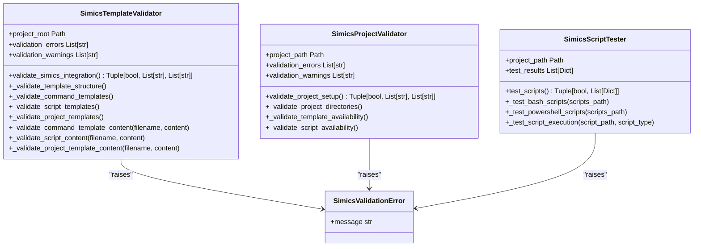
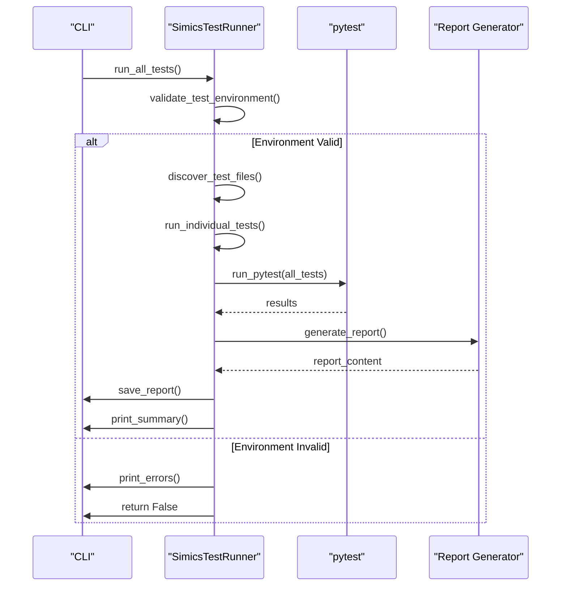
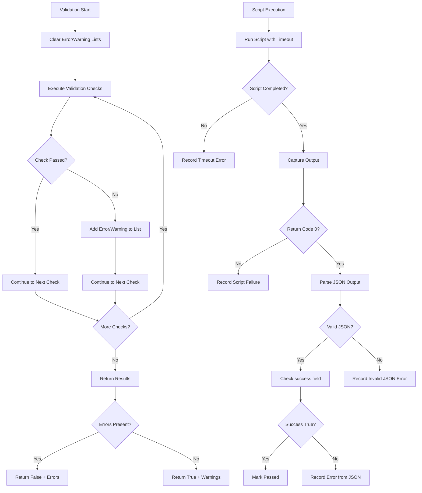

# Validation Framework

<cite>
**Referenced Files in This Document**   
- [simics_validation.py](file://src/specify_cli/simics_validation.py)
- [run_simics_tests.py](file://run_simics_tests.py)
- [test_simics_integration.py](file://tests/test_simics_integration.py)
- [test_simics_e2e.py](file://tests/test_simics_e2e.py)
- [verify_simics_integration.py](file://verify_simics_integration.py)
- [pytest.ini](file://pytest.ini)
</cite>

## Table of Contents
1. [Introduction](#introduction)
2. [Architecture Overview](#architecture-overview)
3. [Core Components](#core-components)
4. [Validation Patterns](#validation-patterns)
5. [Data Flow](#data-flow)
6. [Test Execution and Reporting](#test-execution-and-reporting)
7. [Infrastructure Requirements](#infrastructure-requirements)
8. [Cross-Cutting Concerns](#cross-cutting-concerns)
9. [Dependencies and Compatibility](#dependencies-and-compatibility)
10. [Conclusion](#conclusion)

## Introduction

The Validation Framework component provides a comprehensive system for validating Simics integration within the spec-kit ecosystem. This framework ensures that Simics-related templates, scripts, and project structures adhere to required specifications before deployment. The system employs both validation and testing patterns to verify correctness at multiple levels, from template structure to script functionality.

The framework supports cross-platform operation with both Bash and PowerShell scripts, enabling validation across different operating environments. It integrates with the specification-driven development workflow, allowing validation to occur as part of the specification processing pipeline. The design emphasizes automated verification, comprehensive reporting, and integration with existing testing infrastructure.

**Section sources**
- [simics_validation.py](file://src/specify_cli/simics_validation.py#L1-L431)
- [run_simics_tests.py](file://run_simics_tests.py#L1-L275)

## Architecture Overview

The validation framework follows a modular architecture with distinct components for template validation, project validation, and script testing. The system is designed around the Strategy pattern, allowing different validation strategies to be applied based on the context (template vs. project vs. script).

```mermaid
graph TD
CLI["CLI Interface"] --> VT["SimicsTemplateValidator"]
CLI --> VP["SimicsProjectValidator"]
CLI --> ST["SimicsScriptTester"]
VT --> TS["Template Structure"]
VT --> CT["Command Templates"]
VT --> STT["Script Templates"]
VT --> PT["Project Templates"]
VP --> PD["Project Directories"]
VP --> TA["Template Availability"]
VP --> SA["Script Availability"]
ST --> BS["Bash Scripts"]
ST --> PS["PowerShell Scripts"]
ST --> SE["Script Execution"]
BS --> SD["setup-simics-device.sh"]
BS --> SP["setup-simics-platform.sh"]
BS --> SV["setup-simics-validate.sh"]
PS --> SDP["setup-simics-device.ps1"]
PS --> SPP["setup-simics-platform.ps1"]
PS --> SPV["setup-simics-validate.ps1"]
SE --> JSON["JSON Output"]
SE --> TIMEOUT["Timeout Handling"]
SE --> PARSING["JSON Parsing"]
subgraph "Validation Components"
VT
VP
ST
end
subgraph "Test Infrastructure"
run_simics_tests.py
pytest.ini
tests/
end
Validation Components --> Test Infrastructure
```

**Diagram sources **
- [simics_validation.py](file://src/specify_cli/simics_validation.py#L14-L208)
- [simics_validation.py](file://src/specify_cli/simics_validation.py#L211-L290)
- [simics_validation.py](file://src/specify_cli/simics_validation.py#L293-L393)
- [run_simics_tests.py](file://run_simics_tests.py#L15-L241)

## Core Components

The validation framework consists of three primary classes that implement the Validation pattern: SimicsTemplateValidator, SimicsProjectValidator, and SimicsScriptTester. Each class follows a similar structure with a main validation method that orchestrates multiple validation checks.

The SimicsTemplateValidator performs comprehensive validation of the spec-kit template structure, ensuring that all required directories and files exist and conform to expected formats. It validates both the directory structure and the content of template files, checking for required sections and proper formatting.

The SimicsProjectValidator focuses on validating Simics projects created with spec-kit, verifying that the project has the necessary directory structure and that required templates and scripts are available. This validator operates on projects that have been initialized with the spec-kit system.

The SimicsScriptTester serves as a test runner for Simics scripts, executing scripts and validating their output. It supports both Bash and PowerShell scripts, with platform-appropriate execution methods. The tester validates that scripts produce valid JSON output and handle errors appropriately.

**Section sources**
- [simics_validation.py](file://src/specify_cli/simics_validation.py#L14-L208)
- [simics_validation.py](file://src/specify_cli/simics_validation.py#L211-L290)
- [simics_validation.py](file://src/specify_cli/simics_validation.py#L293-L393)

## Validation Patterns

The framework implements the Validation pattern through a series of specialized validator classes that follow a consistent interface. Each validator collects errors and warnings during validation, providing comprehensive feedback about issues found.

The SimicsTemplateValidator uses a composite validation approach, combining structural validation with content validation. Structural validation checks for the presence of required directories and files, while content validation examines the actual content of template files for required elements like YAML frontmatter, specific fields, and placeholders.



**Diagram sources **
- [simics_validation.py](file://src/specify_cli/simics_validation.py#L14-L208)
- [simics_validation.py](file://src/specify_cli/simics_validation.py#L211-L290)
- [simics_validation.py](file://src/specify_cli/simics_validation.py#L293-L393)
- [simics_validation.py](file://src/specify_cli/simics_validation.py#L9-L11)

## Data Flow

The data flow in the validation framework begins with specification input and progresses through validation, testing, and reporting stages. The process starts when a user invokes validation commands through the CLI, which then orchestrates the appropriate validation components.

```mermaid
flowchart TD
A["Specification Input"] --> B["CLI Command Processing"]
B --> C{"Validation Type"}
C --> |Template| D["SimicsTemplateValidator"]
C --> |Project| E["SimicsProjectValidator"]
C --> |Scripts| F["SimicsScriptTester"]
D --> G["Validate Template Structure"]
D --> H["Validate Command Templates"]
D --> I["Validate Script Templates"]
D --> J["Validate Project Templates"]
E --> K["Validate Project Directories"]
E --> L["Validate Template Availability"]
E --> M["Validate Script Availability"]
F --> N["Test Bash Scripts"]
F --> O["Test PowerShell Scripts"]
F --> P["Execute Scripts with --json"]
P --> Q["Capture Output"]
Q --> R["Parse JSON Output"]
R --> S{"Success?}
S --> |Yes| T["Mark as Passed"]
S --> |No| U["Record Error"]
G --> V["Collect Errors/Warnings"]
H --> V
I --> V
J --> V
K --> V
L --> V
M --> V
T --> V
U --> V
V --> W["Generate Validation Results"]
W --> X["Return Structured Output"]
X --> Y["CLI Output/Reporting"]
```

**Diagram sources **
- [simics_validation.py](file://src/specify_cli/simics_validation.py#L396-L406)
- [simics_validation.py](file://src/specify_cli/simics_validation.py#L409-L419)
- [simics_validation.py](file://src/specify_cli/simics_validation.py#L422-L431)
- [simics_validation.py](file://src/specify_cli/simics_validation.py#L22-L39)

## Test Execution and Reporting

The test execution system is built around pytest, providing comprehensive testing capabilities for the Simics integration. The run_simics_tests.py script serves as the primary test runner, orchestrating test discovery, execution, and reporting.

The SimicsTestRunner class manages the entire testing process, from environment validation to test execution and report generation. It discovers test files using patterns that match Simics-related tests, validates the test environment, and runs tests with appropriate configuration.



**Diagram sources **
- [run_simics_tests.py](file://run_simics_tests.py#L15-L241)
- [run_simics_tests.py](file://run_simics_tests.py#L174-L271)
- [run_simics_tests.py](file://run_simics_tests.py#L37-L85)
- [run_simics_tests.py](file://run_simics_tests.py#L142-L172)

## Infrastructure Requirements

The validation framework has specific infrastructure requirements to ensure proper operation across different environments. The system requires Python 3.7+ with specific packages installed, including pytest, pytest-cov, typer, and other dependencies specified in the project configuration.

For script validation, the framework requires access to either Bash (on Unix-like systems) or PowerShell (on Windows systems). The validation process checks for the availability of these scripting environments and adapts its behavior accordingly. On Windows systems, Bash script testing is skipped when the OS is detected as Windows.

The framework also requires specific directory structures to be present in both the spec-kit installation and in projects being validated. These include template directories for Simics commands, project templates, and script directories for both Bash and PowerShell scripts.

```mermaid
erDiagram
SPEC_KIT_ROOT {
string path
}
TEMPLATES_DIR {
string path
}
SCRIPTS_DIR {
string path
}
TESTS_DIR {
string path
}
SPEC_KIT_ROOT ||--o{ TEMPLATES_DIR : contains
SPEC_KIT_ROOT ||--o{ SCRIPTS_DIR : contains
SPEC_KIT_ROOT ||--o{ TESTS_DIR : contains
TEMPLATES_DIR ||--o{ COMMAND_TEMPLATES : contains
TEMPLATES_DIR ||--o{ PROJECT_TEMPLATES : contains
SCRIPTS_DIR ||--o{ BASH_SCRIPTS : contains
SCRIPTS_DIR ||--o{ POWERSHELL_SCRIPTS : contains
class COMMAND_TEMPLATES {
string simics-device.md
string simics-platform.md
string simics-validate.md
}
class PROJECT_TEMPLATES {
string device-spec-template.md
string platform-spec-template.md
string validation-template.md
}
class BASH_SCRIPTS {
string setup-simics-device.sh
string setup-simics-platform.sh
string setup-simics-validate.sh
}
class POWERSHELL_SCRIPTS {
string setup-simics-device.ps1
string setup-simics-platform.ps1
string setup-simics-validate.ps1
}
```

**Diagram sources **
- [simics_validation.py](file://src/specify_cli/simics_validation.py#L41-L55)
- [simics_validation.py](file://src/specify_cli/simics_validation.py#L57-L77)
- [simics_validation.py](file://src/specify_cli/simics_validation.py#L118-L150)
- [simics_validation.py](file://src/specify_cli/simics_validation.py#L170-L190)

## Cross-Cutting Concerns

The validation framework addresses several cross-cutting concerns including error handling, logging, and failure recovery. The system uses structured error reporting with both errors and warnings, allowing users to distinguish between critical issues and recommendations.

Error handling is implemented consistently across components, with specific exceptions like SimicsValidationError for validation failures. The framework captures detailed error information, including the source of the error and specific details about what failed validation.



**Diagram sources **
- [simics_validation.py](file://src/specify_cli/simics_validation.py#L348-L393)
- [simics_validation.py](file://src/specify_cli/simics_validation.py#L152-L168)
- [simics_validation.py](file://src/specify_cli/simics_validation.py#L192-L208)

## Dependencies and Compatibility

The validation framework relies on several third-party dependencies for its operation. The primary testing framework is pytest, configured through pytest.ini with specific options for coverage reporting and test discovery. The framework requires pytest and pytest-cov to be installed in the environment.

Other required modules include typer for CLI functionality, pathlib for path operations, tempfile for temporary file management, and unittest.mock for testing. The system is designed to validate the presence of these dependencies as part of its environment validation process.

The framework is compatible with both Windows and Unix-like operating systems, with appropriate adaptations for platform differences. It supports Python 3.7 and later versions, ensuring compatibility with modern Python environments. The validation system itself is designed to be version-agnostic for Simics, focusing on the integration patterns rather than specific Simics versions.

**Section sources**
- [pytest.ini](file://pytest.ini#L1-L39)
- [run_simics_tests.py](file://run_simics_tests.py#L106-L140)
- [verify_simics_integration.py](file://verify_simics_integration.py#L1-L186)

## Conclusion

The Validation Framework provides a robust system for ensuring the correctness of Simics integration within the spec-kit ecosystem. By implementing the Strategy and Validation patterns, the framework offers a flexible and extensible approach to validation that can adapt to different contexts and requirements.

The system effectively integrates with the specification-driven development workflow, providing validation at multiple levels from template structure to script functionality. The use of pytest for integration testing ensures comprehensive test coverage and detailed reporting capabilities.

The framework's design considerations for cross-platform operation, structured error reporting, and comprehensive validation coverage make it well-suited for large projects with complex Simics integration requirements. The separation of concerns between template validation, project validation, and script testing allows for targeted validation that can be applied appropriately based on the development stage.

**Section sources**
- [simics_validation.py](file://src/specify_cli/simics_validation.py#L1-L431)
- [run_simics_tests.py](file://run_simics_tests.py#L1-L275)
- [test_simics_integration.py](file://tests/test_simics_integration.py#L1-L351)
- [test_simics_e2e.py](file://tests/test_simics_e2e.py#L1-L308)