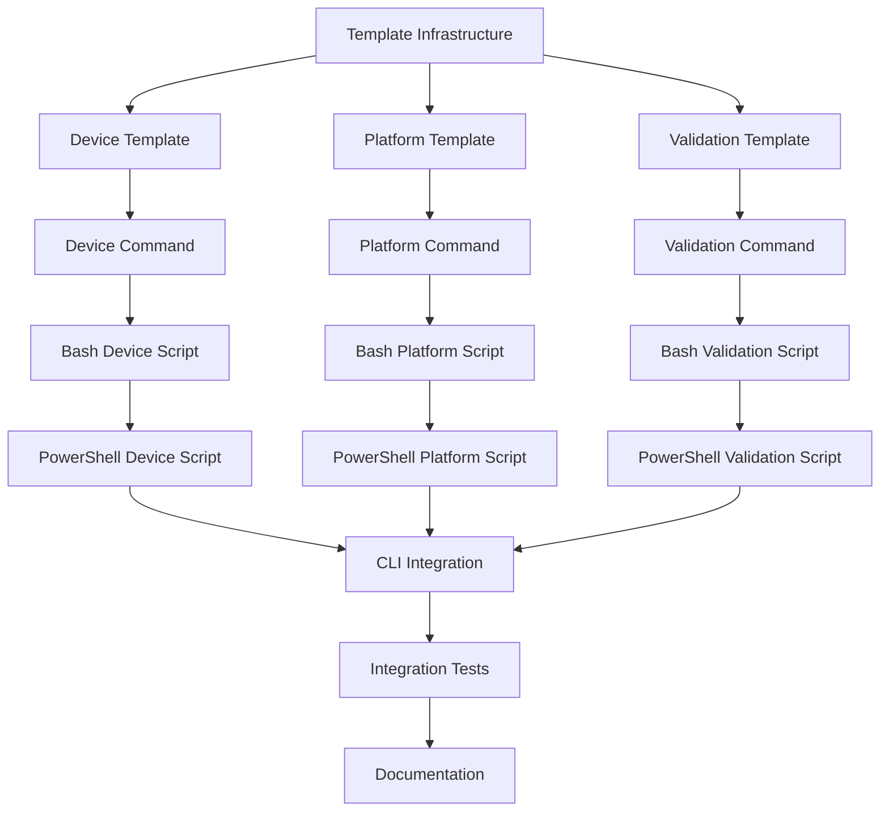

# Spec-Kit Simics Integration Implementation Plan

**Project**: Spec-Kit Simics Device Modeling Integration  
**Created**: 2025-09-21  
**Status**: Implementation Ready  
**Based on**: [Spec-Kit Simics Integration Design Document]

## Executive Summary

This implementation plan provides a comprehensive roadmap for integrating Intel Simics device modeling capabilities into the spec-kit specification-driven development framework. The integration extends spec-kit's existing CLI architecture with three new Simics-specific commands (`/simics-device`, `/simics-platform`, `/simics-validate`) while maintaining compatibility with the existing workflow.

## Architecture Analysis Summary

**Current Architecture**: spec-kit is a CLI tool built with Typer/Rich that provides:
- Command-based workflow (`/specify`, `/plan`, `/tasks`)
- Template-driven specification generation
- Script execution for different platforms (bash/PowerShell)
- Project initialization and management

**Integration Strategy**: Extend the existing template system and command structure rather than modify core CLI logic, ensuring backward compatibility and consistent user experience.

---

## Implementation Checklist

### Phase 1: Foundation & Templates ⏳ **2-3 days**

#### 1.1 Create Simics Template Infrastructure
- [ ] **Task T001** [P]: Create `templates/simics/` directory structure
  - **Files**: Create base directory and subdirectories
  - **Path**: `c:\Users\haita\spec-kit\templates\simics\`
  - **Deliverable**: Directory structure for Simics templates

- [ ] **Task T002** [P]: Create device specification template
  - **Files**: `templates/simics/device-spec-template.md`
  - **Content**: Device behavioral specification template with Simics interfaces
  - **Requirements**: Register maps, memory interfaces, validation scenarios
  - **Deliverable**: Comprehensive device specification template

- [ ] **Task T003** [P]: Create platform specification template  
  - **Files**: `templates/simics/platform-spec-template.md`
  - **Content**: System-level platform integration template
  - **Requirements**: Component topology, interconnections, timing models
  - **Deliverable**: Virtual platform specification template

- [ ] **Task T004** [P]: Create validation framework template
  - **Files**: `templates/simics/validation-template.md`
  - **Content**: Testing and validation methodology template
  - **Requirements**: Unit tests, integration tests, performance validation
  - **Deliverable**: Validation framework template

#### 1.2 Create Simics Command Templates
- [ ] **Task T005** [P]: Create `/simics-device` command template
  - **Files**: `templates/commands/simics-device.md`
  - **Content**: Command definition with script integration
  - **Requirements**: Device model specification generation workflow
  - **Dependencies**: Uses device-spec-template.md
  - **Deliverable**: Device command template

- [ ] **Task T006** [P]: Create `/simics-platform` command template
  - **Files**: `templates/commands/simics-platform.md`
  - **Content**: Platform specification command definition
  - **Requirements**: Platform integration workflow
  - **Dependencies**: Uses platform-spec-template.md
  - **Deliverable**: Platform command template

- [ ] **Task T007** [P]: Create `/simics-validate` command template
  - **Files**: `templates/commands/simics-validate.md`
  - **Content**: Validation workflow command definition
  - **Requirements**: Validation task generation
  - **Dependencies**: Uses validation-template.md
  - **Deliverable**: Validation command template

### Phase 2: Script Implementation ⏳ **3-4 days**

#### 2.1 Create Simics-Specific Scripts (Bash)
- [ ] **Task T008**: Create bash script for device project setup
  - **Files**: `scripts/bash/setup-simics-device.sh`
  - **Function**: Initialize device model project structure
  - **Inputs**: Device name, project type, Simics version
  - **Outputs**: JSON with project paths and configuration
  - **Deliverable**: Device setup script

- [ ] **Task T009**: Create bash script for platform project setup
  - **Files**: `scripts/bash/setup-simics-platform.sh`
  - **Function**: Initialize platform project with multiple devices
  - **Inputs**: Platform name, device list, system architecture
  - **Outputs**: JSON with platform configuration
  - **Deliverable**: Platform setup script

- [ ] **Task T010**: Create bash validation script
  - **Files**: `scripts/bash/validate-simics-model.sh`
  - **Function**: Execute Simics model validation workflows
  - **Inputs**: Model path, validation type, test scenarios
  - **Outputs**: Validation results and test reports
  - **Deliverable**: Model validation script

#### 2.2 Create Simics-Specific Scripts (PowerShell)
- [ ] **Task T011**: Create PowerShell device setup script
  - **Files**: `scripts/powershell/setup-simics-device.ps1`
  - **Function**: Windows-compatible device project initialization
  - **Dependencies**: Mirrors bash version functionality
  - **Deliverable**: PowerShell device setup script

- [ ] **Task T012**: Create PowerShell platform setup script
  - **Files**: `scripts/powershell/setup-simics-platform.ps1`
  - **Function**: Windows-compatible platform initialization
  - **Dependencies**: Mirrors bash version functionality
  - **Deliverable**: PowerShell platform setup script

- [ ] **Task T013**: Create PowerShell validation script
  - **Files**: `scripts/powershell/validate-simics-model.ps1`
  - **Function**: Windows-compatible model validation
  - **Dependencies**: Mirrors bash version functionality
  - **Deliverable**: PowerShell validation script

### Phase 3: Enhanced Templates ⏳ **2-3 days**

#### 3.1 Create Simics-Enhanced Planning Templates
- [ ] **Task T014**: Create Simics implementation plan template
  - **Files**: `templates/simics/simics-plan-template.md`
  - **Content**: Extends plan-template.md with Simics-specific sections
  - **Requirements**: DML/Python implementation planning, interface specifications
  - **Deliverable**: Simics-enhanced planning template

- [ ] **Task T015**: Create Simics task generation template
  - **Files**: `templates/simics/simics-tasks-template.md`
  - **Content**: Extends tasks-template.md with device modeling tasks
  - **Requirements**: Model implementation, interface testing, validation tasks
  - **Deliverable**: Simics task generation template

#### 3.2 Create Simics Project Structure Templates
- [ ] **Task T016** [P]: Create device model directory template
  - **Files**: `templates/simics/device-structure.md`
  - **Content**: Standard device model project layout
  - **Requirements**: DML files, Python interfaces, test directories
  - **Deliverable**: Device project structure guide

- [ ] **Task T017** [P]: Create platform project structure template
  - **Files**: `templates/simics/platform-structure.md`
  - **Content**: Virtual platform project organization
  - **Requirements**: System configuration, device integration, validation
  - **Deliverable**: Platform project structure guide

### Phase 4: CLI Integration ⏳ **2-3 days**

#### 4.1 Extend Template Processing
- [ ] **Task T018**: Update template processor for Simics commands
  - **Files**: `src/specify_cli/__init__.py` (modify existing functions)
  - **Function**: Extend `_process_adk_command_templates()` for Simics
  - **Requirements**: Handle Simics-specific template variables
  - **Dependencies**: Must not break existing ADK functionality
  - **Deliverable**: Enhanced template processing

- [ ] **Task T019**: Add Simics template validation
  - **Files**: `src/specify_cli/__init__.py` (add validation functions)
  - **Function**: Validate Simics template completeness and consistency
  - **Requirements**: Check required sections, validate syntax
  - **Deliverable**: Template validation functions

#### 4.2 Update Project Initialization
- [ ] **Task T020**: Extend project initialization for Simics projects
  - **Files**: `src/specify_cli/__init__.py` (modify `setup_adk_project_from_local`)
  - **Function**: Include Simics templates in project setup
  - **Requirements**: Copy Simics templates, configure project type
  - **Dependencies**: Backward compatibility with existing projects
  - **Deliverable**: Enhanced project initialization

### Phase 5: Testing & Validation ⏳ **3-4 days**

#### 5.1 Create Integration Tests
- [ ] **Task T021** [P]: Create device command integration test
  - **Files**: `tests/integration/test_simics_device.py`
  - **Function**: Test complete device specification workflow
  - **Requirements**: Mock Simics environment, validate outputs
  - **Deliverable**: Device command integration test

- [ ] **Task T022** [P]: Create platform command integration test
  - **Files**: `tests/integration/test_simics_platform.py`
  - **Function**: Test platform specification workflow
  - **Requirements**: Multi-device platform scenarios
  - **Deliverable**: Platform command integration test

- [ ] **Task T023** [P]: Create validation command integration test
  - **Files**: `tests/integration/test_simics_validate.py`
  - **Function**: Test validation workflow execution
  - **Requirements**: Mock validation scenarios, result verification
  - **Deliverable**: Validation command integration test

#### 5.2 Create Unit Tests
- [ ] **Task T024** [P]: Create template processing unit tests
  - **Files**: `tests/unit/test_simics_templates.py`
  - **Function**: Test Simics template processing logic
  - **Requirements**: Template variable substitution, validation
  - **Deliverable**: Template processing unit tests

- [ ] **Task T025** [P]: Create script execution unit tests
  - **Files**: `tests/unit/test_simics_scripts.py`
  - **Function**: Test Simics script execution and JSON parsing
  - **Requirements**: Mock script outputs, error handling
  - **Deliverable**: Script execution unit tests

### Phase 6: Documentation & Examples ⏳ **2-3 days**

#### 6.1 Create Documentation
- [ ] **Task T026**: Create Simics integration documentation
  - **Files**: `docs/SIMICS_INTEGRATION.md`
  - **Content**: Complete integration guide and usage examples
  - **Requirements**: Command reference, workflow examples, troubleshooting
  - **Deliverable**: Comprehensive integration documentation

- [ ] **Task T027**: Update main README with Simics support
  - **Files**: `README.md` (update existing)
  - **Content**: Add Simics integration section and prerequisites
  - **Requirements**: Clear feature description, installation instructions
  - **Deliverable**: Updated README with Simics information

#### 6.2 Create Example Projects
- [ ] **Task T028** [P]: Create example device model project
  - **Files**: `examples/simics/simple-device/`
  - **Content**: Complete example showing device specification workflow
  - **Requirements**: Working DML/Python model, validation tests
  - **Deliverable**: Example device model project

- [ ] **Task T029** [P]: Create example platform project
  - **Files**: `examples/simics/virtual-platform/`
  - **Content**: Multi-device platform example
  - **Requirements**: System configuration, device integration
  - **Deliverable**: Example platform project

---

## Detailed Task Specifications

### Critical Path Tasks (Must Complete First)

#### Task T001: Create Simics Template Infrastructure
```bash
# Create directory structure
mkdir -p templates/simics/commands
mkdir -p templates/simics/projects
mkdir -p templates/simics/examples

# Create index file
echo "# Simics Integration Templates" > templates/simics/README.md
```

#### Task T002: Create Device Specification Template
**File**: `templates/simics/device-spec-template.md`
**Content Structure**:
- Device Overview and Purpose
- Functional Requirements (behavioral model)
- Register Interface Specifications
- Memory Map Definitions
- Simics Interface Requirements (processor_info_v2, int_register, etc.)
- Integration Requirements
- Validation Scenarios and Test Cases

#### Task T005: Create `/simics-device` Command Template
**File**: `templates/commands/simics-device.md`
**YAML Frontmatter**:
```yaml
---
description: Create comprehensive device model specification for Simics development
scripts:
  sh: scripts/bash/setup-simics-device.sh --json "{ARGS}"
  ps: scripts/powershell/setup-simics-device.ps1 -Json "{ARGS}"
---
```

### Implementation Dependencies



### Parallel Execution Opportunities

**Phase 1 Parallel Tasks**:
- T002, T003, T004 (different template files)
- T005, T006, T007 (different command files)

**Phase 2 Parallel Tasks**:
- T008, T009, T010 (different bash scripts)
- T011, T012, T013 (different PowerShell scripts)

**Phase 3 Parallel Tasks**:
- T016, T017 (different structure templates)

**Phase 5 Parallel Tasks**:
- T021, T022, T023, T024, T025 (different test files)

**Phase 6 Parallel Tasks**:
- T028, T029 (different example projects)

---

## Quality Gates & Validation

### Gate 1: Template Completeness (After Phase 1)
- [ ] All Simics templates include required sections
- [ ] Templates follow spec-kit formatting conventions
- [ ] Command templates include proper YAML frontmatter
- [ ] Templates include execution flows and validation checklists

### Gate 2: Script Functionality (After Phase 2)
- [ ] All scripts accept JSON input and produce valid JSON output
- [ ] Scripts handle error conditions gracefully
- [ ] PowerShell scripts mirror bash script functionality
- [ ] Scripts integrate with existing spec-kit workflow

### Gate 3: CLI Integration (After Phase 4)
- [ ] Simics commands integrate without breaking existing functionality
- [ ] Template processing handles Simics-specific variables
- [ ] Project initialization includes Simics templates
- [ ] Command execution produces expected outputs

### Gate 4: Testing Coverage (After Phase 5)
- [ ] Integration tests cover all new commands
- [ ] Unit tests validate core functionality
- [ ] Tests include error scenarios and edge cases
- [ ] Test suite runs without failures

### Gate 5: Documentation Quality (After Phase 6)
- [ ] Documentation provides clear usage examples
- [ ] Examples demonstrate complete workflows
- [ ] Troubleshooting guide addresses common issues
- [ ] Integration with existing spec-kit documentation

---

## Risk Mitigation

### High-Risk Areas
1. **CLI Integration**: Risk of breaking existing functionality
   - **Mitigation**: Extensive testing, backward compatibility validation
   
2. **Template Complexity**: Simics templates may become too complex
   - **Mitigation**: Iterative development, user feedback integration
   
3. **Script Maintenance**: Maintaining dual bash/PowerShell scripts
   - **Mitigation**: Shared test cases, automated validation

### Testing Strategy
- **Unit Tests**: Test individual functions and template processing
- **Integration Tests**: Test complete command workflows
- **Regression Tests**: Ensure existing functionality remains intact
- **Example Projects**: Validate real-world usage scenarios

### Success Metrics
- All new commands execute successfully
- Templates generate valid Simics specifications
- Integration tests pass consistently
- Documentation enables independent usage
- Example projects demonstrate value

---

## Conclusion

This implementation plan provides a systematic approach to integrating Simics device modeling capabilities into spec-kit while maintaining the framework's core principles and existing functionality. The phased approach allows for iterative development and validation, reducing risk while ensuring comprehensive integration.

**Estimated Timeline**: 14-20 development days
**Key Deliverables**: 3 new commands, 15+ templates, comprehensive testing, documentation
**Success Criteria**: Seamless Simics device modeling workflow within spec-kit framework