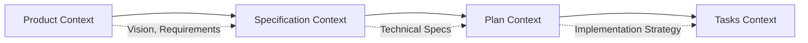

# Enhanced Workflow Enforcement

## Overview

The Enhanced Workflow Enforcement system ensures proper development sequence and context flow throughout the spec-kit framework. It enforces the **product → specify → plan → tasks** workflow sequence while capturing and transferring context between phases.

## Architecture

### Core Components

#### 1. Workflow State Manager (`workflow_state.py`)
- **Purpose**: Central state management for workflow phases
- **Features**:
  - Phase completion tracking
  - Prerequisites validation  
  - State persistence in `.spec-kit/workflow-state.json`
  - Phase markers in `.spec-kit/phase-markers/`
  - Context integrity checking

#### 2. Context Transfer Manager (`context_transfer.py`)
- **Purpose**: Manages context flow between workflow phases
- **Features**:
  - Product context extraction and storage
  - Specification context integration
  - Plan context transfer
  - Template injection utilities
  - Traceability validation

#### 3. Command Integration (`command_integration.py`)
- **Purpose**: Integrates workflow enforcement into existing commands
- **Features**:
  - Prerequisites validation before command execution
  - Context loading and preparation
  - Phase completion management
  - User guidance generation

#### 4. Validation Framework (`validation_framework.py`)
- **Purpose**: Validates document quality and completeness
- **Features**:
  - Specification validation (structure, content, clarity)
  - Plan validation (feasibility, completeness, detail level)
  - Quality scoring and issue reporting

#### 5. Traceability Verification (`traceability_verification.py`)
- **Purpose**: Ensures proper traceability across all phases
- **Features**:
  - Context flow validation
  - Requirement traceability checking
  - Phase consistency verification
  - Traceability matrix generation

## Workflow Phases

### Phase 1: Product (`/simics-platform`)
**Entry Point** - Defines product context and requirements

**What it does**:
- Initializes workflow state tracking
- Captures product vision, success criteria, and constraints
- Identifies stakeholder requirements and technical constraints
- Creates platform specification foundation

**Context Captured**:
- Product vision and objectives
- Success criteria and acceptance criteria
- Technical and business constraints
- Stakeholder information
- High-level requirements

**Next Step**: `/specify` command

### Phase 2: Specify (`/specify`)
**Specification Creation** - Transforms product context into technical specifications

**Prerequisites**: Product phase must be completed

**What it does**:
- Loads product context automatically
- Validates product context completeness
- Generates technical specifications from product requirements
- Ensures traceability from product vision to technical details
- Resolves clarification items

**Context Integration**:
- Maps product requirements to technical specifications
- Incorporates constraints and stakeholder information
- Ensures requirement coverage and traceability

**Next Step**: `/plan` command

### Phase 3: Plan (`/plan`)
**Implementation Planning** - Creates detailed implementation plan from specifications

**Prerequisites**: Specification phase must be completed

**What it does**:
- Loads specification context automatically
- Validates specification completeness
- Creates implementation strategy and technology selection
- Defines milestones, resources, and timelines
- Addresses risks and dependencies

**Context Integration**:
- Uses technical requirements for technology selection
- Incorporates architecture decisions into implementation strategy
- Ensures all specification requirements are planned for

**Next Step**: `/tasks` command

### Phase 4: Tasks (`/tasks`)
**Task Generation** - Generates actionable implementation tasks from plan

**Prerequisites**: Plan phase must be completed

**What it does**:
- Loads plan context automatically
- Validates plan completeness
- Generates dependency-ordered implementation tasks
- Creates parallel execution opportunities
- Ensures task-to-plan traceability

**Context Integration**:
- Uses implementation strategy for task prioritization
- Incorporates technology stack into setup tasks
- Maps plan milestones to task dependencies

**Result**: Complete workflow sequence finished

## Key Features

### 1. Phase Prerequisites Enforcement
Commands validate prerequisites before execution:

```bash
# ❌ This will be blocked
$ /specify "feature description"
Error: Cannot proceed to specify phase.
Required prerequisite phase 'product' is not completed.
Please complete the product phase first.
📋 Required action: Run /simics-platform command

# ✅ Correct sequence
$ /simics-platform "ARM embedded platform"  # Product phase
$ /specify "detailed specifications"         # Specify phase  
$ /plan "implementation approach"           # Plan phase
$ /tasks "task generation"                  # Tasks phase
```

### 2. Automatic Context Transfer
Product context flows automatically through phases:



### 3. Validation and Quality Assurance
- **Specification Validation**: Structure, completeness, clarity
- **Plan Validation**: Feasibility, detail level, resource allocation
- **Traceability Validation**: Requirement flow across phases

### 4. State Persistence
- Workflow state survives system restarts
- Context data preserved between command executions
- Recovery from interruptions and failures

## File Structure

```
.spec-kit/
├── workflow-state.json          # Central workflow state
├── phase-markers/              # Phase completion indicators
│   ├── product.complete
│   ├── specify.complete
│   ├── plan.complete
│   └── tasks.complete
└── context-data/               # Phase context storage
    ├── product-context.json
    ├── spec-context.json
    └── plan-context.json
```

## Usage Examples

### Successful Workflow Execution

```bash
# Step 1: Define product (always allowed)
$ /simics-platform "ARM Cortex-M4 IoT platform with UART and GPIO"
✅ Product phase completed successfully
✅ Product context captured for specification phase
→ Next step: Use /specify command to proceed to specification phase

# Step 2: Create specification (requires product completion)
$ /specify "detailed technical specification" 
✅ Specification phase completed successfully
✅ Product context integrated into specification
→ Next step: Use /plan command to proceed to planning phase

# Step 3: Create implementation plan (requires specification completion)
$ /plan "agile development approach"
✅ Planning phase completed successfully  
✅ Specification context integrated into plan
→ Next step: Use /tasks command to proceed to tasks phase

# Step 4: Generate tasks (requires plan completion)
$ /tasks "implementation task generation"
✅ Tasks phase completed successfully
✅ Plan context integrated into tasks
✅ Full workflow sequence completed: product -> specify -> plan -> tasks
```

### Blocked Workflow Attempts

```bash
# Attempting to skip phases
$ /plan "implementation plan"
❌ Cannot proceed to plan phase.
🔍 Missing prerequisite: specify phase must be completed first.
📋 Required action: Run /specify command to create a feature specification.

# Attempting to start with tasks
$ /tasks "generate tasks"  
❌ Cannot proceed to tasks phase.
🔍 Missing prerequisites: product, specify, plan phases must be completed.
📋 Required action: Run /simics-platform command to start the product phase.
```

## Configuration

### Workflow Settings
The workflow enforcement system can be configured through environment variables:

```bash
# Enable/disable workflow enforcement (default: enabled)
export SPEC_KIT_WORKFLOW_ENFORCEMENT=true

# Set validation strictness (default: standard)
export SPEC_KIT_VALIDATION_LEVEL=strict  # strict, standard, lenient

# Enable debug logging (default: false)
export SPEC_KIT_DEBUG_WORKFLOW=true
```

### Validation Thresholds
Validation scoring thresholds can be customized:

- **Specification Validation**: Minimum 0.7 score (70%)
- **Plan Validation**: Minimum 0.7 score (70%)  
- **Traceability Validation**: Minimum 0.8 score (80%)

## Error Handling

### Common Error Scenarios

#### 1. Prerequisites Not Met
```
❌ Cannot proceed to specify phase.
Required prerequisite phase 'product' is not completed.
Please complete the product phase first.
```

**Solution**: Follow the proper sequence: product → specify → plan → tasks

#### 2. Context Not Available
```
⚠️ Product context not found. Product phase may not have been completed properly.
```

**Solution**: Re-run the product phase command to capture context properly

#### 3. Validation Failures
```
❌ Specification validation failed (score: 0.4)
- 3 errors - 5 warnings
Missing required sections: architecture, interfaces, validation
```

**Solution**: Address validation issues before proceeding to next phase

### Recovery Procedures

#### Workflow Reset
```bash
# Reset from a specific phase (also resets subsequent phases)
$ python -m specify_cli.workflow_state reset --phase specify

# Clear entire workflow state
$ python -m specify_cli.workflow_state clear
```

#### Context Recovery
```bash
# Validate context flow
$ python -m specify_cli.traceability_verification --workspace .

# Generate traceability report  
$ python -m specify_cli.traceability_verification --workspace . --report
```

## Testing

### Running Tests
```bash
# Run all workflow enforcement tests
$ pytest tests/test_workflow_enforcement.py -v

# Run integration tests
$ pytest tests/test_integration.py -v

# Run edge case tests
$ pytest tests/test_edge_cases.py -v

# Run all tests with coverage
$ pytest tests/ --cov=src/specify_cli --cov-report=html
```

### Test Categories
- **Unit Tests**: Individual component functionality
- **Integration Tests**: Command coordination and state sharing
- **Edge Case Tests**: Error handling and recovery scenarios
- **End-to-End Tests**: Complete workflow scenarios

## Troubleshooting

### Debug Information
```bash
# Check workflow status
$ python -m specify_cli.command_integration status --workspace .

# Validate specific phase prerequisites  
$ python -m specify_cli.command_integration validate --phase specify --workspace .

# Get phase context
$ python -m specify_cli.command_integration context --phase product --workspace .
```

### Common Issues

#### Issue: Command blocked unexpectedly
**Diagnosis**: Check workflow status and completed phases
```bash
$ python -m specify_cli.command_integration status
```

#### Issue: Context not transferring between phases
**Diagnosis**: Validate context flow and integrity
```bash
$ python -m specify_cli.traceability_verification --workspace .
```

#### Issue: State file corruption
**Diagnosis**: Check state file validity and permissions
```bash
$ ls -la .spec-kit/
$ cat .spec-kit/workflow-state.json | python -m json.tool
```

## Best Practices

### 1. Follow the Sequence
Always follow the product → specify → plan → tasks sequence. The system is designed to enforce this flow for good reasons:
- **Context Continuity**: Each phase builds on the previous
- **Quality Assurance**: Validation at each step prevents issues downstream
- **Traceability**: Clear path from requirements to implementation

### 2. Provide Rich Context
Include comprehensive information at each phase:
- **Product**: Clear vision, detailed requirements, realistic constraints
- **Specify**: Complete technical details, architecture decisions
- **Plan**: Detailed implementation strategy, realistic timelines
- **Tasks**: Actionable, specific implementation steps

### 3. Address Validation Issues
Don't ignore validation warnings:
- **Resolve [NEEDS CLARIFICATION] items** before proceeding
- **Address missing sections** highlighted by validation
- **Improve clarity and completeness** based on feedback

### 4. Regular Status Checks
Monitor workflow progress:
```bash
# Check current status
$ python -m specify_cli.command_integration status

# Validate traceability
$ python -m specify_cli.traceability_verification
```

### 5. Recovery Planning
Prepare for interruptions:
- **Workflow state persists** across sessions
- **Context is preserved** between command executions  
- **Reset capabilities** available for iterations

## Integration with Existing Workflows

### CI/CD Integration
```yaml
# .github/workflows/workflow-validation.yml
name: Workflow Validation
on: [push, pull_request]

jobs:
  validate:
    runs-on: ubuntu-latest
    steps:
      - uses: actions/checkout@v2
      - name: Validate Workflow State
        run: |
          python -m specify_cli.traceability_verification --workspace .
          python -m specify_cli.validation_framework spec specs/*/spec.md
```

### IDE Integration
The workflow enforcement system integrates with modern IDEs through:
- **Command palette integration** for phase commands
- **Status bar indicators** for current workflow phase
- **Validation annotations** in documents
- **Context-aware suggestions** based on current phase

## Future Enhancements

### Planned Features
- **Branch-based workflows** for parallel feature development
- **Team collaboration features** with role-based access
- **Advanced analytics** on workflow efficiency
- **Custom validation rules** per project type
- **Integration with external tools** (JIRA, Azure DevOps)

### Extensibility
The system is designed for extensibility:
- **Plugin architecture** for custom phases
- **Validation rule customization** 
- **Context transfer handlers** for new content types
- **Command integration hooks** for custom commands

## Support and Feedback

For questions, issues, or feedback about the workflow enforcement system:

- **Documentation**: See full documentation in `/docs`
- **Issues**: Report bugs via GitHub issues
- **Discussions**: Join community discussions
- **Contributing**: See `CONTRIBUTING.md` for contribution guidelines

The Enhanced Workflow Enforcement system is designed to improve development quality and consistency while providing flexibility for different project types and team workflows.